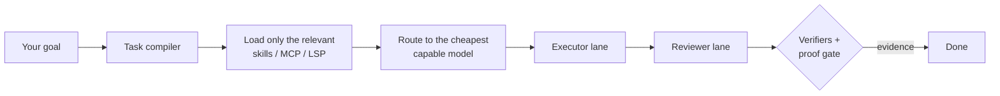

<div align="center">

# LeanPi

**A coding agent that spends less per task — and proves the work is done.**

[](https://github.com/jonit-dev/lean-pi/actions/workflows/ci.yml) [](https://www.npmjs.com/package/leanpi) [](https://www.npmjs.com/package/leanpi) [](.nvmrc) [](LICENSE) [](CONTRIBUTING.md)


</div>

Most coding agents send every task to the same expensive model, load every tool
into context, and call it done when the model says so. **LeanPi does the
opposite.** Tell it your goal. It picks the cheapest model that can handle the
task, loads only the context the task needs, and treats a task as finished only
when verifiers show the evidence.

## Getting Started

```sh
npx leanpi                         # or: npm install -g leanpi && leanpi
```

Node 22+ is the only requirement. No new account or API key: LeanPi runs on
the Claude Code, Codex and OpenCode subscriptions you already have. The first
run writes `~/.config/leanpi/leanpi.config.yaml` (a plain file you can edit)
and opens a session. Then type what you want:

> refactor the auth middleware, and prove the tests still pass

| command   | what it does                                                          |
| --------- | --------------------------------------------------------------------- |
| `/help`   | list every command                                                    |
| `/status` | roles, reasoning level, backend health, session cost                  |
| `/model`  | models per role, with availability, score and price                   |
| `/verify` | run the verifiers and proof gate against the workspace                |
| `/doctor` | probe backends and registries — first stop when something looks wrong |

## Why LeanPi

|                                                  |                                                                                                                                                                                                       |
| ------------------------------------------------ | ----------------------------------------------------------------------------------------------------------------------------------------------------------------------------------------------------- |
| 💸 **Pay for the model the task needs**          | A rename doesn't need the model you'd use for an architecture change. LeanPi rates each task's complexity and routes it to the cheapest capable model, using your quick, balanced and strong options. |
| 🔌 **Use the subscriptions you already pay for** | On the first run it detects which vendor CLIs are installed and signed in (Claude Code, Codex, OpenCode), then assigns their models to roles. No setup wizard and no copying keys around. Cheap plans can take the routine work so your premium quota lasts: [stacking subscriptions](docs/usage.md#stacking-subscriptions). |
| ✅ **Done means proven**                         | A separate reviewer checks the executor's work. A proof gate then requires artifacts such as passing tests before a task counts as done. `/verify` re-runs the checks whenever you want.              |
| 🪶 **Lean context, fewer tokens**                | Skills, MCP servers and LSPs load only when a task needs them. You don't pay to resend every tool schema with every prompt.                                                                           |
| 🧾 **Know what every task cost**                 | Every run writes its own record — model, tokens, cache hits, wall time, dollars — and `/status` and `/cost` read it back. Budgets and spend guards stop a runaway turn. Vanilla Pi reports none of this. |
| 🛡️ **Safe by default**                           | Permissions are set per scope (edit, shell, network, destructive git, package install), and a project can only make them stricter. For a whole session, use `--safety low\|medium\|high`.             |
| 🏠 **Keep routing on your machine**              | `--laya` makes routing decisions with a local model. The decisions are free and never leave your machine.                                                                                             |

## How it works



Every turn shows the decision it made in the footer, for example
`Auto: opus (Medium) — MEDIUM complexity — Executor lane`, so routing is never a
black box.

## Benchmarks

LeanPi against the subscription CLIs it sits above — one model
(`opencode-go/deepseek-v4.1-flash`), scored on **cost per externally verified
completion**, with failed trials kept in the numerator (2026-09-21):

| arm         | verified | cost per verified completion | LeanPi is cheaper by |
| ----------- | -------: | ---------------------------: | -------------------: |
| **LeanPi**  |      2/2 |                **$0.010521** |                    — |
| Codex CLI   |      1/2 |                    $0.023243 |            **54.7%** |
| Claude Code |      1/2 |                    $0.045636 |            **76.9%** |

**Against vanilla Pi, we land at roughly the same cost per task** — that is the
control plane's price, and it is the honest comparison: that arm is the same
runtime with no LeanPi loaded, so it has no verification, no cost accounting, no
routing and no permission scoping to trim — very little in it is removable.
Matching a barebones harness on spend while still exiting through a proof gate is
the number to read; the side-by-side figures and why parity is expected are in
[`docs/benchmarks/`](docs/benchmarks/README.md).

**All runs, methodology and caveats → [`docs/benchmarks/`](docs/benchmarks/README.md)**

## JEV key (optional)

JEV is the control plane that makes routing decisions. Without a key LeanPi
falls back to heuristics: it still works, but spends more per task. The first
run asks for a key once; press Enter to skip.

```sh
leanpi --jev-key <key>   # or: export JEV_API_KEY=<key>
leanpi --laya            # run a local decision model instead (free, less accurate)
/jev provider laya       # make Laya the default for every run (in a session)
leanpi --no-jev          # skip it deliberately
```

**Configuration, permissions, safety levels, UI, Laya, subagents →
[`docs/usage.md`](docs/usage.md)**

## FAQ

**Does it replace Claude Code or Codex?** No, it uses them. LeanPi sits above the
CLIs you already have and decides which one handles each task.

**Is it actually cheaper?** Against the CLIs it replaces, yes — **55% cheaper
than Codex CLI** and **77% cheaper than Claude Code** per verified completion in
our run. Against vanilla Pi it is roughly a wash, and that is by design: that
arm has no verification, accounting or routing to take out. Cutting cost per
_verified_ task is the goal; every number and caveat is in
[`docs/benchmarks/`](docs/benchmarks/README.md). Run `pnpm bench` to measure it
on your own tasks.

**What is Pi?** [Pi](https://github.com/earendil-works/pi) is the open-source
coding-agent runtime LeanPi is built on. Pi extensions and commands keep
working.

## Development

```sh
git clone https://github.com/jonit-dev/lean-pi.git
cd lean-pi
pnpm install && pnpm build
pnpm test && pnpm lint && pnpm typecheck
pnpm record:demo   # re-record docs/demos/leanpi-demo.{cast,gif}
```

Node `>=22.19.0` (`.nvmrc` pins 22). Tests need no credentials or network.
Pull request rules: [`CONTRIBUTING.md`](CONTRIBUTING.md)
([`AGENTS.md`](AGENTS.md) for agents).

| path      | what                                                                                                                                     |
| --------- | ---------------------------------------------------------------------------------------------------------------------------------------- |
| `src/`    | the runtime: compiler, executor, reviewer, proof, JEV client, permissions                                                                |
| `tests/`  | every PRD's acceptance criteria                                                                                                          |
| `bench/`  | benchmark harness, suites and recorded runs                                                                                              |
| `skills/` | the bundled skill pack                                                                                                                   |
| `docs/`   | [roadmap](docs/PRDs/v1/ROADMAP.md), [PRD index](docs/PRDs/v1/INDEX.md), [architecture](docs/architecture/README.md), benchmarks, reports |

## Contributing

Contributions are welcome — bug reports, benchmarks, skills and code.

1. Pick an [open issue](https://github.com/jonit-dev/lean-pi/issues) (or open one first for anything non-trivial)
2. Read [`CONTRIBUTING.md`](CONTRIBUTING.md) — every change ships with a test that proves it
3. Open a PR; CI runs build, typecheck, lint and tests

Please follow the [Code of Conduct](CODE_OF_CONDUCT.md).

## License & security

MIT — see [`LICENSE`](LICENSE); vendored third-party content is listed in
[`THIRD_PARTY_NOTICES.md`](THIRD_PARTY_NOTICES.md). Report vulnerabilities
privately via [`SECURITY.md`](SECURITY.md).
