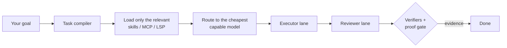
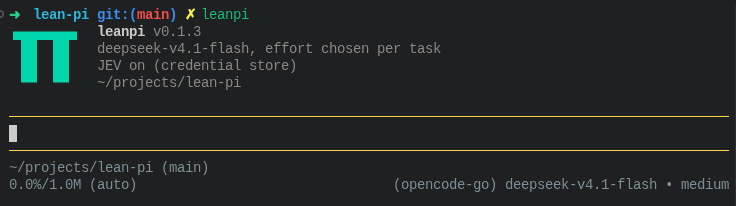
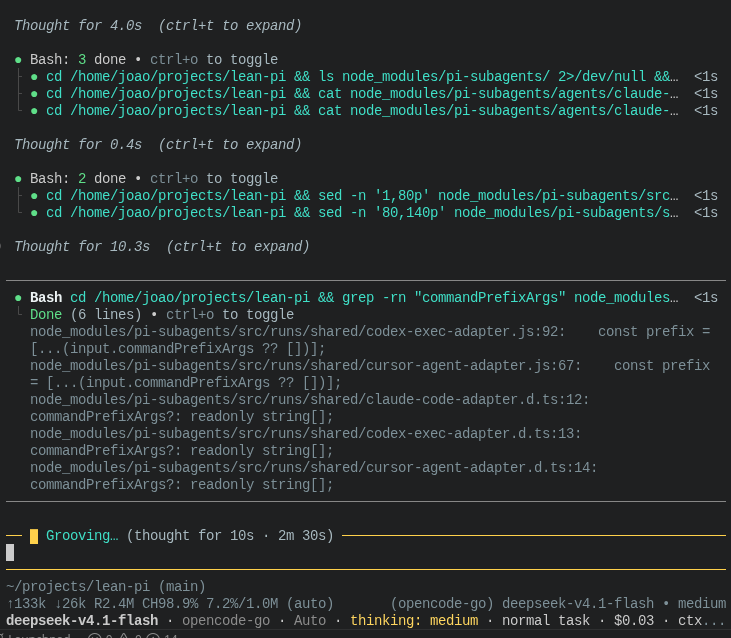

# LeanPi

**Cost-aware task compiler and coding runtime built on [Pi](https://github.com/earendil-works/pi).**

> Minimize effective cost per **verified** successful coding task, without losing
> the completion quality of leading coding harnesses.

Tell it your goal; it figures out the rest. LeanPi finds the subscriptions and
models your machine already has, then picks the models, reasoning effort, tools
and proof each task needs.



"Done" means verified by artifacts, not by the model saying so.



| a session: roles, routing, proof | diffs you can read |
| --- | --- |
|  |  |

## Quick start

```sh
npx leanpi
```

Node 22+ is the only requirement. The first run detects which vendor CLIs are
installed and signed in (Claude Code, Codex, OpenCode), writes
`~/.config/leanpi/leanpi.config.yaml`, and opens a session. Then type what you
want:

> refactor the auth middleware, and prove the tests still pass

Install globally instead: `npm install -g leanpi && leanpi`.

| command | what it does |
| --- | --- |
| `/help` | list every command |
| `/status` | roles, reasoning level, backend health, session cost |
| `/model` | models per role, with availability, score and price |
| `/verify` | run the verifiers and proof gate against the workspace |
| `/doctor` | probe backends and registries — first stop when something looks wrong |

### JEV key (optional)

JEV is the control plane that makes routing decisions. Without a key LeanPi
falls back to heuristics: it still works, but spends more per task. The first
run asks for a key once; press Enter to skip.

```sh
leanpi --jev-key <key>   # or: export JEV_API_KEY=<key>
leanpi --laya            # run a local decision model instead (free, less accurate)
/jev provider laya       # make Laya the default for every run (in a session)
leanpi --no-jev          # skip it deliberately
```

**Configuration, permissions, safety levels, UI, Laya, subagents →
[`docs/usage.md`](docs/usage.md)**

## Benchmarks

Four harnesses, one model (`opencode-go/deepseek-v4.1-flash`), cost per
externally verified completion (2026-09-21):

| arm | verified | cost per verified completion | LeanPi is cheaper by |
| --- | --: | --: | --: |
| **LeanPi** | 2/2 | **$0.010521** | — |
| stock Pi | 2/2 | $0.014163 | **25.7%** |
| Codex CLI | 1/2 | $0.023243 | **54.7%** |
| Claude Code | 1/2 | $0.045636 | **76.9%** |

⚠️ Small sample. A longer LeanPi-vs-stock-Pi run (n=5 each) is 5.9% cheaper,
but its 95% CI is [0.32, 2.70]: **no winner is declared**.

**All runs, methodology and caveats → [`docs/benchmarks/`](docs/benchmarks/README.md)**

## Development

```sh
git clone https://github.com/jonit-dev/lean-pi.git
cd lean-pi
pnpm install && pnpm build
pnpm test && pnpm lint && pnpm typecheck
```

Node `>=22.19.0` (`.nvmrc` pins 22). Tests need no credentials or network.
Pull request rules: [`CONTRIBUTING.md`](CONTRIBUTING.md)
([`AGENTS.md`](AGENTS.md) for agents).

| path | what |
| --- | --- |
| `src/` | the runtime: compiler, executor, reviewer, proof, JEV client, permissions |
| `tests/` | every PRD's acceptance criteria |
| `bench/` | benchmark harness, suites and recorded runs |
| `skills/` | the bundled skill pack |
| `docs/` | [roadmap](docs/PRDs/v1/ROADMAP.md), [PRD index](docs/PRDs/v1/INDEX.md), [architecture](docs/architecture/README.md), benchmarks, reports |

## License & security

MIT — see [`LICENSE`](LICENSE); vendored third-party content is listed in
[`THIRD_PARTY_NOTICES.md`](THIRD_PARTY_NOTICES.md). Report vulnerabilities
privately via [`SECURITY.md`](SECURITY.md).
