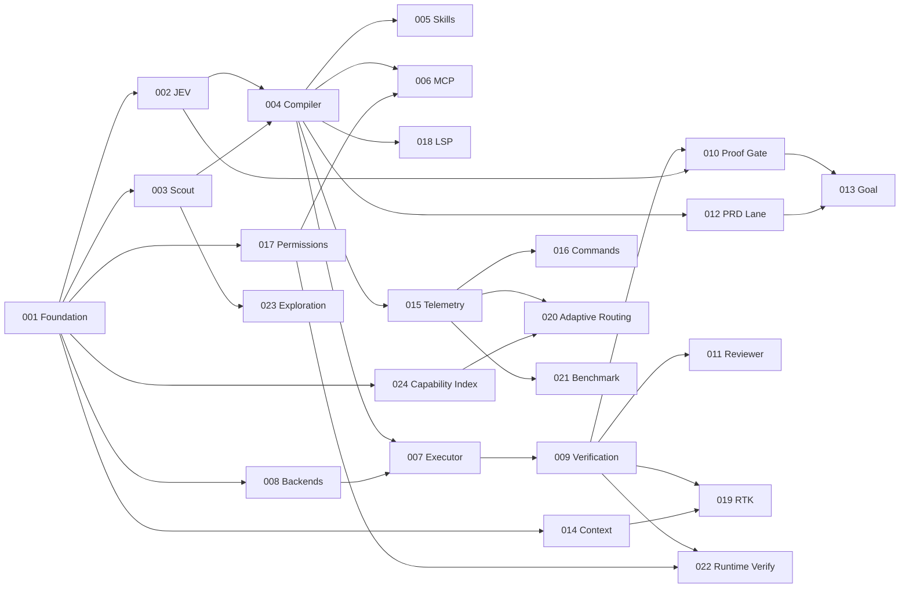

# LeanPi v1 — PRD Index

Slice of [`ROADMAP.md`](./ROADMAP.md) into 24 implementable PRDs. Every functional requirement in ROADMAP §51 has exactly one owning PRD; every roadmap section that describes buildable behavior is claimed below.

**Status:** all PRDs `NOT STARTED`. Nothing is implemented; the repository contains only these documents.

## PRDs

| PRD | Title | Complexity | Depends on | Phases / boxes | Owns |
|---|---|---|---|---|---|
| [001](./PRD-001-harness-foundation.md) | Harness Foundation | 5 MEDIUM | — | 3 / 8 | FR-001, 002, 040–045 |
| [002](./PRD-002-jev-control-plane.md) | JEV Control Plane | 5 HIGH | 001 | 5 / 12 | FR-010, 011, 020 |
| [003](./PRD-003-task-scout.md) | Task Scout | 3 LOW | 001 | 2 / 4 | §9 packet |
| [004](./PRD-004-task-compiler-router.md) | Task Compiler & Router | 4 MEDIUM | 002, 003 | 4 / 11 | FR-003–006, 012, 013 |
| [005](./PRD-005-skill-disclosure.md) | Skill Disclosure | 3 LOW | 002, 004 | 2 / 6 | FR-014, 070–076, 145 |
| [006](./PRD-006-mcp-disclosure.md) | MCP Disclosure | 7 HIGH | 002, 004, 017 | 4 / 8 | FR-015, 080–084, 086, 087, 146 |
| [007](./PRD-007-executor-lane.md) | Executor Lane | 5 MEDIUM | 004, 008 | 4 / 9 | FR-019, 060, 063, 065–067 |
| [008](./PRD-008-backend-workers.md) | Backend Workers | 4 MEDIUM | 001 | 4 / 9 | FR-046, 050–055, 057, 058 |
| [009](./PRD-009-deterministic-verification.md) | Deterministic Verification | 4 MEDIUM | 001, 007 | 3 / 6 | FR-120–123 |
| [010](./PRD-010-proof-gate.md) | Proof Gate | 3 MEDIUM | 002, 009 | 2 / 6 | FR-016, 017, 124–127 |
| [011](./PRD-011-reviewer-lane.md) | Reviewer Lane | 3 LOW | 002, 008, 009 | 2 / 6 | FR-018, 061, 062, 064, 144 |
| [012](./PRD-012-prd-lane.md) | PRD Lane | 5 MEDIUM | 004 | 4 / 9 | FR-030–035 |
| [013](./PRD-013-goal-engine.md) | Goal Engine | 5 MEDIUM | 010, 012 | 4 / 7 | FR-130–136, 143 |
| [014](./PRD-014-context-engine.md) | Context Engine | 5 MEDIUM | 001 | 4 / 8 | FR-100–107 |
| [015](./PRD-015-cost-telemetry.md) | Cost Telemetry | 3 LOW | 002, 004, 008 | 2 / 6 | FR-149, §52 |
| [016](./PRD-016-command-surface.md) | Command & Session Surface | 4 MEDIUM | 002, 004, 015 | 4 / 12 | FR-140–142, 148, 150, 151 |
| [017](./PRD-017-permissions-trust.md) | Permissions & Trust | 3 HIGH | 001 | 3 / 10 | FR-085, 147, §48 |
| [018](./PRD-018-lsp-integration.md) | LSP Integration | 4 MEDIUM | 004 | 3 / 9 | FR-090–094 |
| [019](./PRD-019-rtk-integration.md) | RTK Integration | 4 MEDIUM | 002, 009, 014 | 3 / 7 | FR-110–113 |
| [020](./PRD-020-adaptive-routing.md) | Adaptive Routing & Quota Pricing | 4 MEDIUM | 002, 008, 015, 024 | 4 / 7 | FR-047, 048, 056 |
| [021](./PRD-021-benchmark-harness.md) | Benchmark & Evaluation Harness | 5 MEDIUM | 015 | 4 / 8 | §53–§57, §67 #12 |
| [022](./PRD-022-runtime-verification.md) | Runtime Verification & Workspace Isolation | 6 HIGH | 009, 017 | 4 / 9 | §35 runtime/UI verifiers, §60 worktrees |
| [023](./PRD-023-jev-exploration-governor.md) | JEV Exploration Governor | 4 MEDIUM | 002, 003, 009, 014 | 4 / 7 | file/search-layer JEV sites |
| [024](./PRD-024-model-capability-index.md) | Model Capability Index | 5 MEDIUM | 001, 008, 015 | 4 / 8 | model capability catalog |

Totals: 84 phases, 198 required boxes, 3 owner-lane gates (PRD-008 real subscription smoke, PRD-021 external baselines, PRD-024 live keyed catalog fetch). Every other criterion is agent-runnable locally.

## Build order

Waves that can run concurrently once their prerequisites land: {002, 003, 008, 014, 017}, then {004, 024}, then {005, 006, 012, 018, 007}, then {009, 015}, then {010, 011, 016, 019, 021, 022, 023}, then {013, 020}.

## FR coverage

| ROADMAP §51 block | FRs | Owning PRDs |
|---|---|---|
| Core Orchestration | 001–006 | 001 (001, 002), 004 (003–006) |
| JEV | 010–020 | 002 (010, 011, 020), 004 (012, 013), 005 (014), 006 (015), 010 (016, 017), 011 (018), 007 (019) |
| PRDs | 030–035 | 012 |
| Models | 040–048 | 001 (040–045), 008 (046), 020 (047, 048) |
| Subscriptions | 050–058 | 008 (050–055, 057, 058), 020 (056) |
| Executor / Reviewer | 060–067 | 007 (060, 063, 065–067), 011 (061, 062, 064) |
| Skills | 070–076 | 005 |
| MCP | 080–087 | 006 (080–084, 086, 087), 017 (085) |
| LSP | 090–094 | 018 |
| Context Efficiency | 100–107 | 014 |
| RTK | 110–113 | 019 |
| Verification | 120–127 | 009 (120–123), 010 (124–127) |
| `/goal` | 130–136 | 013 |
| UX / Commands | 140–151 | 016 (140–142, 148, 150, 151), 013 (143), 011 (144), 005 (145), 006 (146), 017 (147), 015 (149) |

All 108 FRs owned exactly once — verified mechanically against ROADMAP.md, not by hand.

## JEV decision sites

Every site registers in PRD-002's decision-site registry with a mandatory deterministic fallback, so JEV is never a single point of failure (§49). Ratings are the product owner's.

| Decision | Owner | Rating |
|---|---|---|
| PRD gate (does this need structured planning) | 004 | ★★★★★ |
| Execution complexity | 004 | ★★★★★ |
| Model capability need (class/specialization) | 004 | ★★★★★ |
| Review-risk classification input | 004 | ★★★★★ |
| Skill disclosure | 005 | ★★★★★ |
| MCP disclosure (+ mid-task capability request) | 006 | ★★★★★ |
| Failure classification | 007 | ★★★★★ |
| Retry usefulness | 007 | ★★★★★ |
| Escalation reason | 007 | ★★★★★ |
| User-clarification need | 007 | ★★★★☆ |
| Regression scope | 009 | ★★★★★ |
| Proof sufficiency | 010 | ★★★★★ |
| Missing-proof classification | 010 | ★★★★★ |
| Reviewer selection | 011 | ★★★★★ |
| PRD requirement status | 012 | ★★★★★ |
| Goal completion (semantic clauses) | 013 | ★★★★★ |
| Context retention | 014 | ★★★★☆ |
| LSP usefulness (tie-break only) | 018 | ★★★☆☆ |
| RTK/output-reduction policy (off by default) | 019 | ★★☆☆☆ |
| Quota-aware preference (tie band only) | 020 | ★★★☆☆ |
| Reasoning effort | 020 | ★★★★☆ |
| Subagent/delegation worth | 020 | ★★★☆☆ |
| File candidate ranking | 023 | ★★★★★ |
| Stop file exploration | 023 | ★★★★★ |
| Directory/subsystem selection | 023 | ★★★★☆ |
| Snippet relevance | 023 | ★★★★★ |
| Sibling-file expansion | 023 | ★★★★☆ |
| Test relevance | 023 | ★★★★☆ |

Model selection itself (024) and permission decisions (017) are deliberately **not** JEV sites: the first is arithmetic over catalog records, the second is a security boundary that must be a deterministic function of config.

## Installed skills consumed, not reimplemented

Discovery defaults on this machine; all configurable, never hard-coded in product code.

| Asset | Path | Consumer |
|---|---|---|
| Ponytail instruction bundle (pinned 4.9.0) | `~/.claude/plugins/cache/ponytail/ponytail/4.9.0/skills/ponytail/SKILL.md` | 001 vendors it as the static prefix (FR-002); 014 treats it as the STATIC prompt layer |
| prd-creator | `~/.claude/skills/prd-creator/SKILL.md` (mirror `~/.codex/skills/`) | 012 authoring contract |
| prd-manager + `scripts/prd-close.mjs` | `~/.claude/skills/prd-manager/` | 012 work units and closure |
| prd-executor | `~/.claude/skills/prd-executor/SKILL.md` | 012 work-unit shape |
| git-worktree | `~/.claude/skills/git-worktree/SKILL.md` | 022 worktree isolation |
| Global skill roots | `~/.claude/skills` (27), `~/.codex/skills` (211), `~/.claude/plugins/cache/*/*/<version>/skills/`, project `.claude/skills` | 005 registry, precedence project > user global > plugin |

## Roadmap priority mapping

- **§59 MVP P0** — 001, 002, 003, 004, 005, 006, 007, 008, 009, 010, 011, 012, 013, 015, 014, 016, 017, 024. (024 is P0-adjacent: role binding needs a capability source; it degrades to the bundled snapshot so it never blocks.)
- **§60 P1** — 018 LSP, 019 RTK, 020 adaptive routing/quota pricing, 021 benchmark, 022 runtime verification + worktrees, 023 exploration governor.
- **§61 P2** — deliberately not sliced. Learned route predictors, per-repo routing profiles, task-specific success probabilities, dynamic context budgets, automatic model benchmarking, executor tournaments, parallel reviewer sampling, a local JEV equivalent, cost-aware subagent orchestration and remote execution pools all depend on telemetry that only exists after 015/021 run on real work. Slicing them now would be speculative design against unmeasured behavior. Revisit after the first §54 baseline comparison.

## Non-goals (§58)

No foundation-model training; no generative router replacing JEV; no blanket capability exposure; no autonomy maximization regardless of cost; no correctness claims without evidence; no vendor-limit bypass; no mandatory cloud models; no JEV requirement for basic operation; no default multi-agent swarms.
