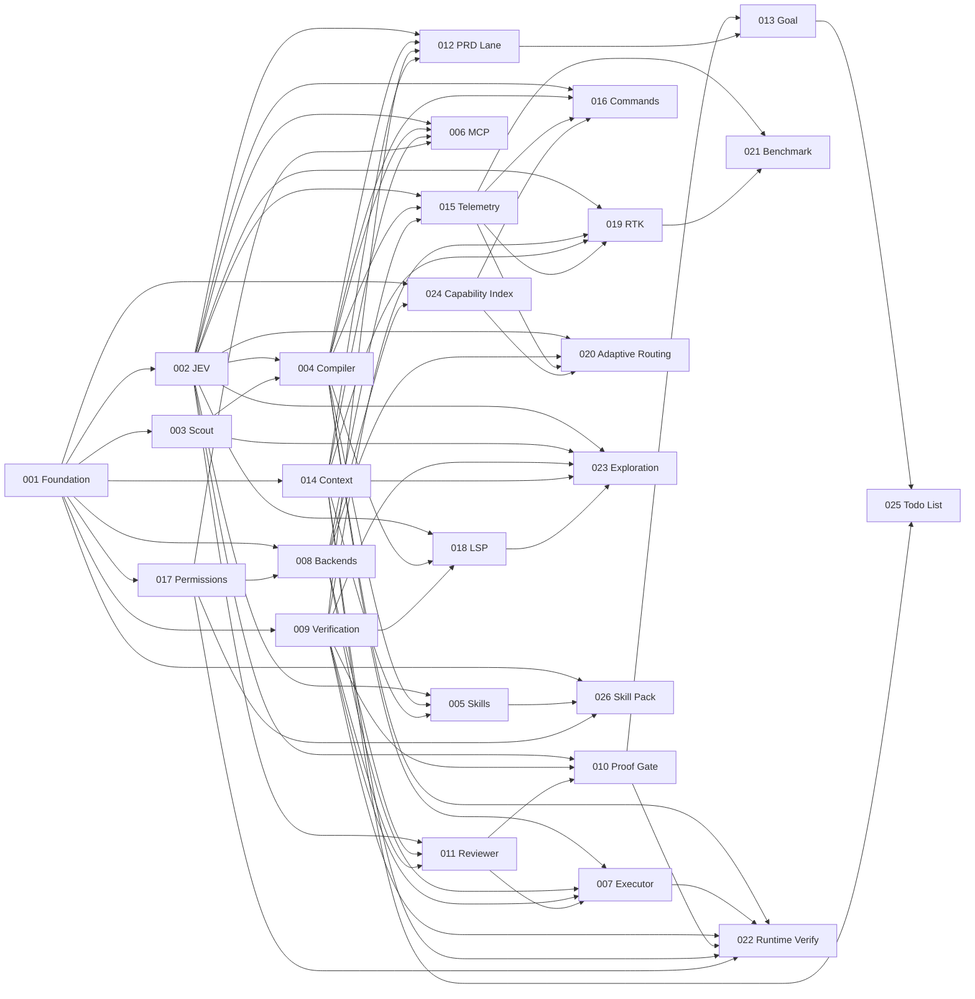

# LeanPi v1 — PRD Index

Slice of [`ROADMAP.md`](./ROADMAP.md) into 26 implementable PRDs. Every functional requirement in ROADMAP §51 has exactly one owning PRD; every roadmap section that describes buildable behavior is claimed below.

**Status:** all 26 PRDs `DONE` (verified 2026-09-19); each lives in [`done/`](./done/) with per-criterion evidence. Two criteria stay open by construction and are owner-gated: PRD-008 AC-9 (a real vendor subscription run) and PRD-021 AC-4 (external Claude Code / Codex baselines).

Every number in this document is derived from the PRD files on disk — phase counts from their `#### Phase` headings, box counts from their `AC-` lines, dependencies and FR ownership from their headers — not maintained by hand.

## PRDs

| PRD | Title | Complexity | Depends on | Phases / boxes | Owns |
|---|---|---|---|---|---|
| [001](./done/PRD-001-harness-foundation.md) | Harness Foundation | 5 MEDIUM | — | 3 / 9 | FR-001, 002, 040–045 |
| [002](./done/PRD-002-jev-control-plane.md) | JEV Control Plane | 5 HIGH | 001 | 5 / 13 | FR-010, 011, 020 |
| [003](./done/PRD-003-task-scout.md) | Task Scout | 3 LOW | 001 | 2 / 4 | §9 packet |
| [004](./done/PRD-004-task-compiler-router.md) | Task Compiler & Router | 4 MEDIUM | 002, 003 | 4 / 11 | FR-003–006, 012, 013 |
| [005](./done/PRD-005-skill-disclosure.md) | Skill Disclosure | 3 LOW | 002, 004, 014 | 2 / 7 | FR-014, 070–076, 145 |
| [006](./done/PRD-006-mcp-disclosure.md) | MCP Disclosure | 7 HIGH | 002, 004, 014, 017 | 4 / 9 | FR-015, 080–084, 086, 087, 146 |
| [007](./done/PRD-007-executor-lane.md) | Executor Lane | 5 MEDIUM | 004, 008, 009, 011 | 4 / 9 | FR-019, 060, 063, 065–067 |
| [008](./done/PRD-008-backend-workers.md) | Backend Workers | 4 MEDIUM | 001, 017 | 4 / 9 | FR-046, 050–055, 057, 058 |
| [009](./done/PRD-009-deterministic-verification.md) | Deterministic Verification | 4 MEDIUM | 001 | 3 / 8 | FR-120–123 |
| [010](./done/PRD-010-proof-gate.md) | Proof Gate | 3 MEDIUM | 002, 009, 011 | 2 / 7 | FR-016, 017, 124–127 |
| [011](./done/PRD-011-reviewer-lane.md) | Reviewer Lane | 3 LOW | 002, 008, 009 | 2 / 6 | FR-018, 061, 062, 064, 144 |
| [012](./done/PRD-012-prd-lane.md) | PRD Lane | 5 MEDIUM | 002, 004, 009, 014 | 4 / 9 | FR-030–035 |
| [013](./done/PRD-013-goal-engine.md) | Goal Engine | 5 MEDIUM | 010, 012 | 4 / 7 | FR-130–136, 143 |
| [014](./done/PRD-014-context-engine.md) | Context Engine | 5 MEDIUM | 001 (009 and 013 are runtime prerequisites through the `WorkingStateSources` provider interface declared here, not slicing dependencies) | 4 / 8 | FR-100–107 |
| [015](./done/PRD-015-cost-telemetry.md) | Cost Telemetry | 3 LOW | 002, 004, 008 | 2 / 6 | FR-149, §52 |
| [016](./done/PRD-016-command-surface.md) | Command & Session Surface | 4 MEDIUM | 002, 004, 015, 024 | 4 / 12 | FR-140–142, 148, 150, 151 |
| [017](./done/PRD-017-permissions-trust.md) | Permissions & Trust | 4 HIGH | 001 | 3 / 15 | FR-085, 147, §48 |
| [018](./done/PRD-018-lsp-integration.md) | LSP Integration | 4 MEDIUM | 002, 004, 009 | 3 / 10 | FR-090–094 |
| [019](./done/PRD-019-rtk-integration.md) | RTK Integration | 4 MEDIUM | 002, 009, 014, 015 | 3 / 7 | FR-110–113 |
| [020](./done/PRD-020-adaptive-routing.md) | Adaptive Routing & Quota Pricing | 4 MEDIUM | 002, 008, 015, 024 | 4 / 7 | FR-047, 048, 056 |
| [021](./done/PRD-021-benchmark-harness.md) | Benchmark & Evaluation Harness | 5 MEDIUM | 015, 019 | 4 / 8 | §53–§57, §67 #12 |
| [022](./done/PRD-022-runtime-verification.md) | Runtime Verification & Workspace Isolation | 6 HIGH | 004, 007, 009, 010, 014, 017 | 4 / 9 | §35 runtime/UI verifiers, §60 worktrees |
| [023](./done/PRD-023-jev-exploration-governor.md) | JEV Exploration Governor | 4 MEDIUM | 002, 003, 009, 014, 018 | 4 / 7 | file/search-layer JEV sites |
| [024](./done/PRD-024-model-capability-index.md) | Model Capability Index | 4 MEDIUM | 001, 008 | 3 / 6 | bundled static model ranking |
| [025](./done/PRD-025-todo-list.md) | Task Todo List | 5 MEDIUM | 013, 014 | 4 / 6 | §20/§42/§43 todo list |
| [026](./done/PRD-026-bundled-skill-pack.md) | Bundled Skill Pack | 4 MEDIUM | 001, 005, 017 | 3 / 7 | §6.1/§16 bundled skill pack |

Totals: 88 phases, 216 required boxes, 3 owner-lane gates (PRD-002 live `/jev test` round trip, PRD-008 real subscription smoke, PRD-021 external baselines). Every other criterion is agent-runnable locally. PRD-024 has no owner gate: its ranking is a committed file with zero network access, so every one of its criteria is local.

## Beyond the v1 slice (027+)

PRDs added after the original 26-PRD slice are not in the table above. Status read from each file's header on 2026-09-22.

| PRD | Title | Status | Location |
|---|---|---|---|
| [028](./done/PRD-028-production-readiness-audit.md) | Production Readiness Audit | DONE (audit; fresh 4×2 qualification not demonstrated) | `done/` |
| [029](./PRD-029-provider-usage-and-model-ranking.md) | Provider Usage & Model Ranking | NOT STARTED | open |
| [030](./done/PRD-030-cli-model-detection.md) | CLI Model Detection | DONE | `done/` |
| [031](./PRD-031-npm-publish.md) | Publish LeanPi to npm | IN PROGRESS — AC-5 owner-gated | open |
| [032](./done/PRD-032-jev-optional.md) | JEV Optional | DONE | `done/` (a stale `NOT STARTED` duplicate also sits in the open directory — see `prd-audit`) |
| [033](./done/PRD-033-thinking-fold-default-collapse.md) | Thinking-Fold Default Collapse | DONE | `done/` |
| [034](./done/PRD-034-pi-version-update-notice.md) | Pi Version Update Notice | DONE | `done/` |
| [035](./done/PRD-035-codebase-audit.md) | Codebase Audit | DONE | `done/` |
| [036](./done/PRD-036-session-recap.md) | Session Recap | DONE | `done/` |
| [037](./PRD-037-reasoning-token-lever.md) | Reasoning-Token Cost Lever | NOT STARTED | open |
| [038](./done/PRD-038-cost-regression-gate.md) | Pre-publish Cost-Regression Gate | DONE (verified 2026-09-22) | `done/` |
| [039](./done/PRD-039-first-run-onboarding.md) | First-Run Onboarding | DONE (verified 2026-09-21) | `done/` |

## Build order

Waves that can run concurrently once their prerequisites land — each PRD appears in the wave after the last of its declared dependencies, so nothing is scheduled before a dependency:

1. {001}
2. {002, 003, 009, 014, 017}
3. {004, 008}
4. {005, 006, 011, 012, 015, 018, 024}
5. {007, 010, 016, 019, 020, 023, 026}
6. {013, 021, 022}
7. {025}

PRD-014 is in wave 2 on its declared hard dependency (001); its Phase 2 and Phase 4 inputs from 009 and 013 arrive through the provider interface it declares, which is what keeps 012 → 014 → 013 acyclic.

## FR coverage

Derived from each PRD's `**Covers:**` header line.

| ROADMAP §51 block | FRs | Owning PRDs |
|---|---|---|
| Core Orchestration | 001–006 | 001 (001, 002), 004 (003–006) |
| JEV | 010–020 | 002 (010, 011, 020), 004 (012, 013), 005 (014), 006 (015), 007 (019), 010 (016, 017), 011 (018) |
| PRDs | 030–035 | 012 (030–035) |
| Models | 040–048 | 001 (040–045), 008 (046), 020 (047, 048) |
| Subscriptions | 050–058 | 008 (050–055, 057, 058), 020 (056) |
| Executor / Reviewer | 060–067 | 007 (060, 063, 065–067), 011 (061, 062, 064) |
| Skills | 070–076 | 005 (070–076) |
| MCP | 080–087 | 006 (080–084, 086, 087), 017 (085) |
| LSP | 090–094 | 018 (090–094) |
| Context Efficiency | 100–107 | 014 (100–107) |
| RTK | 110–113 | 019 (110–113) |
| Verification | 120–127 | 009 (120–123), 010 (124–127) |
| `/goal` | 130–136 | 013 (130–136) |
| UX / Commands | 140–151 | 005 (145), 006 (146), 011 (144), 013 (143), 015 (149), 016 (140–142, 148, 150, 151), 017 (147) |

All 108 FRs owned exactly once — re-derived from the `**Covers:**` lines on disk, with no FR claimed twice and none unclaimed. PRD-003, PRD-021, PRD-022, PRD-023, PRD-024, PRD-025 and PRD-026 own no FR id; they own roadmap sections, listed in the table above.

## JEV decision sites

Every site registers in PRD-002's decision-site registry with an id, its question set, a `consequence` class (`low`/`normal`/`high` — numeric thresholds live only in `src/jev/confidence.ts`) and a mandatory deterministic fallback, so JEV is never a single point of failure (§49). Calls are `ask(siteId, questions, state)`, site id first. Ratings are the product owner's.

Thirty sites, re-derived from each PRD's *JEV Decision Sites* section:

| Decision | Owner | Rating |
|---|---|---|
| `gate.prd_required` — does this task need structured planning | 004 | ★★★★★ |
| `classify.execution_complexity` | 004 | ★★★★★ |
| `classify.required_capability` (coding-index floor + specialization) | 004 | ★★★★★ |
| `classify.review_risk_input` | 004 | ★★★★★ |
| `skill.disclosure` | 005 | ★★★★★ |
| `mcp.disclosure` | 006 | ★★★★★ |
| `mcp.disclosure` (`phase: request`) — mid-task capability request | 006 | ★★★★★ |
| Failure classification | 007 | ★★★★★ |
| Retry usefulness | 007 | ★★★★★ |
| Escalation reason | 007 | ★★★★★ |
| User-clarification need | 007 | ★★★★☆ |
| Regression scope | 009 | ★★★★★ |
| `proof.sufficiency` | 010 | ★★★★★ |
| `proof.missing_proof_category` | 010 | ★★★★★ |
| `review.level` — reviewer selection | 011 | ★★★★★ |
| `prd.criterion_satisfied` | 012 | ★★★★★ |
| `goal.semantic_completion` | 013 | ★★★★★ |
| `context.retention_relevance` | 014 | ★★★★☆ |
| `lsp.usefulness` (tie-break only) | 018 | ★★★☆☆ |
| `rtk.reduction_policy` (off by default) | 019 | ★★☆☆☆ |
| `routing.quota_preference` (tie band only) | 020 | ★★★☆☆ |
| `routing.reasoning_effort` | 020 | ★★★★☆ |
| `routing.delegation_worth` | 020 | ★★★☆☆ |
| File candidate ranking | 023 | ★★★★★ |
| Stop-exploration | 023 | ★★★★★ |
| Directory/subsystem selection | 023 | ★★★★☆ |
| Snippet relevance | 023 | ★★★★★ |
| Sibling-file expansion | 023 | ★★★★☆ |
| Test relevance | 023 | ★★★★☆ |
| `todo.needed` | 025 | ★★★☆☆ |

Model selection (024) and permission decisions (017) are deliberately **not** JEV sites, and both PRDs declare zero sites: the first is arithmetic over ranked records (`coding_score ≥ min_coding_index`, cheapest blended price), the second is a security boundary that must be a deterministic function of config. PRD-001, PRD-003, PRD-008, PRD-015, PRD-016, PRD-021, PRD-022 and PRD-026 also own none.

## Installed skills consumed, not reimplemented

Discovery defaults on this machine; all configurable, never hard-coded in product code.

| Asset | Path | Consumer |
|---|---|---|
| Ponytail instruction bundle (pinned 4.9.0) | `~/.claude/plugins/cache/ponytail/ponytail/4.9.0/skills/ponytail/SKILL.md` | 001 vendors it as the static prefix (FR-002); 014 treats it as the STATIC prompt layer assembled by `assemble()` |
| prd-creator | `~/.claude/skills/prd-creator/SKILL.md` (mirror `~/.codex/skills/`) | 012 authoring contract |
| prd-manager + `scripts/prd-close.mjs` | `~/.claude/skills/prd-manager/` | 012 work units and closure |
| prd-executor | `~/.claude/skills/prd-executor/SKILL.md` | 012 work-unit shape |
| git-worktree | `~/.claude/skills/git-worktree/SKILL.md` | 022 worktree isolation |
| i-have-adhd (plugin, pinned 0.3.0) | `~/.claude/plugins/cache/i-have-adhd/i-have-adhd/0.3.0/skills/i-have-adhd/SKILL.md` | 026 bundles it; invoked explicitly, never ranked |
| ponytail-review / -audit / -debt (pinned 4.9.0) | `~/.claude/plugins/cache/ponytail/ponytail/4.9.0/skills/` | 026 bundles the three review/audit siblings; the always-on `ponytail` prefix itself is 001's, not a pack entry |
| Global skill roots | `~/.claude/skills` (27), `~/.codex/skills` (211), `~/.claude/plugins/cache/*/*/<version>/skills/`, project `.claude/skills` | 005 registry, precedence project > user global > plugin > **bundled** |

**Bundled floor (026).** The rows above are *discovered* on this machine; five of them are also *vendored* into the package under `skills/` by 026, so the harness still works on a machine with no installed library. Precedence extends to project > user global > plugin > bundled: the user's own copy always wins, and bundled is a floor, never an override. Vendoring copies bytes at sync time behind a file allowlist with `fs.realpath` resolution (the `prd-*` sources are symlinks into `~/.agents/skills/`, and `prd-creator` carries a stray `SKILL.md.bak`), locks every file's sha256, and hard-fails the load on mismatch.

The model ranking is deliberately **not** on this list: PRD-024 authors and ships `src/capability/models.json` in-repo rather than consuming any external capability source, so there is no third-party asset, key or network call behind role binding.

## Roadmap priority mapping

- **§59 MVP P0** — 001, 002, 003, 004, 005, 006, 007, 008, 009, 010, 011, 012, 013, 015, 014, 016, 017, 024. (024 is P0-adjacent: role binding needs a capability source, and since that source is a committed file with no network dependency it can never block a session start.)
- **§60 P1** — 018 LSP, 019 RTK, 020 adaptive routing/quota pricing, 021 benchmark, 022 runtime verification + worktrees, 023 exploration governor, 025 todo list, 026 bundled skill pack. (025 and 026 are product-owner additions rather than roadmap-priority items; 026 is what makes 012's PRD lane work on a machine with no installed skill library.)
- **§61 P2** — deliberately not sliced. Learned route predictors, per-repo routing profiles, task-specific success probabilities, dynamic context budgets, automatic model benchmarking, executor tournaments, parallel reviewer sampling, a local JEV equivalent, cost-aware subagent orchestration and remote execution pools all depend on telemetry that only exists after 015/021 run on real work. Slicing them now would be speculative design against unmeasured behavior. Revisit after the first §54 baseline comparison.

## Non-goals (§58)

No foundation-model training; no generative router replacing JEV; no blanket capability exposure; no autonomy maximization regardless of cost; no correctness claims without evidence; no vendor-limit bypass; no mandatory cloud models; no JEV requirement for basic operation; no default multi-agent swarms.
