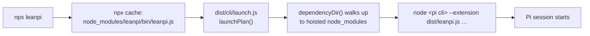

# PRD-031 — Publish LeanPi to npm (`npx leanpi`)

**Status:** IN PROGRESS — Phase 1 complete (AC-1–AC-4 verified 2026-09-20); AC-5 owner-gated.
**POST-RELEASE-EVALUATION-REQUIRED**
**Progress:** 90% — code and docs done; only the owner's publish (AC-5) remains.
**Complexity:** 3 (LOW); risk override: none.
**Owner:** LeanPi maintainers
**Depends on:** None

## Context

LeanPi's documented install is `npm install && npm run build && npm link`
(`README.md:31-37`) — a source checkout, not a package. `package.json` already
carries `bin.leanpi`, `files`, `engines`, `repository` and a `license`, so the
manifest looks publish-ready. It is not: **the packed tarball does not run.**

Verified 2026-09-20 by `npm pack` → `npm install <tgz>` into an empty directory
→ `leanpi --version`:

```
Pi's CLI was not found at <dir>/node_modules/leanpi/node_modules/@earendil-works/pi-coding-agent/dist/bundle/cli.js.
Run `npm install` in <dir>/node_modules/leanpi.
```

Cause: `src/cli/launch.ts` resolves every dependency as
`join(packageRoot(), "node_modules", <pkg>)` —
`resolvePiCli` (`src/cli/launch.ts:113`) and `bundledExtensions`
(`src/cli/launch.ts:93`). That path only exists in the pnpm dev checkout, where
`node_modules/` sits beside the source. npm and `npx` **hoist** dependencies to
the consumer's top-level `node_modules/`, so `node_modules/leanpi/node_modules/`
does not exist at all — confirmed: `ls node_modules/leanpi/node_modules` → no
such directory. Pi's CLI, `@hk_net/pi-usage-bars` and `pi-claude-code-ui` are
all unreachable, and `resolvePiCli` throws before a session can start.

Second gap: `dist/` is gitignored (`.gitignore:2`) and `files` ships it, with no
`prepack`/`prepublishOnly` in `scripts`. A publish from a clean clone would ship
an empty `dist/` and fail at `launchPlan`'s own "LeanPi is not built" guard
(`src/cli/launch.ts:224`).

Facts established while scoping:

- The name `leanpi` is **free** on the public registry (`npm view leanpi` → 404).
- The npm token copied to `.npmrc` (gitignored) is **expired**: `npm whoami` →
  `401 Unauthorized`. A fresh automation token is required before any publish.
- `files` already covers the non-`dist` runtime assets `launchPlan` reaches for:
  `themes/leanpi.json`, `skills/`, `src/cli/spinner.ts` (attached as TypeScript
  on purpose, `src/cli/launch.ts:71-82`) and `src/capability/models.json`.
  npm adds `README.md` and `LICENSE` automatically; both were present in the
  packed tarball.
- CI (`.github/workflows/ci.yml`) runs typecheck/lint/test only — no publish job.

## Solution

Two changes, no new module.

**1. Resolve dependencies by walking up the `node_modules` chain**, the way Node
itself does, instead of assuming one fixed location. One ~10-line stdlib helper
in `src/cli/launch.ts` replaces both hardcoded joins:

```ts
/** The installed directory of `pkg`, searching upward like Node's resolver. */
function dependencyDir(pkg: string, from: string): string | undefined {
	let dir = from;
	for (;;) {
		const candidate = join(dir, "node_modules", pkg);
		if (existsSync(candidate)) return realpathSync(candidate);
		const parent = dirname(dir);
		if (parent === dir) return undefined;
		dir = parent;
	}
}
```

`realpathSync` is kept for the reason already documented at
`src/cli/launch.ts:87-91` — pnpm's `node_modules/<pkg>` is a store link, and
Pi's loader requires an extension's own dependencies relative to the path it is
handed. The upward walk covers the pnpm dev checkout (hit on the first
iteration, behavior unchanged), a hoisted `npm i -g` tree, and the `npx` cache
tree identically.

`createRequire().resolve()` was considered and rejected: the deep specifiers
this needs (`.../dist/bundle/cli.js`, `.../extensions/index.ts`) are subject to
each dependency's `exports` map, and the comment at `src/cli/launch.ts:106-109`
already records that `pi-coding-agent` does not expose its own manifest. Path
existence is what this code actually needs, and `bundledExtensions` already
treats a missing package as skip-not-fatal.

The "Run `npm install` in \<root\>" message in `resolvePiCli`'s error is correct
advice only for a dev checkout; for an installed package it is wrong. The error
text becomes one that names the package and says to reinstall `leanpi`.

**2. Build on pack.** Add `"prepack": "tsc -p tsconfig.json"` so `npm pack`,
`npm publish` and a git-dependency install all produce `dist/` from source.
`prepack` rather than `prepublishOnly` because it also covers `npm pack` and
direct-from-repo installs.

Docs: `README.md` "Run it" leads with `npx leanpi`, with the source checkout kept
below it for contributors.

Consumer flow:



Out of scope: scoped/private publishing, a changelog or release-notes
generator, semantic-release, provenance attestation, and a publish GitHub
Action. The first release is a manual `npm publish` by the owner; automate it
only once there is a second release to automate.

## Acceptance Criteria

- [x] AC-1 [local; actor: agent]: `npm pack` in a clean checkout produces a tarball whose `dist/` is populated without a prior manual `pnpm build`. — Evidence: `rm -rf dist` then `npm pack` in the repo produced `leanpi-0.1.0.tgz`; `tar -tzf` lists `package/dist/cli/launch.js` and `package/dist/leanpi.js`, so `prepack` built `dist/` from source.
- [x] AC-2 [local; actor: agent]: Installing that tarball into an empty directory and running `./node_modules/.bin/leanpi --version` prints Pi's version and exits 0 — no "Pi's CLI was not found". — Evidence: tarball installed into an empty `npm init -y` dir (295 packages, `node_modules/leanpi/node_modules` absent — the hoisted layout); `./node_modules/.bin/leanpi --version` printed `0.86.1`, exit 0.
- [x] AC-3 [local; actor: agent]: The same install attaches the bundled extensions from the hoisted tree: `launchPlan`'s args contain absolute, existing paths for `pi-claude-code-ui` and `themes/leanpi.json`. — Evidence: importing the installed `dist/cli/launch.js` and calling `launchPlan(["--version"])` yields `cli` and every `bundled` entry absolute and existing — `…/node_modules/pi-claude-code-ui/extensions/index.ts`, `…/node_modules/pi-claude-code-ui/extensions/spinner.ts`, `…/node_modules/@hk_net/pi-usage-bars/extensions/usage-bars/index.ts` — plus `…/node_modules/leanpi/themes/leanpi.json` and `…/node_modules/leanpi/src/cli/spinner.ts`, both existing.
- [x] AC-4 [local; actor: agent]: `pnpm typecheck`, `pnpm lint` and `pnpm test` pass, and the dev checkout still launches unchanged (`pnpm leanpi --version`). — Evidence: `pnpm typecheck` clean; `pnpm lint` warnings only (all pre-existing); `pnpm test` 108 files / 622 tests pass; `pnpm leanpi --version` → `0.86.1`, exit 0. New unit test `tests/cli/launch.spec.ts` — "finds dependencies hoisted above the package" — builds a fixture with the dependencies one level *above* the package root and asserts `resolvePiCli`/`bundledExtensions` return the hoisted absolute paths.
- [ ] AC-5 [owner; actor: maintainer]: A fresh npm automation token is in place, `npm publish` succeeds, and `npx leanpi@<version> --version` in a clean directory on another machine prints the version. — Evidence: pending (owner action; this PRD does not authorize a publish).

## Integration Ledger

| Capability | Reachable consumer/trigger | Replaces / disposition | Evidence |
|---|---|---|---|
| Launch from an installed package | `npx leanpi` → `bin/leanpi.js` → `launchPlan` (`src/cli/launch.ts:220`) → `resolvePiCli` / `bundledExtensions` | Replaces the fixed `packageRoot()/node_modules` joins at `src/cli/launch.ts:93` and `:113`; no second code path kept | AC-2, AC-3 |
| Publishable artifact | `npm pack` / `npm publish` → `prepack` → `files` | Replaces the documented `npm link` install as the primary path; source checkout stays documented for contributors | AC-1, AC-5 |

## Execution Phases

#### Phase 1: The installed package finds its dependencies
**Status:** COMPLETE
**ACs:** AC-1, AC-2, AC-3, AC-4
**Files:**
- `src/cli/launch.ts` — added `dependencyDir(entry, from)` (upward `node_modules` walk, realpath'd); used in `resolvePiCli` and `bundledExtensions`; the not-found error now names the package and says to reinstall `leanpi`.
- `package.json` — added `scripts.prepack` (`tsc -p tsconfig.json`).
- `tests/cli/launch.spec.ts` — resolution from a hoisted layout; the dev-checkout `plan.cli` assertion realpath'd to match the store link.

**Implementation:**
1. Add `dependencyDir(pkg, from)` as above (stdlib `fs`/`path` only, already imported).
2. `bundledExtensions`: map each entry to `dependencyDir(<pkg>, root)` joined with the entry's in-package subpath; keep the existing `existsSync` filter so a missing optional extension stays a skip, not a crash.
3. `resolvePiCli`: `dependencyDir("@earendil-works/pi-coding-agent", root)` + `dist/bundle/cli.js`; throw naming the package and instructing a reinstall of `leanpi` when absent.
4. `package.json`: `"prepack": "tsc -p tsconfig.json"`.

**Verification:** E1 — build a tarball from a clean worktree (`npm pack`, no prior build), `npm install` it into an empty temp dir, assert `node_modules/leanpi/dist/cli/launch.js` exists (AC-1) and `./node_modules/.bin/leanpi --version` exits 0 printing a version (AC-2). Negative control: this exact sequence is the failure already observed on `main` (`Pi's CLI was not found at …/node_modules/leanpi/node_modules/…`), so a pass distinguishes the fix from the pre-change baseline — no manufactured red needed. E2 — a unit test over `bundledExtensions`/`resolvePiCli` against a fixture tree with the dependency one level *above* the package root, asserting absolute existing paths (AC-3); this is a distinct failure mode from E1 (wrong path *content* vs. process exit). E3 — `pnpm typecheck && pnpm lint && pnpm test && pnpm leanpi --version` for the unchanged dev path (AC-4).
**Checkpoint:** done — E1/E2/E3 all pass; evidence recorded on AC-1–AC-4.

#### Phase 2: First release
**Status:** IN PROGRESS — README done; the publish is an owner action (AC-5).
**ACs:** AC-5
**Files:** `README.md` — "Run it" leads with `npx leanpi`; the checkout install moved under a contributor heading.
**Implementation:** Update the README install path. Then, **owner action only** (this PRD does not authorize it and no agent step performs it): mint a fresh npm automation token, confirm `npm whoami`, `npm publish`, and smoke `npx leanpi@<version> --version` from a clean directory.
**Verification:** E4 — README's stated command matches the published `bin` name (`leanpi`) and the tarball smoke from E1 (AC-2). E5 (owner) — registry URL for the published version plus the `npx` smoke output.
**Checkpoint:** pending — README updated (E4 met); AC-5 awaits the owner's publish.

## Open items for the owner

One request, at the end of Phase 1:

1. **Credential: resolved 2026-09-20.** A granular token
   `leanpi-publish-2026-09` was created on the `jonit-dev` account (read/write,
   all packages, direct publish, expires 2026-12-19) and written to this repo's
   gitignored `.npmrc` (`.gitignore:9`, mode 600). Verified: `npm whoami` →
   `jonit-dev`.

   Two caveats for AC-5:
   - **Scope is wider than wanted.** npm only scopes a granular token to
     packages that already exist, and `leanpi` does not yet — so "all packages"
     was the only option. After the first publish, replace it with a token
     scoped to `leanpi` alone and delete this one.
   - **Bypass-2FA did not take.** The generated token shows no checkmark in the
     tokens table's Bypass 2FA column, so `npm publish` will likely prompt for
     an OTP (`--otp=<code>`). That is fine for a manual first release; a CI
     publish would need a bypass-2FA token or a trusted-publisher setup.

     **Confirmed the hard way (2026-09-22, releases 0.1.1 and 0.1.2).**
     `npm publish` with this token fails `EOTP` — `npm token list --json` shows
     `"bypass_2fa": false` for `leanpi-publish-2026-09`, and `true` for the
     account's `threenative-github-actions-2026-09` token, whose
     `{type: "package", name: null}` scope (npm's "all packages: write") does
     cover `leanpi`. Two consequences worth keeping:
     - The repo `.npmrc` listed **this** token, and a project `.npmrc`
       overrides `~/.npmrc`, so it silently shadowed the account's bypass-2FA
       token. It is now commented out with the reason inline; re-enable it the
       moment the leanpi token gets the bypass toggle, since it is the
       least-privilege option.
     - `npm publish` reported `+ leanpi@0.1.1` and the packument lagged by
       ~2 minutes on the CDN; `npm view` returned `ETARGET`/`404` throughout,
       and only `curl https://registry.npmjs.org/leanpi/0.1.1` settled it. Do
       not re-publish on a lagging read — npm rejects the duplicate with
       "You cannot publish over the previously published versions".

   Superseded context, kept because it explains why nothing on disk worked:
   the ten pre-existing `.npmrc` files under `~/projects` carry only two
   distinct tokens (fingerprints `d006d3d6`, `deb7d363`), both `401
   Unauthorized`, and `jonit-dev/lean-pi` has no repository secrets
   (`gh secret list` empty).
