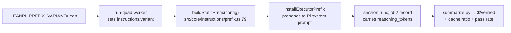

# PRD-037 — Reasoning-token cost lever

**Status:** IN PROGRESS (Phase 1 done 2026-09-23)
**Complexity:** 2 (LOW); risk override: none.
**Owner:** LeanPi maintainers
**Depends on:** None

## Context

The 2026-09-21/22 cost follow-up (`docs/benchmarks/2026-09-21-cost-followup.md`)
closed the relative goal: LeanPi is **32.0% cheaper per verified completion**
than stock Pi on `cost-followup-20260922` ($0.008150 vs $0.011991, both 5/5).
What is left is a single component.

Decomposed from that run (mean per attempt, same task/model/rates):

| component | leanpi | stock-pi | delta |
| --- | --: | --: | --: |
| uncached input | $0.002584 | $0.005070 | **−$0.002486** |
| cached input | $0.000797 | $0.001591 | **−$0.000794** |
| output + reasoning | $0.006283 | $0.005330 | **+$0.000953** |
| JEV classifier | $0.000123 | $0 | +$0.000123 |

LeanPi wins input by $0.003280 and loses output by $0.000953. That loss is
**entirely reasoning**:

| mean per attempt | leanpi | stock-pi |
| --- | --: | --: |
| tool calls | 19.6 | 19.2 |
| non-reasoning output tokens | 3,215 | 3,870 |
| reasoning tokens | 7,257 | 5,013 |

Turns are equal and LeanPi writes *fewer* answer tokens; it thinks +42% more per
turn. The turn-count lever is spent — do not re-run it.

Dead ends already measured (do not retry):

- `backends.opencode-go.thinkingLevel: low` → **cost +79%** (total reasoning
  8,899 → 20,036, tools 22.8 → 29.0). Less effort per turn buys more turns.
- Fixing the dropped `explicit_result` marker so complexity becomes `LOW` →
  **cost +90%** (`LOW` routes the reviewer `by_review_risk` and rebuilds the
  prompt prefix).

Untested: the **STATIC prefix**. `installExecutorPrefix` (`src/index.ts:196`)
prepends `buildStaticPrefix` (`src/core/instructions/prefix.ts:79`) — the
6,637-byte vendored Ponytail bundle, then `WORKING_RULES`, then `OUTPUT_STYLE` —
to Pi's own system prompt. Stock Pi sends no such block. The prefix is cacheable
(cache ratio 0.9360 vs 0.9386), so its *input* cost is already negligible; its
*behavioral* effect on deliberation is unmeasured. `instructions.ponytail: false`
already renders a much smaller prefix (`WORKING_RULES` + `OUTPUT_STYLE` only),
so one comparison point exists today.

## Solution

Measure the prefix's effect on reasoning with a controlled A/B, then ship the
leanest variant that holds pass rate and cache ratio. No new module.

**Variants** (all byte-stable per session, so the cache is not disturbed):

- `full` — today's default: Ponytail marker + vendored body + working rules +
  output style. 6,637 B body.
- `lean` — working rules + output style, no vendored body. This is exactly
  `instructions.ponytail: false` today.
- `minimal` — one short executor instruction (tool protocol + "verify with the
  project's own runner"), no persona, no output style.

The knob is `instructions.variant: full | lean | minimal`, parsed by
`src/core/config.ts` beside the existing `instructions.ponytail` boolean
(`src/core/config.ts:400`), defaulting to `full`. `ponytail: false` keeps working
and is equivalent to `variant: lean`; if both are set, `variant` wins and the
combination is rejected at parse time rather than silently ordered.

The bench driver reads `LEANPI_PREFIX_VARIANT` in its Pi worker and sets the
knob on the run's config, so a variant is selected without editing code.

**Measurement.** The 2026-09-21 handoff's own power calculation says a true 20%
difference needs ~28 trials per arm; within-arm cost spread is 2.4×. This lever
is smaller than 20%, so a smaller n cannot resolve it. Run each variant against
the same stock-Pi control in one run, and report the **within-run ratio**, which
cancels provider drift. Score on cost per verified completion (§53), with failed
trials kept in the numerator.

**Guards (stop conditions, not optimisations).** Any variant that drops the
cache ratio below 0.93 or the pass rate below the `full` baseline is rejected
regardless of its reasoning tokens — the one experiment that broke the prefix
doubled the bill on its own.

Consumer flow:

Out of scope: changing the model or its `reasoning` config (measured dead end),
touching the reviewer/JEV routing, and any per-turn dynamic prompt content.

## Acceptance Criteria

- [x] AC-1 [local; actor: agent]: A prefix variant is selectable for a run without editing code — `LEANPI_PREFIX_VARIANT` applies to each LeanPi bench row as `instructions.variant`, and the default stays `full`. — Evidence: `configForRow` (`src/bench/adapters.ts`) applies it; `instructions.variant` parses and renders (`src/core/config.ts`, `src/core/instructions/prefix.ts`); `tests/prefix.spec.ts`, `tests/config.spec.ts` and `tests/bench/adapters.spec.ts` pass; run-quad preflight reports `dist_newer_than_src: true`.
- [ ] AC-2 [local; actor: agent]: One run records reasoning tokens per turn, cost per verified completion, cache ratio and pass rate for `full` and at least one trimmed variant, each against the same stock-Pi control, n≥28 per arm. — Evidence: pending.
- [ ] AC-3 [local; actor: agent]: The chosen variant reduces mean reasoning tokens per turn by ≥15% vs `full`, at pass rate ≥ the `full` baseline and cache ratio ≥0.93. — Evidence: pending.
- [ ] AC-4 [local; actor: agent]: The chosen variant's cost per verified completion improves on `bench/cost/baseline.json`, and `pnpm typecheck`, `pnpm lint`, `pnpm test` stay green with `full` as the shipped default until AC-3 is met. — Evidence: pending.

## Integration Ledger

| Capability | Reachable consumer/trigger | Replaces / disposition | Evidence |
|---|---|---|---|
| Selectable executor prefix | `leanpi.config.yaml` `instructions.variant` → `loadConfig` (`src/core/config.ts:400`) → `buildStaticPrefix` (`src/core/instructions/prefix.ts:79`) → `installExecutorPrefix` (`src/index.ts:196`) | Extends the existing `instructions.ponytail` switch; `full` remains the default, so no consumer path changes until AC-3 chooses otherwise | AC-1, AC-3 |
| Variant selection on the bench path | `LEANPI_PREFIX_VARIANT` → run-quad Pi worker → run config | New env-only bench hook; the interactive default is untouched | AC-1, AC-2 |

## Execution Phases

#### Phase 1: The prefix variant is selectable, and `full` is still the default
**Status:** DONE (verified 2026-09-23)
**ACs:** AC-1
**Files:**
- `src/core/types.ts` — `PrefixVariant` union and `InstructionsConfig.variant?`.
- `src/core/config.ts` — parse/validate `instructions.variant`; reject `variant` + `ponytail` together; default renders `full`.
- `src/core/instructions/prefix.ts` — `buildStaticPrefix` renders by variant; `ponytail: false` maps to `lean`; `TOOL_PROTOCOL` moved here so both the `minimal` prefix and the assembled prompt read one string.
- `src/context/prompt.ts` — imports `TOOL_PROTOCOL` and no longer re-appends it when the prefix already carries it.
- `src/index.ts` — exports `TOOL_PROTOCOL` and the `PrefixVariant` type.
- `src/bench/adapters.ts` — `configForRow` applies `LEANPI_PREFIX_VARIANT` to each LeanPi row's config, so every bench entry point (the validated-suite lane and the four-way worker) selects a variant without editing code.
- `tests/prefix.spec.ts`, `tests/config.spec.ts` — variant bytes, the `ponytail: false` equivalence, and config validation.

**Implementation:** Add the union type and parse it with the same `ConfigError` shape as `instructions.ponytail` (`src/core/config.ts:401`). `buildStaticPrefix` switches on the variant; `full` must reproduce the current string byte-for-byte so the cache and every prefix-hash test are unaffected. The worker override is one assignment next to the existing config pruning.
**Verification:** E1 — `pnpm typecheck && pnpm lint && pnpm test`; the new spec asserts `full` output equals the pre-change string (a golden literal), `lean` equals today's `ponytail: false` output, and `minimal` contains the tool-protocol line but neither `PONYTAIL_MARKER` nor `OUTPUT_STYLE`. Negative control: a spec that asserts `minimal !== full` fails if the knob is ignored. E2 — `node bench/out/four-way-20260921/run-quad.mjs` preflight still passes offline (no API calls).
**Checkpoint:** 2026-09-23 — `pnpm typecheck` clean; `pnpm lint` exit 0 (warnings only); `pnpm test` 1064 passed, 2 failed, 11 skipped — both failures are the pre-existing `PRD-001 AC-9` role-ladder `UnknownPinError` on `capability.roles.strong.pin "opus"` (reproduced on a stashed, unmodified tree), unrelated to this change; `tests/prefix.spec.ts` 14 passed, including an end-to-end spec that boots a session with `variant: minimal` and asserts the provider payload carries `TOOL_PROTOCOL` and not `PONYTAIL_MARKER`, with `execute` still on the surface; `tests/config.spec.ts` 24 tests, only the same two pre-existing failures; `tests/bench/adapters.spec.ts` verifies the env hook picks the variant and leaves the loaded config unmutated; run-quad preflight passes offline (`dist_newer_than_src: true`, `api_key: true`). **Deviations:** two files beyond the original list (`prompt.ts`, `index.ts`) move the tool-protocol string to one source so the `minimal` prefix does not duplicate it in the assembled prompt; the full and lean renders are unchanged byte-for-byte, asserted against the pre-change composition.

#### Phase 2: Measure the variants and ship the leanest one that holds
**Status:** NOT STARTED
**ACs:** AC-2, AC-3, AC-4
**Files:**
- `bench/cost/series.json` (or a new `bench/out/reasoning-lever-<date>/`) — the recorded run and its variant arms.
- `src/core/instructions/prefix.ts` + `src/core/config.ts` — the chosen default, if AC-3 is met; otherwise the default stays `full` and this phase records why.

**Implementation:**
1. Run `full`, `lean`, `minimal` each against stock Pi in one run at n≥28, with `LEANPI_PREFIX_VARIANT` selecting the arm. Reuse completed attempts (`run-quad.mjs` refuses to re-bill them).
2. Fold the §52 records: reasoning tokens per turn, cache ratio, pass rate, `summarize.py` cost per verified completion.
3. If a variant clears AC-3 and AC-4, make it the default and re-record `bench/cost/baseline.json`; otherwise leave `full` as the default and record the negative result in `docs/benchmarks/2026-09-21-cost-followup.md`.

**Verification:** E3 — the recorded run's `summary-input.json` through `summarize.py`, showing each variant's cost per verified completion and the within-run ratio to stock Pi (AC-2). E4 — reasoning tokens per turn and cache ratio computed from the same run's `telemetry.jsonl`, asserted against the AC-3 thresholds (AC-3). E5 — `pnpm typecheck && pnpm lint && pnpm test` on the shipped default, plus the `bench/cost/gate.mjs` comparison if PRD-038 has landed (AC-4).
**Checkpoint:** pending

## Open risks

- **The prefix may not be the driver.** The +42% reasoning could come from the tool surface (`search` as a separate call) or from Pi's own prompt under a different tool count. Phase 2's variants will show whether removing prefix bytes moves reasoning at all; a null result is a valid outcome and closes the PRD with that recorded.
- **Reasoning is not free to cut.** The `thinkingLevel: low` result is the warning: less deliberation per turn can buy more turns. AC-3 therefore gates on pass rate and cost, never on reasoning tokens alone.
