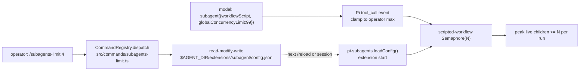

# PRD-041 — pi-subagents integration (reachable delegation, operator per-run limit)

**Status:** NOT STARTED
**Complexity:** 5 (MEDIUM); risk override: none.
**Owner:** LeanPi maintainers
**Depends on:** None
**Base:** `a7bc232`; stacked on open PR #4 (`fix/tdd-self-improvement`).

## Context

LeanPi has no subagent delegation. The reference package is
[`pi-subagents`](https://pi.dev/packages/pi-subagents) 0.70.1 (github
`nicobailon/pi-subagents`, pinned tarball shasum
`c961a4a5d8250ff5dd4625cdc5f85161eda4f06`, MIT). It is a Pi extension whose root
entry default-exports `registerSubagentExtension(pi)`
(`package/index.js`); it registers the `subagent` tool, the `bg_wait` tool, a
supervisor tool, agents/skills/prompts and many `/subagents*` commands. We add it
as a dependency and attach it — we do not rebuild it.

The user asked for one thing beyond delegation: a **max of 3 children running at
once, per delegation run**, configurable with a command. Upstream already has
`globalConcurrencyLimit` (default 20, docs/configuration.md) enforced per run by
a fresh `Semaphore` (`workflows/scripted-workflow.js:1936`,
`runs/background/subagent-runner.js:1498`,
`runs/foreground/subagent-executor.js:1671`). It is **not** process-wide: two
independent calls each get their own semaphore. That is the ceiling we can
honestly enforce, and the PRD does not claim more.

### Verified upstream facts (targeted reads)

- Config: `getConfigPath()` = `join(getAgentDir(), "extensions", "subagent",
  "config.json")` (`src/extension/config.js:194`), honoring
  `PI_CODING_AGENT_DIR`. `loadConfig()` is called **once** per extension start
  (`src/extension/index.js:378`) and captured in `executorDeps`; there is no
  public refresh or config setter and no slash command writes this key.
  `updateConfig`/`saveConfig` are module-local. A written value applies after
  `/reload` or restart.
- Override: `public-execution.js:43-53` accepts a **top-level**
  `globalConcurrencyLimit` only on `workflowScript`/`workflowScriptPath`; a plain
  `{agent, task}` call is rejected if it carries the field. Consumers read
  `requestParams.globalConcurrencyLimit ?? deps.config.globalConcurrencyLimit`.
- Clamp seam: Pi's extension API fires `tool_call` before execution with a
  **mutable** `event.input` and no re-validation
  (`pi-coding-agent dist/core/extensions/types.d.ts:745-790,1014`) — verified in
  this checkout's installed SDK (`node_modules/@earendil-works/pi-coding-agent`).
- Children: root `index.js` is inert when `PI_SUBAGENT_CHILD=1`, and a
  foreground child is built with `host: "parent"` →
  `ambientExtensions = false` → `DefaultResourceLoader({noExtensions:true})`
  (`src/runs/shared/child-launch.js:184,230`). A child therefore never re-loads
  LeanPi's extension; a background runner process carries `PI_SUBAGENT_CHILD=1`.
  LeanPi's module-global lanes are safe.
- `/run` (a Pi host command, `src/slash/slash-commands.js:844`) calls the
  executor directly via `launchCommand(ctx, {workflowScript,…})` — a host-owned
  delegation entrypoint that does not depend on who owns the model loop.

### Reachability by parent mode (the part that must be honest)

| Parent mode | Who answers the turn | Model can call `subagent`? | Supported delegation entrypoint |
|---|---|---|---|
| `leanpi` CLI, native backends | Pi's own loop | Yes | `subagent` tool (AC-1) |
| `createLeanPiSession`, native backends | Pi's own loop | Yes, once enabled | `subagent` tool (AC-2) |
| External-harness (all roles `external_harness`) | the vendor CLI (LeanPi returns `{action:"handled"}`, `src/index.ts:801-891`) | **No** | host-owned `/run`, `/subagents*`, `/subagents-limit` (AC-9) |
| Plain `pi --extension` | Pi's own loop | Yes | `subagent` tool (CLI plan) |

Registering a Pi tool does **not** make it callable by an external vendor CLI.
No external-harness adapter or scheduler is invented here; the gap is disclosed
and the host-owned commands are the supported path.

## Solution

One small adapter module and one command; everything else is wiring.

- **Attach once.** Add `pi-subagents@0.70.1` (exact) to `dependencies`. Append
  `node_modules/pi-subagents/index.js` to `BUNDLED_EXTENSIONS`
  (`src/cli/launch.ts:46`) so `launchPlan` resolves it via the existing
  `dependencyDir` walk and Pi attaches it after LeanPi's own extension. For the
  SDK, add a second `extensionFactories` entry in `createLeanPiSession`
  (`src/index.ts:1117`) that calls `registerSubagentExtension(pi)`.
- **Don't hide the package's tools.** The SDK session passes an explicit tool
  allowlist (`src/index.ts:1163,1171`); add the upstream parent tool names
  (`subagent`, `bg_wait`, `subagent_supervisor`) to both the allowlist and the
  active set so the registered tools are callable, not merely present.
- **Own the operator limit.** `src/subagents/index.ts`:
  - `ensureDefaultLimit()` runs at `activate()` — if the config file names no
    `globalConcurrencyLimit`, read-modify-write the parsed object adding exactly
    `3`, preserving every other key; if the file is unparseable, **abort and
    leave it untouched**.
  - `clampSubagentOverride(pi)` registers one `pi.on("tool_call", …)` handler:
    for `toolName === "subagent"`, clamp `input.globalConcurrencyLimit` down to
    the cached operator max only when `input.workflowScript`/`workflowScriptPath`
    is present; never inject the field on a plain `{agent, task}` call.
  - The cached max is read once per activation, matching upstream's
    once-per-start capture, so the clamp and the loaded config never disagree.
- **One command.** `src/commands/subagents-limit.ts`, registered through the
  existing registry so it appears in `/help` and is bridged to Pi
  (`registerCommandSurface`, `src/commands/index.ts`). `/subagents-limit` shows
  the cached value; `/subagents-limit <N>` validates a positive safe integer and
  writes it; `/subagents-limit reset` writes `3`. Invalid input writes nothing.
  Set/reset report "saved; applies after /reload or restart" — the honest
  upstream behaviour.

Consumer flow:

Out of scope: a process/session-wide cap across independent calls (upstream has
none and it is not promised), RPC/extension-to-extension callers (separate
trusted API; disclosed, not covered), background detached runs beyond the
forwarded clamped params, and any second native execution to expose tools.

## Acceptance Criteria

- [ ] AC-1 [local; actor: agent]: `launchPlan` attaches the pinned `pi-subagents` entry exactly once, after LeanPi's own extension, and a real Pi-native session boots with `subagent` registered and callable (stub model emits the tool call). — Evidence: pending.
- [ ] AC-2 [local; actor: agent]: `createLeanPiSession` exposes and activates `subagent` and `bg_wait` (and admits `subagent_supervisor`) through the real SDK session; no upstream parent tool is hidden by LeanPi's allowlist. — Evidence: pending.
- [ ] AC-3 [local; actor: agent]: On activation with no `globalConcurrencyLimit`, the file at `getAgentDir()/extensions/subagent/config.json` gains `= 3` while every unrelated key and any explicit user value is preserved; malformed JSON is left untouched and abort is observable. — Evidence: pending.
- [ ] AC-4 [local; actor: agent]: `/subagents-limit` show/set/reset dispatches through the real command registry, appears in `/help`, rejects non-positive/non-integer input without writing, and its save message names `/reload` or restart. — Evidence: pending.
- [ ] AC-5 [local; actor: agent]: A model-issued `subagent` call carrying a top-level `workflowScript` and `globalConcurrencyLimit` above the operator max is clamped to the max; a lower value is respected; a plain `{agent, task}` call is untouched — observed through a real session tool call, not only a handler unit. — Evidence: pending.
- [ ] AC-6 [local; actor: agent]: With >3 children requested by one run in a real SDK session against the local provider fixture, the observed peak concurrent child requests at the provider boundary is ≤3 (default). — Evidence: pending.
- [ ] AC-7 [local; actor: agent]: `/subagents-limit 2` followed by a new session lowers the observed peak to ≤2, and the value persists across a restart; an invalid command write leaves the file byte-identical. — Evidence: pending.
- [ ] AC-8 [local; actor: agent]: After a child run the parent session's LeanPi activation is not re-run (lanes unchanged, process env not marked child) and an ordinary native turn still completes. — Evidence: pending.
- [ ] AC-9 [local; actor: agent]: Each parent mode's supported delegation entrypoint is documented, and in an external-harness parent session the host-owned `/run` and `/subagents-limit` commands are reachable through the real session command surface; the unsupported model-driven path is disclosed, not claimed. — Evidence: pending.
- [ ] AC-10 [local; actor: agent]: The `npm pack` tarball's launcher attaches the pi-subagents path and every attached path exists in the packed layout; PRD archived to `done/` with evidence. — Evidence: pending.

## Integration Ledger

| Capability | Reachable consumer/trigger | Replaces / disposition | Evidence |
|---|---|---|---|
| Package attachment (CLI) | `leanpi` → `launchPlan` `BUNDLED_EXTENSIONS` (`src/cli/launch.ts:46`) → Pi `--extension` → `subagent` tool | New; no prior delegation path | AC-1 |
| Package attachment (SDK) | `createLeanPiSession` `extensionFactories` (`src/index.ts:1117`) → session enabled tools | New | AC-2 |
| Operator per-run limit | `activate()` → config write; model `subagent` call → `pi.on("tool_call")` clamp → upstream `globalConcurrencyLimit` | New LeanPi writer for an upstream-read key; upstream has no writer | AC-3, AC-5 |
| `/subagents-limit` command | user types it in Pi's TUI → `CommandRegistry` → `bridgeCommands` → `registerSubagentExtension` config | New; upstream ships no concurrency command | AC-4 |
| External-harness delegation | host-owned `/run` (`src/slash/slash-commands.js:844`) and `/subagents*` Pi commands | Reused upstream; unchanged | AC-9 |
| Child isolation from LeanPi | `PI_SUBAGENT_CHILD=1` / `host:"parent"` `noExtensions` | Reused upstream policy; no LeanPi scheduler added | AC-8 |

## Execution Phases

#### Phase 1: The package is attached and reachable in both Pi-native parent modes
**Status:** NOT STARTED
**ACs:** AC-1, AC-2
**Files:**
- `package.json` — add `"pi-subagents": "0.70.1"` (exact) to `dependencies`.
- `src/cli/launch.ts` — append `join("pi-subagents", "index.js")` to `BUNDLED_EXTENSIONS`.
- `src/subagents/index.ts` (new) — `subagentsFactory()` wrapping `registerSubagentExtension`.
- `src/index.ts` — add the factory to `extensionFactories` and the upstream tool names to the `tools` allowlist and `setActiveToolsByName` in `createLeanPiSession`.
- `tests/subagents/registration.spec.ts` (new) — real-session registration/first delegation.

**Implementation:** Install the exact version; verify typebox peer compatibility at install. Keep LeanPi's factory first so `activate()` runs before upstream's `loadConfig()`. For the SDK, `noTools: "builtin"` already disables Pi builtins; add `subagent`, `bg_wait`, `subagent_supervisor` to the enabled set. Prove a single registration (no duplicate `subagent`).
**Verification:** E1 — `pnpm typecheck && pnpm lint`; new spec boots `createLeanPiSession` with the attached factory and a stub backend that emits one `subagent` tool call, asserting the tool is registered and the handler is reached (AC-2, AC-1). E2 — `launchPlan([], root).args` contains exactly one pi-subagents path, positioned after LeanPi's extension (AC-1). Negative control: assert `subagent` is absent when the factory is not attached.
**Checkpoint:** pending

#### Phase 2: LeanPi owns the operator per-run limit
**Status:** NOT STARTED
**ACs:** AC-3, AC-4, AC-5
**Files:**
- `src/subagents/index.ts` — `subagentConfigPath()`, `ensureDefaultLimit()`, `readLimit()`, `setLimit(n | "reset")`, `clampSubagentOverride(pi)`.
- `src/commands/subagents-limit.ts` (new) — show/set/reset handler with validation and the reload message.
- `src/commands/index.ts` — register the command and add `subagents-limit` to `OWNED_COMMANDS`.
- `src/index.ts` — call `ensureDefaultLimit()` and `clampSubagentOverride(pi)` in `activate()`.
- `tests/subagents/limit.spec.ts` (new) — config, command and clamp coverage.

**Implementation:** Read the JSON object, mutate only the one key, write atomically (tmp + rename) in the same tidy shape upstream uses; on parse failure, throw/notify and do not write. `ensureDefaultLimit()` adds the key only when absent, so a user's explicit value survives and unrelated keys are byte-preserved. The clamp handler reads the cached max from activation and only touches top-level workflow overrides.
**Verification:** E3 — command/config spec against a temp `PI_CODING_AGENT_DIR`: default 3 created; unrelated keys and an explicit value preserved; malformed file untouched and no write observed; invalid `N` rejected; reset writes 3; `/help` lists the command (AC-3, AC-4). E4 — real-session `tool_call` clamp: `{workflowScript, globalConcurrencyLimit: 99}` → max; `{…, 2}` unchanged; `{agent, task}` byte-identical input (AC-5). Negative control: a handler call that mutates input without the guard must fail the plain-call assertion.
**Checkpoint:** pending

#### Phase 3: Real concurrency and parent-state proof
**Status:** NOT STARTED
**ACs:** AC-6, AC-7, AC-8
**Files:**
- `tests/helpers/stub-backend.ts` — add a held-response mode that records start/end timestamps and exposes peak concurrent in-flight requests (extend, don't add a second stub).
- `tests/subagents/concurrency.spec.ts` (new) — real `createLeanPiSession` + pi-subagents + local stub provider.

**Implementation:** Script the parent model to emit one `subagent` `workflowScript` fanning out to ≥5 children, all resolving to the stub model; children are delayed so overlap is observable. Count peak concurrency among requests tagged as child runs (`<active_agent` / agent name in the body), and assert the default peak ≤3. Then run `/subagents-limit 2` through the real registry, boot a new session, and re-measure (≤2). Capture `listLanes()`/activation identity before and after to prove the parent was not re-activated.
**Verification:** E5 — `vitest run tests/subagents/concurrency.spec.ts` asserting observed peak ≤3 with 5+ requested, the changed peak after the command, and restart persistence (AC-6, AC-7). E6 — the same run asserts parent lanes/env unchanged and a subsequent ordinary native turn completes (AC-8). Negative control: with the limit temporarily removed, the observed peak exceeds 3, proving the measurement is not vacuous.
**Checkpoint:** pending

#### Phase 4: Reachability settled, packaged, archived
**Status:** NOT STARTED
**ACs:** AC-9, AC-10
**Files:**
- `README.md` — a short "Subagents" section: the support matrix, the default 3, `/subagents-limit`, the per-run scope and the external-harness gap.
- `tests/subagents/reachability.spec.ts` (new) — external-harness parent session command surface.
- `tests/cli/packaging.spec.ts` — assert the pi-subagents path is attached and exists in the packed layout.
- `docs/PRDs/v1/PRD-041-subagents-integration.md` → `git mv` to `done/` in the finishing commit.

**Implementation:** Boot an external-harness-configured session and read the real command surface; assert `/run` (upstream) and `/subagents-limit` (LeanPi) are registered, and record the documented model-path gap. Document the per-run ceiling honestly: independent calls each get their own semaphore, and RPC/extension callers are a separate trusted API.
**Verification:** E7 — reachability spec asserts the host-owned commands are present in the external-harness parent and no model-tool claim is made (AC-9). E8 — `pnpm test` packaging smoke (`npm pack` + `launchPlan` in the unpacked layout) attaches the pi-subagents path and every attached path exists (AC-10). E9 — full gates `pnpm typecheck && pnpm lint && pnpm test` on the final revision; then archive the PRD with the recorded evidence.
**Checkpoint:** pending

## Open risks

- **Peer resolution in the packed layout.** `pi-subagents` declares optional peers (`@earendil-works/pi-*`, `typebox@1.1.38` vs this repo's `1.3.34`) and ships plain `.js` loaded natively, not via jiti. Phase 1 must confirm the extension actually loads with no `Failed to load extension` error; if peer resolution fails, fall back to the `dependencyDir` entry and record it.
- **`/run` is not clamped by the tool_call hook.** `/run` calls the executor directly, bypassing the model tool event; it uses the config default (3) but a future `/run` override would not be clamped. Disclosed; not covered.
- **External-harness cannot model-call `subagent`.** This is inherent to a vendor CLI owning the turn. Documented as a prerequisite, not solved with an adapter.
- **Async/background runs** spawn a detached process and re-derive the limit from forwarded params (`runs/background/async-execution.js`). Only the forwarded clamped value is covered; a direct background override outside the model path is out of scope.

## Ownership

Task ledger convention does not exist in this repository (searched; none found), so ownership is recorded here: worktree `/home/joao/projects/lean-pi/.worktrees/subagents-integration`, branch `feat/subagents-integration`, base `a7bc232`, owner LeanPi maintainers, stacked draft PR against `fix/tdd-self-improvement` (#4).
