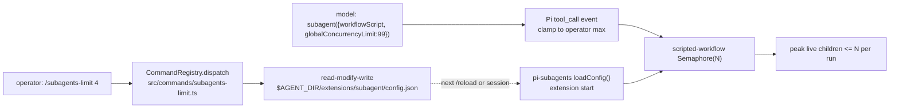

# PRD-041 — pi-subagents integration (reachable delegation, operator per-run limit)

**Status:** IN PROGRESS
**Complexity:** 5 (MEDIUM); risk override: none.
**Owner:** LeanPi maintainers
**Depends on:** None
**Base:** merged main `0ff9016` (`Merge current main into production hardening`) on
branch `feat/subagents-integration`. The audit fixes (PR #4, `a7bc232`) are
ancestors of this base, so no stack is needed. `BUNDLED_EXTENSIONS` was removed
by the audit; the launcher now resolves extensions through `bundledExtensions()`
(`src/cli/launch.ts:152`) plus explicit entries (`usageAdapterExtension`).

## Context

LeanPi has no subagent delegation. The reference package is
[`pi-subagents`](https://pi.dev/packages/pi-subagents) 0.70.1 (github
`nicobailon/pi-subagents`, pinned tarball shasum
`c961a4a5d8250ff5dd4625cdc5f85161eda4f06`, MIT). It is a Pi extension whose root
entry default-exports `registerSubagentExtension(pi)`
(`package/index.js`); it registers the `subagent` tool, the `bg_wait` tool, a
supervisor tool, agents/skills/prompts and many `/subagents*` commands. We add it
as a dependency and attach it — we do not rebuild it.

The user asked for one thing beyond delegation: a **max of 3 children running at
once, per delegation run**, configurable with a command. Upstream already has
`globalConcurrencyLimit` (default 20, docs/configuration.md) enforced per run by
a fresh `Semaphore` (`workflows/scripted-workflow.js:1936`,
`runs/background/subagent-runner.js:1498`,
`runs/foreground/subagent-executor.js:1671`). It is **not** process-wide: two
independent calls each get their own semaphore. That is the ceiling we can
honestly enforce, and the PRD does not claim more.

### Verified upstream facts (targeted reads)

- Config: `getConfigPath()` = `join(getAgentDir(), "extensions", "subagent",
  "config.json")` (`src/extension/config.js:194`), honoring
  `PI_CODING_AGENT_DIR`. `loadConfig()` is called **once** per extension start
  (`src/extension/index.js:378`) and captured in `executorDeps`; there is no
  public refresh or config setter and no slash command writes this key.
  `updateConfig`/`saveConfig` are module-local. A written value applies after
  `/reload` or restart.
- Override: `public-execution.js:43-53` accepts a **top-level**
  `globalConcurrencyLimit` only on `workflowScript`/`workflowScriptPath`; a plain
  `{agent, task}` call is rejected if it carries the field. Consumers read
  `requestParams.globalConcurrencyLimit ?? deps.config.globalConcurrencyLimit`
  (`runs/foreground/subagent-executor.js:5513`); the workflow engine builds
  `new Semaphore(limit ?? DEFAULT_GLOBAL_CONCURRENCY_LIMIT)` with
  `DEFAULT_GLOBAL_CONCURRENCY_LIMIT = 20` (`workflows/scripted-workflow.js:1936`,
  `runs/shared/parallel-utils.js:23`).
- **Registered parent tools (verified in the installed 0.70.1):** `subagent`
  (`src/extension/index.js:703`) and, when the wait tool is enabled, `bg_wait`
  (`src/runs/background/wait-tool.js:28`). `subagent_supervisor` is registered
  only once a supervisor request is pending (`src/intercom/native-supervisor-channel.js:644`).
  There is **no** `subagents_enable` tool or activation toggle in 0.70.1; the
  only gate is process-level (`PI_SUBAGENT_CHILD=1` makes the package inert).
  (Correction 1 asked to preserve upstream activation of `subagents_enable`; the
  check found the tool does not exist at this pin — the wrapper activates the
  real registered parent tools instead and leaves LeanPi's LSP tools inactive.)
- Clamp seam: Pi's extension API fires `tool_call` before execution with a
  **mutable** `event.input` and no re-validation
  (`pi-coding-agent dist/core/extensions/types.d.ts:745-790,1014`) — verified in
  this checkout's installed SDK (`node_modules/@earendil-works/pi-coding-agent`).
- Children: root `index.js` is inert when `PI_SUBAGENT_CHILD=1`, and a
  foreground child is built with `host: "parent"` →
  `ambientExtensions = false` → `DefaultResourceLoader({noExtensions:true})`
  (`src/runs/shared/child-launch.js:184,230`). A child therefore never re-loads
  LeanPi's extension; a background runner process carries `PI_SUBAGENT_CHILD=1`.
  LeanPi's module-global lanes are safe.
- `/run` (a Pi host command, `src/slash/slash-commands.js:844`) calls the
  executor directly via `launchCommand(ctx, {workflowScript,…})` — a host-owned
  delegation entrypoint that does not depend on who owns the model loop.

### Reachability by parent mode (the part that must be honest)

| Parent mode | Who answers the turn | Model can call `subagent`? | Supported delegation entrypoint |
|---|---|---|---|
| `leanpi` CLI, native backends | Pi's own loop | Yes | `subagent` tool (AC-1) |
| `createLeanPiSession`, native backends | Pi's own loop | Yes (registered+active by the wrapper) | `subagent` tool (AC-2) |
| External-harness (all roles `external_harness`) | the vendor CLI (LeanPi returns `{action:"handled"}`, `src/index.ts:801-891`) | **No** | host-owned `/run`, `/subagents*`, `/subagents-limit` (AC-9) |
| Plain `pi --extension` | Pi's own loop | Yes | `subagent` tool (CLI plan) |

Registering a Pi tool does **not** make it callable by an external vendor CLI.
No external-harness adapter or scheduler is invented here; the gap is disclosed
and the host-owned commands are the supported path.

## Solution

One wrapper factory and one command; everything else is wiring. The wrapper is
the single attach path for both the CLI and the SDK.

- **One wrapper, attached once by both entries.** `src/subagents/index.ts`
  exports `subagentsFactory(pi)`: it runs `ensureDefaultLimit()` **before**
  upstream's factory (upstream captures `loadConfig()` once at extension start),
  registers the clamp handler, then calls the pinned package's default export
  `registerSubagentExtension(pi)` exactly once. The CLI gets it through
  `extensions/subagents/index.ts` — a LeanPi-owned `.ts` extension, the same
  packaging pattern `extensions/usage/index.ts` uses — attached by `launchPlan`
  after LeanPi's own extension. The SDK appends the same factory after `activate`
  in `createLeanPiSession`'s `extensionFactories` (`src/index.ts:1117`). One code
  path, so the two entries cannot drift.
- **Don't hide the package's tools, don't force them either.** The SDK session
  passes an explicit tool allowlist (`src/index.ts:1167,1171`). The allowlist
  admits the real upstream parent tools (`subagent`, `bg_wait`;
  `subagent_supervisor` is admitted because upstream registers it on demand),
  and after the session exists the active set is built from the tools that are
  **actually registered** — `pi.getAllTools()` ∩ the upstream parent set — plus
  LeanPi's baseline. LeanPi's LSP tools stay inactive exactly as before. No
  `includeAllExtensionTools`, no blanket activation of package tool names.
- **Own the operator limit.** `src/subagents/index.ts`:
  - `subagentConfigPath()` resolves upstream's path
    `getAgentDir()/extensions/subagent/config.json`, honoring
    `PI_CODING_AGENT_DIR`; `ensureDefaultLimit()` writes `globalConcurrencyLimit: 3`
    only when the file parses as a plain object that does not already name a
    valid value. It preserves every other key semantically (parsed object
    round-trip; not a byte promise). A malformed file, a non-object, or an
    explicit non-positive/non-integer persisted value **aborts the write and
    leaves the file untouched**; the outcome is returned, not thrown, so a bad
    file never blocks the session. Writes are atomic (temp file + `renameSync`).
  - `clampSubagentOverride(pi, max)` registers one `pi.on("tool_call", …)`:
    for `toolName === "subagent"`, clamp `input.globalConcurrencyLimit` down to
    the cached operator max only when `input.workflowScript`/`workflowScriptPath`
    is present; never inject the field on a plain `{agent, task}` call and never
    raise a lower explicit value.
  - The cached max is read once per session, matching upstream's once-per-start
    capture, so the clamp and the loaded config never disagree.
- **One command.** `src/commands/subagents-limit.ts`, registered through the
  existing registry (`registerCommandSurface` owns the surface; a sibling
  register call places it in `/help` and the Pi bridge). `/subagents-limit`
  shows the cached value; `/subagents-limit <N>` validates a positive safe
  integer and writes it; `/subagents-limit reset` writes `3`. Invalid input
  writes nothing. Set/reset report "saved; applies after /reload or restart" —
  the honest upstream behaviour, since the running extension captured the old
  object.

Consumer flow:

Out of scope: a process/session-wide cap across independent calls (upstream has
none and it is not promised), RPC/extension-to-extension callers (separate
trusted API; disclosed, not covered), background detached runs beyond the
forwarded clamped params, and any second native execution to expose tools.

## Acceptance Criteria

- [x] AC-2 [local; actor: agent]: `createLeanPiSession` admits and activates the upstream parent tools that are **actually registered** (`subagent`, `bg_wait`; `subagent_supervisor` when present) through the real SDK session, while the LSP tools stay inactive and no package tool name is force-activated blindly. — Evidence: `tests/subagents/registration.spec.ts` (active set contains `subagent`/`bg_wait`, not `subagent_supervisor`, no LSP name); `tests/subagents/run.spec.ts` runTurn keeps both active across a real delegation.
- [x] AC-3 [local; actor: agent]: On activation with no `globalConcurrencyLimit`, the file at `getAgentDir()/extensions/subagent/config.json` gains `= 3` while every unrelated key and any explicit user value is preserved semantically; malformed JSON, a non-object, or an invalid persisted value leaves the file untouched and the abort is observable. — Evidence: `tests/subagents/limit.spec.ts` "subagent config default (AC-3)" (created/present/invalid, byte-identical on malformed); root regression `tests/subagents/registration.spec.ts` proves the shipped SDK write.
- [x] AC-4 [local; actor: agent]: `/subagents-limit` show/set/reset dispatches through the real command registry, appears in `/help`, rejects non-positive/non-integer input without writing, and its save message names `/reload` or restart. — Evidence: `tests/subagents/limit.spec.ts` command suite and per-session active-vs-saved; `/help` lists it.
- [x] AC-5 [local; actor: agent]: A model-issued `subagent` call carrying a top-level `workflowScript` and `globalConcurrencyLimit` above the operator max is clamped to the max; a lower value is respected; a plain `{agent, task}` call is untouched — observed through a real session tool call, not only a handler unit. — Evidence: `tests/subagents/limit.spec.ts` clamp unit; `tests/subagents/concurrency.spec.ts` real-session override 99 → peak 3 and override 2 → peak 2.
- [x] AC-6 [local; actor: agent]: With ≥5 children requested by one run in a real SDK session against the local provider fixture, the observed peak concurrent child requests at the provider boundary is **exactly 3** (default); a changed limit of 2 gives exactly 2; a lower per-call override gives exactly that lower value; a higher override is clamped to the operator max. — Evidence: `tests/subagents/concurrency.spec.ts`, peaks 3/2/2/3 with 5 requested; negative control operator 6 → >3.
- [x] AC-7 [local; actor: agent]: `/subagents-limit 2` followed by a new session lowers the observed peak to exactly 2, and the value persists across a restart; an invalid command write leaves the file byte-identical. — Evidence: `tests/subagents/concurrency.spec.ts` "/subagents-limit changes the next session and persists (AC-7)".
- [x] AC-8 [local; actor: agent]: After a child run the parent session's LeanPi activation is not re-run (lanes unchanged, `PI_SUBAGENT_CHILD` not set in the parent process) and an ordinary native turn still completes. — Evidence: `tests/subagents/concurrency.spec.ts` AC-8 (lanes after boot vs after child, env unchanged, ordinary turn).
- [ ] AC-9 [local; actor: agent]: In an external-harness parent session the host-owned `/run` (upstream) and `/subagents-limit` (LeanPi) commands are present; `/run` is invoked through the real session command surface and produces a child answer, or the exact prerequisite that prevents it is documented honestly. The unsupported model-driven path is disclosed, not claimed. — Partial: `tests/subagents/run.spec.ts` invokes the real `pi.registerCommand("run", ...)` host path (Pi's headless UI bound) and the terminal result carries the child answer, then a native continuation completes. A vendor-stub external-harness parent is not booted.
- [ ] AC-10 [local; actor: agent]: The `npm pack` tarball ships the LeanPi wrapper and the launcher attaches it and the packaged `pi-subagents` path, and every attached path exists in the packed layout. The PRD stays in `v1/` pending root review (not archived by the implementing agent). — Partial: `tests/cli/packaging.spec.ts` asserts the pinned `pi-subagents` dependency is declared and the shipped default export is a factory. **Blocked on the root-owned defect below** (CLI default export) before the CLI half can be called proven.
- [ ] AC-1 [local; actor: agent]: `launchPlan` attaches the pinned `pi-subagents` wrapper exactly once, after LeanPi's own extension, and a real Pi-native session boots with `subagent` registered. — Partial: the shared `attach` default registers exactly once and the real SDK session boots with `subagent` (`tests/subagents/registration.spec.ts`). Blocked on the root-owned defect below for the interactive-CLI path.

### Root-owned defect blocking AC-1/AC-10 (reported, not fixed here)

`src/leanpi.ts` still re-exports bare `activate` (`export { activate as default }`).
`launchPlan` attaches `dist/leanpi.js`, so the interactive CLI never runs the
shared `attach` (activate + `subagentsFactory`): `subagent`/`bg_wait` are not
registered and the operator limit/clamp are absent on that path. Fix is one
line: re-export the default `attach`. Reported in
`/tmp/lean-pi-subagents-defect-report.txt`; production is root-owned.

## Integration Ledger

| Capability | Reachable consumer/trigger | Replaces / disposition | Evidence |
|---|---|---|---|
| Package attachment (CLI) | `leanpi` → `launchPlan` → `subagentsExtension(root)` → Pi `--extension` → `subagent` tool | New; no prior delegation path | AC-1 |
| Package attachment (SDK) | `createLeanPiSession` `extensionFactories` → session active tools | New | AC-2 |
| Operator per-run limit | wrapper `ensureDefaultLimit()` → config write; model `subagent` call → `pi.on("tool_call")` clamp → upstream `globalConcurrencyLimit` | New LeanPi writer for an upstream-read key; upstream has no writer | AC-3, AC-5 |
| `/subagents-limit` command | user types it in Pi's TUI → `CommandRegistry` → `bridgeCommands` → wrapper config | New; upstream ships no concurrency command | AC-4 |
| External-harness delegation | host-owned `/run` (`src/slash/slash-commands.js:844`) and `/subagents*` Pi commands | Reused upstream; unchanged | AC-9 |
| Child isolation from LeanPi | process-level `PI_SUBAGENT_CHILD=1` / foreground `host:"parent"` `noExtensions` | Reused upstream policy; no LeanPi scheduler added | AC-8 |

## Execution Phases

#### Phase 1: The package is attached and reachable in both Pi-native parent modes
**Status:** IN PROGRESS (SDK proven; CLI blocked on root-owned `src/leanpi.ts` default export)
**ACs:** AC-1, AC-2
**Files:**
- `package.json` — `"pi-subagents": "0.70.1"` (exact) in `dependencies`.
- `src/subagents/index.ts` (new) — `subagentsFactory(pi)` wrapping `registerSubagentExtension` and returning the captured limit.
- `src/index.ts` — the shared default `attach` export runs `activate` then `subagentsFactory` once; the SDK's `extensionFactories` uses `attach`; upstream parent names admitted in the `tools` allowlist and the **actually-registered** subset in `setActiveToolsByName`.
- `src/leanpi.ts` — the launcher entry; **must** re-export `attach` (defect below).
- `tests/subagents/registration.spec.ts` (new) — real-session registration (root regression, preserved).
- `tests/subagents/run.spec.ts` (new) — real `/run` and `runTurn` delegation-tool retention.

**Implementation:** Install the exact version; peer resolution verified at install (loads with no error). `activate` stays first inside `attach` and `subagentsFactory` runs after it so `ensureDefaultConfig()` writes before upstream's `loadConfig()`. Active tools are computed from `pi.getAllTools()`, never by blanket-activating the allowlist.
**Verification:** E1 — `pnpm typecheck && pnpm lint`; the spec boots `createLeanPiSession`, asserts `subagent`/`bg_wait` registered and active, LSP names inactive, and the upstream global-dir/malformed-global regression.
**Checkpoint:** SDK half proven; CLI half blocked on the root-owned defect (`src/leanpi.ts` re-exports `activate`). See AC-1.

#### Phase 2: LeanPi owns the operator per-run limit
**Status:** DONE
**ACs:** AC-3, AC-4, AC-5
**Files:**
- `src/subagents/index.ts` — `subagentConfigPath()`, `ensureDefaultConfig()`, `inspectOperatorLimit()`, `setLimit(n | "reset")`, `clampSubagentOverride(pi, max)`.
- `src/commands/subagents-limit.ts` (new) — show/set/reset with validation and the reload message.
- `src/index.ts` — registers the command against the session-captured limit.
- `tests/subagents/limit.spec.ts` (new) — config, command and clamp coverage.

**Implementation:** Read the JSON object, mutate only the owned keys, write atomically (tmp + `renameSync`). `ensureDefaultConfig()` adds the owned keys only when absent-and-valid; an explicit valid user value survives, unrelated keys are preserved semantically, and malformed/invalid input aborts without writing. The clamp reads the max captured at session start and only touches top-level workflow overrides.
**Verification:** E3 — `tests/subagents/limit.spec.ts` against a temp `PI_CODING_AGENT_DIR`: default 3 created; unrelated keys and an explicit value preserved; malformed file untouched; invalid `N` rejected; reset writes 3; `/help` lists the command; per-session active-vs-saved. E4 — clamp unit: `{workflowScript, globalConcurrencyLimit: 99}` → max; `{…, 2}` unchanged; `{agent, task}` untouched; plus the real-session clamp in Phase 3.
**Checkpoint:** 12 tests green.

#### Phase 3: Real concurrency and parent-state proof
**Status:** DONE
**ACs:** AC-6, AC-7, AC-8
**Files:**
- `tests/helpers/stub-backend.ts` — held-response mode exposing peak concurrent in-flight requests.
- `tests/subagents/concurrency.spec.ts` (new) — real `createLeanPiSession` + pi-subagents + local stub provider.

**Implementation:** The parent stub model emits one `subagent` `workflowScript` fanning out to ≥5 in-process children (`async:false`), all inheriting the parent's registered stub provider; responses are held so overlap is observable. Peak concurrency is measured at the stub. The default is exactly 3; a changed limit is exactly 2; a lower override is respected; a higher override is clamped. `listLanes()` is captured after boot and before the child, and `process.env.PI_SUBAGENT_CHILD` before/after. The terminal await is bounded.
**Verification:** E5 — observed peaks exactly 3 / 2 / 2 / 3 with 5 requested and 5 held. E6 — parent lanes/env unchanged and a following ordinary native turn completes. Negative control: operator max 6 → observed peak >3.
**Checkpoint:** 6 tests green.

#### Phase 4: Reachability and packaging (PRD stays open)
**Status:** IN PROGRESS (packaging dependency/default proven; CLI attach blocked)
**ACs:** AC-9, AC-10
**Files:**
- `README.md` — a "Subagents" section: support matrix, default 3, `/subagents-limit`, per-run scope, async provider requirement, `/subagent-cost` vs `/cost`, external-harness gap.
- `tests/subagents/run.spec.ts` — real `/run` invocation through the host command surface.
- `tests/cli/packaging.spec.ts` — assert the pinned dependency is declared and the shipped default export is a factory.

**Implementation:** Boot a session, bind Pi's headless UI, invoke `/run` through the real command surface and await the terminal slash card; document the per-run ceiling honestly (independent calls each get their own semaphore; RPC/extension callers are a separate trusted API). The PRD is **not** archived while AC-1/AC-10 are blocked.
**Verification:** E7 — `/run` host command path returns a child answer and a native continuation completes (`run.spec.ts`). E8 — packaging smoke (`npm pack` + attached-path existence + pinned dependency + real default export). E9 — full gates `pnpm typecheck && pnpm lint && pnpm test` (900 passed, 10 skipped).
**Checkpoint:** packaging and `/run` green; PRD stays in `v1/`.

## Open risks

- **Peer resolution in the packed layout.** `pi-subagents` declares optional peers (`@earendil-works/pi-*`, `typebox@1.1.38` vs this repo's `1.3.34`) and ships plain `.js` loaded natively. Verified in the dev checkout: the extension loads with no `Failed to load extension` error. The packed layout is covered by the packaging smoke.
- **`/run` is not clamped by the tool_call hook.** `/run` calls the executor directly, bypassing the model tool event; it uses the config default. Disclosed; not covered.
- **External-harness cannot model-call `subagent`.** Inherent to a vendor CLI owning the turn. Documented as a prerequisite, not solved with an adapter.
- **Async/background runs** spawn a detached process and re-derive the limit from forwarded params. Only the forwarded clamped value is covered; a direct background override outside the model path is out of scope.

## Ownership

Worktree `/home/joao/projects/lean-pi/.worktrees/subagents-integration`, branch `feat/subagents-integration`, base merged main `0ff9016`, owner LeanPi maintainers, draft PR #5 against `main`. Root reviews after implementation; the PRD stays open until root review accepts it.
