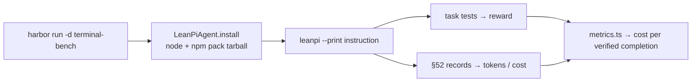

# PRD-047 — Terminal-Bench runs through a Harbor adapter

**Status:** NOT STARTED
**Complexity:** 6 (MEDIUM); risk override: none
**Owner:** LeanPi maintainers
**Depends on:** None

## Context

The README's headline claim — LeanPi 25.7–76.9% cheaper per verified completion — rests on the four-way run in `docs/benchmarks/2026-09-21-four-way-harness-cost.md`: 2 tasks per arm. That's too small a sample to back the claim.

`unreallabsai/unreal-agent` ships `benchmarks/harbor/`: a ~600-line Python/uv package with a Harbor `BaseInstalledAgent` subclass (`src/harness_harbor/agent.py`) that installs a prebuilt bundle into each task container, runs it, and converts its session log to Harbor's ATIF trajectory with token totals. Harbor then runs Terminal-Bench (`-d terminal-bench/terminal-bench@4.0.0`) on Docker or Modal, with reward decided by the task's own tests, not by the agent.

LeanPi pieces this reuses:

- Headless turn: Pi's `--print`, passed through by the launcher (`src/cli/bootstrap.ts:401`).
- Cost: PRD-015 §52 run records under the session's `.leanpi/`; `src/bench/metrics.ts` already turns them into cost per verified completion.
- Local tools present: Docker 29.8.1, uv 0.12.17.

## Solution

New uv project `bench/harbor/` (Python 3.12+, Harbor pinned):

1. `LeanPiAgent(BaseInstalledAgent)` — `install()` puts Node 22 and a `npm pack` tarball of the tested checkout into the container; `run()` writes a `leanpi.config.yaml` pinning every role to the run's model, runs `leanpi --print "<instruction>"` in the task workdir, then copies back the §52 records and fills Harbor's `AgentContext` token/cost fields **from those records**.
2. A bundle manifest (`git rev-parse HEAD` + hash of `git diff HEAD`) so a result names the exact tested tree, dirty or not.
3. Baseline arm: stock Pi on the same model — Harbor's built-in agent if one exists for Pi/opencode (check in Phase 1), else the same class with the LeanPi extension not loaded.

Secrets (`OPENCODE_API_KEY`) reach the container only through Harbor's `--ae`; never written into the config, manifest or report.

New ROADMAP requirement: **FR-153 — SHOULD:** Run the cost-per-verified-completion benchmark on Terminal-Bench through Harbor, with verification decided by the task's own tests.

## Acceptance Criteria

- [ ] AC-1 [local; actor: agent]: `harbor run` with `LeanPiAgent` on one Terminal-Bench task in Docker finishes with a Harbor reward, and the trial's cost/token fields equal the task's §52 record (a zeroed record must make the fields zero — no adapter literal) — Evidence: pending.
- [ ] AC-2 [local; actor: agent]: The trial's reported agent version names the bundle manifest (commit + diff hash), and a one-line edit to the checkout changes it — Evidence: pending.
- [ ] AC-3 [local; actor: agent]: The LeanPi arm and the stock-Pi arm run the same ≥20-task Terminal-Bench subset on `opencode-go/deepseek-v4.1-flash`; `docs/benchmarks/<date>-terminal-bench.md` records verified count and cost per verified completion per arm, computed by `src/bench/metrics.ts`. Spend cap: stop and report if projected spend exceeds $10 — Evidence: pending.

## Integration Ledger

| Capability | Reachable consumer/trigger | Replaces / disposition | Evidence |
|---|---|---|---|
| Harbor agent | `uv run harbor run -a leanpi_harbor.agent:LeanPiAgent` → `bench/harbor/src/leanpi_harbor/agent.py` → `leanpi --print` in container | New; `pnpm bench` suite stays for local/offline runs | AC-1 / E1 |
| Cost from telemetry | container `.leanpi/` §52 records → `AgentContext` | New | AC-1 / E1 |

## Execution Phases

#### Phase 1: One task, end to end
**Status:** NOT STARTED
**ACs:** AC-1, AC-2
**Files:** `bench/harbor/pyproject.toml`, `bench/harbor/src/leanpi_harbor/agent.py`, `bench/harbor/build.py` (npm pack + manifest), `bench/harbor/README.md`.
**Implementation:** Mirror `unreal-agent/benchmarks/harbor/src/harness_harbor/agent.py` shape (`install` / `run` / `populate_context_post_run`); skip its ATIF trajectory converter unless Harbor refuses a run without one. Confirm Harbor's built-in agent list for the Phase 2 baseline.
**Verification:** E1 — one easy Terminal-Bench task in Docker; inspect `jobs/<name>` result JSON for reward, cost and version; then re-run with the §52 record removed in the container and confirm cost reads zero or errors (negative control for "cost is a literal"). E2 — build twice around a trivial edit; versions differ.
**Checkpoint:** pending

#### Phase 2: Baseline and a real sample
**Status:** NOT STARTED
**ACs:** AC-3
**Files:** `bench/harbor/src/leanpi_harbor/agent.py` (baseline switch, only if no built-in fits); `docs/benchmarks/<date>-terminal-bench.md`.
**Implementation:** Pick the subset once (fixed task IDs, listed in the report), run both arms with `-n` parallelism that Docker on this machine sustains, feed the job output to `src/bench/metrics.ts`.
**Verification:** E3 — report table generated from job files, task IDs listed, both arms on identical IDs. `prd-work-reviewer` checkpoint on the report before closure.
**Checkpoint:** pending
