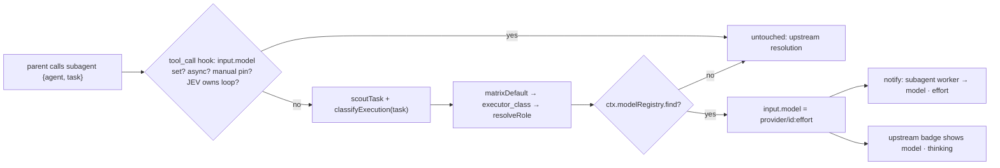

# PRD-049 — JEV routes each subagent's model and effort

**Status:** PARTIAL
**Blocker:** AC-4 half-met: the dispatch notice shows live, but Pi 0.87.1's compact tool card does not render the upstream `(model · thinking)` badge. Operator to choose: accept the notice as the UI, or scope a card change.
**Complexity:** 1 (LOW)
**Owner:** Joao
**Depends on:** PRD-041 (subagents integration), PRD-048 (manual mode pin)

## Context

Every `subagent` child runs on whatever pi-subagents resolves: per-call `model` → agent frontmatter `model` → `subagents.defaultModel` → the parent session's model (`pi-subagents/docs/models.md:14`, `src/runs/shared/model-resolution.js:251-287`). LeanPi routes the parent turn per task (`before_agent_start`, `src/index.ts:1034-1079`: classify → `executor_class` → `resolveRole` → `pi.setModel`, effort → `thinkingLevelFor` → `pi.setThinkingLevel`) but never routes a child. A child scanning files runs on the same strong model and effort as a child refactoring an invariant-heavy module.

Facts that shape the design (pi-subagents v0.70.1):
- The `subagent` tool takes `model` (`src/extension/schemas.js:359`): `"provider/id"`, with an optional `:off|minimal|low|medium|high|xhigh|max` suffix that sets thinking. There is no per-dispatch `thinking` field.
- In a workflow call, the top-level `model` is the default for every child that does not name its own. Per-step models inside `workflowScript` source are out of reach.
- A model missing from the registry throws (`model-resolution.js:207`). Async children run out of process and cannot see LeanPi's in-process providers (PRD-041, `src/subagents/index.ts:112-115`).
- The upstream result card and progress widget already show `(model · thinking X)` per child (`src/tui/render.js:1992`), but Pi 0.87.1's compact tool card does not render it (seen live, AC-4). The call header (`renderCall`, `src/extension/index.js:711`) does not.
- `tool_call` `event.input` can be mutated in place (Pi `types.d.ts:785-788`). `clampSubagentOverride` (`src/subagents/index.ts:203`) already uses this.

Decisions (operator, 2026-09-22):
- Route unless the call passes an explicit `model`. The routed pick overrides agent frontmatter defaults.
- Use the cheap classifier: `scoutTask` + `classifyExecution` (about one JEV call, with a heuristic fallback) → `matrixDefault` → `executor_class`. Do not run the full `compileTask`.
- UI: keep the upstream badge and add a one-line LeanPi notice when the child is dispatched.

## Solution

- **Where:** one `pi.on("tool_call")` handler registered in `activate()` (`src/index.ts`), next to the existing `before_agent_start` routing. The JEV client, config and `cwd` are in scope there. The handler lives in `src/subagents/route.ts` as `registerSubagentRouting(pi, deps)`.
- **Task text:** a plain call uses `input.task`. A call with no `task` string (a workflow, `action: "list"`) is skipped and keeps upstream's chain.
- **Mapping:** `complexity` → `matrixDefault(false, complexity, "R0").executor_class` → `resolveRole(config, class)`. Effort is `EFFORT_BY_COMPLEXITY[complexity]` (export it from `src/compiler/index.ts`), capped by `thinkingLevelFor(config, backend, effort)`. The value written is `${model.provider}/${model.id}` plus `:${level}` when a level survives the cap.
- **Skips (input untouched, no JEV call):**
  1. `input.model` is already set: the parent model or the operator chose.
  2. `input.async === true`: routed native providers are invisible to async children.
  3. A PRD-048 manual pin is active (`routePins().model`): the operator picked the model by hand.
  4. `ownsExecutionLoop(config)` is true: external harness, with no Pi registry to route into.
  5. The resolved role is not in `ctx.modelRegistry`, for example a CLI-only `strong` role. The notice says it inherited.
- **Failure:** a JEV error falls back to `heuristicBand` inside `classifyExecution`. Any other throw in the handler leaves the input untouched and logs once. Routing must never block a dispatch.
- **UI:** `ctx.ui.notify("subagent <agent> → <model> · <level> (<complexity>)", "info")` on a routed dispatch, and `… → inherit (<reason>)` for skip 5. Skips 1–4 stay silent. The upstream card shows the resolved model and thinking level once the child runs.

## Acceptance Criteria

- [x] AC-1 [local; actor: agent]: A `subagent {agent, task}` tool call with no `model`, dispatched through the registered `tool_call` handler, ends with `input.model === "<provider>/<id>:<level>"` taken from the classified complexity. A LOW task and a HIGH task produce different role/level picks. — E1: `pnpm vitest run tests/subagents/route.spec.ts`, 4/4 passed. The LOW task routes to `local/m-quick:low` and the HIGH task to `local/m-strong:high`. The `activate()` test routes through the real registration. Red: the module was absent. Negative control: with the `registerSubagentRouting` line in `src/index.ts` commented out, the activate test fails (1 failed, 3 passed); restored.
- [x] AC-2 [local; actor: agent]: Explicit `model`, `async: true`, an active manual pin, and an unregistered resolved role each leave `input.model` exactly as dispatched (unset or unchanged), and none of them throws. — E1, tests "leaves explicit, async, manually pinned and workflow calls alone" and "inherits when the routed model is not in Pi's registry".
- [x] AC-3 [local; actor: agent]: A routed dispatch emits one `ui.notify` naming the agent, model and level. The unregistered-role skip emits the inherit notice. — E1, notify assertions in the same tests.
- [ ] AC-4 [local; actor: agent]: In a live `leanpi` session, a subagent call shows the LeanPi notice, and the upstream result card shows the same model and thinking level. — E2 (2026-09-22, tmux, `scripts/leanpi-local.sh` in a scratch repo): the notice `subagent worker → deepseek-v4.1-flash · medium (MEDIUM)` rendered. The frontmatter default `Thinking: high` was overridden, and the `action: list` call was skipped. The card half fails: Pi renders `● Subagent Subagent / └ 11 lines returned` with no model badge.
- [x] AC-5 [local; actor: agent]: `pnpm test`, `pnpm typecheck`, `pnpm lint` are green, and ROADMAP gains FR-153 for this behavior. — typecheck exit 0; lint exit 0 (warnings only, none in the files this PRD touched); FR-153 is in ROADMAP §14. `pnpm test`: 1018 passed, 2 failed, both in `tests/config.spec.ts` "the role ladder". They fail with this PRD's wiring disabled too: `loadConfig` from `tests/` reads the repo's uncommitted `leanpi.config.yaml` (`capability.roles.strong.pin: opus`). Pre-existing, not this change.

## Integration Ledger

| Capability | Reachable consumer/trigger | Replaces / disposition | Evidence |
|---|---|---|---|
| Per-subagent model/effort routing | Parent model calls `subagent` → Pi `tool_call` → handler registered in `activate()` (`src/index.ts:586`) → `registerSubagentRouting` handler → upstream reads `input.model` | New. Upstream fallback chain unchanged when skipped | AC-1, AC-2 / E1 |
| Dispatch notice | Same handler → `ctx.ui.notify` | New | AC-3 / E1, AC-4 / E2 |

## Execution Phases

#### Phase 1: Route and notify
**Status:** DONE
**ACs:** AC-1, AC-2, AC-3, AC-5
**Files:**
- `src/subagents/route.ts` (new): `registerSubagentRouting`.
- `src/index.ts`: register the `tool_call` handler in `activate()`.
- `src/compiler/index.ts`: export `EFFORT_BY_COMPLEXITY`.
- `docs/PRDs/v1/ROADMAP.md`: FR-153 under §14.
- `tests/subagents/route.spec.ts` (new).
**Implementation:** as in Solution. Order the skip checks before any scout or JEV work. Classify with the same JEV client the compiler context uses.
**Verification:** E1: `pnpm vitest run tests/subagents/route.spec.ts` drives the handler through a fake `pi.on` registry, as the existing `clampSubagentOverride` tests do, with a stub JEV client answering LOW or HIGH. It asserts the mutated `input.model`, the four skips, and the notify calls. Red first: the handler is absent, so `input.model` stays unset. Then `pnpm test && pnpm typecheck && pnpm lint`.
**Checkpoint:** self-review. Handler registered at `src/index.ts:586`; skips run before any JEV call; a throw only logs.

#### Phase 2: Live check
**Status:** PARTIAL
**ACs:** AC-4
**Files:** none
**Implementation:** `pnpm link:bin`, start `leanpi`, and ask it to delegate one trivial task to a subagent.
**Verification:** E2: capture the notice line and the upstream card's `(model · thinking X)`, and confirm the two match.
**Checkpoint:** pending
