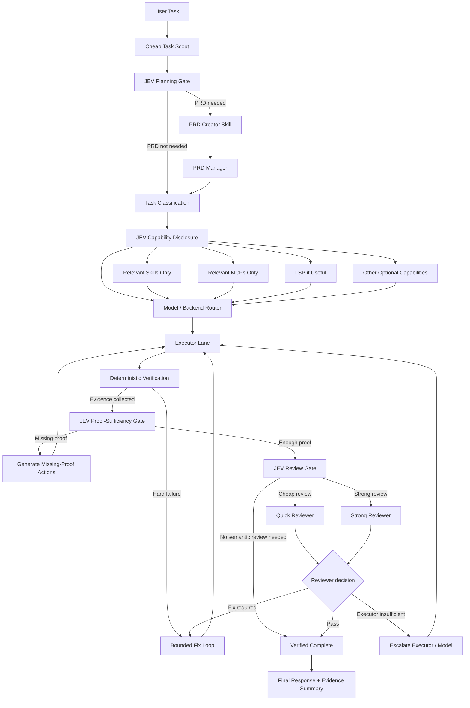
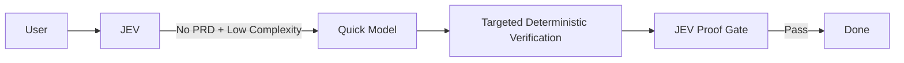

# LeanPi — Product Requirements Document

**Status:** Draft
**Version:** 0.1
**Date:** September 18, 2026
**Base:** Pi coding agent
**Working name:** LeanPi
**Primary objective:** Claude Code / Codex-class coding effectiveness at substantially lower effective cost per verified successful task.

---

# 1. Executive Summary

LeanPi is a cost-optimized coding-agent harness built on Pi.

Its goal is not simply to minimize token usage. Its goal is to:

> **Minimize effective cost per verified successful coding task while preserving the task-completion quality expected from leading coding harnesses such as Claude Code and Codex.**

**Mantra: "Tell me your goal, I figure out the rest."** Every user-facing
decision resolves that way: LeanPi detects the subscriptions and models a
machine already has, compiles the task, and picks the capabilities, the models,
the reasoning effort and the proof it needs. It asks only for what it cannot
know — a credential, or a goal it was never told.

LeanPi accomplishes this through five core ideas:

1. **Task compilation before execution.**
   A cheap semantic control layer powered by JEV determines whether a task needs a PRD, how complex the task is, what capabilities are relevant, how much review is appropriate, and what class of model should execute it.

2. **Progressive capability disclosure.**
   Skills, MCP servers/tools, LSP, web access, and other capabilities are not blindly inserted into every model context. LeanPi exposes only what is relevant to the current task.

3. **Cost-aware multi-model routing.**
   LeanPi supports local models, metered APIs, Pi-compatible providers, and already-paid subscription harnesses such as Claude Code, Codex, and OpenCode. Easy tasks should run on cheap/fast models. Expensive intelligence is reserved for difficult or risky work.

4. **Separate Executor and Reviewer lanes.**
   The model that performs implementation does not necessarily review it. Execution complexity and review risk are classified separately, allowing combinations such as a cheap executor with a strong reviewer.

5. **Evidence-driven completion.**
   Deterministic verification establishes facts such as build/test/typecheck results. At the end, JEV evaluates whether enough evidence exists to support each acceptance criterion. If proof is missing, LeanPi identifies the missing evidence and continues or escalates instead of prematurely declaring success.

The intended result is not “Pi with JEV.” It is a **cost-aware task compiler and coding runtime built around Pi**.

---

# 2. Product Thesis

Current coding harnesses often spend expensive intelligence indiscriminately.

A trivial task may receive:

- a large system prompt;
- dozens of tool definitions;
- every installed skill;
- every MCP schema;
- a strong reasoning model;
- large amounts of shell output;
- repeated repository context;
- semantic review even when compilation proves the result.

Conversely, difficult tasks may be attempted repeatedly by a model that lacks sufficient capability.

LeanPi should instead follow:

> **Pay for intelligence only when complexity, uncertainty, or risk justifies it.**

The harness—not the executor model—should handle as much orchestration as possible.

The model should primarily solve problems that actually require model intelligence.

---

# 3. Product Objective

LeanPi optimizes:

$$
\text{Effective Cost per Verified Success}
=
\frac{
\text{API cost}
+
\text{subscription quota cost}
+
\text{local compute cost}
+
\text{retry cost}
}{
\text{verified successful tasks}
}
$$

Raw token consumption remains an important diagnostic metric, but it is not the primary objective.

A 5,000-token run that fails three times is worse than a 12,000-token run that succeeds once.

---

# 4. Aspirational Product Targets

These are product targets, not claims about current performance.

### Quality target

Achieve approximately **90–95% or more of the verified task-completion rate** of a contemporary Claude Code / Codex baseline on the chosen evaluation suite.

### Cost target

Achieve **≤25% of the comparable effective inference cost per verified successful task**.

### Stretch target

For low- and medium-complexity bounded coding tasks:

> **≤10% of comparable inference cost while preserving the required solve rate.**

### Latency target

Low-complexity tasks should feel materially faster than routing everything through a large reasoning model.

---

# 5. Research Basis

Pi is an appropriate foundation because its core is intentionally minimal and extensible through TypeScript extensions, skills, prompt templates, packages, custom providers, an SDK, RPC mode, session management, and custom compaction. ([Pi Dev][1])

Pi already supports subscription logins including ChatGPT Plus/Pro for Codex, Claude Pro/Max, and GitHub Copilot, in addition to normal API-key and local-model providers. A notable caveat is that Pi documents third-party Claude subscription authentication as drawing from Anthropic Extra Usage rather than ordinary Claude plan limits, which means invoking the official Claude Code CLI is preferable when the goal is specifically to consume an existing Claude Code subscription allowance. ([Pi Dev][2])

Claude Code demonstrates several useful patterns LeanPi should match or improve upon. Skills are lazily loaded rather than placing their full bodies permanently into context; `/goal` automatically continues work while a small model checks the completion condition; subagents can use different models and restricted tools; hooks can intercept tool execution; and MCP provides external capabilities. ([Claude Platform Docs][3])

Codex CLI similarly exposes session resume, subagents, web search, MCP, permissions/sandboxing, dedicated review flows, and a non-interactive `codex exec` interface suitable for programmatic orchestration. ([OpenAI Developers][4])

OpenCode contributes useful patterns around provider independence, specialized primary/subagents, lazy Agent Skills, MCP, granular permissions, plugins, subscription offerings such as OpenCode Go, and optional LSP integration. OpenCode explicitly notes that LSP feedback is not always a net positive and that direct lint/typecheck tools may be better in some projects. ([OpenCode][5])

JEV is well suited to LeanPi's control plane because it accepts shared state plus atomic typed questions and returns `Choice`, `Score`, or `Noul` results rather than generating prose. Multiple questions can share one request. The current documented Jev 1.13 model costs $0.042 per million input tokens, with output free, making narrow routing decisions inexpensive compared with full generative model turns. ([TypeSafe AI][6])

TypeSafe has specifically tested JEV-assisted skill selection. In its published 488-request experiment, incorrect skill loads fell from 16.8% to 7.3% and unnecessary loads from 9.8% to 4.0%. The benchmark has limitations—the positive requests were generated from skill definitions and used an older JEV version—but it gives direct support to progressive skill disclosure as an architecture worth evaluating. ([TypeSafe AI][7])

---

# 6. Product Principles

## 6.1 Ponytail is core, not a skill

The project's Ponytail instruction set SHALL be embedded into LeanPi's minimal static instruction prefix.

It SHALL NOT require skill discovery.

Its text SHALL be:

- versioned;
- measurable;
- short enough to preserve prefix efficiency;
- loaded for every executor unless explicitly disabled by configuration.

The exact Ponytail text is an implementation dependency and is not redefined by this PRD.

---

## 6.2 Cheap by default

The default execution model SHALL be the cheapest model expected to solve the classified task reliably.

Strong models are an escalation path rather than the starting point.

---

## 6.3 Context is rented, not owned

Anything placed into an LLM context has recurring cost.

LeanPi SHALL prefer:

- references over duplicated content;
- targeted excerpts over whole files;
- structured state over transcripts;
- reversible pruning over destructive summarization;
- deterministic retrieval over speculative context loading.

---

## 6.4 Deterministic before probabilistic

If ordinary code can establish a fact reliably, LeanPi SHALL not spend model inference deciding it.

Examples:

- exit code;
- compilation success;
- number of failing tests;
- whether a file exists;
- git dirty status;
- whether a command timed out.

JEV and generative models are used for semantic judgments.

---

## 6.5 Evidence before completion

An executor saying “done” does not make a task complete.

Completion requires evidence.

---

## 6.6 Model independence

LeanPi SHALL define logical model roles instead of hardcoding vendors.

Example roles:

- `quick`
- `balanced`
- `strong`
- `specialist`
- `review_quick`
- `review_strong`

Configuration maps those roles onto actual models/backends.

---

# 7. High-Level Architecture



---

# 8. Task Compiler

LeanPi SHALL compile every task into an internal execution contract before substantial generative work begins.

Example:

```yaml
task:
  type: bugfix
  prd_required: false
  execution_complexity: low
  review_risk: low

routing:
  executor_class: quick
  executor_backend: native
  reviewer_class: none

reasoning:
  effort: low

capabilities:
  skills:
    - none
  mcps:
    - none
  lsp: true
  rtk: auto

context:
  strategy: targeted
  budget_tokens: 6000

verification:
  required:
    - typecheck
    - affected_tests

limits:
  execution_attempts: 2
  semantic_review_rounds: 0
```

JEV SHALL NOT generate this whole object directly.

Individual atomic JEV decisions SHALL be composed by ordinary application code into the execution contract.

This follows TypeSafe's recommendation to decompose broad judgments into atomic questions and combine their outputs in code. ([TypeSafe AI][6])

---

# 9. Stage 0 — Task Scout

Before asking a generative model to inspect the repository, LeanPi SHOULD gather a small deterministic task packet.

Possible fields:

```yaml
repository:
  languages: [typescript, cpp]
  project_type: monorepo
  package_manager: npm
  dirty: true

task:
  user_request: 'fix crash selecting Douglas torpedo'

workspace:
  changed_files: [...]
  likely_modules: [...]
  test_runners: [...]
  lsp_available: true
  git_branch: feature/foo
```

The scout SHALL avoid dumping:

- entire directory trees;
- full package manifests unless needed;
- whole AGENTS.md/CLAUDE.md files;
- full git history;
- full files.

This packet exists mainly to improve the initial routing decision.

---

# 10. Stage 1 — JEV Planning Gate

The first semantic decision is:

> **Does this task need a PRD before implementation?**

JEV SHOULD evaluate several atomic signals rather than one vague “is this complex?” prompt.

Suggested questions include:

```text
Does the task require choosing or changing architecture?
Does it alter multiple externally visible behaviors?
Does it contain materially ambiguous requirements?
Does it involve multiple dependent implementation stages?
Would acceptance criteria materially reduce execution risk?
Is the work a localized implementation/fix with a clear expected result?
```

LeanPi combines those results into:

```text
PRD_REQUIRED
DIRECT_EXECUTION
UNCERTAIN
```

### Low-confidence behavior

If confidence is insufficient:

- a low-risk bounded task defaults to direct execution with elevated review;
- a high-risk or architectural task defaults to PRD creation.

Confidence thresholds SHALL be calibrated from real LeanPi task data rather than taken from generic JEV examples. TypeSafe explicitly recommends domain-specific calibration. ([TypeSafe AI][8])

---

# 11. PRD Lane

If `PRD_REQUIRED`:

```text
PRD Creator
   ↓
PRD Manager
   ↓
Execution
```

## 11.1 PRD Creator

The PRD Creator skill SHALL convert the user's objective and repository evidence into:

- problem statement;
- goals;
- non-goals;
- functional requirements;
- architecture constraints;
- acceptance criteria;
- verification requirements;
- dependencies;
- unresolved risks.

The output SHOULD favor machine-verifiable acceptance criteria.

---

## 11.2 PRD Manager

PRD Manager SHALL:

- convert the PRD into executable work units;
- maintain dependencies;
- track completed requirements;
- track acceptance criteria;
- expose only the current work unit to the executor;
- preserve references to the complete PRD outside model context;
- reopen requirements when verification disproves completion;
- determine when the next work unit can begin.

The executor SHOULD NOT need the entire PRD on every turn.

---

# 12. Execution Complexity

PRD requirement and execution complexity are independent dimensions.

LeanPi SHALL classify:

```text
LOW
MEDIUM
HIGH
```

Optionally internally:

```text
E0 = mechanical
E1 = straightforward implementation
E2 = reasoning-heavy / multi-file
E3 = architectural / unfamiliar / highly coupled
```

### Low examples

- rename symbol;
- straightforward CSS change;
- update obvious constant;
- fix explicit type error;
- simple localized bug with clear failing test.

### Medium examples

- bug spans several modules;
- moderate refactor;
- add API endpoint with several integrations;
- unfamiliar local subsystem.

### High examples

- architectural redesign;
- concurrency;
- compiler/runtime behavior;
- performance-critical native code;
- unclear multi-system failure;
- migration with significant compatibility risk.

---

# 13. Review Risk

Review risk SHALL be classified separately from execution complexity.

Possible values:

```text
R0 deterministic verification sufficient
R1 cheap semantic review
R2 strong independent review
R3 staged/high-risk review
```

Examples:

A huge but mechanical codemod may be:

```text
execution = LOW
review_risk = HIGH
```

A difficult algorithm with excellent exhaustive tests may be:

```text
execution = HIGH
review_risk = LOW
```

This separation is mandatory.

---

# 14. Default Routing Matrix

| PRD | Execution | Default Executor  | Default Review                                    |
| --- | --------- | ----------------- | ------------------------------------------------- |
| No  | Low       | Quick/cheap       | None if deterministic proof is sufficient         |
| No  | Medium    | Balanced          | Quick reviewer when semantic risk exists          |
| No  | High      | Strong            | Strong reviewer                                   |
| Yes | Low       | Quick or Balanced | Quick reviewer                                    |
| Yes | Medium    | Balanced/Strong   | Reviewer                                          |
| Yes | High      | Strong            | Strong independent reviewer + staged verification |

The router MAY deviate from this matrix based on:

- model availability;
- subscription availability;
- quota reserves;
- historical task performance;
- language specialization;
- latency;
- current backend failures.

---

# 15. Capability Disclosure

Capabilities SHALL be progressively disclosed.

The executor MUST NOT receive every installed capability by default.

Capability categories include:

- skills;
- MCP servers/tools;
- built-in tools;
- LSP;
- web access;
- browser automation;
- image understanding;
- code search/indexing;
- AST tools;
- RTK;
- subagents;
- database connectors;
- cloud provider tools.

---

# 16. Skill Routing

LeanPi SHALL maintain an out-of-context skill registry containing at least:

```yaml
name:
description:
tags:
capabilities:
risk:
cost_hint:
source:
version:
```

JEV SHALL determine:

1. whether any skill is needed;
2. which candidate skills are relevant;
3. whether the best candidate actually fits.

For large skill libraries, use progressive disclosure similar to the demonstrated TypeSafe pattern:

```text
full lightweight registry
        ↓
JEV rank
        ↓
top K metadata/details
        ↓
JEV verify
        ↓
load 0–N full skills
```

The executor receives full `SKILL.md` content only for selected skills.

OpenCode and Claude Code both support on-demand skill loading rather than permanently loading every skill body. ([Claude Platform Docs][3])

### Manual control

Users SHALL be able to:

```text
/skills
/skills enable <name>
/skills disable <name>
/skills pin <name>
```

Pinned skills bypass relevance filtering.

---

# 17. MCP Routing

MCP SHALL be supported as a first-class feature.

LeanPi SHOULD support:

- local stdio MCP;
- remote HTTP MCP;
- OAuth-capable MCP;
- project scope;
- user/global scope;
- enable/disable;
- tool-level permissions;
- health/status.

However, MCP schemas consume context. OpenCode explicitly advises adding only the MCP servers needed because MCP tools consume model context. ([OpenCode][9])

Therefore LeanPi SHALL keep a compact out-of-band MCP catalog.

JEV determines which servers and/or tools are relevant before exposing schemas to the executor.

Conceptually:

```text
50 installed MCP tools
        ↓
metadata only
        ↓
JEV
        ↓
4 relevant tools
        ↓
executor sees schemas for 4
```

An executor MAY request additional capability mid-task. The request passes through the capability router instead of exposing everything automatically.

---

# 18. LSP

LSP SHALL be supported but not globally mandatory.

Available uses:

- go to definition;
- references;
- hover/types;
- document symbols;
- workspace symbols;
- call hierarchy;
- diagnostics.

OpenCode currently exposes comparable LSP functionality and specifically warns that language servers may consume memory, become stale, or slow workflows, and that direct lint/typecheck tools may sometimes be superior. ([OpenCode][10])

LeanPi therefore SHALL choose among:

```text
LSP_OFF
LSP_DIAGNOSTICS
LSP_NAVIGATION
LSP_FULL
```

based on:

- repository language;
- task type;
- project configuration;
- expected value.

For a trivial Markdown change:

```text
LSP_OFF
```

For a large TypeScript rename:

```text
LSP_NAVIGATION
```

---

# 19. RTK / Tool-Output Reduction

LeanPi SHALL support RTK or equivalent tool-output reduction as an optional optimization.

RTK compresses shell output and preserves raw results externally. The project itself accurately distinguishes shell-output byte savings from total session cost. ([GitHub][11])

However, RTK SHALL NOT initially be enabled universally.

An independent JetBrains 2026 benchmark reported no end-to-end cost benefit at high reasoning effort and an increase in cost in its tested low-reasoning configuration, despite RTK reducing command output. ([The JetBrains Blog][12])

Therefore:

```text
rtk: off | on | auto | experiment
```

Default during evaluation:

```text
rtk: auto
```

LeanPi SHOULD track whether output reduction actually lowers:

- total tokens;
- task cost;
- retries;
- completion time.

The full raw output MUST remain recoverable.

---

# 20. Context Engine

LeanPi SHALL maintain an external working-state representation independent of model chat history.

Example:

```yaml
goal: 'fix torpedo selection crash'

acceptance:
  - torpedo can be selected
  - no native crash
  - existing weapon selection remains functional

files_touched:
  - src/loadout.ts
  - native/weapon_bridge.cpp

current_failure:
  type: runtime
  summary: null WeaponHandle at loadout.ts:184

verification:
  targeted_test: pass
  typecheck: pass
  runtime: pending

attempts:
  strategies: 1

unresolved:
  - verify alternate weapon path
```

This state SHOULD often be hundreds rather than thousands of tokens.

---

# 21. Reversible Context Pruning

Large tool results SHALL be stored as artifacts.

The executor receives compact representations:

```text
test run: 183 passed, 1 failed
failure: weapon.test.ts:83
expected WeaponHandle, received null
stack: createWeapon → selectWeapon
[full output: artifact://test/29]
```

rather than the entire log.

The executor can explicitly expand the artifact.

LeanPi MUST preserve:

- source references;
- exact raw output;
- timestamps;
- exit status.

Context reduction MUST be reversible whenever practical.

---

# 22. Prompt Construction

Prompt layout SHOULD maximize reusable prefixes:

```text
STATIC
  LeanPi/Ponytail core
  stable tool protocol
  stable behavioral rules

SEMI-STABLE
  selected project instructions
  selected skills
  task contract

VOLATILE
  latest evidence
  current diff
  current failure
```

Dynamic information SHOULD appear as late as possible.

---

# 23. Model and Backend Architecture

LeanPi SHALL distinguish a **model** from an **execution backend**.

A subscription coding harness is not simply a model endpoint.

Two major backend categories are required.

## Native model backend

LeanPi owns the Pi agent loop:

```text
LeanPi
  → model
  → tool
  → model
  → verification
```

Examples:

- OpenAI API;
- Anthropic API;
- OpenRouter;
- llama.cpp;
- Ollama;
- vLLM;
- Pi subscription-supported provider;
- other Pi custom provider.

## External harness worker

LeanPi delegates a bounded execution/review job to another harness:

```text
LeanPi
   ↓ task packet
Claude Code / Codex / OpenCode
   ↓
workspace changes + structured result
   ↓
LeanPi verification
```

This is the preferred abstraction for consuming an existing vendor-harness subscription.

---

# 24. Subscription Backends

LeanPi MUST support already-paid subscriptions where the vendor exposes a supported programmatic interface.

Initial targets:

### Claude Code

Use official non-interactive execution:

```text
claude -p ...
```

Claude Code documents `-p/--print`, structured JSON, JSON Schema output, restricted tool sets, session continuation, and a `--bare` mode that omits normal skill/plugin/MCP/CLAUDE.md discovery—particularly useful for avoiding duplicated LeanPi context. ([Claude][13])

### Codex

Use:

```text
codex exec ...
```

Codex officially supports this mode for scripts and CI and supports explicit sandboxing and structured output schemas. ([OpenAI Developers][14])

### OpenCode

Use:

```text
opencode run ...
```

OpenCode supports noninteractive execution, model selection, agent selection, JSON output, and session continuation. ([OpenCode][15])

OpenCode also exposes OpenCode Go as a low-cost subscription provider. ([OpenCode][16])

---

# 25. Subscription Routing

Subscriptions SHOULD be treated as resource pools.

Configuration example:

```yaml
backends:
  claude:
    type: external_harness
    command: claude
    enabled: true
    priority: 20
    quota_class: scarce-premium

  codex:
    type: external_harness
    command: codex
    enabled: true
    priority: 15
    quota_class: premium

  opencode:
    type: external_harness
    command: opencode
    enabled: true
    quota_class: low-cost

  local:
    type: native
    provider: llama.cpp
    model: local-code-27b
    marginal_cost: 0
```

LeanPi SHALL NOT attempt to bypass vendor limits or authentication rules.

---

# 26. Quota Shadow Pricing

A subscription call may have near-zero immediate dollar cost but still consume scarce quota.

LeanPi SHOULD therefore maintain an internal shadow price:

```text
effective_cost =
    monetary_cost
  + quota_shadow_cost
  + local_compute_cost
  + latency_penalty
  + predicted_retry_cost
```

This prevents:

> “Use Opus for everything because the subscription is already paid.”

Premium quota should be preserved for tasks that benefit materially from it.

---

# 27. Model Roles

The core configuration SHALL use roles.

Example:

```yaml
models:
  quick:
    backend: local
    model: cheap-fast-code

  balanced:
    backend: opencode
    model: default

  strong:
    backend: codex
    model: strong

  review_quick:
    backend: local
    model: cheap-reviewer

  review_strong:
    backend: claude
    model: strong-review
```

LeanPi routing logic refers to roles, not vendor names.

---

# 28. Executor Lane

The Executor owns implementation.

Responsibilities:

- inspect relevant context;
- edit files;
- invoke allowed tools;
- run targeted checks;
- gather evidence;
- follow PRD requirements when present;
- stop when blocked rather than pretending completion.

The Executor MUST receive:

- task objective;
- active acceptance criteria;
- selected context;
- selected capabilities;
- budget;
- retry limit.

The Executor SHOULD NOT receive the entire routing process.

---

# 29. Quick Path

The cheapest and most important path is:



There SHALL be no mandatory:

- PRD;
- PRD manager;
- strong model;
- reviewer;
- subagent;
- broad skill scan in executor context;
- broad MCP disclosure.

Example:

> Rename `parseFoo` to `parseBar` and fix references.

Expected route:

```yaml
prd: false
complexity: low
review_risk: low
executor: quick
skills: []
mcps: []
lsp: navigation
reviewer: none
verification:
  - typecheck
  - affected_tests
```

---

# 30. Reviewer Lane

Reviewer execution is independent of the executor lane.

The Reviewer SHOULD receive a compact evidence packet, not the executor conversation.

Example:

```yaml
objective:
acceptance_criteria:
final_diff:
changed_files:
verification_results:
known_warnings:
executor_summary:
```

Reviewer outputs:

```yaml
decision: PASS | FIX_REQUIRED | ESCALATE

findings:
  - criterion
  - file
  - location
  - severity
  - evidence
```

---

# 31. Reviewer Independence

Whenever practical:

```text
Executor model ≠ Reviewer model
```

Examples:

```text
cheap local executor → Claude reviewer
Codex executor → local reviewer
Claude executor → Codex reviewer
```

The goal is independent error detection, not duplicate expensive reasoning.

---

# 32. Review Gate

Not every task needs a reviewer.

After deterministic verification and proof assessment, JEV SHALL classify review need:

```text
NO_SEMANTIC_REVIEW
QUICK_REVIEW
STRONG_REVIEW
```

Inputs may include:

- task risk;
- execution complexity;
- diff size;
- files changed;
- test coverage;
- failed attempts;
- novelty;
- security-sensitive areas;
- public API changes;
- proof strength.

This gate avoids spending another model call on trivial verified edits.

---

# 33. Bounded Retry Loop

LeanPi MUST prevent endless correction loops.

The retry state SHALL track:

```yaml
attempt:
strategy:
failure_signature:
new_evidence:
model:
```

Policy:

```text
same failure + same strategy → reject repeated attempt
same failure + new evidence → optionally retry
new failure → reassess
multiple failed strategies → escalation gate
```

Retry ceilings SHALL be enforced in code rather than merely requested in prompts.

---

# 34. Escalation

Escalation options:

```text
GET_MORE_CONTEXT
ENABLE_CAPABILITY
INCREASE_REASONING
SWITCH_MODEL
SWITCH_BACKEND
STRONG_REVIEW
USER_INPUT
STOP_BLOCKED
```

JEV may classify the appropriate escalation category.

Application code performs the escalation.

---

# 35. Deterministic Verification Layer

Before semantic verification, LeanPi SHALL gather objective evidence.

Possible verifiers:

- compile;
- typecheck;
- targeted test;
- full test suite;
- lint;
- formatter;
- static analysis;
- LSP diagnostics;
- build;
- runtime smoke test;
- browser test;
- screenshot comparison;
- CLI invocation;
- benchmark;
- git diff/status;
- package validation.

The exact verifier set is derived from task requirements.

---

# 36. Final JEV Proof-Sufficiency Layer

This is a core LeanPi requirement.

After implementation and deterministic checks:

> **JEV evaluates whether the available evidence is actually sufficient to claim that each requested feature or acceptance criterion works.**

It does NOT replace tests.

It evaluates the semantic relationship:

```text
requirement
       ↕
evidence
```

---

# 37. Proof Packet

JEV receives a compact packet such as:

```yaml
criterion: 'Selecting a Douglas torpedo must not crash native.'

changes:
  - loadout.ts: changed handle validation
  - weapon_bridge.cpp: added null guard

evidence:
  targeted_test:
    status: pass
    scope: torpedo selection
  typecheck:
    status: pass
  runtime_test:
    status: not_run

review:
  status: none

known_gaps:
  - no native runtime smoke test
```

---

# 38. Atomic JEV Proof Questions

LeanPi SHOULD ask separate questions.

Example:

```text
1. Does the evidence directly demonstrate this acceptance criterion?
2. Is any evidence contradictory?
3. Is the evidence primarily static when runtime behavior is required?
4. Is there an important relevant execution path with no evidence?
```

Then an evidence-gap `Choice`:

```text
NONE
TARGETED_TEST_REQUIRED
BUILD_REQUIRED
TYPECHECK_REQUIRED
RUNTIME_TEST_REQUIRED
UI_VERIFICATION_REQUIRED
REGRESSION_TEST_REQUIRED
DIFF_INSPECTION_REQUIRED
REVIEW_REQUIRED
USER_CONFIRMATION_REQUIRED
MORE_CONTEXT_REQUIRED
```

JEV does not need to generate prose saying what to do.

LeanPi maps the selected category to a concrete action.

---

# 39. Proof Decision

LeanPi application logic, not JEV alone, makes the final completion decision.

Conceptually:

```text
PASS if:
  all mandatory deterministic checks pass
  AND no evidence is stale
  AND no contradiction exists
  AND every acceptance criterion has sufficient support
  AND required review has passed
```

Otherwise:

```text
MISSING_PROOF
FAILED
BLOCKED
```

This distinction is important:

> JEV answers whether the evidence supports the claim. It does not magically establish the underlying fact.

---

# 40. Missing-Proof Recovery

If JEV identifies missing proof:

```text
JEV
 ↓
evidence gap category
 ↓
verification planner
 ↓
run cheapest missing check
 ↓
update evidence packet
 ↓
JEV proof gate again
```

Example:

```text
"Button works"
+
unit tests pass
+
no browser evidence
```

JEV:

```text
UI_VERIFICATION_REQUIRED
```

LeanPi then exposes/uses the appropriate browser capability.

---

# 41. Proof Loop Limit

Proof collection SHALL be bounded.

If evidence remains insufficient after the configured number of attempts:

```text
cheap reviewer
      ↓
strong reviewer
      ↓
user / blocked result
```

LeanPi SHALL not manufacture evidence simply to satisfy the gate.

---

# 42. `/goal`

LeanPi MUST provide `/goal`.

Claude Code now uses `/goal` to keep working until a completion condition is satisfied, with a small model evaluating the condition after turns. ([Claude][17])

LeanPi SHALL implement a cheaper evidence-aware version.

Example:

```text
/goal all PRD acceptance criteria pass with fresh verification
```

State:

```yaml
goal:
  text:
  active: true
  max_turns:
  max_cost:
  started_at:
```

At each execution boundary:

1. update deterministic evidence;
2. evaluate explicit machine conditions;
3. invoke JEV only for semantic conditions;
4. continue only if useful work remains.

Stop conditions:

```text
GOAL_MET
GOAL_IMPOSSIBLE
BLOCKED
BUDGET_EXCEEDED
USER_STOPPED
```

---

# 43. `/goal` and PRDs

For PRD tasks, LeanPi SHOULD automatically derive:

```text
goal = all required acceptance criteria have sufficient fresh evidence
```

PRD Manager provides the remaining criteria.

The user does not need to manually create `/goal`.

---

# 44. Common Harness Features

LeanPi MUST provide the common functionality expected from modern coding harnesses.

### Core commands

```text
/help
/status
/goal
/model
/models
/route
/review
/prd
/skills
/mcp
/permissions
/context
/compact
/cost
/resume
/new
/tree
/doctor
/config
```

### Session features

- persisted sessions;
- resume;
- fork/branch;
- session names;
- task history;
- compact;
- context inspection.

Pi already provides a strong underlying session/tree model that LeanPi SHOULD retain. ([Pi Dev][2])

### Model features

- switch model;
- inspect current route;
- inspect reasoning level;
- list models;
- manually force executor;
- manually force reviewer;
- backend health status.

### Tools

Baseline:

```text
read
search
edit/patch
write
execute
```

Additional implementation tools SHOULD be routed internally where possible rather than permanently expanding the model's tool surface.

---

# 45. `/route`

LeanPi SHOULD expose routing transparently.

Example:

```text
/route
```

Output:

```text
PRD: no
complexity: low
review risk: low
executor: quick → local/bonsai-27b
review: deterministic only
skills: none
MCP: none
LSP: TypeScript navigation
reasoning: low
budget: 6k context / 2 execution attempts
```

Users SHOULD be able to override:

```text
/route executor strong
/route reviewer strong
/route prd force
/route prd skip
```

---

# 46. `/review`

Manual review SHALL always be available regardless of automatic routing.

Modes:

```text
/review
/review quick
/review strong
/review security
/review diff
```

Codex and Claude Code both expose dedicated review concepts; LeanPi should treat this as table-stakes functionality. ([OpenAI Developers][18])

---

# 47. `/permissions`

LeanPi SHALL expose a permissions system with:

```text
ALLOW
ASK
DENY
```

Scopes SHOULD include:

- read;
- edit;
- shell;
- network;
- MCP;
- external directories;
- subagents;
- destructive git operations;
- package installs.

OpenCode, Claude Code, and Codex all expose permission/sandbox controls in their contemporary harnesses. ([OpenCode][19])

---

# 48. Security

Project-local executable extensions and MCP configurations MUST require trust.

Secrets SHALL NOT be placed into LLM context unless explicitly required.

Subscription credentials SHALL remain owned by their source CLI/provider.

External JEV calls SHALL be configurable:

```text
enabled
disabled
metadata-only
redacted
```

Projects requiring complete local privacy MUST be able to disable JEV and use heuristic fallback routing.

---

# 49. JEV Failure Mode

JEV must never be a single point of failure.

If unavailable:

```text
planning gate → deterministic heuristics
complexity → conservative balanced
skills → lexical/tag routing
MCP → manually pinned/project-default
proof gate → deterministic checks + reviewer
```

Execution continues unless the user explicitly requires JEV-only operation.

---

# 50. JEV Confidence

Confidence SHALL be used asymmetrically.

Examples:

Low confidence that PRD is unnecessary:

```text
prefer PRD on high-risk work
```

Low confidence selecting a skill:

```text
load none or inspect top candidates
```

Low confidence that proof is sufficient:

```text
do not pass
```

High-consequence actions require higher confidence thresholds.

---

# 51. Functional Requirements

## Core Orchestration

**FR-001 — MUST:** Build LeanPi on Pi's extension/SDK architecture rather than reimplementing the entire coding harness.

**FR-002 — MUST:** Embed the Ponytail instruction bundle as a versioned static core instruction.

**FR-003 — MUST:** Generate a structured execution contract for each substantive task.

**FR-004 — MUST:** Separate task planning, execution, verification, and review state.

**FR-005 — MUST:** Support low-, medium-, and high-complexity routing.

**FR-006 — MUST:** Support review-risk classification independently from execution complexity.

---

## JEV

**FR-010 — MUST:** Integrate JEV as an internal service unavailable directly to normal executor tool calling.

**FR-011 — MUST:** Use atomic typed JEV questions rather than broad generative-style prompts.

**FR-012 — MUST:** Use JEV to decide whether a PRD is warranted.

**FR-013 — MUST:** Use JEV to assist task-complexity classification.

**FR-014 — MUST:** Use JEV for skills relevance.

**FR-015 — MUST:** Use JEV for MCP/capability relevance.

**FR-016 — MUST:** Use JEV for semantic proof-sufficiency evaluation.

**FR-017 — MUST:** Use JEV to identify a structured missing-proof category when evidence is insufficient.

**FR-018 — SHOULD:** Use JEV to select review level.

**FR-019 — SHOULD:** Use JEV to classify escalation after repeated failures.

**FR-020 — MUST:** Log model version and typed decision results for later calibration.

---

## PRDs

**FR-030 — MUST:** Provide a PRD Creator skill.

**FR-031 — MUST:** Provide a PRD Manager.

**FR-032 — MUST:** Skip all PRD machinery when `prd_required=false`.

**FR-033 — MUST:** Store PRD acceptance criteria in structured task state.

**FR-034 — MUST:** Track criterion status independently.

**FR-035 — SHOULD:** Derive `/goal` automatically from PRD acceptance criteria.

---

## Models

**FR-040 — MUST:** Support multiple model providers in one session.

**FR-041 — MUST:** Define logical model roles instead of vendor-specific hardcoding.

**FR-042 — MUST:** Support `quick`, `balanced`, and `strong` executor classes.

**FR-043 — MUST:** Support `review_quick` and `review_strong` classes.

**FR-044 — MUST:** Support local/self-hosted models.

**FR-045 — MUST:** Support metered API providers.

**FR-046 — MUST:** Support backend fallback.

**FR-047 — SHOULD:** Support specialist model roles by language/task type.

**FR-048 — SHOULD:** Support adaptive reasoning effort.

---

## Subscriptions

**FR-050 — MUST:** Treat already-paid subscription harnesses as supported execution resources.

**FR-051 — MUST:** Support Claude Code as an external worker through documented programmatic interfaces.

**FR-052 — MUST:** Support Codex CLI as an external worker through `codex exec`.

**FR-053 — MUST:** Support OpenCode as an external worker through `opencode run`.

**FR-054 — MUST:** Preserve each vendor's authentication rather than copying credentials into LeanPi.

**FR-055 — MUST:** Track subscription backends separately from metered APIs.

**FR-056 — SHOULD:** Model subscription scarcity using configurable quota shadow pricing.

**FR-057 — MUST:** Permit users to disable any backend.

**FR-058 — MUST:** Respect vendor limits and supported authentication methods.

---

## Executor / Reviewer

**FR-060 — MUST:** Provide an explicit Executor lane.

**FR-061 — MUST:** Provide an independent Reviewer lane.

**FR-062 — MUST:** Allow different models/backends for Executor and Reviewer.

**FR-063 — MUST:** Allow zero-model-review for sufficiently deterministic low-risk tasks.

**FR-064 — MUST:** Send Reviewer a compact evidence packet instead of the complete Executor transcript.

**FR-065 — MUST:** Bound execution/review retry loops.

**FR-066 — MUST:** Detect equivalent repeated failure attempts.

**FR-067 — SHOULD:** Escalate model class when repeated failures indicate capability limits.

---

## Skills

**FR-070 — MUST:** Support Agent Skills.

**FR-071 — MUST:** Discover skill metadata without inserting full bodies into normal context.

**FR-072 — MUST:** Lazily load selected skill bodies.

**FR-073 — MUST:** Permit JEV to return “no skill required.”

**FR-074 — MUST:** Support project and global skills.

**FR-075 — MUST:** Allow manually pinned skills.

**FR-076 — SHOULD:** Support standard Agent Skills directory conventions where practical.

---

## MCP

**FR-080 — MUST:** Support MCP.

**FR-081 — MUST:** Support local stdio MCP.

**FR-082 — MUST:** Support remote HTTP MCP.

**FR-083 — SHOULD:** Support MCP OAuth.

**FR-084 — MUST:** Keep inactive MCP tool schemas out of executor context.

**FR-085 — MUST:** Support capability-level allow/ask/deny rules.

**FR-086 — MUST:** Provide `/mcp` status and control.

**FR-087 — SHOULD:** Lazily connect MCP servers on first relevant use.

---

## LSP

**FR-090 — SHOULD:** Support LSP navigation.

**FR-091 — SHOULD:** Support LSP diagnostics.

**FR-092 — MUST:** Permit LSP to remain disabled when expected benefit is low.

**FR-093 — SHOULD:** Auto-detect language servers.

**FR-094 — SHOULD:** Prefer targeted compiler/typecheck feedback when superior to LSP.

---

## Context Efficiency

**FR-100 — MUST:** Store full tool output externally when truncating/compressing it.

**FR-101 — MUST:** Make omitted raw output retrievable.

**FR-102 — MUST:** Deduplicate repeated context.

**FR-103 — MUST:** Preserve user requirements and acceptance criteria across compaction.

**FR-104 — MUST:** Preserve active errors across compaction.

**FR-105 — SHOULD:** Preserve a stable prompt prefix for provider caching.

**FR-106 — SHOULD:** Maintain a structured working-state record.

**FR-107 — SHOULD:** Avoid generative summarization when deterministic reduction suffices.

---

## RTK

**FR-110 — SHOULD:** Support RTK integration.

**FR-111 — MUST:** Keep RTK optional.

**FR-112 — MUST:** Record actual end-to-end token/cost impact before making RTK default.

**FR-113 — MUST:** Retain full raw output when RTK filters output.

---

## Verification

**FR-120 — MUST:** Track deterministic verification separately from model assertions.

**FR-121 — MUST:** Associate verification with workspace state so stale checks cannot be treated as current.

**FR-122 — MUST:** Run task-appropriate targeted verification.

**FR-123 — MUST:** Prevent a JEV pass from overriding a deterministic failure.

**FR-124 — MUST:** Evaluate each acceptance criterion independently at the final proof gate.

**FR-125 — MUST:** Fail the proof gate when relevant evidence is contradictory.

**FR-126 — MUST:** Return structured missing-proof actions.

**FR-127 — MUST:** Bound proof-gathering retries.

---

## `/goal`

**FR-130 — MUST:** Implement `/goal`.

**FR-131 — MUST:** Persist goal state across turns.

**FR-132 — MUST:** Automatically continue when the goal remains achievable and useful work remains.

**FR-133 — MUST:** Use deterministic goal conditions without model inference where possible.

**FR-134 — MUST:** Use JEV for semantic goal conditions.

**FR-135 — MUST:** Support max-turn and max-cost limits.

**FR-136 — MUST:** Stop on blocked/impossible goals.

---

## UX / Commands

**FR-140 — MUST:** Provide `/status`.

**FR-141 — MUST:** Provide `/model` and `/models`.

**FR-142 — MUST:** Provide `/route`.

**FR-143 — MUST:** Provide `/goal`.

**FR-144 — MUST:** Provide `/review`.

**FR-145 — MUST:** Provide `/skills`.

**FR-146 — MUST:** Provide `/mcp`.

**FR-147 — MUST:** Provide `/permissions`.

**FR-148 — SHOULD:** Provide `/context`.

**FR-149 — MUST:** Provide `/cost`.

**FR-150 — MUST:** Support resume/new/session branching through Pi facilities.

**FR-151 — SHOULD:** Provide `/doctor` for backend/capability diagnostics.

**FR-152 — SHOULD:** Launch Pi with long prompt-cache retention (`PI_CACHE_RETENTION=long`) unless the operator sets `PI_CACHE_RETENTION`, when measurement shows it does not raise cost per verified completion.

---

# 52. Cost Telemetry

Every run SHOULD record:

```yaml
task_id:
route:
prd_used:
executor_backend:
executor_model:
reviewer_backend:
reviewer_model:

usage:
  input_tokens:
  cached_input_tokens:
  output_tokens:
  reasoning_tokens:
  jev_tokens:
  local_gpu_seconds:
  external_harness_calls:
  subscription_usage:

cost:
  api_usd:
  jev_usd:
  estimated_quota_cost:
  effective_cost:

execution:
  wall_ms:
  tool_calls:
  file_reads:
  repeated_reads:
  retries:
  escalations:
  compactions:

result:
  verification:
  proof_gate:
  reviewer:
  success:
```

---

# 53. Primary Evaluation Metrics

### Verified solve rate

$$
\frac{\text{verified successful tasks}}{\text{attempted tasks}}
$$

### Cost per verified success

$$
\frac{\text{total effective cost}}{\text{verified successful tasks}}
$$

### Generator tokens per verified success

$$
\frac{\text{generator model tokens}}{\text{verified successful tasks}}
$$

### Time to verified success

Measure median and p95.

### False completion rate

Tasks LeanPi marks complete but independent evaluation determines are not complete.

This metric is especially important for the JEV proof gate.

---

# 54. Evaluation Baselines

The same task suite SHOULD be run through:

```text
Claude Code baseline
Codex baseline
Stock Pi with comparable model
LeanPi without JEV
LeanPi + JEV
LeanPi + JEV + subscription routing
LeanPi + all accepted optimizations
```

This isolates which features actually help.

---

# 55. Benchmark Suite

Initial suite SHOULD contain at least 50–100 representative real tasks:

- mechanical edits;
- localized bugs;
- multi-file bugs;
- test creation;
- refactoring;
- frontend/UI changes;
- TypeScript;
- native/C++;
- build tooling;
- dependency failures;
- unfamiliar repositories;
- architecture changes;
- performance work;
- tasks requiring MCP;
- tasks requiring web research;
- tasks requiring semantic runtime proof.

Synthetic benchmarks alone are insufficient.

---

# 56. JEV-Specific Metrics

Track:

```text
PRD false-positive rate
PRD false-negative rate

complexity under-routing
complexity over-routing

skill wrong-selection rate
skill unnecessary-load rate
MCP unnecessary-disclosure rate

review unnecessary-call rate
review missed-risk rate

proof false-pass rate
proof unnecessary-evidence rate

escalation accuracy
```

---

# 57. RTK-Specific Evaluation

Compare:

```text
RTK OFF
RTK ON
```

under identical tasks/models.

Measure:

- shell-output size;
- total context tokens;
- total model calls;
- retries;
- solve rate;
- wall time;
- cost per success.

Promote RTK defaults only if the end-to-end result improves.

---

# 58. Non-Goals

Initial LeanPi is NOT intended to:

- train its own foundation coding model;
- replace JEV with a generative router;
- automatically expose every installed integration;
- maximize autonomous runtime regardless of cost;
- guarantee correctness without external evidence;
- bypass vendor usage limits;
- require cloud models;
- require JEV for basic operation;
- create complex multi-agent swarms by default.

---

# 59. MVP Scope

## MVP — P0

Required for a meaningful first evaluation:

```text
Pi base
Ponytail core
JEV client
Task Scout
PRD gate
Complexity classification
PRD Creator
PRD Manager
quick / balanced / strong model roles
local/API providers
Claude Code worker
Codex worker
OpenCode worker
Executor lane
deterministic verification
JEV proof-sufficiency gate
basic Reviewer lane
skill relevance/disclosure
MCP relevance/disclosure
/goal
/route
/cost
telemetry
bounded retries
```

---

# 60. P1

```text
advanced Reviewer routing
quota shadow pricing
LSP integration
RTK experimentation
advanced context artifacts
semantic retry classification
specialist models
worktrees
browser/runtime verification
advanced MCP OAuth
benchmark dashboard
historical router calibration
```

---

# 61. P2

Potential future improvements:

- learned route predictor trained from LeanPi telemetry;
- per-repository routing profiles;
- task-specific model success probabilities;
- dynamic context budget prediction;
- automatic model benchmarking;
- executor tournament for exceptionally difficult work;
- parallel independent reviewer sampling;
- local JEV-equivalent fallback;
- cost-aware subagent orchestration;
- remote execution pools.

---

# 62. Example: Trivial Task

User:

> Change the button text from “Deploy” to “Publish”.

Route:

```text
Scout
 ↓
JEV: PRD NO
JEV: complexity LOW
JEV: review risk LOW
 ↓
skills: none
MCP: none
LSP: off
 ↓
QUICK model
 ↓
edit
 ↓
targeted check
 ↓
JEV proof gate
 ↓
PASS
```

No large-model review.

---

# 63. Example: Medium Bug

User:

> Selecting the torpedo sometimes crashes the aircraft game.

Route:

```text
Scout
 ↓
JEV: PRD NO
complexity MEDIUM
risk MEDIUM
 ↓
debugging skill
LSP relevant
no MCP
 ↓
BALANCED executor
 ↓
targeted runtime/test evidence
 ↓
JEV:
"proof incomplete — runtime path not exercised"
 ↓
runtime smoke test
 ↓
proof sufficient
 ↓
QUICK reviewer
 ↓
PASS
```

---

# 64. Example: Major Feature

User:

> Replace the networking implementation while maintaining compatibility.

Route:

```text
Scout
 ↓
JEV: PRD YES
 ↓
PRD Creator
 ↓
PRD Manager
 ↓
complexity HIGH
review HIGH
 ↓
relevant networking skills
relevant MCP only
LSP/navigation
 ↓
STRONG executor
 ↓
milestone verification
 ↓
JEV proof checks per acceptance criterion
 ↓
STRONG independent reviewer
 ↓
bounded remediation
 ↓
final proof gate
 ↓
PASS
```

---

# 65. Central Decision Policy

The most important routing behavior is:

```text
NO PRD + LOW
    → cheapest/fastest capable executor
    → deterministic verification
    → JEV proof gate
    → done

NO PRD + MEDIUM
    → balanced executor
    → targeted capabilities
    → deterministic verification
    → proof gate
    → reviewer only if risk warrants

NO PRD + HIGH
    → strong executor
    → strong verification/review

PRD REQUIRED
    → PRD Creator
    → PRD Manager
    → complexity/risk routing
    → executor
    → staged evidence
    → reviewer where warranted
    → proof gate
```

---

# 66. Why This Can Be Cheaper Than a Single Premium Harness

LeanPi attempts to substitute inexpensive components for premium-model reasoning wherever possible:

```text
large prompt interpretation
→ JEV typed routing

huge skill roster
→ JEV progressive disclosure

all MCP schemas
→ JEV capability routing

repository wandering
→ deterministic search/LSP

verbose command output
→ compact reversible evidence

model remembering requirements
→ structured task state

model deciding tests passed
→ exit codes

model repeatedly retrying
→ retry state machine

large executor on trivial work
→ quick model

large executor reviewing itself
→ risk-selected independent reviewer

"looks done"
→ proof-sufficiency gate

paid API call
→ available local/subscription capacity
```

This is the core economic thesis.

---

# 67. Success Criteria for LeanPi v1

LeanPi v1 is successful when:

1. The harness can route one repository session across multiple model providers/backends.
2. Low-complexity no-PRD work takes the quick path automatically.
3. High-complexity work can trigger structured PRD execution.
4. Skills and MCPs are progressively disclosed.
5. Claude Code, Codex, OpenCode, local models, and APIs can occupy Executor or Reviewer lanes.
6. Deterministic verification is recorded as evidence.
7. JEV can reject completion because proof is insufficient and identify the missing class of evidence.
8. Reviewer invocation is conditional rather than mandatory.
9. `/goal` can continue a task until proof-backed completion or a bounded stop condition.
10. Full raw evidence remains recoverable despite context compression.
11. Routing and cost decisions are observable through `/route` and `/cost`.
12. An A/B benchmark demonstrates whether LeanPi materially lowers effective cost without unacceptable loss of verified solve rate.

---

# 68. Final Product Definition

LeanPi is:

> **A Pi-based, JEV-governed, multi-model coding runtime that compiles each task into the cheapest execution plan likely to succeed, progressively discloses capabilities, can consume local/API/subscription backends, separates execution from review, and refuses to declare completion until available evidence sufficiently supports the requested outcome.**

The core loop is:

```text
UNDERSTAND CHEAPLY
      ↓
BUY ONLY NEEDED INTELLIGENCE
      ↓
EXECUTE WITH MINIMAL CONTEXT
      ↓
VERIFY WITH MACHINES
      ↓
ASK JEV WHETHER THE PROOF IS ENOUGH
      ↓
REVIEW ONLY WHEN RISK JUSTIFIES IT
      ↓
PASS OR COLLECT THE SPECIFIC MISSING PROOF
```

That—not raw token compression—is the central product.

The part I’d treat as the **main differentiator** is the last proof gate: deterministic tools establish facts, then JEV asks “do these facts actually prove what the user asked for?” That gives cheap executors a much stronger safety net without paying for a premium reviewer on every trivial task.

[1]: https://pi.dev/docs/latest?utm_source=chatgpt.com 'Pi Documentation · Documentation · Pi'
[2]: https://pi.dev/docs/latest/quickstart?utm_source=chatgpt.com 'Quickstart · Documentation · Pi'
[3]: https://docs.anthropic.com/en/docs/claude-code/slash-commands 'Extend Claude with skills - Claude Code Docs'
[4]: https://developers.openai.com/pt-BR/docs/codex/cli?utm_source=chatgpt.com 'Codex CLI | ChatGPT Learn'
[5]: https://opencode.ai/docs/skills?utm_source=chatgpt.com 'Agent Skills | OpenCode'
[6]: https://docs.typesafe.ai/ 'Introduction - TypeSafe AI'
[7]: https://docs.typesafe.ai/cookbooks/skill_suggestion 'Skill suggestion - TypeSafe AI'
[8]: https://docs.typesafe.ai/confidence 'Confidence - TypeSafe AI'
[9]: https://opencode.ai/v2/docs/mcp-servers?utm_source=chatgpt.com 'MCP servers | OpenCode'
[10]: https://dev.opencode.ai/docs/tools/?utm_source=chatgpt.com 'Tools | OpenCode'
[11]: https://github.com/rtk-ai/rtk/blob/develop/docs/guide/resources/savings-explained.md?utm_source=chatgpt.com 'rtk/docs/guide/resources/savings-explained.md at develop · rtk-ai/rtk · GitHub'
[12]: https://blog.jetbrains.com/ai/2026/07/rtk-claude-code-token-savings/?utm_source=chatgpt.com 'rtk Claude Code Token Savings: A Skill Trial Benchmark'
[13]: https://code.claude.com/docs/en/headless 'Run Claude Code programmatically - Claude Code Docs'
[14]: https://developers.openai.com/es-419/docs/non-interactive-mode?utm_source=chatgpt.com 'Modo no interactivo | ChatGPT Learn'
[15]: https://opencode.ai/v2/docs/cli/commands/ 'Commands | OpenCode'
[16]: https://opencode.ai/docs/providers?utm_source=chatgpt.com 'Providers | OpenCode'
[17]: https://code.claude.com/docs/en/goal 'Keep Claude working toward a goal - Claude Code Docs'
[18]: https://developers.openai.com/zh-Hant/docs/codex/cli?utm_source=chatgpt.com 'Codex CLI | ChatGPT Learn'
[19]: https://opencode.ai/v2/docs/permissions?utm_source=chatgpt.com 'Permissions | OpenCode'
