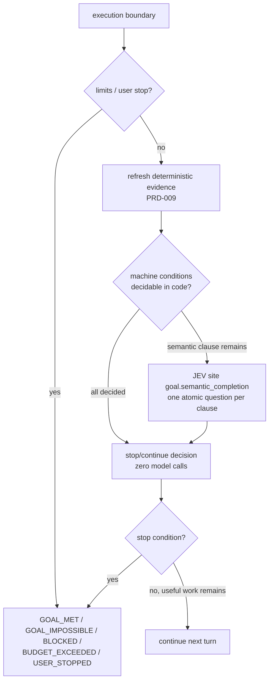

# PRD-013 — Goal Engine

**Status:** DONE (verified 2026-09-19)
**Complexity:** 5 (MEDIUM)
**Risk override:** none — no security boundary, no destructive migration, no external release surface.
**Owner:** joao
**Depends on:** PRD-010, PRD-012

## Context

**Covers:** FR-130, FR-131, FR-132, FR-133, FR-134, FR-135, FR-136, FR-143; ROADMAP §42, §43, §51 (`/goal`), §6.4.

LeanPi must keep working toward a user-stated objective across turns instead of stopping after one executor reply (ROADMAP §42). The incumbent behavior LeanPi is cheaper than — Claude Code's `/goal` — evaluates the completion condition with a model after every turn. ROADMAP §6.4 forbids that when ordinary code can decide the fact: exit codes, failing-test counts, typecheck status and budget counters are all machine-decidable, so paying for inference on them is pure waste.

Repository state inspected: the repository contains only `docs/PRDs/v1/ROADMAP.md`. There is no source tree, no package manifest and no test harness yet; PRD-001 creates the TypeScript/Pi harness skeleton, `npm` scripts (`build`, `typecheck`, `test`, `lint`) and `src/core/types.ts`. Every path named below is therefore a path this PRD's phases create.

Inputs this PRD consumes rather than re-implements:

- PRD-009 `src/verify/evidence.ts` — `EvidenceRecord { kind, status, workspaceHash, startedAt, exitCode, artifactRef }`, the deterministic evidence this engine reads at each boundary.
- PRD-010 `src/proof/` — the proof gate that decides whether an acceptance criterion has *sufficient fresh* evidence. The goal engine asks the gate; it does not re-derive proof sufficiency.
- PRD-012 `src/prd/goal.ts` — `deriveGoal(): Array<{ criterionId, text, verifyCommand }>`, the remaining-required-criteria descriptor used for PRD-derived goals (ROADMAP §43). This function is the entire handoff; this PRD never parses a PRD file or reaches the prd-manager skill itself.
- PRD-002 `src/jev/client.ts` — `ask(siteId, questions, state)` and the JEV decision-site registry; used **only** for semantic goal clauses.
- PRD-007 `src/executor/` — emits the execution boundary this engine hooks.
- PRD-015 `src/telemetry/` — per-run cost accumulation, read for the `max_cost` limit.

## Solution

One small module, `src/goal/`, holding persisted state and a single pure evaluation function the executor calls at each boundary.

**Goal state** (`src/goal/state.ts`) is the ROADMAP §42 record verbatim — `{ text, active, max_turns, max_cost, started_at }` plus `turns_used` — persisted through the Pi session store that PRD-001 already wires, not a new database. Persistence across turns and resumes (FR-131) is therefore a serialization concern, not new infrastructure.

**Boundary evaluation** (`src/goal/boundary.ts`) implements ROADMAP §42's four steps in order, and the order is the whole point:

Budget checks (`turns_used >= max_turns`, `cost_so_far >= max_cost`) and evidence-status checks run before any JEV call, so a budget-exhausted or deterministically-met goal costs zero inference (FR-133, FR-135). JEV is invoked only for clauses the deterministic pass cannot decide (FR-134), and a JEV outage or a disabled JEV degrades to the deterministic fallback in the table below rather than blocking basic operation.

**Goal text parsing** is deliberately dumb: a clause is machine-decidable when it names a verification kind the evidence store already tracks (`tests`, `typecheck`, `lint`, `build`, `runtime`) or a PRD acceptance criterion id. Everything else is semantic. No grammar, no NLP, no classifier — the fallback is always "ask JEV", which is correct, just more expensive.

**PRD-derived goals** (`src/goal/from-prd.ts`): `/goal` with no argument, in a session with an active PRD, calls PRD-012's `deriveGoal()` and maps each returned entry to one machine clause keyed by `criterionId`, synthesizing `all required acceptance criteria have sufficient fresh evidence` (ROADMAP §43). Each clause is resolved through the PRD-010 proof gate, so the common case makes no JEV call at all.

**Consumer path:** user types `/goal <text>` (or `/goal` on a PRD task) → `src/commands/goal.ts` → `src/goal/state.ts` persists → PRD-007's executor calls `evaluateGoal()` at each boundary → session either takes another turn unprompted or prints the stop condition and deactivates the goal.

Reused rather than rebuilt: the Pi session store (persistence), PRD-009's evidence store (freshness and workspace hashing), PRD-010's proof gate (criterion sufficiency), PRD-012's `deriveGoal()` (remaining criteria), PRD-015's cost counter (budget). This PRD adds no scheduler, no state machine library, no condition DSL and no separate goal daemon.

Restated non-goals (ROADMAP §58): the engine does **not** maximize autonomous runtime regardless of cost — every loop is bounded by `max_turns`/`max_cost` and by "useful work remains"; it does **not** guarantee correctness without external evidence — `GOAL_MET` is only reachable from deterministic evidence plus the proof gate, never from an executor's self-report; it does **not** require JEV for basic operation — fully deterministic goals complete with JEV disabled; it does **not** create multi-agent swarms — one executor, one loop.

Risks: (1) a goal that never terminates because its clauses are unsatisfiable — mitigated by `GOAL_IMPOSSIBLE` on a clause whose evidence cannot change and by the hard turn/cost caps; (2) stale evidence making a failed goal look met — mitigated by reading only PRD-009 records whose `workspaceHash` matches the current workspace.

## External Skill Dependencies

LeanPi consumes the operator's already-installed skills; this PRD re-implements none of them, and it reads no skill path of its own. Discovery is `LeanPiConfig.capabilities.skillRoots` — PRD-005's single key, so PRD-017's trust filter applies — and this PRD reaches the skill below only transitively, through PRD-012's `deriveGoal()`. There is no `prd.managerSkillPath` setting here.

| Skill / bundle | Verified path | How this PRD uses it |
|---|---|---|
| prd-creator | `/home/joao/.claude/skills/prd-creator/SKILL.md` (mirror `/home/joao/.codex/skills/prd-creator/`) | Defines the AC/lane/evidence vocabulary a derived goal quantifies over (`[local; actor: agent]`, `Evidence:` lines). Consumed indirectly through PRD-012's `deriveGoal()`, so goal derivation and PRD authoring cannot drift apart. |

Goal derivation depends on no skill path of its own: the remaining-criteria list comes from PRD-012's in-repo criterion store, which stays readable whether or not a skill is installed. The real degraded path is *no active PRD in the session* — bare `/goal` then prints usage and explicit `/goal <text>` runs unchanged.

## JEV Decision Sites

This PRD owns one site. It is registered with PRD-002's decision-site registry (id, question set, return type, `consequence` class `normal`, non-null deterministic fallback, telemetry tag), so FR-020 logging and the §56 per-site metrics come for free.

| Decision | Atomic question(s) | Return type | Deterministic fallback when JEV off | Value rating |
|---|---|---|---|---|
| `goal.semantic_completion` — is an unresolved semantic goal clause satisfied by the current evidence bundle? | One atomic question per unresolved clause: "Given this evidence, is `<clause text>` satisfied?" → `yes` / `no` / `insufficient_evidence` | Choice | Clause is treated as **undecidable**, not merely unsatisfied: once every machine clause is resolved and the only remaining clause is semantic with JEV unavailable, the loop stops `BLOCKED` at that boundary naming the clause instead of spending the rest of the budget. `GOAL_MET` is unreachable without a positive verdict, so a disabled JEV can never fabricate completion. | ★★★★★ |

Machine-decidable clauses (verification kinds, PRD criterion ids) are deliberately **not** a JEV site — they are resolved from `EvidenceRecord` status and the PRD-010 proof gate. Sites owned elsewhere and merely consumed here: proof sufficiency and missing-proof classification (PRD-010), PRD requirement status per criterion (PRD-012), failure classification and retry usefulness (PRD-007).

## Acceptance Criteria

- [x] AC-1 [local; actor: agent]: In a LeanPi session, `/goal ship the parser fix --max-turns 5 --max-cost 2.00` echoes the active goal; after the session is resumed in a new process, the persisted record deserializes to exactly `{ text: 'ship the parser fix', active: true, max_turns: 5, max_cost: 2.0, started_at: <ISO timestamp>, turns_used: 0 }`; a goal created with neither flag persists the configured `goal.default_max_turns` / `goal.default_max_cost` values rather than nulls, so no goal is ever unbounded on both axes — Evidence: tests/goal/goal-state.test.ts — `/goal` echoes and persists a six-key record with the documented defaults, follows a config change when flagless, and refuses an empty bare `/goal` or a malformed flag without creating a record.
- [x] AC-2 [local; actor: agent]: With a goal whose clauses are all machine-decidable (`targeted tests pass and typecheck passes`) and a JEV client stubbed to throw on `ask()`, a boundary evaluation against passing fresh evidence returns `GOAL_MET` without throwing, proving zero JEV invocations on the deterministic path — Evidence: tests/goal/goal-boundary.test.ts — machine clauses over fresh pass records reach GOAL_MET with zero JEV calls when the semantic client throws.
- [x] AC-3 [local; actor: agent]: With a goal containing one semantic clause (`the error message reads naturally to a user`), a boundary evaluation issues exactly one `ask()` at site `goal.semantic_completion` and the returned Choice changes observable behavior: a `no` verdict takes another turn, a `yes` verdict with all machine clauses satisfied ends the session `GOAL_MET`. With JEV disabled in config, the same goal never returns `GOAL_MET` and ends `BLOCKED` naming that clause at the first boundary where every machine clause is resolved — `turns_used` at that stop is strictly less than `max_turns`, so an undecidable clause does not burn the budget — Evidence: tests/goal/goal-boundary.test.ts — the real JEV client receives exactly one request per semantic boundary, the decision log row carries `goal.semantic_completion`, yes→GOAL_MET and no→continue; with JEV disabled zero requests are made and the boundary stops BLOCKED quoting the clause while the turn budget still bounds the loop.
- [x] AC-4 [local; actor: agent]: With an active goal, two unmet criteria and budget remaining, the session takes further executor turns with no user input and stops with `GOAL_MET` on the boundary after the last criterion's evidence turns fresh-pass; a boundary at which no criterion changed and no action remains stops with `BLOCKED` instead of looping — Evidence: tests/goal/goal-boundary.test.ts — a failing-then-passing evidence sequence takes exactly one turn with no user input and stops GOAL_MET on the next boundary; a drained or all-blocked PRD-025 list stops BLOCKED without running a turn; stale-hash evidence never satisfies a clause.
- [x] AC-5 [local; actor: agent]: A goal with `max_turns: 2` stops with `BUDGET_EXCEEDED` after the second boundary and `active: false`; independently, a goal whose accumulated PRD-015 cost crosses `max_cost` stops with `BUDGET_EXCEEDED` on the next boundary. Both decisions are reached with the JEV client stubbed to throw, proving the limits are enforced in code — Evidence: tests/goal/goal-limits.test.ts — `max_turns` stops with BUDGET_EXCEEDED and persists `active: false`, a following run reports USER_STOPPED, and a telemetry cost above `max_cost` stops the next boundary.
- [x] AC-6 [local; actor: agent]: `/goal stop` during an active goal returns `USER_STOPPED`, sets `active: false` and prevents any further automatic turn; a goal clause whose required evidence kind can never be produced in this workspace returns `GOAL_IMPOSSIBLE` with the naming clause in its reason — Evidence: tests/goal/goal-limits.test.ts — `/goal stop` mid-loop yields USER_STOPPED after exactly one turn, and a clause naming a declared kind with no registered verifier yields GOAL_IMPOSSIBLE quoting the clause with zero JEV calls.
- [x] AC-7 [local; actor: agent]: In a session with an active PRD whose `deriveGoal()` returns three remaining acceptance criteria, bare `/goal` reports a derived goal covering exactly those three `criterionId`s without the user typing goal text, continues while any of them lacks fresh sufficient evidence per the PRD-010 proof gate, and returns `GOAL_MET` only once all three pass; with no active PRD in the session, bare `/goal` prints usage and explicit `/goal <text>` still runs — Evidence: tests/goal/goal-from-prd.test.ts — a bare `/goal` with an active PRD derives the sentence plus exactly the three criteria; passing two continues, the third plus all VERIFIED reaches GOAL_MET with zero JEV calls, reopening a criterion makes the next boundary continue naming it, and contradictory evidence keeps the goal running.

## Integration Ledger

| Capability | Reachable consumer/trigger | Replaces / disposition | Evidence |
|---|---|---|---|
| `/goal` command and persisted goal state | LeanPi session slash-command dispatch → `src/commands/goal.ts` → `src/goal/state.ts` (both created in Phase 1) | New capability; no incumbent path in the harness | AC-1 |
| Boundary goal evaluation | PRD-007 executor boundary → `evaluateGoal()` in `src/goal/boundary.ts` (created in Phase 2) | New; the executor previously ended the session at each boundary | AC-2, AC-3, AC-4 |
| JEV site `goal.semantic_completion` | Same boundary call → PRD-002 decision-site registry entry declared in `src/goal/boundary.ts` (created in Phase 2) | New site; registry is PRD-002's, the entry is this PRD's | AC-3 |
| Turn/cost limit enforcement and stop conditions | Same boundary call → `src/goal/limits.ts` (created in Phase 3); `/goal stop` → `src/commands/goal.ts` | New; the only authority that can end an automatic loop | AC-5, AC-6 |
| PRD-derived goal | Bare `/goal` with an active PRD → `src/goal/from-prd.ts` (created in Phase 4) → PRD-012 `src/prd/goal.ts` `deriveGoal()` | Removes the need for a hand-written `/goal` on PRD tasks (ROADMAP §43) | AC-7 |

## Execution Phases

#### Phase 1: `/goal` command and persisted state
**Status:** DONE (verified 2026-09-19)
**ACs:** AC-1
**Files:** `src/goal/state.ts` (goal record type, load/save through the Pi session store, argument parsing for `--max-turns`/`--max-cost`); `src/commands/goal.ts` (slash command: set, show, `stop`); `src/core/config.ts` (edited; created in PRD-001 — `goal.default_max_turns`, `goal.default_max_cost`); `tests/goal-state.test.ts`.
**Implementation:** Define `GoalState { text, active, max_turns, max_cost, started_at, turns_used }` matching ROADMAP §42 plus the turn counter the limit check needs. Persist through PRD-001's session store — no new file format, no new store. `--max-turns`/`--max-cost` are optional *flags*, not optional limits: an absent flag takes `goal.default_max_turns` / `goal.default_max_cost` (concrete non-zero defaults) at goal creation, so an auto-continuing loop is always bounded on both axes. Reject a `/goal` with empty text and no active PRD with a usage message rather than creating an inert goal. Round-trip load/save by serializing the same record; no migration logic for a format that has never shipped.
**Verification:** E1 — `npm test -- tests/goal-state.test.ts`: set a goal through the command handler, save, construct a fresh store instance from the same backing data, load, assert field-by-field equality including `active: true` and `turns_used: 0`; then create a goal with no flags and assert the persisted `max_turns`/`max_cost` equal the configured defaults (not null), and that changing the config changes them. Asserts AC-1 and the distinct risks of a lossy or defaulted deserialization silently resetting budgets and of a flagless goal running unbounded.
**Checkpoint:** done

#### Phase 2: Deterministic-first boundary evaluation
**Status:** DONE
**ACs:** AC-2, AC-3, AC-4
**Files:** `src/goal/clauses.ts` (split goal text into machine vs semantic clauses); `src/goal/boundary.ts` (`evaluateGoal(state, deps) -> { decision, stop?, reason }` plus the `goal.semantic_completion` registry entry); `src/executor/` boundary hook registration (single call site added to PRD-007's loop); `tests/goal-boundary.test.ts`.
**Implementation:** Execute ROADMAP §42's steps in order: refresh deterministic evidence through PRD-009; resolve every machine clause from `EvidenceRecord` status filtered to the current `workspaceHash` so stale results cannot satisfy a clause; only if unresolved semantic clauses remain, issue one atomic question per clause through PRD-002's client at site `goal.semantic_completion`. Register that site with id, question template, `Choice` return type, `consequence: normal` and the non-null fallback from the table above so PRD-015 telemetry and PRD-016's `/route` view pick it up without further work here. Continue only when at least one criterion is unmet *and* an action remains available; otherwise return a stop condition — and when the only unresolved clause is semantic with JEV unavailable, that boundary is terminal `BLOCKED`, not a reason to keep spending turns. The JEV client is an injected dependency, so a throwing stub proves the deterministic path never calls it and a disabled-JEV config exercises the fallback. A JEV transport failure or a below-threshold confidence maps to the same fallback — unsatisfied, never `GOAL_MET`.
**Verification:** E2 — `npm test -- tests/goal-boundary.test.ts`: (a) all-machine goal + throwing JEV stub + fresh passing evidence → `GOAL_MET`, no throw; (b) semantic goal → assert exactly one `ask()` recorded at site `goal.semantic_completion` and that flipping the returned Choice flips continue vs `GOAL_MET`; (c) same goal with JEV disabled → assert no `ask()`, no `GOAL_MET`, terminal `BLOCKED` quoting the clause; (d) drive two boundaries through the real executor hook with evidence transitioning fail→pass and assert the session advanced without user input and stopped `GOAL_MET`, then a no-change boundary returning `BLOCKED`. Covers AC-2, AC-3, AC-4 and the distinct risks of hidden inference on deterministic conditions, a fallback that silently completes the goal, a mis-wired hook the executor never invokes, and an unbounded spin on a stalled boundary.
**Checkpoint:** done

#### Phase 3: Limits and stop conditions
**Status:** DONE
**ACs:** AC-5, AC-6
**Files:** `src/goal/limits.ts` (turn and cost caps read from PRD-015 telemetry); `src/goal/boundary.ts` (stop-condition ordering); `src/commands/goal.ts` (`/goal stop`); `tests/goal-limits.test.ts`.
**Implementation:** Evaluate stop conditions before any evidence refresh or JEV call, in fixed precedence: `USER_STOPPED` → `BUDGET_EXCEEDED` → `GOAL_IMPOSSIBLE` → `BLOCKED` → `GOAL_MET`. `turns_used` increments once per boundary. Cost comes from PRD-015's accumulated run cost; the goal engine reads it and does not compute pricing. `GOAL_IMPOSSIBLE` is raised only for a clause naming a verification kind this workspace cannot produce, reported with that clause quoted — an unsatisfied-but-producible clause is `BLOCKED`, not impossible. Every stop sets `active: false` and persists.
**Verification:** E3 — `npm test -- tests/goal-limits.test.ts`: run three boundaries with `max_turns: 2` and a throwing JEV stub, assert stop at boundary two with `BUDGET_EXCEEDED` and persisted `active: false`; push telemetry cost past `max_cost` and assert the same code on the next boundary; call `/goal stop` mid-loop and assert `USER_STOPPED` plus no further automatic turn; declare a clause naming an unavailable verification kind and assert `GOAL_IMPOSSIBLE` quoting it. Covers AC-5, AC-6 and the distinct risk of a budget check that runs after inference has already been paid for.
**Checkpoint:** done

#### Phase 4: PRD-derived goal
**Status:** DONE
**ACs:** AC-7
**Files:** `src/goal/from-prd.ts` (map PRD-012's `deriveGoal()` entries to machine clauses); `src/commands/goal.ts` (bare-`/goal` branch); `tests/goal-from-prd.test.ts`.
**Implementation:** On bare `/goal` with an active PRD, call PRD-012's `deriveGoal()` in `src/prd/goal.ts` and build exactly one machine clause per returned `{ criterionId, text, verifyCommand }`. The clause resolves through PRD-010's proof gate (sufficient *and* fresh), not through a raw evidence lookup, so an AC with contradictory evidence keeps the goal running. Re-call `deriveGoal()` at each boundary so a criterion PRD-012 reopens re-enters the goal. Parse nothing here — no PRD file reading, no skill path of this PRD's own. With no active PRD, bare `/goal` prints usage — no invented goal.
**Verification:** E4 — `npm test -- tests/goal-from-prd.test.ts`: with a PRD fixture whose `deriveGoal()` returns three remaining criteria, assert bare `/goal` derives exactly those three `criterionId`s; advance evidence for two and assert continuation; satisfy the third through the proof gate and assert `GOAL_MET`; reopen one criterion in the fixture and assert the next boundary resumes instead of staying met; finally run bare `/goal` in a session with no active PRD and assert it prints usage while explicit `/goal <text>` still reaches a stop condition. Covers AC-7 and the distinct risks of a snapshot-once derivation that ignores reopened requirements and of a bare `/goal` inventing a goal when none can be derived.
**Checkpoint:** done
