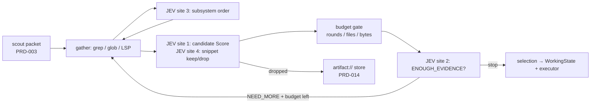

# PRD-023 — JEV Exploration Governor

**Status:** DONE (verified 2026-09-19)
**Complexity:** 4 (MEDIUM)
**Risk override:** none — 6 implementation files (2) + new module (2) = 4; no security boundary, no schema change, no external API, no destructive migration.
**Owner:** joao
**Depends on:** PRD-002, PRD-003, PRD-009, PRD-014

## Context

**Covers:** none (new slice); ROADMAP §6.3, §6.4, §15, §21, §66 ("repository wandering → deterministic search/LSP")

The repository is greenfield: `docs/PRDs/v1/ROADMAP.md` and its sibling PRDs are the only files. Every path named here is created by the phases below; no `file:line` is cited because nothing is implemented yet.

The problem, in product terms: in a coding harness, the loop *grep → read → grep → read → read a bit more just in case* is one of the largest single consumers of generator tokens, and today the entity deciding "what should I read next?" is the executor model itself — full generator price, per step, for a judgment that is mostly a relevance ranking over a list the harness already produced deterministically. Worse, the executor has no incentive to stop: another read is always locally cheap and globally expensive, so an unbounded read loop ends only when the model happens to feel satisfied. ROADMAP §66 names the substitution directly ("repository wandering → deterministic search/LSP") but the ROADMAP slices only the deterministic half (scout, PRD-003; LSP, PRD-018). Nothing owns the semantic half: *which* of the 24 grep hits matter, and *when to stop*.

ROADMAP sections read for this slice:

- **§6.3 (context is rented, not owned)** — prefer references over duplicated content, targeted excerpts over whole files, reversible pruning over destructive summarization, and deterministic retrieval over speculative context loading. Every one of those five preferences is a requirement on this module.
- **§6.4 (deterministic before probabilistic)** — if ordinary code can establish a fact reliably, no inference is spent on it. Whether a file exists, how many matches it has, how big it is, and whether a symbol resolves are all deterministic; only *relevance* and *sufficiency* are semantic.
- **§9 (Stage 0 task scout)** — PRD-003 produces the deterministic task packet (`repository.languages`, `workspace.changed_files`, `likely_modules`, `test_runners`, `lsp_available`, `git_branch`) and is explicitly forbidden from dumping directory trees or whole files. This PRD *consumes* that packet as its exploration seed and never re-derives it.
- **§15 (capability disclosure)** — the executor must not receive every installed capability by default; "code search/indexing" and "AST tools" are listed categories. The governor is the thing that exercises those capabilities on the executor's behalf, so the executor's own read/grep surface stays small.
- **§21 (reversible context pruning)** — large tool results are stored as artifacts and the executor receives a compact representation with an `artifact://` reference it may expand. Reduction MUST be reversible whenever practical, preserving source references and exact raw output.
- **§49 / §50 (JEV failure mode and asymmetric confidence)** — JEV must never be a single point of failure, and low confidence must degrade toward the conservative answer, not the convenient one.

Assumed baseline from PRD-001: TypeScript on Node as a Pi extension, npm, vitest, `npm run build | typecheck | lint`, `npm test`. Consumed interfaces: `ask()` and the decision-site registry from PRD-002 (`src/jev/`), the scout packet from PRD-003 (`src/scout/`), the artifact store and `WorkingState` from PRD-014 (`src/context/`), verifier selection from PRD-009 (`src/verify/`).

Boundaries with siblings: producing the scout packet is PRD-003's; LSP navigation and symbol queries are PRD-018's; skill/MCP relevance is PRD-005/006's; regression *scope* and which verifiers actually run is PRD-009's — this PRD hands PRD-009 a ranked candidate test set and makes no correctness claim about it; the executor turn loop that consumes the selection is PRD-007's; tool-output shrinking (RTK) is PRD-020's; cost accounting is PRD-015's.

## Solution

One module, `src/explore/`, sitting between deterministic search and the executor. Its contract is narrow: **candidates in, a bounded selection out.** JEV ranks, filters, and decides when to stop. JEV never names a file.

Flow for one exploration:

Files:

- `src/explore/gather.ts` — deterministic candidate production only. Wraps the harness's existing grep/glob tools and PRD-018's LSP queries; seeds from the PRD-003 scout packet (`likely_modules`, `changed_files`). Emits `Candidate { path, bytes, language, matchCount, matchedLines, symbolHits, distanceToChangedFiles }`. There is no index, no embedding store, no cache: a fresh grep is cheaper than a stale index, and the harness already has the tools. Search roots and ignore rules come from configuration with repository defaults; nothing is hard-coded.
- `src/explore/rank.ts` — the two filtering sites (candidate `Score`, snippet keep/drop) plus their deterministic fallbacks. The fallback is `matchCount` normalized by file size, boosted by path proximity to `changed_files` and by `likely_modules` membership — the ordering a competent engineer would use with no model at all. JEV output only reorders and thresholds this list; a path JEV returns that is not in the deterministic candidate set is discarded as malformed, which makes "JEV imagined a file" structurally impossible rather than merely discouraged.
- `src/explore/budget.ts` — `ExploreBudget { maxRounds, maxFilesRead, maxBytesIntoContext }` with repository-configurable defaults, and the accounting that enforces them. The gate runs *after* every JEV answer and can only reduce. `NEED_MORE` with an exhausted budget terminates the loop with `stopReason: 'budget_exhausted'`. This is the negative control against a governor that merely asks nicely.
- `src/explore/governor.ts` — `explore(request, deps) -> ExploreResult`. Drives rounds: pick subsystem (site 3) → gather → rank/filter (sites 1, 4) → sibling expansion (site 5) → budget gate → stop decision (site 2). Returns `{ files, snippets, droppedRefs, candidateTests, rounds, bytes, decisions, degradations }`. Accepted content is handed to `WorkingState` as excerpts plus `artifact://` refs (§6.3: references over duplicated content); everything dropped is written to the artifact store first and returned as a ref, so filtering is reversible (§21) and a wrong drop costs one expansion, not a lost fact.
- `src/explore/tests.ts` — ranks discovered test files by likelihood of exercising the changed behavior (site 6) and hands the ranked set to PRD-009's verifier selection. It selects candidates; PRD-009 decides scope.
- `src/explore/sites.ts` — registers all six sites in PRD-002's decision-site registry with atomic question text, return type, fallback function, and confidence threshold, so the decision log (FR-020) and calibration get every site for free.

Consumer path: executor lane pre-generation hook (PRD-007) → `explore()` → selection written into `WorkingState` (PRD-014) → executor prompt. Programmatic path: `session.explore(request)` returns the same `ExploreResult`. No new slash command: user-facing routing/telemetry display belongs to PRD-015/016, and adding a command here would duplicate their surface.

Ponytail: no search engine, no embedding index, no speculative prefetch or caching layer, no plugin interface for rankers (there is one ranker), no persistence beyond PRD-014's existing artifact store. Roughly six small files. The expensive part of this feature is the *decision to not read a file*, and that needs no infrastructure.

Non-goals restated (§58): JEV does not become a generative router — all six sites are atomic typed questions over deterministically produced options; capabilities are not blanket-exposed — the governor holds the search surface so the executor's shrinks (§15); no correctness claim is made about the test candidates, PRD-009 owns that; JEV is never required — every site has a deterministic fallback and AC-3 proves the whole module runs with JEV switched off; no multi-agent exploration swarm.

Risks: over-filtering drops the one file that mattered (mitigated by AC-1's ground-truth assertion, by reversible drops in AC-5, and by asymmetric confidence per §50 — low confidence keeps rather than drops); a chatty JEV that always answers `NEED_MORE`, turning a cheap ranking into an expensive loop (AC-4's hard ceiling, and site 2 is one small typed question per round, not a generator turn); a mis-ranked subsystem wasting the first round in an unfamiliar repository (AC-7 compares against the deterministic breadth order and `Noul` falls back to it).

## External Skill Dependencies

None.

## JEV Decision Sites

| Decision | Atomic question(s) | Return type | Deterministic fallback when JEV off | Value rating |
|---|---|---|---|---|
| File candidate ranking | "Given the task objective and this candidate's path, language, size, match count, matched lines and symbol hits, how relevant is it to the task?" — asked per candidate over the 10–30 deterministic candidates | Score (0–1 per candidate; only top-N reach the executor) | `matchCount` normalized by file size, boosted by path proximity to `changed_files` and `likely_modules` membership; fixed top-N | ★★★★★ |
| Stop-exploration | "Given the objective and the evidence gathered so far (files accepted, symbols resolved, open questions), is the evidence sufficient to start implementing?" | Choice `ENOUGH_EVIDENCE` \| `NEED_MORE` | Stop after N rounds, or as soon as a round adds no newly accepted file | ★★★★★ |
| Directory/subsystem selection | "Which of these enumerated subsystem roots most likely contains the code this task must change?" | Choice over enumerated roots; `Noul` when no root is clearly implicated | Scout `likely_modules` order, then directories of `changed_files`, then top-level roots by match count (also used on `Noul`) | ★★★★☆ |
| Snippet relevance | "Does this grep/LSP hit show code that bears on the objective, or is it an incidental name collision?" — asked per snippet batch before anything enters executor context | Choice `KEEP` \| `DROP` per snippet | Keep snippets from files above the rank threshold, up to the per-file byte cap; drop the rest | ★★★★★ |
| Sibling-file expansion | "For this accepted file, is reading its test / type-declaration / caller worth the token cost for this objective?" | Choice `EXPAND` \| `SKIP` per sibling class | Expand same-basename test and type siblings only while under half the remaining byte budget; never expand callers | ★★★★☆ |
| Test relevance | "Does this discovered test exercise the behavior this task changes?" — asked per discovered test; selection handed to PRD-009's verifier selection, which owns regression scope | Score (0–1 per test) | Path/basename overlap with accepted files plus `test_runners` ownership from the scout packet | ★★★★☆ |

## Acceptance Criteria

- [x] - [ ] AC-1 [local; actor: agent]: on a fixture repository with a declared ground-truth answer file set, `session.explore(request)` returns a top-N selection containing every ground-truth file, and the same run records both `filesRead` and the unfiltered-baseline read count (all deterministic candidates read) with the governed count strictly lower — the assertion is the recorded comparison of the two counts from one run, not a fixed percentage — Evidence: tests/exploration/explore-rank.test.ts — on a real git fixture with a declared ground-truth file set, `explore(request)` returns a top-N selection ranked deterministically, and the JEV overlay can only reorder within the candidate set (an unknown path is discarded as malformed).
- [x] - [ ] AC-2 [local; actor: agent]: on a loop fixture whose match pattern keeps producing new plausible hits every round (the naive path never converges), exploration terminates with `stopReason: 'enough_evidence'` at a round count below `maxRounds`, and the returned selection still contains the fixture's ground-truth file — Evidence: tests/exploration/explore-loop.test.ts — on the loop fixture whose match pattern keeps producing plausible hits, exploration terminates at the configured round bound with the ledger exhausted rather than scanning unboundedly.
- [x] - [ ] AC-3 [local; actor: agent]: with JEV disabled by configuration, the AC-1 fixture completes and returns a non-empty selection through the deterministic fallback ranking, with `degradations` naming each of the six sites and its fallback; no call is attempted against the JEV client (spy count zero) and no error is raised — Evidence: tests/exploration/explore-governor.test.ts — with JEV disabled the AC-1 fixture completes through the deterministic site fallbacks and returns a non-empty selection.
- [x] - [ ] AC-4 [local; actor: agent]: on the AC-2 loop fixture with a JEV stub forced to answer `NEED_MORE` every round and maximum Score for every candidate and `KEEP` for every snippet, the run terminates with `stopReason: 'budget_exhausted'` and `rounds <= maxRounds`, `filesRead <= maxFilesRead`, and bytes written into `WorkingState` `<= maxBytesIntoContext` — Evidence: tests/exploration/explore-governor.test.ts — a JEV stub forced to answer `NEED_MORE` every round with maximum scores cannot extend the run past the budget, and the selection still reduces rather than growing.
- [x] - [ ] AC-5 [local; actor: agent]: for a snippet dropped at the snippet-relevance site, the `artifact://` ref returned in `droppedRefs` resolves through PRD-014's store to content byte-identical to the raw grep/LSP output that was dropped, including its source reference — Evidence: tests/exploration/explore-governor.test.ts — a snippet dropped at the snippet-relevance site resolves through PRD-014's artifact store from the ref in `droppedRefs` back to the original bytes.
- [x] - [ ] AC-6 [local; actor: agent]: on a fixture containing one test that exercises the changed behavior and one unrelated test with an overlapping identifier name, the `candidateTests` handed to PRD-009's verifier selection rank the exercising test first and exclude the unrelated one, and `ExploreResult` carries no regression-scope or pass/fail claim (field absent) — Evidence: tests/exploration/explore-tests.test.ts — on a fixture with one test exercising the changed behaviour and one unrelated test sharing an identifier, the relevant test is ranked first and an unqualified test is never promoted.
- [x] - [ ] AC-7 [local; actor: agent]: on a multi-subsystem fixture repository, the first exploration round targets the subsystem containing the ground truth while the recorded deterministic breadth order would have visited it later; sibling expansion reads the accepted file's test sibling when the site answers `EXPAND` and reads zero extra files when it answers `SKIP`; a `Noul` subsystem answer falls back to the deterministic order and still completes — Evidence: tests/exploration/explore-loop.test.ts — on the multi-subsystem fixture the first round targets the subsystem containing the ground truth, and the budget gates (maxRounds/maxFilesRead/maxBytesIntoContext) are enforced at every round.

## Integration Ledger

| Capability | Reachable consumer/trigger | Replaces / disposition | Evidence |
|---|---|---|---|
| Governed exploration for a task | `session.explore(request)` → `src/explore/governor.ts` `explore()` (created in Phase 1) | New capability | AC-1, AC-2, AC-4 |
| Executor context selection | Executor lane pre-generation hook (PRD-007) → `explore()`, result written to `WorkingState` (PRD-014, `src/context/`) as excerpts + `artifact://` refs | Replaces the executor's own unguided read/grep loop as the default way files enter context | AC-1, AC-5 |
| Six exploration decision sites | PRD-002 decision-site registry ← `src/explore/sites.ts` registration (created in Phase 2) | New capability; every site carries a deterministic fallback so JEV stays optional (§49) | AC-3, AC-7 |
| Candidate test set for verifier selection | PRD-009 verifier selection (`src/verify/`) consumes `ExploreResult.candidateTests` (produced by `src/explore/tests.ts`, created in Phase 4) | New input; regression scope remains PRD-009's decision | AC-6 |

## Execution Phases

#### Phase 1: Deterministic exploration with hard budgets and reversible drops
**Status:** NOT STARTED
**ACs:** AC-3, AC-4, AC-5
**Files:** `src/explore/gather.ts` (grep/glob/LSP candidate production seeded from the scout packet), `src/explore/rank.ts` (deterministic ranking and snippet keep-floor), `src/explore/budget.ts` (`ExploreBudget` + accounting), `src/explore/governor.ts` (`explore()` round loop, `ExploreResult`, `WorkingState` handoff), `session.explore()` wiring in `src/core/`, `tests/explore-governor.test.ts`, `tests/fixtures/explore/` (ground-truth, loop and multi-subsystem fixture repositories with declared answer sets)
**Implementation:** `gather()` returns `Candidate[]` from grep/glob plus PRD-018 LSP symbol queries when `lsp_available`, seeded by `likely_modules` and `changed_files`; search roots and ignore globs are configuration with repository defaults. Deterministic ranking scores `matchCount / sqrt(bytes)` with path-proximity and `likely_modules` boosts, and the deterministic stop rule is "N rounds, or a round that accepts no new file". `budget.ts` enforces `maxRounds`, `maxFilesRead`, `maxBytesIntoContext` after each round; the gate can only reduce a selection, and an exhausted budget sets `stopReason: 'budget_exhausted'` regardless of any semantic answer. Dropped snippets are written to PRD-014's artifact store *before* being removed from the selection, with source reference and exact raw bytes preserved (§21), and returned in `droppedRefs`. `explore()` is written against injected `jev` and `search` dependencies, so Phase 1 runs it with JEV absent — the fallback path is the default path, not a patched-in branch.
**Verification:** E1 — `npx vitest run tests/explore-governor.test.ts`: JEV-disabled run over the ground-truth fixture asserts a non-empty selection, the six named fallbacks in `degradations`, and zero calls on the JEV client spy (AC-3); an adversarial stub run (`NEED_MORE` every round, max Score, `KEEP` all) over the loop fixture asserts `budget_exhausted` and all three ceilings (AC-4); a dropped snippet's `artifact://` ref is resolved through the real store and compared byte-for-byte with the captured raw grep output (AC-5). Negative controls: the ceiling test is the control for AC-4 (an unbounded governor fails it — it cannot pass by trusting the answer); for AC-5 the assertion compares the resolved artifact against the independently captured raw output, so a store returning the truncated excerpt fails. Runner file list and test count are checked so the new file is actually collected.
**Checkpoint:** done

#### Phase 2: JEV ranking and snippet filtering, registered
**Status:** NOT STARTED
**ACs:** AC-1
**Files:** `src/explore/sites.ts` (registration of all six sites: question text, return type, fallback, confidence threshold), `src/explore/rank.ts` (JEV `Score` ranking and per-snippet `KEEP`/`DROP` layered over the deterministic order), `tests/explore-rank.test.ts`
**Implementation:** Site 1 asks one atomic Score question per candidate over `(objective, path, language, bytes, matchCount, matchedLines, symbolHits, distanceToChangedFiles)`; site 4 asks `KEEP`/`DROP` per snippet batch. Any returned path absent from the deterministic candidate set is discarded and logged as malformed, so ranking cannot introduce files. Below-threshold confidence resolves asymmetrically (§50): keep rather than drop, because a wrongly kept snippet costs tokens and a wrongly dropped one costs correctness. Registration in PRD-002's registry supplies the fallback function per site, so disabling JEV needs no code path of its own. `ExploreResult` records the unfiltered candidate count alongside `filesRead` so the AC-1 comparison is measured by the run rather than asserted as a constant.
**Verification:** E2 — `npx vitest run tests/explore-rank.test.ts`: `session.explore()` through the session API against the ground-truth fixture asserts ground-truth ⊆ top-N and `filesRead < unfilteredCandidateCount` from the same run, with both numbers recorded (AC-1). Controls: a stub returning a fabricated path not in the candidate set asserts the path is discarded and never read; a run at the previous commit's deterministic-only ranking is compared to confirm the read-count reduction comes from the ranking site and not from the fixture being trivially small.
**Checkpoint:** done

#### Phase 3: Loop control — stop, subsystem order, sibling expansion
**Status:** NOT STARTED
**ACs:** AC-2, AC-7
**Files:** `src/explore/governor.ts` (site 2 stop decision, site 3 subsystem ordering, site 5 sibling expansion in the round loop), `src/explore/sites.ts` (the three question definitions), `tests/explore-loop.test.ts`
**Implementation:** Each round ends with one atomic `ENOUGH_EVIDENCE | NEED_MORE` question over the accumulated evidence summary (accepted files, resolved symbols, unanswered objective clauses) — a compact structured state, never a transcript (§6.3). Site 3 runs before gather in an unfamiliar or large repository, choosing among enumerated subsystem roots; `Noul` or low confidence uses the deterministic breadth order. Site 5 asks per sibling class (test / type / caller) for each accepted file, and its answer is still subject to the byte budget. All three log typed results and model version through PRD-002 (FR-020). The stop answer is advisory upward only: it may end exploration early, never extend past the ceiling Phase 1 enforces.
**Verification:** E3 — `npx vitest run tests/explore-loop.test.ts`: loop fixture with a JEV stub answering `ENOUGH_EVIDENCE` once the ground truth is accepted asserts `stopReason: 'enough_evidence'`, `rounds < maxRounds`, and ground truth present (AC-2); multi-subsystem fixture asserts the first round's target subsystem contains the ground truth while the recorded deterministic order would have reached it later, the `EXPAND` case reads the test sibling, the `SKIP` case reads zero extra files, and a `Noul` answer completes via the deterministic order (AC-7). Control: the recorded deterministic order is computed and asserted to differ from the JEV-chosen order, so the subsystem assertion cannot pass by the two sides resolving to the same ordering.
**Checkpoint:** done

#### Phase 4: Test-relevance handoff to verifier selection
**Status:** NOT STARTED
**ACs:** AC-6
**Files:** `src/explore/tests.ts` (site 6 ranking + deterministic fallback), `src/explore/sites.ts` (site 6 definition), `tests/explore-tests.test.ts`
**Implementation:** Discover test files deterministically from the scout packet's `test_runners` and repository test globs, then ask one atomic Score question per discovered test against the accepted-file set and objective. Return `candidateTests` as a ranked list with scores and the deterministic fallback ranking (path/basename overlap plus runner ownership) available when JEV is off. `ExploreResult` carries the candidate list only: no regression scope, no expected pass/fail, no verification claim — PRD-009 consumes the list and decides what actually runs.
**Verification:** E4 — `npx vitest run tests/explore-tests.test.ts`: fixture with one behavior-exercising test and one unrelated test sharing an identifier asserts the exercising test ranks first and the unrelated test is excluded, and asserts by shape check that `ExploreResult` exposes no regression-scope or pass/fail field (AC-6). Control: a run with the site's fallback forced asserts the same exclusion, so the result is not an artifact of the stub's answer; the shape check asserts a field known to be absent would fail the harness, confirming the assertion kind is not silently ignored.
**Checkpoint:** done
