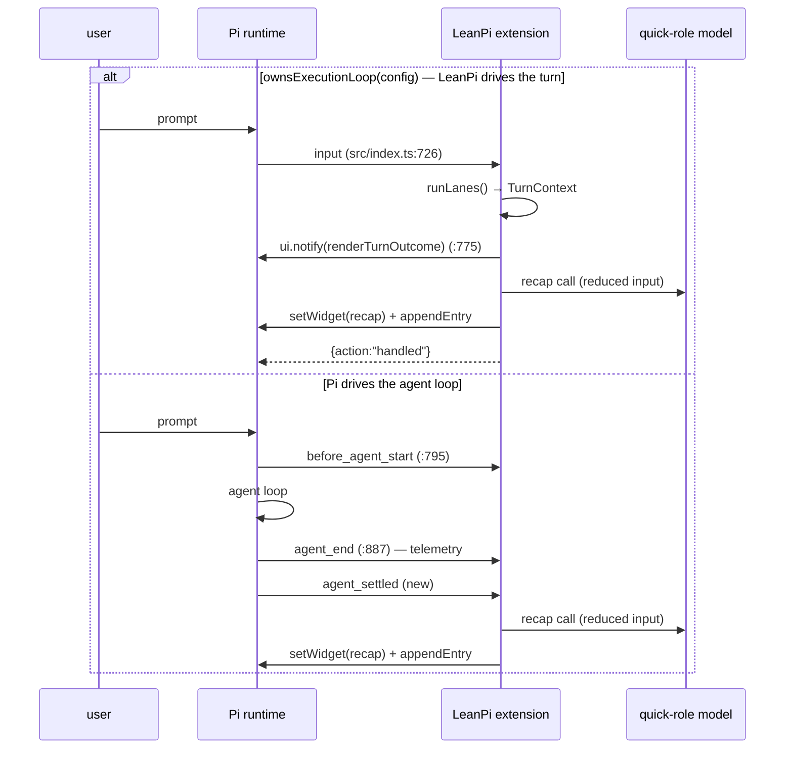

# PRD-036 — Turn recap, `/recap`, and session title

**Status:** DONE
**Complexity:** 6 (MEDIUM)
**Owner:** joao
**Depends on:** None

## Context

A long session leaves no answer to "what was I doing in this terminal?". Pi
gives every extension the pieces — `pi.setSessionName`, `pi.appendEntry`,
`ctx.ui.setWidget` — and LeanPi uses none of them.

### Upstream evaluation (the question that started this)

Three published extensions do some of this. Inspected `@tifan/pi-recap@0.4.7`
in full (unpacked from npm; ships TypeScript source, 1272 lines across 5 files,
MIT, provenance-signed, zero runtime deps, `peerDependencies:
@earendil-works/pi-coding-agent >=0.84.3` — LeanPi is on 0.87.0).

**Safe to integrate: yes.** No network beyond the model call, no filesystem
writes outside its own config, reads the session through the public
`ctx.sessionManager` API, and persists the recap with `pi.appendEntry`, which
Pi documents as *not sent to the LLM*. Nothing in it is hostile or fragile.

**Worth depending on: no**, and two of the three premises behind the original
plan are wrong:

1. *"Change the trigger from away-5-min to agent settles."* It already hooks
   `agent_settled` (`src/index.ts:548`). The delay is `AWAY_RECAP_DELAY_MS =
   5 * 60 * 1_000` (`:38`), a module constant with no config knob — changing it
   means a fork or an upstream PR, not a setting.
2. *"Use `agent_settled`, not `session_shutdown`."* Correct, and upstream
   already does; it uses `session_shutdown` only to reset state. Pi's
   `session_shutdown` fires on quit/reload/new/resume/fork with the UI already
   going away, so nothing can be rendered from it. **There is no useful
   "end of session" recap surface in Pi** — the end-of-*turn* recap is the real
   feature, and the session title is what survives the session.
3. *"Don't summarize the whole transcript."* Upstream does exactly that:
   `buildPrompt` (`:241`) serializes the entire active session context into one
   user message on every trigger. On a long session that is the most expensive
   thing in the room, and it is the direct opposite of this project's thesis.

The decisive point is that ~65% of upstream's code solves problems LeanPi has
already solved. `models.ts` + `model-picker.ts` (414 lines) are a model-auth
resolver and picker — LeanPi has `selectRoleModel`
(`src/capability/roles.ts:125`), `resolveRole`, and the whole `/model` surface.
`getCurrentSessionMessages` (`:226`) reconstructs what the turn did by
re-reading the transcript — LeanPi already holds it as a `TurnContext`
(`src/commands/session.ts:33`) and already renders it deterministically with
`renderTurnOutcome` (`src/cli/outcome.ts:82`): headline, changed files,
evidence, commands, all for zero tokens.

So LeanPi's own recap is *smaller* than adopting upstream's, because the
deterministic half already exists. What is missing is one sentence of intent
(goal / next action), a place to keep it, and a session title.

Inspected: `src/index.ts` (`input` :726, `before_agent_start` :795, `agent_end`
:887, notify at :775), `src/cli/outcome.ts`, `src/commands/index.ts`,
`src/commands/registry.ts`, `src/review/lane.ts:210` (one-shot worker call),
`src/backends/registry.ts:313` (`runWorkerTurn`), `src/capability/roles.ts`,
`tests/extension-surface.spec.ts`, and
`node_modules/@earendil-works/pi-coding-agent/dist/core/extensions/types.d.ts`
(event union :879, `on()` overloads :978-1017, `setSessionName` :1062,
`appendEntry` :1060).

## Solution

One new module, `src/recap/`, plus wiring. The recap line is the only thing a
model produces; everything else is data LeanPi already has.

### Where it attaches

LeanPi has two turn paths and the recap must fire on both.



Both paths call one function, `recapTurn(pi, ctx, input)`. `agent_settled` is
the Pi-side trigger because it fires after the run has fully settled;
`agent_end` is already taken by PRD-015's telemetry sink and fires mid-settle.

### What the model sees

Not the transcript. A fixed-shape brief, hard-capped, assembled from state
already in memory:

| Part | Source | Cap |
|---|---|---|
| Session goal | first user message of the session | 400 chars |
| This turn's ask | current user message | 400 chars |
| What the turn did | `renderTurnOutcome(context)` output | 1200 chars |
| Open work | `todoCarrier` items, titles only | 300 chars |

Roughly 600–800 tokens, flat, regardless of session length. On the Pi-driven
path there is no `TurnContext`; the "what the turn did" slot takes the last
assistant message text from the `agent_end` payload, same cap.

### The call

`runWorkerTurn` (`src/backends/registry.ts:313`) with `allowedTools: []`,
`budget: 1`, and `model: resolveRole(config, "quick")` — the same one-shot
shape `src/review/lane.ts:236-244` already uses for the reviewer. This keeps
recap spend inside PRD-015's cost telemetry instead of bypassing it via
`ctx.modelRegistry.complete`. 4s timeout, no retries, aborted on the next
`agent_start` or `input`.

The model returns two lines, parsed positionally:

```
RECAP: <one sentence: goal, state, next action — under 240 chars>
TITLE: <3-6 words, session-level, omitted after the first turn>
```

`TITLE:` is requested only when `pi.getSessionName()` is still unset or the
Pi default; once set it is never regenerated, so it costs nothing after turn 1.
A missing or malformed line is dropped, not retried — a failed recap is
silently skipped and the previous one kept.

### What the user sees

Collapsed, one line, dim, above the editor (`ctx.ui.setWidget`, the surface
upstream uses):

```
※ recap: Wiring provider autodetection into the router; detection lands, routing next.
```

The expanded form the original sketch asked for is **already on screen** — it
is `renderTurnOutcome`'s notify, printed directly above, with changed files,
evidence and commands. Deliberately not duplicating it into a second
expandable block.

### Persistence and restore

`pi.appendEntry("leanpi:recap", {version: 1, recap, contextLeafId})` — outside
the LLM context by Pi's own contract. On `session_start` the newest such entry
is read back and shown, so resuming a session re-displays its recap without a
model call. Invalidated (widget cleared) on the next `input` or `agent_start`.

### Config

```yaml
recap:
  enabled: true      # false disables generation entirely
  role: quick        # any ModelRole
```

Default on. No key, no extra auth: it reuses whatever `quick` already resolves
to, and does nothing if that resolves to nothing.

**Assumption to confirm:** `quick` (`min_coding_index: 50`,
`src/capability/roles.ts:49`) is the right role. If the ranking resolves it to
something that cannot follow a two-line format, the fix is the config default,
not code.

**Confirmed in implementation:** `quick` resolves and the call round-trips
end-to-end against a stub backend (`tests/recap/wiring.spec.ts`, "runs the real
worker call end to end"). One deviation from the sketch: the packet uses
`budget: 2`, not `1`. `runNative` aborts at `turn_end` when `turns >= budget`
*and the session is still streaming*, so `budget: 1` kills the answer it just
produced and the outcome comes back `blocked` with the text discarded — the
recap would never render on a native backend. With no tools the loop is one
turn, so `2` never trips. `RECAP_TIMEOUT_MS` remains the hard bound.

Risk: the recap is an extra model call per turn. Mitigated by the flat capped
input, the 4s timeout, `enabled: false`, and the fact that it is billed through
the same telemetry the user already reads with `/status`.

## Acceptance Criteria

- [x] AC-1 [local; actor: agent]: `buildRecapBrief` on a long fabricated turn emits a brief under the documented caps and never includes the transcript — Evidence: `tests/recap/brief.spec.ts` asserts each slot's ceiling on oversized input, a 50-message transcript's late markers absent, absent slots omitted rather than empty-headed, and malformed/empty/partial responses parsing to `undefined`.
- [x] AC-2 [local; actor: agent]: A turn on the LeanPi-owned path (`input` returns `handled`) results in `ctx.ui.setWidget` being called with the recap text after the outcome notify — Evidence: `tests/recap/wiring.spec.ts` drives the real `input` handler on an external-harness config and asserts the recap widget event follows the verdict notify.
- [x] AC-3 [local; actor: agent]: A turn on the Pi-owned path (`agent_settled`) produces the same widget from the `agent_end` message text — Evidence: `tests/recap/wiring.spec.ts` drives `agent_end` then `agent_settled` and asserts the brief carried the last user/assistant text and the widget was set.
- [x] AC-4 [local; actor: agent]: A failed or malformed model response leaves the previous widget intact and raises nothing to the user — Evidence: `tests/recap/wiring.spec.ts` "keeps the previous widget and stays silent on a garbage response" (no repaint, no notify).
- [x] AC-5 [local; actor: agent]: The recap is written with `pi.appendEntry` and restored to the widget on `session_start` without any model call — Evidence: `tests/recap/wiring.spec.ts` asserts the `leanpi:recap` entry and a second activation restoring it with zero runner calls.
- [x] AC-6 [local; actor: agent]: `/recap` regenerates on demand and appears in `/help`; `/recap off` suppresses automatic generation for the session — Evidence: `tests/commands/recap.spec.ts` (regenerate, `/help` listing, `off` suppressing the next automatic call) and `tests/extension-surface.spec.ts` (registered with Pi).
- [x] AC-7 [local; actor: agent]: `pi.setSessionName` is called exactly once per session, on the first recap, and not when a name is already set — Evidence: `tests/commands/recap.spec.ts` (once across two consecutive recaps; zero with an existing name).
- [x] AC-8 [local; actor: agent]: `recap.enabled: false` produces no model call on any path — Evidence: `tests/recap/wiring.spec.ts` drives both paths with the switch off and asserts zero runner calls.

## Integration Ledger

| Capability | Reachable consumer/trigger | Replaces / disposition | Evidence |
|---|---|---|---|
| Turn recap line | `pi.on("input")` `src/index.ts:775` (LeanPi path) and new `pi.on("agent_settled")` (Pi path) → `recapTurn()` → `ctx.ui.setWidget` | New surface; complements `renderTurnOutcome`, replaces nothing | AC-2 / AC-3 |
| `/recap` command | TUI slash input → `commandRegistry.dispatch` (`src/commands/registry.ts:156`) → bridged at `src/index.ts:354` | New command in `OWNED_COMMANDS` | AC-6 |
| Session title | first `recapTurn()` of a session → `pi.setSessionName` | New; LeanPi previously never named a session | AC-7 |
| Recap persistence | `pi.appendEntry("leanpi:recap")` → read back in `pi.on("session_start")` `src/index.ts:696` | New session entry type | AC-5 |

## Execution Phases

#### Phase 1: Recap brief and response parsing
**Status:** DONE
**ACs:** AC-1
**Files:** `src/recap/brief.ts` (new — `buildRecapBrief`, caps, `RecapInput` type), `src/recap/parse.ts` (new — `parseRecapResponse` → `{recap, title?}`), `tests/recap/brief.spec.ts` (new)
**Implementation:** Pure functions, no I/O. `buildRecapBrief(input)` truncates each of the four slots to its documented cap and joins them under fixed headings; omits an absent slot rather than emitting an empty heading. `parseRecapResponse(text)` reads `RECAP:`/`TITLE:` prefixes, trims, sanitizes control characters and markdown, enforces 240/60-char ceilings, and returns `undefined` for a response with no usable `RECAP:` line.
**Verification:** E1 — `pnpm test tests/recap/brief.spec.ts`; asserts each cap on oversized input, that a 50-message fabricated transcript is absent from the brief, and that malformed/empty/partial responses parse to `undefined` rather than throwing. Red first: caps asserted before truncation is implemented.
**Checkpoint:** done

#### Phase 2: Generation, wiring, widget, persistence
**Status:** DONE
**ACs:** AC-2, AC-3, AC-4, AC-5, AC-8
**Files:** `src/recap/index.ts` (new — `recapTurn`, abort/staleness state, `appendEntry`, restore), `src/cli/recap-widget.ts` (new — dim one-line `Component`, mirrors `src/cli/todo-widget.ts`), `src/index.ts` (call `recapTurn` after the notify at :775; new `agent_settled` handler; restore in `session_start` at :696; clear on `input`/`agent_start`), `src/core/config.ts` (`recap` block), `tests/recap/wiring.spec.ts` (new)
**Implementation:** `recapTurn` is a no-op when `recap.enabled` is false, when `ctx.hasUI` is false, or when `resolveRole(config, role)` yields nothing. It bumps a `runId`, aborts any in-flight call, builds the brief, and issues one `runWorkerTurn` packet (`allowedTools: []`, `budget: 1`, 4s timeout, no retries) through the lane collector so the spend lands in PRD-015 telemetry. A stale `runId` on return discards the result. Success sets the widget and appends the entry; every failure path keeps the previous widget and stays silent.
**Verification:** E2 — `pnpm test tests/recap/wiring.spec.ts`, driving the real `pi.on` handlers through the fake `pi`/`ctx` harness `tests/extension-surface.spec.ts` already uses, with a stubbed worker runner. Asserts: widget set on both paths; widget preserved and no notify on a rejected/garbage response; `appendEntry` called once with the parsed text; `session_start` restores from a seeded entry with zero runner calls; `enabled: false` yields zero runner calls on both paths. Negative control: assert the stub runner's call count, so a recap that silently never runs fails rather than passes.
**Checkpoint:** done

#### Phase 3: `/recap` command and session title
**Status:** DONE
**ACs:** AC-6, AC-7
**Files:** `src/commands/recap.ts` (new — `registerRecapCommand`, mirrors `src/commands/context.ts`), `src/commands/index.ts` (add `"recap"` to `OWNED_COMMANDS`, call the registrar in `registerCommandSurface`), `src/recap/index.ts` (title branch), `tests/extension-surface.spec.ts` (extend), `tests/commands/recap.spec.ts` (new)
**Implementation:** `/recap` regenerates immediately and reports through the widget; `/recap off` / `/recap on` toggle generation for the session only; anything else prints one usage line. The title branch requests `TITLE:` only when `pi.getSessionName()` returns nothing or Pi's default, and calls `pi.setSessionName` once; a session-scoped flag prevents a second call even if the first recap is regenerated.
**Verification:** E3 — `pnpm test tests/commands/recap.spec.ts tests/extension-surface.spec.ts`; asserts `/recap` reaches the same generator, that it is listed by `/help` and bridged to Pi like every other owned command, that `/recap off` suppresses the next automatic recap, and that `setSessionName` is called once across two consecutive recaps and zero times when a name already exists.
**Checkpoint:** done

#### Final verification
**Status:** DONE
**Verification:** E4 — `pnpm test`, `pnpm typecheck`, `pnpm lint` all green on the candidate; plus one manual `pnpm leanpi` session confirming the recap line renders under the turn outcome and the session title changes in the Pi UI (the widget's visual placement is the one property assertions cannot establish).
**Checkpoint:** done
