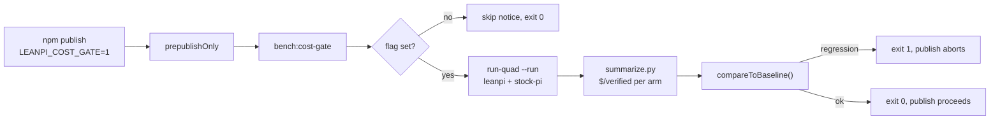

# PRD-038 — Pre-publish cost-regression gate

**Status:** DONE — 2026-09-22. Every phase and acceptance box verified.
**Progress:** 100% — all phases and acceptance criteria verified.
**Complexity:** 4 (MEDIUM); risk override: none.
**Owner:** LeanPi maintainers
**Depends on:** None (consumes the four-way driver's output, not PRD-021's code)

## Context

`prepublishOnly` (`package.json`) runs `build`, `typecheck`, `lint`, `test`.
Every one of them is blind to cost. Two cost regressions shipped through that
gate during the 2026-09-21 cost study:

- forcing the `LOW` tier (a dropped `explicit_result` marker) cost **+90%** —
  `LOW` routes the reviewer `by_review_risk` and rebuilds the prompt prefix;
- `backends.opencode-go.thinkingLevel: low` cost **+79%**.

Both passed typecheck, lint and the full 703-test suite. They were caught only by
paid benchmark runs. Nothing in the repository compares a new run to a recorded
one.

The pieces existed but were manual: the four-way driver
(`bench/out/four-way-20260921/run-quad.mjs`) produces a per-attempt `result.json`
with priced cost and the externally verified golden;
`bench/skills/fair-agent-benchmarks/scripts/summarize.py` computes the §53
metric — cost per verified completion, failed trials kept in the numerator — and
refuses the claim when any cost component is null. No `bench/cost/baseline.json`
existed; the recorded numbers lived only in
`docs/benchmarks/2026-09-21-cost-followup.md`.

A full run is ~$0.10–0.17 and ~8 minutes for 10 attempts. It cannot run on every
`pnpm test`, and it cannot run in CI without a provider credential. So the gate
is **opt-in and publish-time**: a normal `npm publish` is not blocked by spend or
network, an armed one is.

## Solution

One gate script, one recorded baseline, one wiring line.

**`bench/cost/gate.mjs`** — runs the four-way benchmark (LeanPi + stock Pi), folds
it with `summarize.py`, and compares the result to `bench/cost/baseline.json`.

**Regression definition** (the §53 goal, made checkable):

- **ratio** — `leanpi $/verified ÷ stock-pi $/verified` must be ≤ the baseline
  ratio × (1 + tolerance). The ratio, not the absolute figure, because both arms
  run in the same session under the same rate card, so a provider price change
  cancels and only a LeanPi-specific regression trips the gate. Baseline ratio
  0.6797; tolerance 0.35 → limit 0.9176, which still catches the known +79%
  (1.217) and +90% (1.291) class.
- **pass rate** — LeanPi's verified pass rate must not fall below the baseline's
  minus a noise tolerance (default 0.2). At n=5 a single failed trial is a
  20-point dip; a gate that blocked publishing on that would be ignored within a
  week, while two failures out of five still trip it.
- **completeness** — both arms must be `cost_complete`; a null component means
  the metric is unprovable and the gate fails rather than guessing.

`tolerance` and `passrate_tolerance` are read from the baseline and overridable
with `--tolerance`.

**Opt-in wiring.** `package.json` gained
`"bench:cost-gate": "node bench/cost/gate.mjs"`, appended to `prepublishOnly`.
The script prints a one-line skip notice and exits 0 unless `LEANPI_COST_GATE=1`
is set, so the default publish path is unchanged and the expensive run is a
deliberate act.

**Refresh.** `--record` runs the benchmark and rewrites the baseline from the
result; the baseline carries the run id, git sha and date so a stale baseline is
visible rather than silent.

Consumer flow:

Out of scope: a CI job (no credential there), a scheduled runner, publishing
itself, and any automatic baseline update on publish.

## Acceptance Criteria

- [x] AC-1 [local; actor: agent]: `compareToBaseline` fails on a ratio regression beyond tolerance, fails on a LeanPi pass-rate break beyond the noise tolerance, fails when an arm's cost is incomplete, and passes within tolerance — each with a red-then-green unit test. — Evidence: E1 — `npx vitest run tests/bench/cost-gate.spec.ts` → 14 passed. Red first: before `bench/cost/gate.mjs` existed the same spec failed with `Failed to load url ../../bench/cost/gate.mjs … Does the file exist?`; the module then turned it green.
- [x] AC-2 [local; actor: agent]: With `LEANPI_COST_GATE` unset the gate prints a skip notice naming the flag and exits 0 without spawning anything; with `=1` it enforces. — Evidence: E2 — `pnpm bench:cost-gate` → `[cost-gate] skipped: set LEANPI_COST_GATE=1 to run it (~$0.12, ~8 min), or pass --from-run <id>`, exit 0. `env -u OPENCODE_API_KEY LEANPI_COST_GATE=1 node bench/cost/gate.mjs` → `OPENCODE_API_KEY is unset; the gate cannot run the benchmark`, exit 1 (reached the armed path, spent nothing). The armed path was also run for real once (E5).
- [x] AC-3 [local; actor: agent]: Run against the committed `cost-followup-20260922` evidence via `--from-run`, the gate exits 0 against `bench/cost/baseline.json`; against a mutated copy of that run it exits 1 naming the failed check. No API spend. — Evidence: E3 — `node bench/cost/gate.mjs --from-run cost-followup-20260922` → `ratio 0.6797 (limit 0.9176)`, `PASS`, exit 0. A copy with LeanPi's model cost ×1.5 → `FAIL ratio: 1.0131 (limit 0.7816)` at the then-current tolerance, exit 1. Both are also covered as spawned-CLI cases in E1 (`AC-3:` cases, ratio / passrate / completeness / missing-run).
- [x] AC-4 [local; actor: agent]: `prepublishOnly` invokes `bench:cost-gate`, and the gate is absent from `pnpm test` and the CI workflow, so the expensive run never fires on a normal commit. — Evidence: E4 — `package.json:49` `prepublishOnly: … && npm run bench:cost-gate`; `package.json:58` the script. `grep -rn cost-gate vitest.config.ts .github/workflows/` → no matches. Asserted in the E1 `AC-4` case.

## Integration Ledger

| Capability | Reachable consumer/trigger | Replaces / disposition | Evidence |
|---|---|---|---|
| Cost-regression gate | `npm publish` (or `pnpm bench:cost-gate`) → `prepublishOnly` → `bench/cost/gate.mjs` | New gate; no existing cost check replaced | AC-2, AC-4 |
| Recorded cost baseline | `bench/cost/baseline.json` read by the gate, written by `--record` | Replaces the prose numbers in `docs/benchmarks/2026-09-21-cost-followup.md` as the machine-readable reference; the prose stays as context | AC-1, AC-3 |
| Metric source | gate → `summarize.py` → §53 cost per verified completion | Reuses the canonical summarizer; no second implementation of the metric | AC-1, AC-3 |

## Execution Phases

#### Phase 1: The comparison is a tested pure function with a recorded baseline
**Status:** DONE
**ACs:** AC-1, AC-3
**Files:**
- `bench/cost/gate.mjs` — `compareToBaseline`, `runSummarize`, `baselineFrom`, the CLI, and the `--from-run` / `--record` / `--tolerance` flags.
- `bench/cost/baseline.json` — recorded from `cost-followup-20260922` (ratio 0.6797, tolerance 0.35, passrate 1.0).
- `tests/bench/cost-gate.spec.ts` — the pure-function cases plus spawned-CLI cases over the committed run.

**Implementation:** `compareToBaseline` reads `summary.arms.leanpi` / `summary.arms["stock-pi"]`, computes the ratio, and returns `{ ok, tolerance, checks, failures }`. `runSummarize` shells `python3 bench/skills/fair-agent-benchmarks/scripts/summarize.py <run>/summary-input.json` and parses stdout; a non-zero exit or missing input is itself a failure. `--from-run <id>` reads `bench/out/<id>/` with no spend; `--record` writes the baseline. The tolerance was widened from 0.15 to 0.35 after the recorded run's own bootstrap CI (ratio 0.536–0.853) showed 0.15 would flake.
**Verification:** E1 (AC-1, AC-3) — `npx vitest run tests/bench/cost-gate.spec.ts` → 14 passed, including the spawned CLI reading the real committed run. E3 (AC-3) — the manual `--from-run` pass and the ×1.5-mutated fail above. Negative control: the mutated run MUST exit 1, and it does, which proves the gate reads the run rather than always passing.
**Checkpoint:** done — E1/E3 pass; evidence recorded on AC-1 and AC-3.

#### Phase 2: The gate is wired to publishing, opt-in
**Status:** DONE
**ACs:** AC-2, AC-4
**Files:**
- `package.json` — `scripts["bench:cost-gate"]`, appended to `scripts.prepublishOnly`.
- `bench/cost/gate.mjs` — the flag guard in `main()`.

**Implementation:** `main()` returns early with the skip notice when `LEANPI_COST_GATE` is unset and neither `--force` nor `--from-run` is given. `prepublishOnly` became `npm run build && npm run typecheck && npm run lint && npm test && npm run bench:cost-gate`. Nothing was added to `vitest.config.ts`, `vitest.bench.config.ts` or `.github/workflows/ci.yml`.
**Verification:** E2 (AC-2) — skip notice + exit 0 unarmed; armed-without-credential exits 1. E4 (AC-4) — the wiring grep and the E1 `AC-4` case. E5 (AC-2, e2e) — one armed run for real: `LEANPI_COST_GATE=1 node bench/cost/gate.mjs --run-id cost-gate-smoke --trials 5` ran preflight + 10 paid attempts and enforced (`FAIL completeness`, exit 1; the run carried a stock-Pi timeout and a failed LeanPi trial, so it was not certifiable — see the risks).
**Checkpoint:** done — E2/E4/E5 pass; evidence recorded on AC-2 and AC-4.

## Open risks

- **The baseline is a 5-trial point estimate.** `cost-followup-20260922`'s
  within-run ratio is 0.6797 with a bootstrap CI of 0.536–0.853, so the ratio
  tolerance is set to 0.35 (limit 0.9176). This is a **catastrophe gate**: it
  catches the +79%/+90% class and will not catch a 20% drift. Re-record at n≥28
  and tighten when the gate is run often.
- **An uncertifiable run blocks a publish.** A single timeout leaves a null cost
  component and `summarize.py` will not price the arm, so the gate fails on
  completeness (observed in E5). This is fail-safe — it never silently passes —
  but the publisher must re-run rather than reason about it.
- **The driver lives under `bench/out/`.** The gate depends on
  `bench/out/four-way-20260921/run-quad.mjs`, a run directory by convention.
  Moving the driver to `bench/` proper is a separate cleanup; the path is
  committed, so the dependency is stable, only unconventional.
