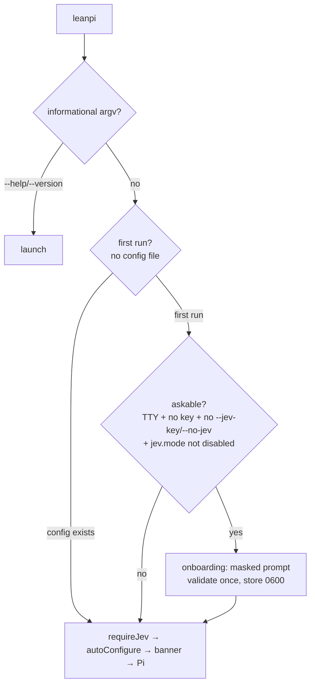

# PRD-039 — First-Run Onboarding

**Status:** DONE — 2026-09-21. Every phase and acceptance box verified.
**Progress:** 100% — all phases and acceptance criteria verified.
**Complexity:** 3 (LOW)
**Owner:** unassigned
**Depends on:** None (PRD-002 credential store and PRD-032's optional-JEV semantics are already shipped)

## Context

A first `leanpi` run on a fresh machine already answers one of the two questions it needs to answer, and never asks the other.

- **Models:** answered. `autoConfigure` (`src/cli/bootstrap.ts:206`) detects the vendor CLIs that are installed and signed in, asks JEV to allocate roles over the discovered inventory, and writes `leanpi.config.yaml`. Nothing to ask.
- **Control plane:** never asked. The JEV key is resolvable from four sources (`resolveCredential`, `src/jev/credentials.ts:104`) — `jev.apiKey` in config, the credential store, `$JEV_API_KEY`, the project `.env` — and a user who has none of them is *told* about the key after the fact: `bin/leanpi.js:78` prints `jevWarning` under the banner, and `src/index.ts:709` notifies once inside the session. Both are read-only messages. The only ways to actually set a key are `leanpi --jev-key <k>` (a flag you must already know) and `/jev setup` (`src/commands/jev.ts:63`, reachable only *after* the session starts).

Two consequences, both on the path every new user takes:

1. The advertised remedy arrives after the damage. The config is written *before* the user has any chance to supply a key, so the first run allocates roles by `ladderAllocation` — the cheapest-first fallback — and stamps `# Roles allocated by the cheapest-first fallback ladder (JEV had no confident answer)` into a file that is then never rewritten (`autoConfigure` never overwrites an existing config). Setting the key later does not re-decide the role map.
2. The user is told they are running a degraded product and handed three shell snippets to go read. A terminal that is already interactive can simply ask.

Files inspected: `bin/leanpi.js`, `src/cli/bootstrap.ts`, `src/cli/launch.ts` (`parseLeanPiFlags:241`), `src/jev/credentials.ts`, `src/commands/jev.ts`, `src/core/config-path.ts`, `src/index.ts:709`, `tests/cli-bootstrap.spec.ts`, `tests/jev-credentials.spec.ts`.

## Solution

One question, asked once, at the only moment where the answer still changes what gets written.

`bin/leanpi.js` gains a step before `requireJev`/`autoConfigure`: when this is a genuine first run **and** the operator is sitting at a terminal **and** the question is not already answered, prompt for the JEV key on stderr, validate it once, store it, and carry on. Everything downstream is unchanged — the stored key is found by the credential resolution that already exists, so `requireJev` reports `credential store`, `jevClientFor()` dials with it, and `autoConfigure` allocates the role map through JEV instead of the ladder.

**Scope is one prompt.** The vendor readiness rows, the login commands and the `no-subscription` exit already exist and already read as onboarding (`readinessRows`, `src/cli/bootstrap.ts:180`); they stay exactly where they are. A pre-flight "can anything run a turn?" check before the key question would double the vendor probe cost of every first run to improve one rare terminal case, so it is deliberately out.

Design decisions, each matching an existing behaviour rather than inventing a policy:

- **One validation attempt, no retry loop.** Same as `/jev setup`. A rejected key prints the provider's reason and the run continues keyless — the key is optional (PRD-032), so a typo must not refuse a session.
- **Empty input is a real answer.** Enter skips; the existing `jevWarning` block prints under the banner as it does today. Nothing is persisted about the decline: `autoConfigure` writes a config at the end of this same run, so the next launch is not a first run and never asks again.
- **Masked input.** The value is a credential. It is read into a variable, written only by `writeStoredKey` (0600 inside a 0700 directory, outside the repository), and never echoed, logged or included in any summary line.
- **Reuse, not re-implementation.** `node:readline/promises` for the prompt (no dependency), `jevClientFor()` for validation, `writeStoredKey` for storage, `configPathFor` for the first-run test.

Risks: (a) a prompt that appears in a non-interactive context would hang CI and every piped `--print` run forever — the TTY gate is the single most important thing to prove; (b) `--help`/`--version` must stay instant.

## Acceptance Criteria

- [x] AC-1 [local; actor: agent]: On a machine with no `leanpi.config.yaml`, an interactive `leanpi` prompts for a JEV key; a pasted valid key is stored at `$XDG_CONFIG_HOME/leanpi/credentials.json` with mode 0600 and the startup banner then reads `JEV on (credential store)` — Evidence: `tests/cli/onboarding.spec.ts` "AC-1 / AC-6" (0600, stored value, `JEV on (credential store)` from the real `requireJev`); a pty smoke run of the built `runOnboarding` stored the pasted key at mode 0600.
- [x] AC-2 [local; actor: agent]: The key accepted at that prompt decides the role map the same run writes — the generated config's header names JEV as the allocator, not the cheapest-first fallback ladder — Evidence: `tests/cli/onboarding.spec.ts` "AC-2" — `autoConfigure` run immediately after, on a signed-in Claude machine, writes a header containing `Roles allocated by JEV` and not `fallback ladder`, and the allocation request carries the stored key.
- [x] AC-3 [local; actor: agent]: Empty input starts the session anyway: a config is written, nothing is stored, and the existing three-line `JEV not configured` warning prints under the banner — Evidence: `tests/cli/onboarding.spec.ts` "AC-3" — `stored: false`, no credential file, no validation request, `autoConfigure` outcome `written`, `jevWarning` returns its three lines.
- [x] AC-4 [local; actor: agent]: A rejected key prints the provider's reason once, stores no credential file, does not re-prompt, and the session still starts — Evidence: `tests/cli/onboarding.spec.ts` "AC-4" — a 401 stub yields exactly one request, one `JEV key rejected: … 401` line, no file, and `requireJev` reports `not configured`.
- [x] AC-5 [local; actor: agent]: No prompt and no hang when the question is already answered or unaskable — non-TTY stdin, `--jev-key`, `--no-jev`, `jev.mode: disabled`, a key in `$JEV_API_KEY`, an existing config, and `--help`/`--version` — Evidence: `tests/cli/onboarding.spec.ts` "AC-5: asks only when the question is genuinely open" (predicate table) and "AC-5: the real binary never prompts where no person is attached" (piped stdin exits 1 at the readiness block with no prompt; `--help`/`--version` spawn and exit with no prompt).
- [x] AC-6 [local; actor: agent]: The key never reaches the terminal or any other file: the captured prompt output contains no substring of the entered value, and the credential store is the only file written — Evidence: `tests/cli/onboarding.spec.ts` "AC-1 / AC-6" (output carries no fragment of the value; the store is the only file onboarding wrote) and "AC-2" (`filesContaining(home, KEY)` is exactly the credential store); confirmed on a real pty: the typed value is absent from the transcript.

## Integration Ledger

| Capability | Reachable consumer/trigger | Replaces / disposition | Evidence |
|---|---|---|---|
| First-run JEV setup | `leanpi` → `bin/leanpi.js` startup path, before `requireJev` (`bin/leanpi.js:55`) | Adds the missing interactive step; `--jev-key`, `$JEV_API_KEY`, `.env` and `/jev setup` all stay and all short-circuit it | `tests/cli/onboarding.spec.ts` — AC-1/AC-2 for the prompt, AC-5 for the short-circuits |

## Execution Phases

#### Phase 1: The prompt, wired where it changes the outcome
**Status:** DONE — every box verified.
**ACs:** AC-1, AC-2, AC-3, AC-4, AC-6
**Files:**
- `src/cli/onboarding.ts` (new) — `shouldOnboard(...)` (first run + askable) and `runOnboarding(...)`, both taking injected `input`/`output` streams and an `isInteractive` flag so the flow is testable without a pty.
- `bin/leanpi.js` — call it inside the non-informational branch, before `requireJev`.
- `tests/cli/onboarding.spec.ts` (new).

**Implementation:**
1. `shouldOnboard({ cwd, env, home, flags, interactive })` → boolean: `!existsSync(configPathFor(cwd, env))` **and** `interactive` **and** `flags.jevKey === undefined` **and** `!flags.allowMissingJev` **and** `requireJev({...}).source` starts with `not configured` (which already covers `jev.mode: disabled` and every resolvable source).
2. `runOnboarding()` writes a short intro to stderr (what LeanPi does with the key, where to get one, that Enter skips), then reads one masked line via `node:readline/promises` with `output: stderr`. Masking: the interface's output write is suppressed for the answer line; the raw value is returned and never re-emitted.
3. Empty → return `{ stored: false }` silently. Non-empty → `jevClientFor({ cwd, env, home }).validateKey(key)`; on `ok` call `writeStoredKey(key, env)` and print `JEV configured (model <v>, <ms>ms)`; on failure print `JEV key rejected: <error> — continuing without it` and return `{ stored: false }`. Never throw: a network failure at this prompt must not refuse a session.
4. `bin/leanpi.js` passes `process.stdin.isTTY === true && process.stderr.isTTY === true` as `interactive`, and wraps the call in the existing try/catch.

**Verification:** E1 — `pnpm vitest run tests/cli/onboarding.spec.ts` against a temp `HOME`/`XDG_CONFIG_HOME` with a stub JEV endpoint (`tests/helpers/stub-jev.ts`) and a fake duplex pair: asserts the stored file's 0600 mode and contents (AC-1), that the captured output never contains the key (AC-6), the empty-input and rejected-key paths (AC-3, AC-4), and — through `autoConfigure` run immediately after, as `bin/leanpi.js` does — that the written config header names JEV rather than the fallback ladder (AC-2). Test-first: the spec was red on the masking leak and the missing rejection line before the module was fixed. Distinct risks: credential leak to the terminal, a retry loop, a refusal on a bad key, and the stale-ladder allocation this PRD exists to fix.
**Checkpoint:** done — `pnpm vitest run tests/cli/onboarding.spec.ts` green (6 tests); `pnpm test` 724 passed / 10 skipped, `pnpm typecheck` and `pnpm lint` clean.

#### Phase 2: It cannot hang anything that is not a person
**Status:** DONE — every box verified.
**ACs:** AC-5
**Files:** `tests/cli/onboarding.spec.ts` (extend), `README.md` (first-run section: what the prompt asks, and the three ways to answer it without one).

**Implementation:** Table-drive `shouldOnboard` over the seven unaskable cases, and add a spawn-level check of the real binary so the gate is proved on the actual consumer path rather than on the predicate alone.

**Verification:** E2 — `pnpm vitest run tests/cli/onboarding.spec.ts`: (a) `shouldOnboard` returns false for each of non-TTY, `--jev-key`, `--no-jev`, `jev.mode: disabled`, `$JEV_API_KEY` set, existing config, and the project `.env`; (b) `spawnSync(process.execPath, ["bin/leanpi.js", "--version"])` and a piped-stdin run under a temp `HOME` with no config both exit within the default test timeout with no prompt text on stderr — the piped run exits 1 at the readiness block, which also proves it got past the gate. E3 — `pnpm test` (724 passed), `pnpm typecheck`, `pnpm lint` all clean.
**Checkpoint:** done — informational argv is covered on the real binary (`--help`/`--version`), which is where the structural gate lives.
