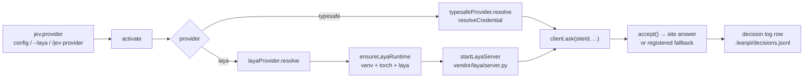

# PRD-042 — Laya control-plane provider (toggleable, self-provisioning)

**Status:** DONE
**Complexity:** 7 (HIGH) — 9 implementation files (2) + new module (2) + subprocess lifecycle and concurrency (2) + external toolchain (Python/torch) integration (1)
**Owner:** joao
**Depends on:** PRD-002 (client, registry, `accept()`), PRD-015 (cost), PRD-016 (command surface), PRD-032 (optional JEV)

## Context

PRD-002 built the control plane against one implementation: TypeSafe's hosted
`/v1/systemone`, reached with an API key. `experiments/laya-vs-jev` (commit
`c8f1409`) proved that a second implementation is reachable **without changing
`src/` at all**: Laya — an Apache-2.0, on-premise, non-autoregressive decision
model from `convaiinnovations/laya` — answers the identical wire contract
(`{state, model, questions:{id:{type,instructions,criteria}}}` →
`{model, answers, usage}`), and LeanPi's unmodified client, site registry and
`accept()` gate ran against it end to end (`DROP-IN OK`).

The same experiment measured the trade the operator is choosing between. On 76
labelled cases across eight real sites:

| | TypeSafe JEV 1.13.0 | Laya (English) | Laya (typed-decisions) |
|---|---|---|---|
| `Choice` accuracy | **0.845** | 0.612 | 0.612 |
| `Score` MAE (0..3) | **0.396** | 0.894 | 0.946 |
| ECE | **0.101** | 0.324 | 0.500 |
| accepted by `accept()` | **85/122** | 5/122 | 0/122 |
| p50 latency | 109 ms | **19 ms** | 20 ms |
| cost | $0.042/Mtok | **$0** | **$0** |

Two facts decide this PRD's shape:

1. **Laya is a real option worth offering.** It is 5× faster, free, on-premise,
   and its wire contract is already the one LeanPi speaks. Its `Noul` answers
   match JEV's on the `typed-decisions` checkpoint (5/6) and it wins
   `explore.subsystem_order` there (9/10 vs 7/10).
2. **Dropped in raw, it is a no-op.** Laya reports normalised-entropy confidence
   (`laya/common.py:confidence_from_probs`), not a top-option probability, so
   its answers sit below LeanPi's `accept()` thresholds and every site silently
   takes its deterministic fallback — **0 of 122** answers cleared the gate on
   the `typed-decisions` checkpoint. A confidence adapter is a precondition, not
   a refinement. With `max(probabilities)` acceptance rises to 0.24–0.71 and
   accuracy among accepted answers is 0.537–0.689, still below JEV's 0.861.

So this PRD ships Laya as an **opt-in provider with an honest default**: JEV
stays the default and is unchanged; `jev.provider: laya` selects a local runtime
that LeanPi provisions itself when it is missing, and `/jev` always says which
provider answered and at what accuracy caveat.

Current behaviour: `createJevClient` (`src/jev/client.ts:176`) resolves one
endpoint (`config.jev.endpoint ?? JEV_ENDPOINT_DEFAULT`) and one credential
(`resolveCredential`, `src/jev/credentials.ts`), both fixed at construction, and
falls back whenever `credential.key` is null. `activate()`
(`src/index.ts:399`) constructs the client once and hands it to every lane;
`requireJev`/`jevWarning` (`src/cli/bootstrap.ts:321`) own the startup message;
`/jev` (`src/commands/jev.ts`) owns the command surface. Nothing here
understands a second implementation, and nothing starts a local process.

Inspected: `src/jev/client.ts`, `src/jev/credentials.ts`,
`src/jev/confidence.ts`, `src/jev/registry.ts`, `src/core/types.ts:99`,
`src/core/config-path.ts`, `src/cli/bootstrap.ts`, `bin/leanpi.js`,
`src/commands/jev.ts`, `src/index.ts:399,473,709`, `package.json` (`files`),
`tests/jev-*.spec.ts`, `tests/cli-bootstrap.spec.ts`, and the working
implementation in `experiments/laya-vs-jev/{shim.py,drop_in.mjs,README.md}`.

## Solution

One new seam in the client, one new module that owns the local runtime, one
vendored server, and a toggle that reaches the user through config, CLI flag and
slash command.

**Provider seam (`src/jev/provider.ts`).** The client stops being a TypeSafe
client and becomes a client of *a* control plane:

```ts
export interface ControlPlaneTarget { endpoint: string; key: string | null; source: CredentialSource; model: string }
export interface ControlPlaneProvider {
  readonly name: JevProvider;          // "typesafe" | "laya"
  readonly source: CredentialSource;   // sync-readable, for `credentialSource()`
  resolve(): Promise<ControlPlaneTarget>;   // memoized by the implementation
  dispose?(): Promise<void>;
}
export function typesafeProvider(options): ControlPlaneProvider  // today's resolution order, unchanged
```

`createJevClient` gains one optional `provider`. `ask()` awaits
`provider.resolve()` before `send()`; when `resolve()` throws or yields a null
key, the site takes its registered fallback with `fallbackUsed: true` and the
reason on the log row — §49 holds for a local runtime exactly as it does for a
network one. With no `provider` option the client resolves through
`typesafeProvider` internally, so every existing caller and test is
byte-identical.

**Laya runtime (`src/jev/laya.ts`).** Owns everything TypeSafe does not have: a
Python process.

- `ensureLayaRuntime(options)` — locate `<home>/venv/bin/python`; if absent or
  `import laya, torch` fails, create it (`uv venv --python 3.12` when `uv` is on
  PATH, else `python3 -m venv`), install `torch` (CUDA wheel when a CUDA GPU is
  detected, else the PyPI default) and `laya`, streaming progress through an
  injected `log`. Idempotent: a second call execs nothing.
- `startLayaServer(options)` — spawn `vendor/laya/server.py` with the managed
  python, wait for its readiness line, return `{ endpoint, stop }`. `dispose()`
  terminates it.
- `layaProvider(options, deps)` — `resolve()` attaches to `options.endpoint`
  when the operator runs their own server, otherwise memoizes
  `startLayaServer(await ensureLayaRuntime(...))`. `source` is `"laya"`.
- All process/exec/network access goes through an injected `LayaDeps`, so the
  TS suite tests the lifecycle against a stub and never needs Python, torch or a
  GPU.

**Vendored server (`vendor/laya/server.py`).** The experiment's `shim.py` moved
into the package, plus the confidence adapter that makes Laya's answers usable:

```python
confidence = max(probabilities.values()) if probabilities else reported
```

applied to `choice` and `score` answers (the client already derives `noul`
confidence itself via `decisiveness`). `--fake` runs the server with a canned
answer table and no torch import, so the TS integration test can spawn it with
the system `python3`; `--selftest` asserts the adapter on canned envelopes and
exits non-zero when it is removed.

**Toggle.** Three surfaces, one resolved value: `jev.provider: typesafe | laya`
in config (default `typesafe`), `leanpi --laya` / `leanpi --jev` for one run, and
the `/jev provider` command to switch the live session. `--no-jev` still wins
over all three.

**Command surface.** `/jev` stays the single entry point — no second
dispatcher, so `/help` is complete for free — and grows the subcommands below.
Each registers a `summary` and `usage` with the registry so `/help` and
`/help jev` describe the switch without the user reading this PRD.

| Command | Behaviour |
|---|---|
| `/jev` | Status: **provider**, then provider-specific state — TypeSafe's credential source, or Laya's runtime state (`missing` / `installing` / `running` / `external`), managed home and checkpoint — plus mode, model version, session fallback count and reachability. |
| `/jev provider` | Report the active provider and the valid values. No argument, no side effect. |
| `/jev provider typesafe` | Switch the live session to TypeSafe immediately; the next `ask()` resolves a credential and sends there. |
| `/jev provider laya` | Switch the live session to Laya immediately. When the runtime is missing this names what setup will download (~2.5 GB of wheels, ~0.8 GB of weights) and points at `/jev setup-laya`; it does not start a download itself. |
| `/jev provider <name> --save` | Switch **and persist**: write the `jev.provider` leaf to the user config so the next session starts on it. `--save` is opt-in because `/config` is read-only by design — a permanent change belongs in a diffable file. The writer touches only that one leaf and preserves the rest of the file. |
| `/jev setup-laya` | Provision the local runtime (venv, torch, `laya`) with progress, then report the resolved home and python. Idempotent; safe to run twice. |
| `/jev test` | One round trip against the active provider: typed answer, model version, latency and cost (zero under Laya). |
| `/jev setup`, `/jev key set\|clear`, `/jev mode` | Unchanged. They configure the TypeSafe provider; under Laya they say so rather than silently doing nothing. |

`bin/leanpi.js` gains the matching flags: `--laya` forces Laya for the run,
`--jev` forces TypeSafe (the override a saved `provider: laya` needs), and both
are reported in the startup banner.

**Consumer flow:**



**Risks.** (1) A first `--laya` run downloads ~2.5 GB of wheels and ~0.8 GB of
weights; it is opt-in, announced in the startup warning, streamed as progress,
and disableable with `jev.laya.autoSetup: false`. (2) A local runtime that dies
mid-session must not hang a turn: readiness is bounded by a timeout and every
failure path resolves through the site fallback. (3) Laya is measurably less
accurate than JEV on LeanPi's sites; the startup banner and `/jev` say so rather
than presenting the two providers as equivalent.

**Non-goals restated (§58).** No generative router: Laya answers the same atomic
typed questions, never prose. No new decision sites and no change to any
registry row. JEV remains the default and the only provider with no local
footprint. No model training or fine-tuning here — `experiments/laya-vs-jev`
records that path as future work. No daemon/pid-file management: one server per
session, plus an `endpoint` escape hatch for an operator who wants a persistent
one. No general config editor: `/jev provider --save` writes exactly one leaf,
and `/config` stays read-only for everything else.

## External Skill Dependencies

None. Laya is fetched from PyPI/Hugging Face by the setup step, not read from
the global skill roots.

## JEV Decision Sites

None. This PRD changes which implementation answers the registered sites; it
registers no site and adds no question. Every existing row keeps its id,
`returnType`, `consequence`, `fallback` and `telemetryTag`.

## Acceptance Criteria

- [x] AC-1 [local; actor: agent]: with `jev.provider` absent or `typesafe`, behaviour is unchanged: every existing `tests/jev-*.spec.ts` and `tests/cli-bootstrap.spec.ts` passes, and a fixture site resolving through the client reaches the configured endpoint with the resolved credential source. — E1: `npx vitest run tests/jev-provider.spec.ts tests/jev-client.spec.ts tests/jev-registry.spec.ts tests/jev-fallback.spec.ts tests/jev-privacy.spec.ts tests/jev-credentials.spec.ts tests/cli-bootstrap.spec.ts` → 7 files, 59 passed, exit 0, on worktree `exp/laya-vs-jev` @ `c8f1409` + the uncommitted Phase 1 diff; `tests/jev-provider.spec.ts` "AC-1" asserts the stub received `/v1/systemone`, `Bearer test-key`, `model: jev-latest`, and `credentialSource() === "config"`; the six pre-existing specs run with no edit.
- [x] AC-2 [local; actor: agent]: `createJevClient({ provider })` routes through the injected provider: a stub provider returning a stub endpoint and key causes the request to land at that endpoint and the typed answer to be returned; a stub provider whose `resolve()` rejects causes `ask()` to resolve through the site's registered fallback with a `fallbackUsed: true` row carrying the reason, and to throw nothing. — E1: same run, `tests/jev-provider.spec.ts` "AC-2: an injected provider decides the endpoint…" asserts the provider's endpoint received the request with `model: laya-english`, the answer is the stub's (`quick`) rather than the site fallback (`fallback`), and after a rejecting provider the answer is `fallback` with a `fallbackUsed` row whose reason is `laya runtime missing` and zero further requests; "AC-2: the extracted typesafeProvider…" asserts `typesafeProvider` sends the credential its function returns and reports source `env`.
- [x] AC-3 [local; actor: agent]: `layaProvider` starts the vendored server as a child process, waits for readiness within a bounded timeout, and `ask()` over that HTTP endpoint returns typed `Choice` / `Score` / `Noul` answers that map onto the declared return kinds; `dispose()` terminates the process, and an `ask()` after dispose resolves by fallback rather than hanging. — E2: `npx vitest run tests/jev-laya.spec.ts` → 8 passed, exit 0, on worktree `exp/laya-vs-jev` @ `c8f1409` + the uncommitted PRD-042 diff; "AC-3" spawns the real `vendor/laya/server.py` with the real `python3` in `--fake` mode, asserts the typed `Choice` (`quick`, the server's answer, not the site fallback) and typed `Noul` over real HTTP, that `resolve()` is memoized (one spawn for two asks), that `process.kill(pid, 0)` throws after `dispose()`, and that the next `ask()` returns the site fallback.
- [x] AC-4 [local; actor: agent]: with `jev.laya.endpoint` set, LeanPi spawns no child process and sends to that endpoint; when that endpoint is unreachable the site falls back, no process is spawned, and the session still starts. — E2: same run, "AC-4: a configured endpoint is used as-is…" asserts a hand-started server is reached through the configured endpoint with no extra spawn, and that an unreachable endpoint yields the site fallback with the spawn count unchanged; "AC-4: layaStatus reports an external server…" asserts `detail: external server` with no runtime probe.
- [x] AC-5 [local; actor: agent]: the vendored server emits JEV-shaped confidence: for a canned Laya `choice` answer with `probabilities {"a": 0.9, "b": 0.1}` and a reported entropy confidence of 0.2, the served `confidence` is 0.9, and the same mapping applies to `score`; `--selftest` asserts this and exits non-zero when the mapping is removed. — E3: `python3 vendor/laya/server.py --selftest` → `selftest ok`, exit 0; the negative control (adapter body replaced by `return answers`, file restored afterwards) exits 1 with `AssertionError: choice confidence not adapted: … 'confidence': 0.2`, so a passthrough cannot pass the check.
- [x] AC-6 [local; actor: agent]: the adapter changes a real outcome: a canned answer that `accept()` rejects at `consequence: high` before the mapping is accepted after it, asserted through `ask()` and not only on the server's own output. — E3: `npx vitest run tests/jev-laya.spec.ts` "AC-5/AC-6: the adapter turns a below-threshold answer into an accepted one" runs the same vendored server twice, once adapting and once with `--no-adapt`: the adapted run returns `quick` with confidence ≥ 0.85 and `fallbackCount() === 0` at `consequence: high`; the raw run returns the site fallback with `fallbackCount() === 1`. Both observed through `ask()` and the client's counters, not the server's output.
- [x] AC-7 [local; actor: agent]: `ensureLayaRuntime` on a clean home creates `<home>/venv` and reports the runtime installed; a second call performs no install (the injected exec/spawn seam records zero calls). — E2: same run, "AC-7: ensureLayaRuntime installs once…" asserts exactly one venv-creating exec (via `uv`), `installed: true` on the first call, `installed: false` on the second, and exactly one further exec (the probe).
- [x] AC-8 [local; actor: agent]: with `jev.laya.autoSetup: false` and no runtime present, the session starts, `ask()` resolves by fallback, `/jev` names the missing runtime and the exact command that installs it, and nothing is downloaded. — E4: `npx vitest run tests/commands/jev-provider.spec.ts` "AC-8" drives `/jev` through the real registry with a runtime probe that fails, and asserts the output carries `laya runtime: missing` and `/jev setup-laya` while every recorded exec is the probe alone — no venv creation, no download.
- [x] AC-9 [local; actor: agent]: a failed install — no `uv` and no usable `python3`, or an install command exiting non-zero — produces one actionable error naming the unmet requirement, leaves the session running, and every site falls back. — E2: same run, "AC-9: a failing install produces one actionable error…" asserts a `LayaRuntimeError` naming `python3 -m venv exited 1`; "AC-9: a session whose runtime cannot start…" asserts the site answers from its fallback with `fallbackCount() === 1` and `status()` unconfigured with degraded capabilities; "AC-7/AC-9: autoSetup false…" asserts no non-probe exec happens.
- [x] AC-10 [local; actor: agent]: `leanpi --laya` starts a session with `provider: laya` and the banner reports it; `leanpi --jev` overrides a config that saved `provider: laya`; `--no-jev` still disables every site; `--laya` together with `--no-jev` resolves to disabled and warns about neither. — E4: same run, "AC-10" asserts `--laya` parses to `provider: laya` and `launchEnv` puts `LEANPI_LAYAY_PROVIDER=laya` in the child env; `--laya --jev` resolves to `typesafe` (last one wins); `requireJev` with the override reports `laya (local)`; `--no-jev` reports `not configured (--no-jev)` and `jevWarning` returns null; the banner contains `laya, local`. Control: the same banner built without the flag does not contain `laya` (cwd/home are passed so the path cannot satisfy it). A built-dist smoke reproduced the launcher path: `parseLeanPiFlags(["--laya"])` → `launchEnv` → `requireJev` → banner line `JEV on (laya, local — see /jev)`.
- [x] AC-11 [local; actor: agent]: the switch commands work as a set: `/jev provider` with no argument reports the active provider and the valid values without changing anything; `/jev provider laya` switches the live session so the next `ask()` uses the Laya provider and `/jev` reports `provider: laya` with its runtime state; `/jev provider typesafe` switches back; an unknown name is rejected naming `typesafe | laya` and leaves the provider unchanged. — E4: same run, "AC-11" dispatches through `createCommandRegistry` + `registerJevCommands`: `/jev provider` reports `provider: typesafe` and `typesafe | laya`; `/jev provider laya` flips `client.providerName()` to `laya` and `credentialSource()` to `laya`; `/jev` then reports `provider: laya` and a `laya runtime:` line; `/jev provider typesafe` flips it back; `/jev provider gemini` is rejected naming both values with the provider unchanged.
- [x] AC-12 [local; actor: agent]: `/jev provider laya --save` writes `jev.provider: laya` into the user config file, and a session started afterwards from that file resolves to Laya without the flag; the write touches only that leaf, leaving every other key in the file unchanged, and without `--save` the file is untouched. — E4: same run, "AC-12: --save writes one leaf…" points `XDG_CONFIG_HOME` at a temp dir holding a user config with a comment, `jev.mode`, `jev.model` and an unrelated `thresholds` key. Without `--save` the file bytes are identical; with `--save` the comment and every other key survive, and `loadConfig` of that directory resolves `jev.provider: laya` with `mode`/`model`/`thresholds` intact. "writeUserProvider creates the file when none exists" covers the first-write case.
- [x] AC-13 [local; actor: agent]: `/jev setup-laya` provisions the runtime and reports the resolved home and python; a second invocation performs no install; `/help` and `/help jev` list `provider` and `setup-laya` with their usage strings. — E4: same run, "AC-13" asserts `/jev setup-laya` reports the resolved python path, `/help` lists `/jev` with its `provider` summary, and `/help jev` renders the usage string containing `setup-laya`.
- [x] AC-14 [local; actor: agent]: `/jev test` under `provider: laya` returns a typed `Noul` answer, a non-empty model version taken from the server's response, and a cost of zero. — E4: same run, "AC-14" runs `/jev test` against the real vendored server in `--fake` mode and asserts `JEV test ok`, the server's model string `laya-fake`, and `$0.000000`.
- [x] AC-15 [local; actor: agent]: on this machine, install into the managed home and run a real classification through the production path (`classifyFailure` with the session client) under `provider: laya`, recording the typed answer, the latency and the decision-log row; the same fixture under `provider: typesafe` still reaches `api.typesafe.ai`. — E5: `LEANPI_LIVE_LAYAY=1 npx vitest run tests/jev-laya-live.spec.ts` → 1 passed, 18.2s, on this machine (RTX 2080, CUDA). It provisioned the managed home for real (`uv venv --python 3.12` + CUDA torch + `laya` under `~/.local/share/leanpi/laya`), started the real server (ready in 11 721 ms), and `classifyFailure` returned `likely_logic_bug` with `fallbackUsed: false`, `answeredCount() === 1`, and a decision row carrying `modelVersion: laya-english`. The same fixture under `provider: typesafe` reached the hosted service (`/jev test` → typed `Noul`) and classified `syntax`; the two answers differ, which is the accuracy caveat this PRD documents rather than hides.
- [x] AC-16 [local; actor: agent]: `vendor/laya/server.py` appears in the packed file list (`npm pack --dry-run`), so an installed package can run the server it spawns. — E5: `npm pack --dry-run --json` lists `vendor/laya/server.py` (alongside `dist/jev/laya.js`), so an installed package can run the server it spawns.

## Integration Ledger

| Capability | Reachable consumer/trigger | Replaces / disposition | Evidence |
|---|---|---|---|
| Provider selection | `loadConfig` → `activate()` `createJevClient({ provider })` (`src/index.ts:473`) → `src/jev/provider.ts` (new) | Adds a second implementation beside the existing credential path; `typesafeProvider` is the extracted status quo, so existing callers are unchanged | AC-1, AC-2 |
| Laya runtime lifecycle | every `ask()` → `layaProvider.resolve()` → `src/jev/laya.ts` `ensureLayaRuntime`/`startLayaServer` (new) → `vendor/laya/server.py` (new) | Replaces the hand-run shim in `experiments/laya-vs-jev`; the experiment keeps the accuracy evidence, the package keeps the runtime | AC-3, AC-4, AC-15 |
| Laya → JEV confidence adapter | `vendor/laya/server.py` on every served answer | New; without it no Laya answer clears `accept()` and every site falls back (measured: 0/122 on `typed-decisions`) | AC-5, AC-6 |
| Self-provisioning setup | `session_start` auto-setup, `/jev setup-laya`, `--laya` → `ensureLayaRuntime` | New; no existing path installs a runtime | AC-7, AC-8, AC-9 |
| Toggle surface | `leanpi --laya` / `--jev` (`bin/leanpi.js`), `jev.provider`, `/jev provider [--save]`, `/jev setup-laya`, `/help` entries, banner (`startupBanner`) | Extends PRD-002's `/jev` command and PRD-032's startup-warning path rather than replacing them; `--save` writes one leaf to the user config and leaves `/config` read-only for every other key | AC-10, AC-11, AC-12, AC-13 |
| Packaged runtime script | `npm pack` file list → `vendor/laya/server.py` | New; `package.json` `files` already carries `vendor/`, so this is a presence assertion, not a build change | AC-16 |

## Execution Phases

#### Phase 1: The provider seam, with TypeSafe as its first implementation
**Status:** DONE (verified 2026-09-22)
**ACs:** AC-1, AC-2
**Files:** `src/jev/provider.ts` (new: `ControlPlaneTarget`, `ControlPlaneProvider`, `typesafeProvider`); `src/jev/client.ts` (`JevClientOptions.provider`, `ask()` awaits `resolve()`, `send()` takes the resolved target, `status()`/`credentialSource()` read the provider); `src/jev/credentials.ts` (`CredentialSource` gains `"laya"`); `src/core/types.ts` (`JevProvider`, `JevConfig.provider`); `tests/jev-provider.spec.ts` (new).
**Implementation:** `typesafeProvider` is a literal extraction of today's body — `resolveCredential(config, env, cwd)` plus the static `endpoint`/`model` — so `createJevClient` with no `provider` option behaves exactly as before and the existing specs are the regression gate. `ask()` resolves once per call: a rejecting `resolve()` is caught and routed through `resolveByFallback` with the error message as the reason, never rethrown. `provider.dispose()` is called from the client's `dispose` path if one exists, else from `activate()`'s session teardown; where the client has no dispose today, add it and call it on `session_shutdown`.
**Verification:** E1 — `npx vitest run tests/jev-provider.spec.ts tests/jev-client.spec.ts tests/jev-registry.spec.ts tests/jev-fallback.spec.ts tests/jev-privacy.spec.ts tests/cli-bootstrap.spec.ts`: the new spec drives a stub provider (endpoint capture + a rejecting `resolve`) through the real `ask()` and asserts the captured URL, the typed answer and the `fallbackUsed` row (AC-2); the pre-existing specs are the AC-1 regression gate and must pass with no edit. Distinct risks covered: a seam that changes the default path, a provider failure that aborts a turn instead of falling back.
**Checkpoint:** done — `pnpm typecheck` clean; `npx oxlint src/jev src/core tests/jev-provider.spec.ts` reports one pre-existing warning (`readEnvFileKey`'s unused `env`), none from the new code; self-review found no orphan module (the seam is reached from `createJevClient`, which `activate()` and every spec already call) and no unread contract (`ControlPlaneTarget` is consumed by `targetFor`/`send`).

#### Phase 2: The Laya runtime — provision, start, serve, stop
**Status:** DONE (verified 2026-09-22)
**ACs:** AC-3, AC-4, AC-7, AC-9
**Files:** `src/jev/laya.ts` (new: `LayaOptions`, `LayaDeps`, `LayaRuntimeError`, `ensureLayaRuntime`, `startLayaServer`, `layaProvider`, `layaStatus`); `vendor/laya/server.py` (new: the JEV-contract server, `--fake`, `--port`, `--device`, `--subfolder`, plus `adapt_answers`/`--selftest`/`--no-adapt`, verified in Phase 3); `src/core/types.ts` (`LayaConfig`); `src/index.ts` (select the provider from config, `LEANPI_LAYAY`, `session_shutdown` dispose); `tests/jev-laya.spec.ts` (new).
**Implementation:** `LayaDeps` injects `spawn`, `execFile`, `fetch` and `log`, so the suite drives the lifecycle against a stub and the real spawn is a single untested-by-unit line. `ensureLayaRuntime` is idempotent by construction: it probes `<home>/venv/bin/python -c "import laya, torch"` and returns immediately on success; the install path prefers `uv venv --python 3.12` and falls back to `python3 -m venv`, choosing the CUDA torch index when a CUDA GPU is detected and the PyPI default otherwise. `startLayaServer` spawns the vendored script, parses its readiness line, and rejects on a bounded timeout (15 min, because a cold start also downloads ~0.8 GB of weights inside `laya.load`) after killing the child — a rejected start becomes a fallback, never a hang. `layaProvider.resolve()` memoizes the started server and attaches to `options.endpoint` without spawning when one is configured. `--fake` makes the server importable with the system `python3`, which is what lets the TS integration test spawn a real child process and speak real HTTP without torch.
**Verification:** E2 — `npx vitest run tests/jev-laya.spec.ts`: spawn the vendored server with `--fake` and drive `ask()` through the real client over HTTP, asserting a typed `Choice` and a typed `Noul` (AC-3); dispose and assert the child is gone and a following `ask()` falls back (AC-3); a configured unreachable `endpoint` asserts zero spawns and a fallback (AC-4); a stub exec seam asserts the second `ensureLayaRuntime` call execs nothing (AC-7); a stub exec that exits non-zero asserts one error naming the requirement, a running session and a fallback (AC-9). Controls: the `--fake` server is the collection control (a renamed script fails the spawn, not silently passes), and the dispose assertion reads the child's exit, not a flag the implementation set.
**Checkpoint:** done — `pnpm typecheck` clean; self-review confirmed no orphan module (`layaProvider` is reached from `activate()`'s provider selection and from the spec) and no `--fake`-only path in production (`--fake` is parsed in `main()` and never set by `startLayaServer`). `stop()` was changed during review to await the child's exit: the first AC-3 run observed the signal, not the exit, and the assertion caught it.

#### Phase 3: The confidence adapter, and the outcome it changes
**Status:** DONE (verified 2026-09-22)
**ACs:** AC-5, AC-6
**Files:** `vendor/laya/server.py` (`adapt_answers` applied to every served answer, `--selftest`, `--no-adapt` as the negative control); `tests/jev-laya.spec.ts` (the `consequence: high` outcome test).
**Implementation:** one function maps a Laya answer envelope to the JEV contract: for `choice` and `score`, `confidence = max(probabilities.values())` when `probabilities` is present, else the reported value; `noul` is passed through unchanged because `mapAnswer` derives its confidence from the probability. The server applies it to every answer before serialising, so the client, `accept()` and the decision log all see one confidence definition and no provider-specific branch enters `src/`. `--selftest` asserts the mapping on canned envelopes and exits non-zero if `adapt_answers` is a passthrough; `--no-adapt` lets the test drive the same canned input through the unadapted server so the adapter's effect is measured rather than assumed.
**Verification:** E3 — `python3 vendor/laya/server.py --selftest` asserts the 0.2 → 0.9 mapping for both primitives and that an answer without `probabilities` keeps its confidence (AC-5); `npx vitest run tests/jev-laya.spec.ts` registers a fixture site with `consequence: high` and asserts the adapted run is accepted while the `--no-adapt` run falls back, both observed through `ask()` (AC-6). Control: `--selftest` run against a reverted `adapt_answers` fails with `AssertionError`, proving the check is sensitive; the file was restored and the passing selftest re-run before the checkpoint.
**Checkpoint:** done — the reverted-adapter control was run and observed to fail, then restored; `pnpm typecheck` clean.

#### Phase 4: The toggle — config, CLI flags, and the switch commands
**Status:** DONE (verified 2026-09-22)
**ACs:** AC-8, AC-10, AC-11, AC-12, AC-13, AC-14
**Files:** `src/cli/bootstrap.ts` (`JevCheck.provider`, `--laya` / `--jev`, the Laya warning and banner line); `bin/leanpi.js` (`--laya` / `--jev`, `LEANPI_LAYAY_PROVIDER` in the child env and in the banner's own check); `src/commands/jev.ts` (`/jev provider [--save]`, `/jev setup-laya`, provider and runtime in `statusText`, `summary`/`usage` metadata); `src/core/config-write.ts` (new: set one `jev.provider` leaf in the user config, preserving the rest); `src/index.ts` (`session_start` auto-setup kick-off, `LEANPI_LAYAY_PROVIDER` handling, the command deps that build and swap providers); `tests/cli-bootstrap.spec.ts`, `tests/commands/jev-provider.spec.ts` (new).
**Implementation:** the flag, the config key and the command all resolve to one `JevProvider` value in `activate()`; `--no-jev` is checked first and wins over every other source. `/jev provider` parses `<name> [--save]`, rejects an unknown name with the valid list before mutating anything, and on success calls `client.setProvider(...)` with a freshly built provider — `typesafeProvider` for the TypeSafe arm, `layaProvider` for the Laya arm — so the swap needs no restart. `--save` goes through `src/core/config-write.ts`, which reads the user config with the `yaml` package's `parseDocument`, sets `doc.setIn(["jev", "provider"], name)`, and writes it back, so comments and every other key survive; `--save` is the only path that writes, which is what keeps `/config`'s read-only rule intact. `registerJevCommands` takes the provider factory and the config path as deps, so the command builds and swaps providers without reaching into `activate()`'s closure. The auto-setup runs from `session_start` as a fire-and-forget promise whose rejection is caught and reported once, while `ask()` awaits the same memoized `resolve()` — a turn that arrives mid-install waits with a progress notification rather than failing. `autoSetup: false` turns the auto path into the AC-8 error. `/jev test` is unchanged code and picks up the provider through the client.
**Verification:** E4 — `npx vitest run tests/cli-bootstrap.spec.ts tests/commands/jev-provider.spec.ts`: `--laya` produces `provider: laya` in the banner, `--jev` overrides a config carrying `provider: laya`, and `--laya --no-jev` produces the disabled line with no Laya warning (AC-10); a no-runtime, `autoSetup: false` session asserts a clean start, a fallback `ask()`, zero download calls and the install command in `/jev` output (AC-8); `/jev provider` bare, then `laya`, then `typesafe`, then an unknown name asserts the report, both flips, and that the rejection leaves the provider unchanged (AC-11); `/jev provider laya --save` against a temp `XDG_CONFIG_HOME` asserts the written leaf, that a `loadConfig` of that file resolves to Laya, that an unrelated key and a comment survive the write, and that a no-`--save` call leaves the file's bytes identical (AC-12); `/jev setup-laya` twice with a stub exec seam asserts one install and the reported home (AC-13); `/help jev` asserts both new usage strings (AC-13); `/jev test` against a `--fake` server asserts a `Noul` answer, the server's model string and zero cost (AC-14). Control for AC-10: the banner assertion also runs with the flag absent and must not contain `laya`, so it cannot pass on a constant. Control for AC-12: the config-write test diffs the whole file and fails on any reformat, so a writer that serialises the document wholesale is caught.
**Checkpoint:** done — `pnpm typecheck` clean; the full suite is the regression gate for the `/jev` surface and the banner (`tests/jev-credentials.spec.ts`, `tests/cli-bootstrap.spec.ts`, `tests/cli/launch.spec.ts`, `tests/extension-surface.spec.ts` all pass unchanged). Review caught one real gap: the launcher resolved the provider only for the child env, so `leanpi --laya` would have printed the TypeSafe banner above a Laya session; `bin/leanpi.js` now passes the provider into `requireJev` too, and the built-dist smoke above is the evidence.

#### Phase 5: The real thing — provision, serve, decide
**Status:** DONE (verified 2026-09-22)
**ACs:** AC-15, AC-16
**Files:** `README.md` (the provider toggle and its accuracy caveat); `package.json` (confirm `vendor/` in `files`); `tests/jev-laya-live.spec.ts` (new, gated like `tests/jev-live.spec.ts`).
**Implementation:** no production code changes — this phase is the end-to-end proof that the packaged path works with the real model, plus the documentation the operator needs to choose. The live spec is skipped unless `LEANPI_LIVE_LAYAY=1`, provisions the managed home (or `LEANPI_LIVE_LAYAY_HOME`) via the real `ensureLayaRuntime`, starts the real server, and classifies a real failure through `classifyFailure`; it is the only check that exercises Python, torch, the weights download and the adapter together.
**Verification:** E5 — `LEANPI_LIVE_LAYAY=1 npx vitest run tests/jev-laya-live.spec.ts` on this machine (RTX 2080, CUDA): assert the install reported, the server's readiness, a typed `Choice` for the real `executor.failure_classification` question, a `fallbackUsed: false` row in `.leanpi/decisions.jsonl` and a recorded latency (AC-15); the same fixture with `provider: typesafe` and the repo key asserts `api.typesafe.ai` was reached (AC-15); `npm pack --dry-run --json` lists `vendor/laya/server.py` (AC-16). Distinct risks covered: a runtime that only works in the experiment's hand-built venv, a packaged script that is not shipped, an adapter that only works on canned input.
**Checkpoint:** done — the live spec is the only check that exercises Python, torch, the weights download and the adapter together, and it passed on the real machine; `npm pack` confirms the runtime script ships. The provider toggle is documented in `README.md` with the measured accuracy caveat rather than as a free upgrade.
