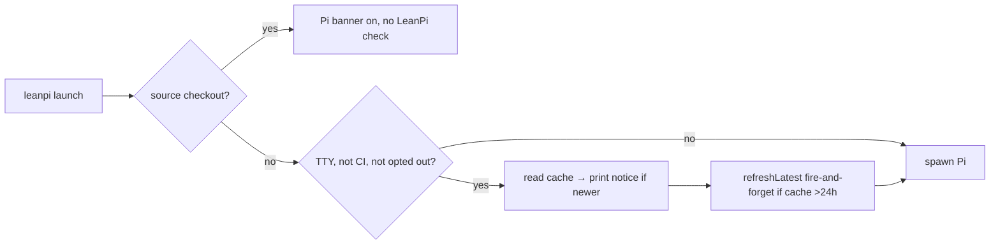

# PRD-043 — LeanPi update notice (installed package only)

**Status:** DONE
**Complexity:** 4 (MEDIUM) — 2 implementation files (1) + new module (2) + external API, the npm registry (1)
**Owner:** joao
**Depends on:** PRD-031 (npm publish)

## Context

An npm-installed `leanpi` never tells its user a newer LeanPi exists. Pi's own "Update Available" banner is the wrong signal. It checks Pi, not LeanPi, and it tells the user to run `pi update`, which cannot move the Pi version LeanPi pins. `launchEnv` already turns that banner off with `PI_SKIP_VERSION_CHECK=1` whenever `sourceCheckout()` is false (`src/cli/launch.ts:348`).

Scope, as decided by the owner:

- **Installed package (prod):** show a LeanPi update notice. Pi's banner stays off, as it is today.
- **Source checkout (dev):** no LeanPi notice. Pi's banner stays on, as it is today. It is the maintainer's cue to bump the Pi pin.

Files inspected: `bin/leanpi.js` (startup order, banner, `jevWarning` yellow-line pattern), `src/cli/launch.ts` (`sourceCheckout`, `launchEnv`, `isInformational`), `src/core/package-info.ts` (`LEANPI_VERSION`).

## Solution

A new module, `src/cli/update-check.ts`, exports two things:

- `updateNotice({ current, cachePath })` returns a notice line or `undefined`. It reads a small JSON cache, `{ checkedAt, latest }`. When `latest` is newer than `current`, it returns `leanpi v<latest> is available (you have v<current>) — npm i -g leanpi@latest`. (No `now`: the line depends only on the cached `latest`.)
- `refreshLatest({ cachePath, now, fetch })` runs only when the cache is missing or older than 24 h. It GETs `https://registry.npmjs.org/leanpi/latest` with a 1.5 s `AbortSignal.timeout` and writes `{ checkedAt: now, latest: body.version }`. Any failure (offline, timeout, bad JSON, unwritable cache) is swallowed. An update check must never break a launch. A *failed* check writes nothing, so it is retried on the next launch — an offline machine that comes back online should not wait a day for the notice, and the request is capped and never awaited.

Startup never waits on the network. The notice comes from the cache written by an earlier launch, so it appears one launch after a release. `refreshLatest` runs without being awaited. The parent process stays alive until the Pi child exits, so the request has time to finish.

Version comparison is numeric on `major.minor.patch`. A prerelease or unparseable `latest` never produces a notice. Known limitation: an installed version that is *itself* a prerelease (`0.2.0-rc.1`) does not parse either, so it is never told about `0.2.0` — acceptable while published versions are releases.

The check runs only when **all** of these are true:

1. `!sourceCheckout()`
2. The command is not informational (`--help`/`--version`)
3. stderr is a TTY
4. `CI` is unset
5. `LEANPI_NO_UPDATE_CHECK` is unset

Cache path: `~/.leanpi/update-check.json`. This is an assumption; move it if a user-level LeanPi dir already exists by then.

Risks: a registry outage or slow network must not delay startup (covered by not awaiting plus the timeout). A stale cache only delays the notice.

## Acceptance Criteria

- [x] AC-1 [local; actor: agent]: The cache says `latest` > installed, in an installed-package layout (no `.git`) on a TTY → the notice line is printed to stderr before Pi starts. Equal, older, prerelease or garbage `latest` → no line. — Evidence: `tests/cli/update-check.spec.ts` (11 tests: newer line, numeric compare, equal/older/prerelease/`v`-prefixed/garbage silent, absent/empty/malformed cache silent) + `tests/cli/launch.spec.ts` "checks for a newer LeanPi only in an installed package…" (installed layout + TTY true). Wiring is `bin/leanpi.js:104-112`, before `spawn` (the cache path is resolved inside the gate, so `homedir()` cannot throw on a launch that never checks).
- [x] AC-2 [local; actor: agent]: A source checkout, a non-TTY stderr, `CI=1`, `LEANPI_NO_UPDATE_CHECK=1` and `--version` each produce no notice and make no registry request. The dev checkout still gets Pi's banner (`PI_SKIP_VERSION_CHECK` absent). — Evidence: `shouldCheckForUpdate` (`src/cli/launch.ts:370`) gates both the notice and `refreshLatest`, so a false gate is no request by construction; asserted per branch in `tests/cli/launch.spec.ts` (source checkout, `isTTY: false`, `CI`, `LEANPI_NO_UPDATE_CHECK`, `--version`). Pi's banner: existing `launchEnv` test asserts `PI_SKIP_VERSION_CHECK` absent for `PACKAGE_ROOT` and `"1"` for an installed root.
- [x] AC-3 [local; actor: agent]: `refreshLatest` writes `{ checkedAt, latest }` from the registry response. It skips the request when the cache is <24 h old. On fetch rejection or timeout it leaves the cache untouched and does not throw. — Evidence: `tests/cli/update-check.spec.ts` — write path (nested dir created), skip at 23 h / refresh at 25 h, rejecting fetch, non-200, body without `version`, unwritable cache path (EISDIR), unreadable cache re-checked, cache stamped in the future re-checked, failed check retried next launch. Timeout is `AbortSignal.timeout(1500)` (`src/cli/update-check.ts:100`) and the request's `signal` is asserted in the write test, so an abort lands in the same `catch`.
- [x] AC-4 [local; actor: agent]: `pnpm test`, `pnpm typecheck`, `pnpm lint` are green. — Evidence: `pnpm build` then `pnpm test` → 148 files / 956 passed, 11 skipped, 0 failed (includes `tests/cli/packaging.spec.ts` `npm pack` and the `bin/leanpi.js` relative-import check); `pnpm typecheck` clean; `pnpm lint` 0 errors (pre-existing warnings only, none in touched files).

## Integration Ledger

| Capability | Reachable consumer/trigger | Replaces / disposition | Evidence |
|---|---|---|---|
| LeanPi update notice | `leanpi` launch → `bin/leanpi.js:104-112` (after `startupBanner` + `jevWarning`, before `spawn`) → gate `shouldCheckForUpdate` `src/cli/launch.ts:370` → `updateNotice` `src/cli/update-check.ts:83` / `refreshLatest` `src/cli/update-check.ts:100` | New. Pi's banner gating in `launchEnv` unchanged | AC-1, AC-2, AC-3 |

## Execution Phases

#### Phase 1: Update check module
**Status:** DONE
**ACs:** AC-1 (logic), AC-3
**Files:** `src/cli/update-check.ts` (new), `tests/cli/update-check.spec.ts` (new)
**Implementation:** `updateNotice`, `refreshLatest`, and a numeric `isNewer(a, b)` kept internal (reached through `updateNotice`). `fetch`, `now` and `cachePath` are injected so the tests touch no network and no real home directory. `updateNotice` drops the PRD's unused `now` parameter: the notice reads only the cached `latest`.
**Verification:** E1. Red→green unit tests with a temp-dir cache and a stubbed `fetch`, covering newer, equal, older, prerelease, garbage, fresh-cache skip, and rejecting or aborted fetch.
**Checkpoint:** DONE

#### Phase 2: Wire into launch
**Status:** DONE
**ACs:** AC-1 (wiring), AC-2, AC-4
**Files:** `bin/leanpi.js`, and optionally a `shouldCheckForUpdate({ root, argv, env, isTTY })` gate beside `launchEnv` in `src/cli/launch.ts`
**Implementation:** After the banner and JEV warning, if the gate passes, print `updateNotice(...)` in yellow on a TTY (same style as `jevWarning`), then call `refreshLatest(...)` without awaiting it.
**Verification:** E2. Test the gate against a temp root with and without `.git`, a TTY flag, `CI` and the opt-out env. That proves every "no notice and no request" branch through the function `bin/leanpi.js` calls. The existing `launchEnv` test keeps covering Pi's banner. Then run `pnpm test`, `pnpm typecheck`, `pnpm lint` once.
**Checkpoint:** DONE
