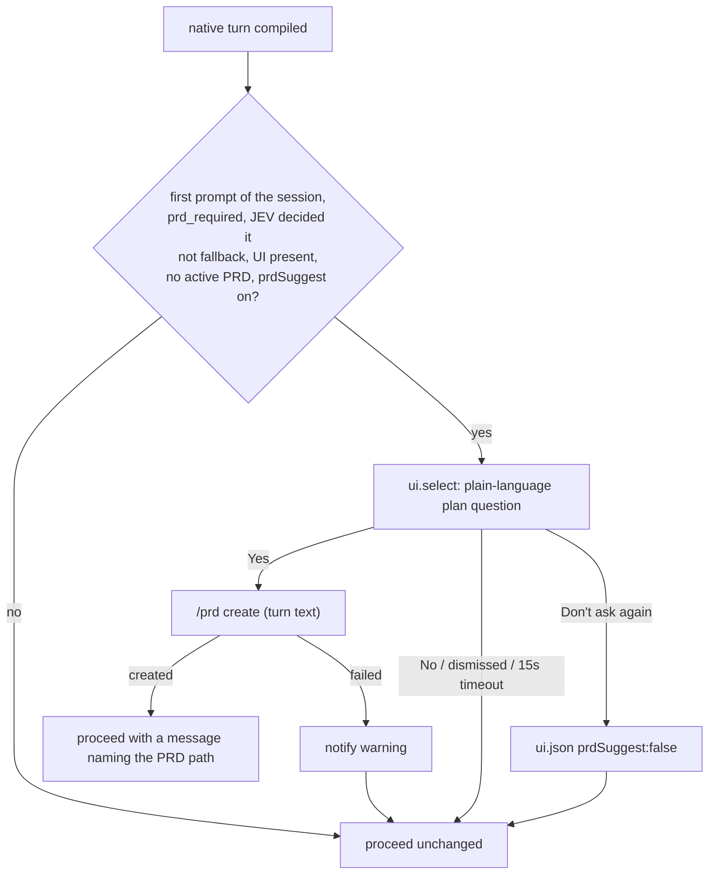

# PRD-044 — Suggest a PRD when JEV classifies a turn PRD_REQUIRED

**Closed:** 2026-09-22 at `8f2690f`, archived to `done/`.

**Status:** DONE — 2026-09-22. Every phase and acceptance box verified.
**Complexity:** 1 (LOW); risk override: none.
**Owner:** LeanPi maintainers
**Depends on:** None

## Context

On the shipped config every role is the native `opencode-go` backend, so
`ownsExecutionLoop` (`src/commands/turn-lanes.ts:193`) is false and the
executor/reviewer lanes are never registered. That is by design: Pi's own loop
is the executor, and a second one would run the turn twice. It stays.

The compiler lane still runs on every native turn (`before_agent_start`,
`src/index.ts:983`), including JEV's `gate.prd_required` site
(`src/compiler/gate.ts`). Its verdict, `contract.task.prd_required`, only
reaches the status line. The decision is paid for and then dropped; the user
never learns a task would have been better served by a PRD than a blind prompt.

`/prd create` already exists (`src/prd/commands.ts:65`), already defaults its
objective to the last turn's text, and already has an authoring model wired
(`src/index.ts:675`). Pi's UI exposes `ctx.ui.select(title, options)`.
User-scope prefs live in `~/.config/leanpi/ui.json` (`src/cli/ui-settings.ts`),
whose only writer (`setThinkingFold`) currently overwrites the whole file.

## Solution

In the native `before_agent_start` path, after `runLanes`:

- Only the session's **first** prompt asks. Pi appends the turn's user message
  after `before_agent_start`, so "no user message on the branch yet" is the
  test; a resumed session already has one and never asks.
- The dialog auto-dismisses after 15 s (Pi's `select` `timeout`), which reads
  as No, so an unattended turn is never held.
- "JEV decided it" = the compile record's `gate.prd_required` telemetry row has
  `fallback_used: false`. The heuristic fallback answers PRD_REQUIRED on any
  uncertainty, so without this check a JEV-less session would be asked on
  almost every turn.
- Yes proceeds by returning `message` from `before_agent_start` (Pi's
  `BeforeAgentStartEventResult`) that names the new PRD and tells the model to
  execute from it.
- `ui.json` writes merge keys, so `thinkingFold` and `prdSuggest` coexist.
- `/prd suggest [on|off]` is the only way back on; no arg prints the state.
- The owned (external-harness) path is unchanged: it already opens the PRD
  lane when a PRD exists.

## Acceptance Criteria

- [x] AC-1 [local; actor: agent]: A booted native session with a UI, whose turn JEV classifies PRD_REQUIRED, calls `ui.select` once with a plain-language question (\"…better with a plan… Want me to write one first?\") and `Yes, write a plan first` / `No, just do it` / `No, and don't ask again`; a DIRECT_EXECUTION turn, a heuristic-fallback PRD_REQUIRED turn, a session with an active PRD, and a session without UI never call it — Evidence: E2: `tests/prd/suggest-wiring.spec.ts` "asks once…", "never asks on a direct turn…", "does not ask when the gate fell back…" — booted session, stub JEV + stub backend + `ui.select` spy.
- [x] AC-2 [local; actor: agent]: `Yes` runs `/prd create` with the turn's text; on success a PRD file and state exist and the turn's request carries a message naming the PRD path; on authoring failure a warning is notified and the turn's request is unchanged — Evidence: E2: "Yes authors the PRD…" (PRD file + state exist; the turn request — the one carrying the session system prompt — contains the PRD id) and "Yes whose authoring fails…" (warning notified, turn request carries the prompt and no PRD note).
- [x] AC-3 [local; actor: agent]: Only the session's first prompt can ask: a later or resumed-session PRD_REQUIRED turn never does; `No`, dismissing, or the 15 s timeout proceeds unchanged — Evidence: E2: "never asks after the session's first prompt, e.g. mid-session or resumed" and "asks once…" (second prompt not asked). Red: with `firstPrompt()` forced true the first test fails `expected [ {…} ] to deeply equal []`.
- [x] AC-4 [local; actor: agent]: `No, don't ask again` writes `prdSuggest: false` to `ui.json` without dropping an existing `thinkingFold` key, and a fresh session does not ask — Evidence: E1 `tests/prd/suggest.spec.ts` "keeps the other key…" (red before: `setPrdSuggest` absent) + E2 "\"No, don't ask again\" persists…".
- [x] AC-5 [local; actor: agent]: `/prd suggest off|on` writes the pref and a fresh session asks again after `on`; `/prd suggest` prints the current state — Evidence: E1 "/prd suggest reports, turns off and back on" + E2 (dispatch `prd suggest on` → a fresh session asks again).
- [x] AC-6 [local; actor: agent]: `pnpm test`, `pnpm typecheck`, `pnpm lint` pass — Evidence: E3 on 8f2690f + working tree: `pnpm typecheck` exit 0; `pnpm lint` exit 0 (warnings only, none in changed files); `pnpm test` 150 files / 968 passed / 11 skipped, 0 failed.

## Integration Ledger

| Capability | Reachable consumer/trigger | Replaces / disposition | Evidence |
|---|---|---|---|
| PRD suggestion | first user prompt → Pi `before_agent_start` → `src/index.ts` handler (search `PRD-044`) → `ui.select` → `/prd create` | New; the status-line-only hint stays | AC-1..4 |
| Re-enable | `/prd suggest on` → `src/prd/commands.ts` → `ui.json` | New subcommand | AC-5 |

## Execution Phases

#### Phase 1: Pref + `/prd suggest`
**Status:** DONE
**ACs:** AC-4 (persistence half), AC-5
**Files:** `src/cli/ui-settings.ts` (merging writer, `prdSuggestEnabled`/`setPrdSuggest`), `src/prd/commands.ts` (`suggest` subcommand), `src/prd/dispatch.ts` (usage text, which `/help` prints).
**Implementation:** read-modify-write `ui.json`; unreadable file treated as `{}` on write only for keys we own. `suggest` without arg reports; `on|off` writes.
**Verification:** E1 — extend `tests/commands/thinking-fold.spec.ts`-style unit tests for merge (red first: current writer drops `thinkingFold`), plus `/prd suggest` dispatch through a booted session.
**Checkpoint:** self-review done (LOW); diff limited to the listed files.
- [x] Phase 1 implemented and verified — E1 (AC-4, AC-5).

#### Phase 2: Prompt in `before_agent_start`
**Status:** DONE
**ACs:** AC-1, AC-2, AC-3, AC-4, AC-6
**Files:** `src/index.ts` (suggestion step, first-prompt check, 15 s timeout).
**Implementation:** conditions in Solution; `commands.dispatch("prd create")` for Yes; return `{ systemPrompt?, message? }`.
**Verification:** E2 — `tests/wiring.spec.ts` booted session with `bindExtensions({ uiContext: { ...headlessUIContext(), select } })`, JEV stub answering the gate, stub backend authoring a valid PRD; asserts select calls, files, request message. Red before the handler change. Then E3 — `pnpm test && pnpm typecheck && pnpm lint`.
**Checkpoint:** self-review done (LOW); diff limited to the listed files.
- [x] Phase 2 implemented and verified — E2, E3 (AC-1, AC-2, AC-3, AC-4, AC-6).
