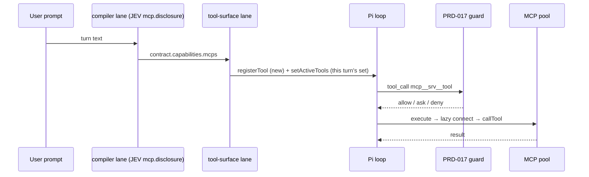

# PRD-045 — MCP tools the model can actually call, with JEV deciding which

**Status:** DONE (verified 2026-09-22)
**Complexity:** 3 → HIGH; risk override: security boundary — this puts new tools on the model's surface under PRD-017's guard, and hands MCP servers to vendor loops the guard cannot see.
**Owner:** LeanPi maintainers
**Depends on:** PRD-006 (MCP disclosure, done), PRD-017 (permission guard, done)

## Context

PRD-006 shipped MCP *disclosure*, not MCP *execution*. Every turn, JEV decides which
MCP tools the task needs, but nothing ever gives those tools to the model:

- `mcpCapabilityProvider` (`src/mcp/select.ts:371`) runs JEV's `mcp.disclosure` site
  inside `compileTask` and writes the admitted tools to `contract.capabilities.mcps`.
  The only thing that reads them is the prompt line `mcp <count>`
  (`src/executor/lane.ts:195`).
- `mcpToolDefinitions` (`src/mcp/tools.ts:38`), the documented "executor tool set's MCP
  half", has no caller. No MCP tool is ever passed to `pi.registerTool`.
- The connection pool (`createMcpPool`, owned by `/mcp`: `src/mcp/command.ts:44`,
  returned as `mcpRuntime` at `src/index.ts:519`) is only used by `/mcp refresh`.
- `requestCapability` (`src/mcp/select.ts:316`), the §17 mid-task router where JEV
  admits one more tool on request, has no caller.
- On external harnesses the Claude worker runs with `--strict-mcp-config` and no
  `--mcp-config` (`src/backends/harness.ts:186`); Codex and OpenCode get no MCP either.
- `writeMcpToken` / `clearMcpToken` exist for a `/mcp login` that PRD-006 deferred to
  §60 P1. They stay deferred (see Non-goals).

A sibling orphan on the same boundary: per-turn LSP tool activation (`applyLspTools`)
runs only in `runTurn` (`src/commands/session.ts:288`), the SDK path. The interactive
`before_agent_start` (`src/index.ts:989`) never applies the compiled LSP mode. Pi
auto-activates newly registered extension tools
(`pi-coding-agent/dist/core/agent-session.js:2559`), so in the TUI the LSP tools are on
whatever the contract compiled. §15 says "never on by default". Both fixes need the
same per-turn tool-surface step, so this PRD owns both.

Facts this design relies on (verified against the installed packages):
- `pi.registerTool` is valid after load and refreshes the registry
  (`extensions/loader.js:220-229`). `pi.setActiveTools(names)` exists
  (`extensions/types.d.ts:1074`).
- PRD-017's guard hooks Pi's `tool_call` event (`src/permissions/guard.ts:179`), so it
  sees runtime-registered tools too. `mcp__<server>__<tool>` already resolves to the
  `mcp` scope (`src/permissions/rules.ts:305`). The built-in default is `ask`.
- `claude --mcp-config <configs...>` accepts JSON files or strings. `codex -c key=value`
  overrides `config.toml`, whose MCP table is `mcp_servers.<name>`. `opencode run`
  exposes no per-run MCP flag; Phase 3 checks its config-file/env route against the
  installed CLI.

## Solution

**One tool-surface lane, both entry points.** A lane registered right after
`compiler` (so it runs inside `runLanes` on the interactive path *and* in `runTurn`)
turns the compiled contract into the turn's active tool set:

1. For each `contract.capabilities.mcps` tool not yet registered this session:
   `pi.registerTool(mcpToolDefinition(tool, mcpRuntime.pool))`. The session's
   registered set only grows.
2. `pi.setActiveTools`: the currently active names, minus every `mcp__*` and every
   LSP name, plus this turn's JEV-selected MCP names, plus the LSP names for
   `lspSelectionOf(contract).mode`. A turn with no contract gets no MCP and `LSP_OFF`.
3. `runTurn`'s direct `applyLspTools` call is removed. The lane replaces it; there is
   no second copy.

Connection stays lazy: `execute` is the only place the pool connects. Every call
passes through PRD-017's `tool_call` guard before `execute` runs, so a `deny` never
spawns a server and `ask` prompts.

**JEV decides availability.** At turn start, availability = `selectMcpTools`
(unchanged). With JEV off or unreachable it falls back to pinned and project-default
servers (§49, unchanged). Mid-turn, a small `mcp_request` tool
(`{ query }`) runs `requestCapability` against the live set. An admission is
registered and activated immediately, and an eviction is deactivated. The model can
ask for a capability, and only JEV (or the §49 lexical fallback) grants it.

**External harness.** The executor packet gains the selected servers (their catalog
entries, resolved through a resolver passed via `ExecutorDeps`). `runHarness` turns
them into vendor config: Claude gets `--mcp-config <json>` plus the
`mcp__<server>__<tool>` names added to `--allowedTools` (Claude uses the same naming).
Codex gets `-c mcp_servers.<name>.{command,args,env,url}`. OpenCode gets whatever
per-run route the installed CLI supports, or none, stated in the row. A vendor loop is
outside PRD-017's guard and cannot `ask`, so **only tools whose resolved decision is
`allow` are handed to a vendor**. `ask` and `deny` are withheld and recorded in the
executor's site rows.

**Non-goals.** `/mcp login` and the OAuth exchange (still §60 P1; the token helpers
stay as they are). Auto-refreshing a server's schema at startup: a server with no
cached schema stays unselectable until `/mcp refresh <server>`, which is PRD-006's
lazy-connect rule. `/mcp` already reports it.

## Acceptance Criteria

- [x] AC-1 [local; actor: agent]: A booted native session (`createLeanPiSession`) with a stub stdio MCP server whose schema is cached, and a stub JEV that selects `stub/echo`: the model's `mcp__stub__echo` call reaches the server and the server's text comes back as the tool result. The server process is spawned only at that call. — Evidence: `tests/mcp/execution.spec.ts` AC-1: booted `createLeanPiSession`; stub stdio server spawned 0→1 only at the call and its call log carries the echo.
- [x] AC-2 [local; actor: agent]: Same session, next turn, JEV selects nothing: `mcp__stub__echo` is not in the active tool set. A turn with no contract has no `mcp__*` and no LSP tool active. — Evidence: `tests/mcp/execution.spec.ts` AC-2: JEV selects nothing → no `mcp__*` and no `lsp_*` among the request's active tools; the baseline five intact.
- [x] AC-3 [local; actor: agent]: With `mcp` resolved to `deny`, the model's `mcp__stub__echo` call is blocked by the guard and the stub server is never spawned. — Evidence: `tests/mcp/execution.spec.ts` AC-3: `mcp: deny` → guard refusal in the tool result; marker absent and call log empty.
- [x] AC-4 [local; actor: agent]: With JEV disabled, only pinned or project-default servers' tools become active. A non-default server's tools stay off. — Evidence: `tests/mcp/execution.spec.ts` AC-4: JEV disabled → `mcp__stub__echo` active (pinned), `mcp__other__*` absent, nothing spawned.
- [x] AC-5 [local; actor: agent]: Interactive path (`before_agent_start`, no `runTurn`): a contract compiled with `LSP_OFF` leaves no LSP tool active, and one compiled with the diagnostics mode activates exactly that group. `runTurn` has no separate `applyLspTools` call left. — Evidence: `tests/mcp/execution.spec.ts` AC-5: `lsp: off` → no LSP tool active; `lsp: diagnostics` → exactly `lsp_diagnostics`, on both `before_agent_start` and `runTurn`; `runTurn` no longer calls `applyLspTools`.
- [x] AC-6 [local; actor: agent]: Mid-turn, the model calls `mcp_request { query }` with a stub JEV that admits `stub/other`: `mcp__stub__other` is callable in the same turn. With the live set full, the lowest-scored tool is deactivated. JEV answering `none` leaves the set unchanged, with a refusal message. — Evidence: `tests/mcp/execution.spec.ts` Phase 2: `mcp_request` admits `stub/other` in the same turn and evicts `stub/echo` at `maxTools: 1`; `capability: none` refuses and leaves the set unchanged.
- [x] AC-7 [local; actor: agent]: External harness with stub spawn: Claude's argv carries `--mcp-config` holding the allowed servers and their `mcp__` names in `--allowedTools`. Codex's argv carries the `mcp_servers.<name>` overrides. OpenCode's handling matches what the installed CLI supports, and a withheld server is named in a site row. — Evidence: `tests/backends/harness.spec.ts` Phase 3: Claude argv carries `--mcp-config` (JSON) and the `mcp__` name in `--allowedTools`; Codex carries `mcp_servers.stub.{command,args,env}`; OpenCode carries `OPENCODE_CONFIG_CONTENT` (verified against `opencode 1.18.31`, which exposes no per-run MCP flag).
- [x] AC-8 [local; actor: agent]: External harness: a selected tool whose resolved decision is `ask` or `deny` is not handed to any vendor and is recorded as withheld. Only `allow` reaches the argv. — Evidence: `tests/mcp/vendor.spec.ts`: only `mcp:stub/echo` (allow) travels; `mcp:stub/other` (ask) is withheld, the packet carries only the allowed server, and the outcome's `mcp.withheld` site row names it.
- [x] AC-9 [local; actor: agent]: `docs/usage.md` states how MCP servers become callable (config file → `/mcp refresh` → JEV selection per turn → permission decision), including the `allow`-only rule for vendor harnesses. — Evidence: `docs/usage.md` §MCP tools: config file → `/mcp refresh` → JEV per-turn selection → `mcp` permission decision, plus the `allow`-only rule for vendor harnesses.

## Integration Ledger

| Capability | Reachable consumer/trigger | Replaces / disposition | Evidence |
|---|---|---|---|
| Per-turn MCP tool surface (native) | User prompt → `before_agent_start` (`src/index.ts:989`) / `runTurn` (`src/commands/session.ts:248`) → `runLanes` → tool-surface lane | Wires the orphan `mcpToolDefinition(s)` (`src/mcp/tools.ts:19,38`) | AC-1, AC-2, AC-3, AC-4 |
| Per-turn LSP activation | Same lane | Replaces `runTurn`'s direct `applyLspTools` (`src/commands/session.ts:288`); interactive path gains it | AC-5 |
| Mid-turn capability request | Model tool call `mcp_request` → `requestCapability` (`src/mcp/select.ts:316`) | Wires the orphan router | AC-6 |
| MCP on external harness | Executor lane packet (`src/executor/lane.ts:347`) → `runHarness` argv (`src/backends/harness.ts:166,217,255`) | Replaces Claude's unconditional empty `--strict-mcp-config` | AC-7, AC-8 |

## Execution Phases

#### Phase 1: Native — JEV-selected MCP tools registered and callable per turn; LSP through the same step
**Status:** DONE (verified 2026-09-22)
**ACs:** AC-1, AC-2, AC-3, AC-4, AC-5
**Files:** `src/mcp/tools.ts` (the surface step: register-once plus the active-set computation), `src/commands/turn-lanes.ts` (register the lane after `compiler`), `src/index.ts` (hand the lane `pi` and `mcpRuntime.pool`), `src/commands/session.ts` (remove the direct `applyLspTools`).
**Implementation:** Lane as in Solution. The registered-name set is per activation, not module-global (a second activation must not inherit it). The active-set edit only touches `mcp__*` and LSP names, and never removes baseline, artifact or subagent tools. Test fixture: a tiny stdio MCP server script under `tests/fixtures/` answering `initialize`/`tools/list`/`tools/call`, plus a pre-written schema cache. It follows the same stub-JEV and stub-backend pattern as `tests/prd/suggest-wiring.spec.ts`.
**Verification:** E1 — one booted-session spec file driving AC-1 to AC-5 through the real entry points. Red first: AC-1 and AC-5 fail on the current tree (tool unknown to Pi; LSP tools active under `LSP_OFF`). Negative control for AC-1: assert the stub server's spawn counter goes 0 → 1 only at the call, so the result cannot come from a mocked `execute`. Then `pnpm test`, `pnpm typecheck`, `pnpm lint`.
**Checkpoint:** self-reviewed against the guard path (AC-3) and the baseline-tool preservation (the lane's active-set edit touches only `mcp__*` and LSP names); `pnpm test` (984 passed), `pnpm typecheck`, `pnpm lint` all green. The `prd-work-reviewer` pass was not run in this execution.

#### Phase 2: Mid-turn `mcp_request` — JEV admits a tool during the turn
**Status:** DONE (verified 2026-09-22)
**ACs:** AC-6
**Files:** `src/mcp/tools.ts` (the `mcp_request` tool definition), `src/index.ts` (register it once and share the lane's live set).
**Implementation:** The tool calls `requestCapability({ query, live, catalog: mcpRuntime.catalog(), client: jev, ... })`, then applies the admission or eviction through the same surface step as Phase 1. The result text names the admitted tool or the refusal. It is registered only when the catalog has at least one server, so a machine with no MCP config gains no extra tool.
**Verification:** E2 — extend E1's spec: admit, evict at `maxTools`, and `none`. Red first on the current tree (tool absent).
**Checkpoint:** self-reviewed against E2 (admit, evict at `maxTools`, `none`); the surface step did not change between Phase 1 and Phase 2. The `prd-work-reviewer` pass was not run in this execution.

#### Phase 3: External harness — the selected, `allow`-resolved servers reach the vendor CLI
**Status:** DONE (verified 2026-09-22)
**ACs:** AC-7, AC-8, AC-9
**Files:** `src/backends/worker.ts` (packet field for MCP servers), `src/executor/lane.ts` (fill it from `contract.capabilities.mcps` via an `ExecutorDeps` resolver, after the permission filter), `src/commands/turn-lanes.ts` (pass the resolver), `src/backends/harness.ts` (per-vendor argv), `docs/usage.md`.
**Implementation:** Resolve each selected tool's decision with PRD-017's `resolve` for `mcp:<server>/<tool>`, keep `allow`, and record the rest as `mcp.withheld` site rows. Claude: an inline JSON `--mcp-config`, keeping `--strict-mcp-config` so only LeanPi's selection loads. Codex: one `-c` per field. OpenCode: check `opencode` against the installed CLI (config file via env, or none) and implement what it supports. Secrets in a server's `env` travel only in the child's argv/env, never in telemetry or decision rows.
**Verification:** E3 — extend the harness spec's stub spawn: argv per vendor (AC-7), and `ask`/`deny` withheld (AC-8). Red first on the current tree. AC-9: read the section back and check its commands against `/mcp`'s usage string. Then `pnpm test`, `pnpm typecheck`, `pnpm lint`.
**Checkpoint:** self-reviewed against the `allow`-only rule and secret handling (server `env` reaches only the child's argv/env; site rows carry capability and decision, never a value); `pnpm test`, `pnpm typecheck`, `pnpm lint` green. The `prd-work-reviewer` pass was not run in this execution.
