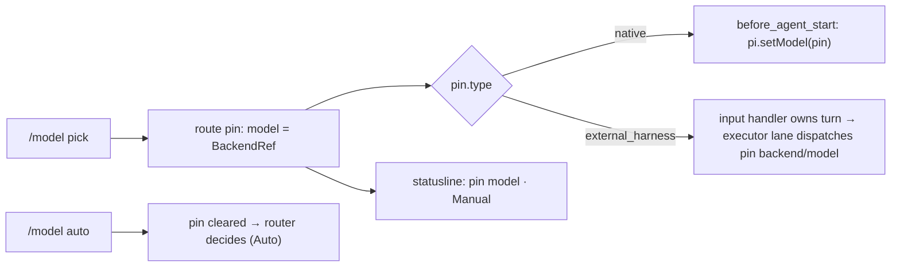

# PRD-048 — `/model` picks the model in use; `/role` binds roles

**Status:** DONE
**Complexity:** 4 (MEDIUM)
**Owner:** Joao
**Depends on:** None

## Context

Picking a model in `/model` does not change the model that runs. Traced on 2026-09-22:

1. `/model` (`src/commands/model.ts` `applyBinding`) binds the pick to a **role** (writes `config.models[role]` + a capability pin). The router still chooses the executor role per turn, so the pick only lands on turns routed to that role.
2. With the operator's config (`quick`/`balanced` native opencode-go, `strong` claude CLI) `ownsExecutionLoop(config)` is false, so Pi's own loop runs every turn. `before_agent_start` (`src/index.ts:1061-1073`) installs the routed model only if it is in Pi's registry; a Claude/Codex CLI model never is, so the turn silently runs on Pi's session model.
3. `/model`'s inventory is CLI-only (`discoverInventory`), so on this config no pick can ever take effect.
4. `surface.bindings` is display-only (`/model`, `/status`).

The operator wants `/model` to mean "the model being used now" (switching the footer from Auto to Manual) and role binding to live in its own `/role` command.

Decisions (operator, 2026-09-22):
- A CLI model picked while the config is native hands the turn to LeanPi's executor lane (the vendor CLI).
- `/model` lists native models (config's native backends) and CLI models.
- Manual mode is session-scoped: `/model auto`, `/new`, `/resume`, `/route reset` return to Auto. Nothing is written to `leanpi.config.yaml`.

## Solution

- **Pin:** add `model?: BackendRef` to `RoutePins` (`src/compiler/pins.ts`). Reuses the session-owner and clearing semantics `/route` already has.
- **Ownership per turn:** new `ownsTurn(config)` in `src/commands/turn-lanes.ts` = `ownsExecutionLoop(config) || routePins().model?.type === "external_harness"`. The `input` handler (`src/index.ts:940`) and `before_agent_start` (`:1061`) use it. The executor lane is registered always and its `run` returns early unless `ownsTurn` — so a native config without a pin behaves exactly as today (no double execution).
- **Executor:** in `src/executor/lane.ts`, a model pin replaces `selectRoute`'s pick: routed identity = pin, every other backend excluded. If the pin's backend is not in the lane's `BackendRegistry` pool (discovered vendor absent from config), the lane rebuilds its registry from the live config before dispatch.
- **Native pin:** `before_agent_start` calls `pi.setModel` with the pinned native model instead of the routed role's model.
- **Statusline:** with a pin, the footer names the pinned model and `Manual`; without one, the routed model and `Auto` (role capability pins no longer decide Auto/Manual).
- **`/model`:** picker = providers (native backends + discovered CLI vendors) → models; `enter` pins, no role step. An `auto` row returns to Auto. Text forms: `/model <backend>:<model>`, `/model auto`; with no UI, `/model` prints the current mode + inventory. `/model use …` is removed.
- **`/role`:** new command owning today's behavior: the picker with the role pane, `/role <role> <backend>:<model>` (persists via `writeRoleBinding`), and the role listing (`renderModels`) with no UI. Registered in `OWNED_COMMANDS`.

Risk: pool rebuild drops cooldown state — only happens when a new backend appears, acceptable.

## Acceptance Criteria

- [x] AC-1 [local; actor: agent]: `/model claude:sonnet` on a native config pins it; the next interactive turn is handled by the executor lane, which dispatches backend `claude`, model `sonnet`; Pi's loop does not also run. — Evidence: `tests/commands/manual-mode.spec.ts` (ownsTurn true, packet model `sonnet`, backend `claude`).
- [x] AC-2 [local; actor: agent]: `/model <native backend>:<model>` makes `before_agent_start` call `pi.setModel` with that model regardless of the routed class. — Evidence: `tests/wiring.spec.ts` "installs a native `/model` pin ahead of the routed class".
- [x] AC-3 [local; actor: agent]: footer shows `Manual` + pinned model while pinned; `/model auto` (and `/route reset`) returns it to `Auto`. — Evidence: `tests/cli-bootstrap.spec.ts` status-line pin case; `tests/commands/model-bind.spec.ts` `/model auto`.
- [x] AC-4 [local; actor: agent]: `/model` picker lists native and CLI providers and pins on enter with no role step; `/model use` is gone. — Evidence: `tests/cli/model-picker.spec.ts` model mode; `tests/commands/model-bind.spec.ts`.
- [x] AC-5 [local; actor: agent]: `/role strong codex:<model>` binds and persists the role (existing PRD-030 behavior, moved); `/role` picker keeps the role pane. — Evidence: `tests/commands/model-bind.spec.ts` `/role` cases.
- [x] AC-6 [local; actor: agent]: native config with no pin: executor lane does not run, turn path unchanged; `pnpm test`, `pnpm typecheck`, `pnpm lint` green. — Evidence: `tests/commands/manual-mode.spec.ts` AC-6; `pnpm typecheck`/`pnpm lint` clean, suite green except the pre-existing `tests/config.spec.ts` role-ladder failures caused by the operator's uncommitted root `leanpi.config.yaml` (walks up into the test cwd; unrelated to this PRD).

## Integration Ledger

| Capability | Reachable consumer/trigger | Replaces / disposition | Evidence |
|---|---|---|---|
| Manual model | `/model` → pins → `input`/`before_agent_start` in `src/index.ts` → executor lane / `pi.setModel` | `/model` role binding moves to `/role` | AC-1, AC-2 |
| Role binding | `/role` command | `/model use` deleted | AC-5 |
| Auto/Manual footer | `statusLine` in `src/cli/statusline.ts` | role capability-pin signal replaced | AC-3 |

## Execution Phases

#### Phase 1: Manual pin reaches the turn
**Status:** DONE
**ACs:** AC-1, AC-2, AC-3, AC-6
**Files:** `src/compiler/pins.ts`, `src/commands/turn-lanes.ts`, `src/index.ts`, `src/executor/lane.ts`, `src/cli/statusline.ts`
**Implementation:** as Solution. Red first: tests for AC-1/2/3 fail before the change.
**Verification:** E1 — focused vitest files for the new tests, red then green.
**Checkpoint:** done

#### Phase 2: `/model` and `/role` split
**Status:** DONE
**ACs:** AC-4, AC-5, AC-6
**Files:** `src/commands/model.ts`, `src/commands/role.ts` (new), `src/cli/model-picker.ts`, `src/commands/index.ts`, `tests/commands/model-bind.spec.ts`, `tests/cli/model-picker.spec.ts`
**Implementation:** as Solution. Move PRD-030 binding tests to `/role`.
**Verification:** E2 — focused vitest red → green; then `pnpm test && pnpm typecheck && pnpm lint`.
**Checkpoint:** done
