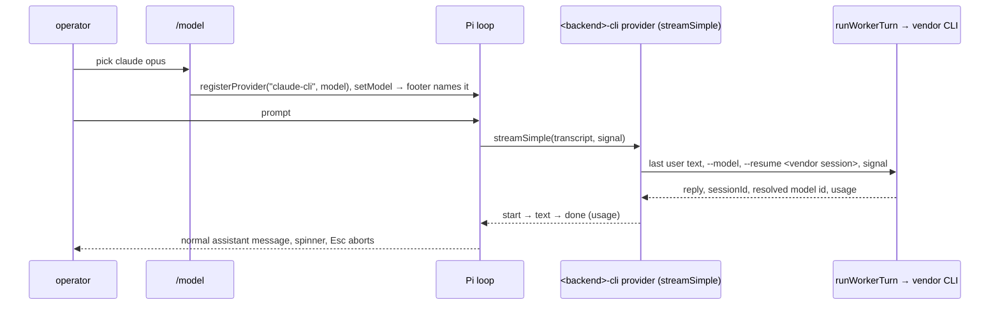

# PRD-051 — A CLI pin runs through Pi's own loop

**Closed:** 2026-09-23 at `b117f66`, archived to `done/`.

**Status:** DONE — 2026-09-23. Every phase and acceptance box verified.
**Complexity:** 5 (MEDIUM)
**Owner:** Joao
**Depends on:** PRD-048

## Context

PRD-048 made `/model` pin a model (Manual). A **native** pin runs in Pi's own loop:
`before_agent_start` (`src/index.ts` ~L760) does `modelRegistry.find(pin.backend, pin.model)` →
`pi.setModel`. A **CLI** pin (claude/codex/opencode vendor CLI) can't go that way: Pi's registry has
no such model. So LeanPi takes the turn from the `input` hook (`ownsTurn()` →
`runManualTurn()` in `src/commands/turn-lanes.ts`, `action: "handled"`). Pi's loop then never runs, and
the operator sees (2026-09-23 screenshots):

1. Pi's footer still names Pi's previous model (`deepseek-v4.1-flash • medium`, `0.0%/1.0M`). Pi draws
   that slot from `session.state.model` only (`components/footer.js` L157); no extension call edits it.
2. No streaming turn: the reply was a muted `notify`. A stopgap (`src/cli/manual-chat.ts`, uncommitted)
   redraws prompt/loader/reply as custom entries, but the reply is not in the transcript, so
   `/model auto` forgets the Manual conversation. Esc can't stop the turn, and context % is meaningless.
3. The footer says `opus`, not a version. Claude's CLI has no model-list command, so discovery
   (`src/cli/allocate.ts` `claudeModels`) lists the aliases `opus|sonnet|haiku` and never guesses a
   full id.

Decision (operator, 2026-09-23): register each vendor CLI as a real Pi provider whose stream runs the
CLI ("CLI as Pi provider"). Operator's suggestion: show model ids such as `claude-opus-5-5` in the picker.

Facts checked:
- Pi's `ProviderConfig.streamSimple` implements a custom wire protocol (`docs/custom-provider.md`):
  `start` → text events → exactly one `done`/`error`; aborts become `aborted`.
  `createAssistantMessageEventStream` comes from `@earendil-works/pi-ai`.
- Pi ships built-in providers `opencode` and `opencode-go`, and a discovered opencode CLI pins as backend
  `opencode`. So a CLI provider needs its own name: `<backend>-cli`.
- `claude -p --output-format json` returns `modelUsage: { "<full id>": { contextWindow, … } }` and
  `usage` (checked: `--model haiku` → `claude-haiku-4-5-20251001`, contextWindow 200000).
- `spawnProcess` (`src/backends/harness.ts`) takes no abort signal: only the timeout kills the child.

## Solution

- New `src/backends/cli-provider.ts`:
  - `cliProviderName(backend)` → `${backend}-cli`.
  - `registerCliModel(pi, deps, pin)` registers the provider with one model: id = pin model,
    `reasoning: false`, text input, contextWindow = learned value else 200 000, zero cost.
  - `streamSimple` runs `runWorkerTurn` for the pinned backend (other backends excluded). The objective
    is the last user message's text. It resumes `routePins().manualSessionId`, passes `options.signal`,
    and maps outcome and usage onto the stream. Pi's tool declarations are ignored: the CLI uses its own
    tools, as today.
- `/model` (`src/commands/model.ts`): a CLI pick registers the model, then `footer.setModel(cliProviderName(backend), model)`,
  exactly like a native pick. `restoreRememberedModel` gains the same registration at startup.
  `before_agent_start` looks the pin up under `cliProviderName` for an `external_harness` pin.
- Removed: `ownsTurn`'s pin clause (the `input` hook stays out of the way under a pin),
  `runManualTurn`, `src/cli/manual-chat.ts` and its `index.ts` wiring, and the executor lane's pin
  branch. A CLI pin on an all-CLI config also leaves the turn to Pi's loop.
- Abort: `HarnessSpawnRequest.signal` → `terminate()` on abort; threaded through `runWorkerTurn`.
- Version: the claude parser returns every `modelUsage` entry. The provider takes the entry that
  equals the asked name, or the one entry whose id contains the alias (`opus` → `claude-opus-5-5`).
  It never takes the busiest entry, because a subagent on a helper model can out-write the main loop.
  It learns only aliases. Usage is the last `usage.iterations` entry (the live context), not the
  run's sum, which would make Pi auto-compact. The provider saves `alias → full id` in `~/.leanpi/model-ids.json`.
  Discovery lists the learned full id instead of the alias. After a turn that resolved an alias, the
  pin is re-registered under the full id (at `agent_end`), so the footer changes from `opus` to
  `claude-opus-5-5`.

Risks: Pi may call the provider outside a prompt (`/compact`, retries). The stream handles any
transcript the same way: it answers the last user text. Pi's auth check needs an `apiKey`, so a
literal placeholder is passed; the CLI authenticates itself.

## Acceptance Criteria

- [x] AC-1 [local; actor: agent]: Under a CLI pin, a prompt goes through Pi's loop: the `input` hook does not handle it; the `<backend>-cli` stream answers with the CLI's reply as a `done` assistant message; the second turn resumes the first turn's vendor session — E1: `pnpm vitest run tests/commands/manual-mode.spec.ts` 20/20 (uncommitted tree on b117f66), test "AC-1/AC-2: `/model` makes the CLI model Pi's model…" — real `activate`, stub `claude` script through real spawn/parse; asserts `input` → undefined, stream `stop` + "Hi there!", argv `--model sonnet`, 2nd call `--resume vendor-session-1`.
- [x] AC-2 [local; actor: agent]: `/model` on a CLI model switches Pi's model to `<backend>-cli/<model>` (the footer's model slot), a remembered CLI pin does the same at startup, and `/model auto` restores the pre-Manual model — E1, same test + "AC-2: a remembered CLI pin is registered at activation and installed on session_start".
- [x] AC-3 [local; actor: agent]: Aborting the stream kills the vendor process and ends the stream `aborted` — E1 "AC-3…" (stub sleeps 30 s, abort at 300 ms, <10 s). Red: with `harness.ts`/`registry.ts` stashed the test times out at 30 s.
- [x] AC-4 [local; actor: agent]: The stopgap path is gone: no `manual-chat.ts`, no `runManualTurn`, `ownsTurn` ignores pins; a native pin and Auto behave as before (existing manual-mode/extension-surface specs green) — E1 + `pnpm test`: 1058 passed, 2 failed only in `tests/config.spec.ts`, caused by the operator's local `leanpi.config.yaml` edit (22/22 with it stashed); `pnpm typecheck` clean; `pnpm lint` no new warnings. `grep -rn "manual-chat\|runManualTurn" src docs tests` → none.
- [x] AC-5 [local; actor: agent]: A claude turn pinned to `opus` records `opus → <full id>`; the picker then lists the full id, and the running pin/footer changes to it — E2: test "AC-5…" (stub `modelUsage` with a helper model; asserts usage reaches the message, `agent_end` re-pins to `claude-sonnet-5`, `detectModels` lists it and not `sonnet`). Red: with `harness.ts` stashed, usage stays 0.
- [x] AC-6 [local; actor: agent]: Live: `leanpi` in tmux, `/model` → claude opus, prompt "say ok" → reply shown as a normal assistant message, footer model slot `claude-opus-…`, no `LeanPi:` phase line — E3 (2026-09-23, tmux 110×40, `pnpm link:bin`): `/model claude:opus` → footer `(claude-cli) opus`, `0.0%/200k`; "reply with just the word ok" → User box + `● ok`, footer `↑2 ↓4 R19k W10k … 2.9%/1.0M (claude-cli) claude-opus-5-5`, line `claude-opus-5-5 · Manual`; 2nd turn "what word did you just reply with?" → `ok` (vendor session resumed); `/model` → claude pane lists `claude-opus-5-5  claude alias opus`. Re-run after the review fixes: `/model claude:opus` (a typed alias) pins `claude-opus-5-5` at once (1.0M window); a multi-tool turn ("wc -l" of 3 files) → footer `R29k … 3.0%/1.0M`, the last call's context, not a sum.

## Integration Ledger

| Capability | Reachable consumer/trigger | Replaces / disposition | Evidence |
|---|---|---|---|
| CLI model as Pi model | `/model` pick → `pinModel` → `registerCliModel` + `pi.setModel`; turn → `before_agent_start` → Pi loop → `streamSimple` | Replaces the `input`-hook `runManualTurn` path (deleted) | AC-1, AC-2, AC-6 |
| Abort | Esc → Pi aborts → `options.signal` → `spawnProcess` terminate | New | AC-3 |
| Resolved model id | claude envelope `modelUsage` → `~/.leanpi/model-ids.json` → `claudeModels` discovery + re-pin | Replaces alias-only listing | AC-5 |

## Execution Phases

#### Phase 1: CLI pin runs as a Pi provider
**Status:** DONE
**ACs:** AC-1, AC-2, AC-3, AC-4
- [x] CLI provider + `/model`/startup/`before_agent_start` wiring (AC-1, AC-2)
- [x] Abort through spawn → harness → worker (AC-3)
- [x] Stopgap and executor pin path removed (AC-4)
**Files:** `src/backends/cli-provider.ts` (new), `src/backends/harness.ts` + `src/backends/registry.ts` (signal), `src/commands/model.ts`, `src/index.ts`, `src/commands/turn-lanes.ts`; delete `src/cli/manual-chat.ts`.
**Implementation:** as Solution; errors → `error` event with the attempts' reasons; blocked → error.
**Verification:** E1 — `tests/commands/manual-mode.spec.ts`: drive real `activate` + `/model` + the registered provider's `streamSimple` with a stub vendor script (reply, resume, abort). Then `pnpm test`, `pnpm typecheck`, `pnpm lint`.
**Checkpoint:** PASS after corrections — prd-work-reviewer: NEEDS CORRECTION. Fixed: (1) the id was learned from the busiest `modelUsage` entry → alias-matched `resolvedModel`; (2) run-summed usage → last iteration; (3) a restored pin kept no `previousModel` → saved on `session_start`; (4) the re-pin now rewrites `model.json` and awaits `setModel`; (5) a vendor session is kept even when Esc lands after the run finishes; (6) stale comments and unused test stubs removed. Red/green: reverting (1), (2) or (3) one at a time fails the AC-5/AC-2 tests (`claude-haiku…` pinned, usage `{input: 20…}`, `previousModel` undefined). Re-gates: 20/20 manual-mode, `pnpm test` 1058 passed (only the 2 known config.spec failures), typecheck clean, no new lint warnings.

#### Phase 2: Resolved ids + live check
**Status:** DONE
**ACs:** AC-5, AC-6
- [x] Resolved ids learned and listed; pin re-pinned (AC-5)
- [x] Live tmux check (AC-6)
**Files:** `src/backends/harness.ts` (modelUsage), `src/backends/cli-provider.ts` (learn + re-pin), `src/cli/allocate.ts` (discovery), `docs/systems/model-modes.md`.
**Implementation:** as Solution.
**Verification:** E2 — spec on a real claude-shaped JSON fixture → learned map → `detectModels` lists full id. E3 — tmux live run of `leanpi` (`pnpm link:bin`) with `capture-pane`.
Also fixed in the `/model` audit: the picker's `auto` row showed "No matching commands" in the models pane; it now reads "the router picks the model per turn" (`tests/cli/model-picker.spec.ts`, red/green).
**Checkpoint:** PASS, covered by the Phase 1 review and corrections above.
