# LeanPi — architecture

**Scope:** the `src/` tree as it runs today. This document describes what the
code *does*; [`docs/PRDs/v1/ROADMAP.md`](../PRDs/v1/ROADMAP.md) describes what it
was asked to do, and [`INDEX.md`](../PRDs/v1/INDEX.md) maps each roadmap section
to the PRD that owns it and the module that implements it. Where the two
disagree, the code is the fact and the disagreement belongs in a PR.

LeanPi is one Pi extension with one objective:

> minimize effective cost per **verified** successful coding task, at the
> completion quality a leading harness delivers.

It gets there by moving work out of the premium model's context. Five ideas:
the **task compiler** whose contract is the executor's only input (§5), the
**routing** that prices a turn before it runs (§6), **progressive capability
disclosure** (§8), separate **executor and reviewer lanes** (§5, §9), and
**evidence-driven completion** — deterministic verification plus a proof gate
(§9). §7 is the decision service all of them ask; §10 is the machinery
underneath.

---

## 1. System context

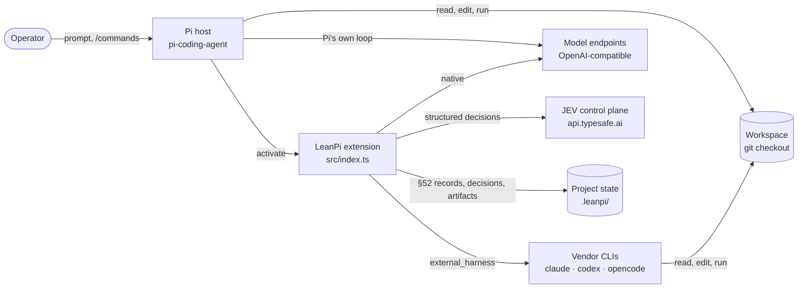

LeanPi never embeds a model and never writes a vendor credential. Every model
call goes either through Pi's provider registry or through a vendor CLI the
operator already signed into. JEV receives the questions and the state the site
declares — the privacy mode decides how much detail leaves the machine — and
§49's mandatory per-site fallback means an unreachable JEV is a slower harness,
not a broken one.

## 2. Module map

Seven planes, and the dependency arrows are the ones that actually exist in the
import graph.

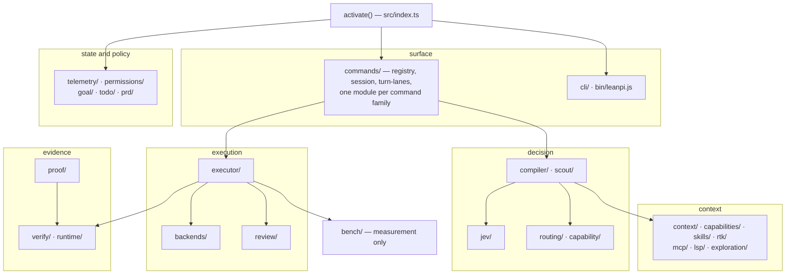

| Plane | Modules | Entry symbols | Spec |
| --- | --- | --- | --- |
| boot and surface | `index.ts`, `commands/`, `cli/`, `leanpi.ts` | `activate()`, `runTurn()`, `runLanes()` | PRD-001, 016 |
| decision | `jev/`, `compiler/`, `routing/`, `capability/`, `scout/` | `compileTask()`, `selectRoute()`, `ask()` | PRD-002, 003, 004, 020, 024 |
| execution | `executor/`, `backends/`, `review/` | `runExecutor()`, `runWorkerTurn()`, `classifyReview()` | PRD-007, 008, 011 |
| evidence | `verify/`, `proof/`, `runtime/` | `verifyTask()`, `evaluateProofGate()`, `recover()` | PRD-009, 010, 022 |
| context | `context/`, `capabilities/`, `mcp/`, `lsp/`, `exploration/`, `rtk/`, `skills/` | `assemble()`, `selectSkills()`, `explore()` | PRD-005, 006, 014, 018, 019, 023, 026 |
| state and policy | `telemetry/`, `permissions/`, `goal/`, `todo/`, `prd/` | `emitRunTelemetry()`, `installPermissionGuard()`, `evaluateGoal()` | PRD-013, 015, 017, 025, 012 |
| measurement | `bench/` | `src/bench/lane.ts`, `bench/cli.ts` | PRD-021 |

`src/index.ts` is both the activation hub **and** a re-export barrel for all
sixteen trees above — it exports what it wires. The barrel is why an import
graph alone cannot tell you what runs; §4 is the accurate answer, not the
exports.

## 3. Boot: from `leanpi` to a live session

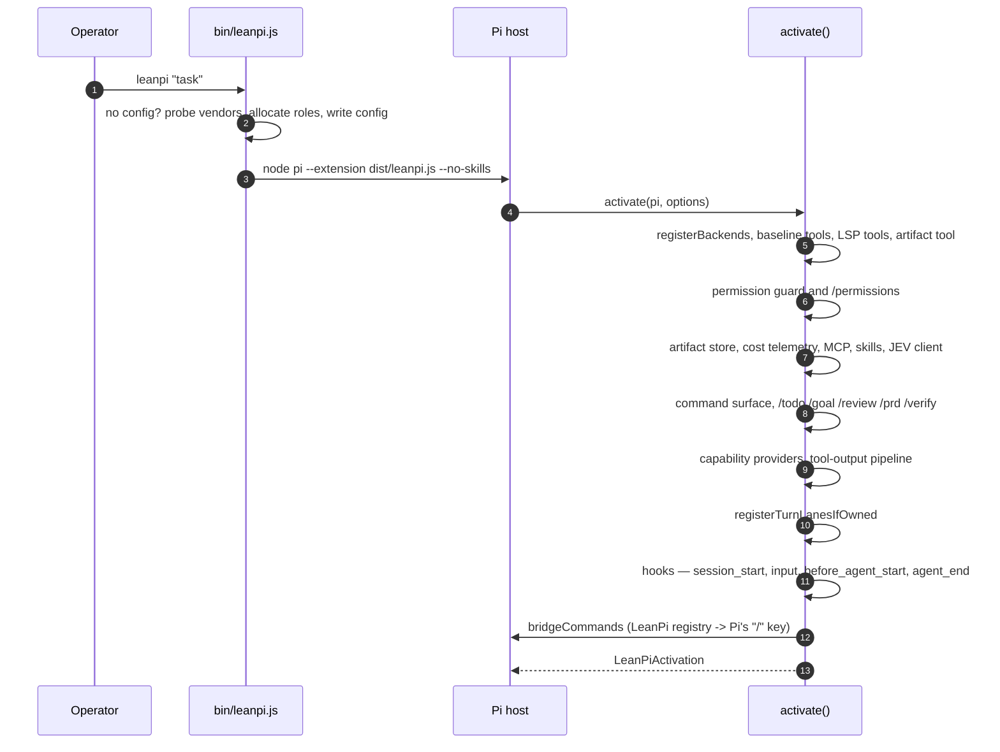

`bin/leanpi.js` → `src/cli/launch.ts` builds the Pi argv; the extension is
`src/leanpi.ts` (a rename so Pi reports `leanpi`, not `dist`). Everything else
happens in `activate()` (`src/index.ts`), which:

1. resolves `cwd` (`LEANPI_CWD` override) and loads `leanpi.config.yaml`
   (`loadConfig`), refusing to start without model roles;
2. registers one Pi provider per `native` backend, the baseline tools, and the
   seven LSP tools (registered once, inactive until a turn's compiled mode
   exposes a group);
3. installs the permission guard — **after** the baseline tools, so the guarded
   `execute` wins the name — and the artifact store keyed off the session id;
4. builds one JEV client per process and hands it to the compiler by reference
   (`setCompilerContext`); `--no-jev` sets mode `disabled`, which is the mode
   every site already resolves a fallback for;
5. registers the skill registry, the command surface, the capability providers
   (`skills`, `mcps`, `lsp`) and the tool-output pipeline (artifact capture
   plus the RTK reducer);
6. registers the PRD-owned commands and the turn lanes, then bridges its own
   registry onto Pi's `/` key — command output goes to `ui.notify`, never
   `sendMessage`, so no command output enters the model's context.

Re-entering `activate()` in one process replaces rather than stacks: owned
commands, owned lanes and capability providers all follow the same
replace-not-stack rule, because the bench boots a session per task.

## 4. The two runtime paths

The single most consequential branch in the codebase is
`ownsExecutionLoop(config)` (`src/commands/turn-lanes.ts`): it is true only when
**all** of `quick`, `balanced` and `strong` resolve to an *enabled*
`external_harness` backend.

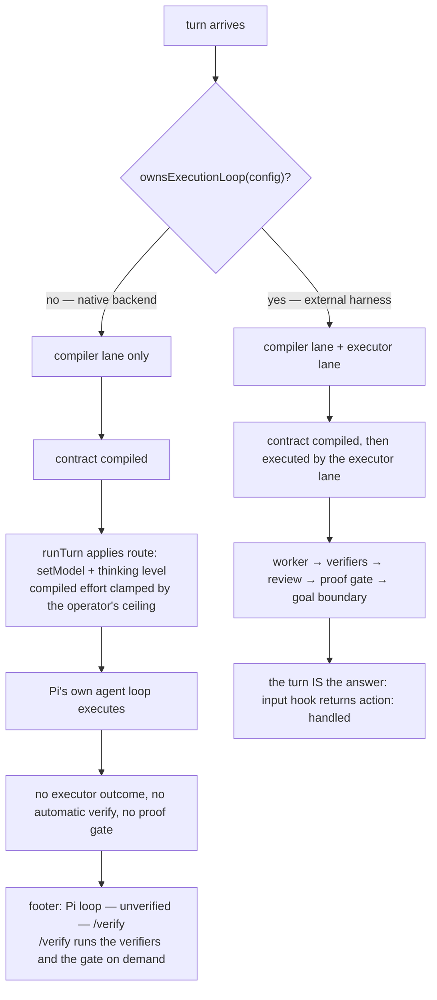

The compiler lane runs on **both** paths — the decision of who executes is
separate from who decides. What differs:

| | native backend | external harness |
| --- | --- | --- |
| executor | Pi's own loop | `runExecutor` → vendor CLI |
| routing effect | `setModel` + `setThinkingLevel` on the session, clamped by `backends.<name>.thinkingLevel` | model and effort pinned on the worker packet |
| deterministic verification | only via `/verify` | automatic, inside `runExecutor` |
| proof gate, review ladder, goal boundary | not run | run, on the turn's evidence |
| the answer | Pi's assistant message | the lane's outcome, returned as `action: "handled"` |

The native path is therefore the *degraded* path by design, and the status line
says so rather than implying evidence that was never collected.

The two hooks that drive this (`src/index.ts`):

- `input` — when LeanPi owns the loop, runs the lanes and returns
  `{ action: "handled" }` so Pi does not answer the same prompt a second time
  with a second model;
- `before_agent_start` — every other case: runs the lanes, applies the compiled
  route to the session, strips Pi's own skill catalog from the system prompt
  (`withoutSkillCatalog`), and arms `pendingRun` so `agent_end` can write one
  telemetry record for the loop Pi is about to run.

The programmatic path (`createLeanPiSession()` → `runTurn()`) goes through
`runLanes` directly and applies the same compiled model and thinking level.

## 5. Turn lifecycle

### 5.1 External harness

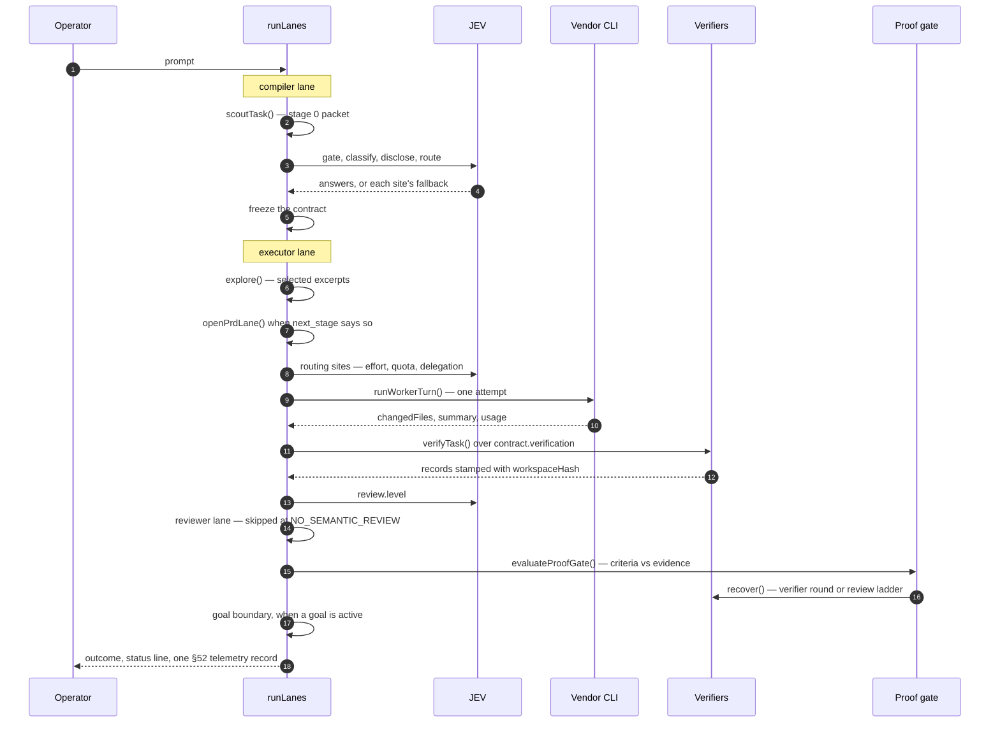

On a failed attempt the loop does not simply retry: `nextAttempt()` decides from
the retry history, `classifyFailure()` names the category, `retryUseful()` says
whether another attempt could change anything, and escalation moves role or
backend — all bounded by `limits.execution_attempts` and `limits.max_escalations`.
A reviewer verdict that is not `PASS` is bounded separately by
`limits.semantic_review_rounds`, which is why the reviewer gate and the verifier
retry ladder cannot drain each other's budget.

### 5.2 The contract

`ExecutionContract` (`src/compiler/contract.ts`) is the only thing the executor
is allowed to read, and the only thing a reviewer is told about the task.

| Field | Holds |
| --- | --- |
| `task` | type, `planning_decision` (PRD_REQUIRED / DIRECT_EXECUTION / UNCERTAIN), `execution_complexity` (LOW/MEDIUM/HIGH), `review_risk` (R0–R3), `required_capability` (coding-index floor + optional specialization), the request verbatim, the objective, `acceptance_criteria[]` |
| `routing` | `executor_class` (quick/balanced/strong/specialist), `reviewer_class` (none/review_quick/review_strong), `deviation` when the matrix default was left |
| `reasoning` | `effort` — low/medium/high |
| `capabilities` | `skills[]`, `mcps[]`, `lsp` flag, `rtk` mode — the disclosure decision, frozen |
| `context` | `strategy` (targeted/broad), `budget_tokens` |
| `verification` | `required[]` verifier kinds, plus per-criterion attribution (kind + scope) when the compiler can name a surface |
| `limits` | `execution_attempts`, `max_escalations`, `semantic_review_rounds`, `isolation` (none/worktree) |

The compiler pipeline (`src/compiler/index.ts` → `compileTask`):

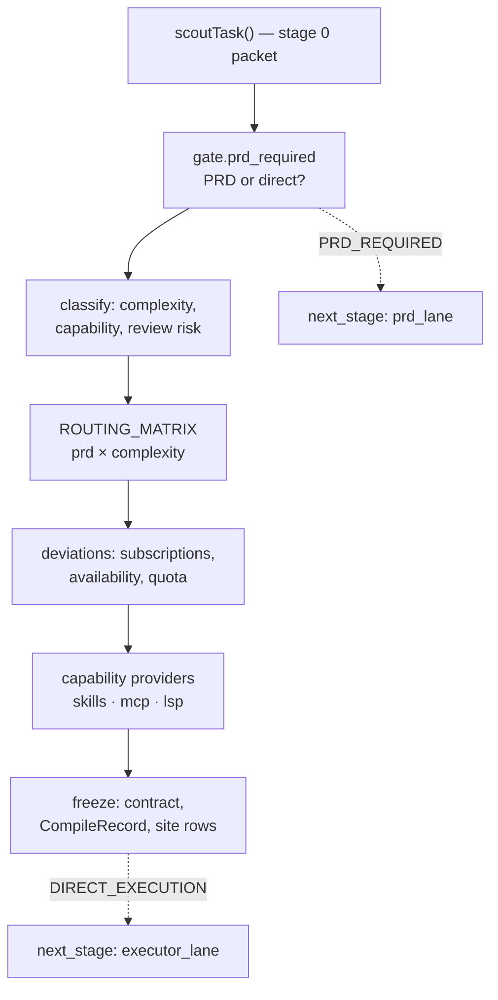

Nothing in that chain asks a model to read the repository: the packet is
deterministic, the matrix is arithmetic, and the only generative calls are the
JEV sites — which answer from the request, the packet and the telemetry.

## 6. Routing and roles

Six logical roles — `quick`, `balanced`, `strong`, `specialist`, `review_quick`,
`review_strong` — are what the config binds. A role resolves to a concrete
(backend, model) pair, never the other way round, and two mechanisms resolve it:

- **the capability index** (`src/capability/models.json`): per model a
  `coding_score`, `specializations`, a 3:1 blended price, a speed tier and an
  `evidence` flag saying whether the score was measured or estimated. A role's
  floor (`quick` 50, `balanced` 70, `strong`/`review_strong` 85) filters the
  index, the cheapest clearing candidate wins, and a role nothing clears reports
  a capability gap rather than silently downgrading. A configured `pin` wins
  unconditionally — and reports its shortfall instead of being swapped;
- **the per-role fallback chain** (`src/core/roles.ts`), walked when the ranking
  cannot answer — the model is unbound, or its backend is disabled.

Routing happens once per turn, in the executor lane, before the first worker
call: `selectRoute()` ranks the candidates that clear the floor, then
`predictRouteCost()` scores each one.

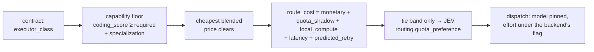

The five terms are a pre-dispatch *estimate*; the §52 record's `effective_cost`
is the measured value, and the two are never summed. What makes this cost-aware
rather than merely price-aware:

- **quota shadow pricing** (§26) — a subscription call costs no dollars but
  consumes scarce quota, so its class carries a configured shadow price;
- **predicted retry** — the bucket's calibrated retry rate multiplies the other
  terms, so a model that fails often costs more than its rate card says;
- **effort before pricing** — a higher reasoning effort raises predicted token
  counts before they are priced, so effort has to justify itself in money;
- **calibration** — the token, latency and retry statistics come from recorded
  telemetry, not from the rate card alone.

Model selection is arithmetic and deliberately **not** a JEV site. JEV reaches
routing in three narrow places: `routing.reasoning_effort` (the effort the turn
is compiled with), `routing.quota_preference` (tie band only — it may reorder
candidates inside a configured cost window, never outside it) and
`routing.delegation_worth`. The routed identity is then pinned for the turn: the
model is written onto the worker packet so nothing downstream re-derives it, the
effort travels under the backend's own parameter name, and an escalation may
override both — at which point the pin and its exclusions are dropped, so the
role's fallback chain is free again.

## 7. JEV control plane

One function, `ask(siteId, questions, state)`, and one structural guarantee: a
site cannot exist without a deterministic fallback, so no decision is ever
blocked on the network (§49).

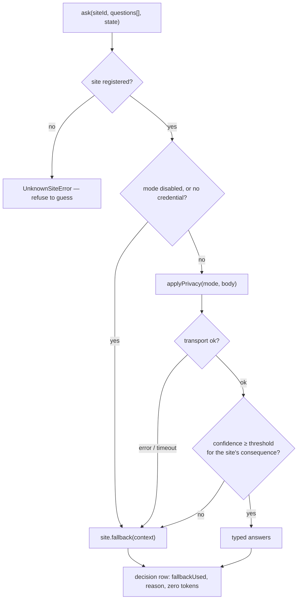

| Property | Implementation |
| --- | --- |
| Decision sites | declared with `ensureSite({ id, questions, returnType, consequence, fallback, telemetryTag })` (`src/jev/registry.ts`); registration rejects a missing fallback, a duplicate id, or a question/return-type length mismatch |
| Consequence | per site — `low`/`normal`/`high`; thresholds 0.5 / 0.7 / 0.85 (`src/jev/confidence.ts`) |
| Asymmetry | a `high` site rejects the whole batch if any answer is below threshold; `normal`/`low` sites replace only the answers that failed |
| Wire | `POST https://api.typesafe.ai/v1/systemone`, `jev-latest`, 20 s timeout, $0.042/M input tokens |
| Credentials | `config.jev.apiKey` → `~/.config/leanpi/credentials.json` (0600) → `JEV_API_KEY` → project `.env` (read, never exported), resolved per call |
| Privacy | `enabled` / `metadata-only` (counts, kinds, extensions, salted path hashes) / `redacted` / `disabled`; one redactor for payloads and log rows |
| Log | `.leanpi/decisions.jsonl`, one row per site with `fallbackUsed`, `reason`, `confidence` and tokens |

Sites by stage — the ids are stable strings and appear in telemetry and the log:

| Stage | Sites |
| --- | --- |
| planning | `gate.prd_required` |
| classification | `classify.execution_complexity`, `classify.required_capability`, `classify.review_risk_input` |
| routing | `routing.reasoning_effort`, `routing.quota_preference`, `routing.delegation_worth` |
| disclosure | `skill.disclosure`, `mcp.disclosure`, `lsp.usefulness` |
| exploration | `explore.candidate_relevance`, `explore.snippet_relevance`, `explore.subsystem_order`, `explore.sibling_expansion`, `explore.test_relevance`, `explore.sufficiency` |
| execution | `executor.failure_classification`, `executor.retry_usefulness`, `executor.escalation_reason`, `executor.user_clarification_need` |
| evidence | `verify.regression_scope`, `proof.sufficiency`, `proof.missing_proof_category`, `review.level` |
| context | `context.retention_relevance`, `rtk.reduction_policy` |
| session | `goal.semantic_completion`, `prd.criterion_satisfied`, `bootstrap.role_models` |

Two decisions are deliberately **not** JEV sites: model selection over the
capability index is arithmetic (`coding_score ≥ floor`, cheapest blended price),
and permission decisions are a security boundary that must be a deterministic
function of config.

## 8. Capability disclosure and prompt assembly

Three layers, and only the first is invariant.

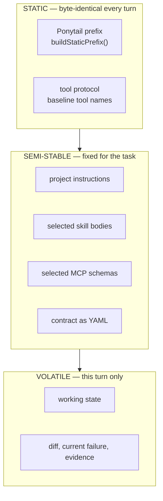

Order is the cache strategy (§22): dynamic content strictly last, so the
cacheable prefix is maximal. Each block is content-hashed; a repeated block is
emitted as its existing `artifact://` reference rather than a second copy.

| Capability | Selection | What enters context |
| --- | --- | --- |
| skills | JEV relevance over the whole registry, then a top-K fit confirmation; pins bypass ranking; disabling wins over pinning | the pointer (name, description, path) on the native path; the body only in the one-shot executor prompt |
| MCP | three questions — any capability needed, which servers are relevant, which tools of those are needed; hydration happens after the decision | one line per tool while deciding; full schema only for admitted tools |
| LSP | static detection of servers on `PATH` and `node_modules/.bin`; the compiled mode decides which tool group a turn exposes | an availability flag in the packet; tool schemas only when the mode exposes them |
| exploration | governor seeded from the packet; budget-bounded rounds; every dropped excerpt is stored before the drop | ranked excerpts, capped per file |
| RTK | deterministic rule, JEV only in the ambiguous band; mode from config → recorded measurement → `auto` | reduced text plus an `artifact://` reference to the raw bytes |

Skill registry precedence is project > user global > plugin cache > **bundled**,
first-claim-wins by skill name; bundled is a floor that config omission cannot
remove. Bundled files are verified against `skills/pack.lock.json` sha256 on
load and a mismatch throws rather than degrading.

The artifact store (`src/context/artifacts.ts`) is the reversibility mechanism
under all of this: anything over `context.artifact_threshold_bytes` becomes a
reference, and the `artifact` tool (the one tool beyond the five baseline names)
expands it.

## 9. Evidence: verification → proof → review → goal

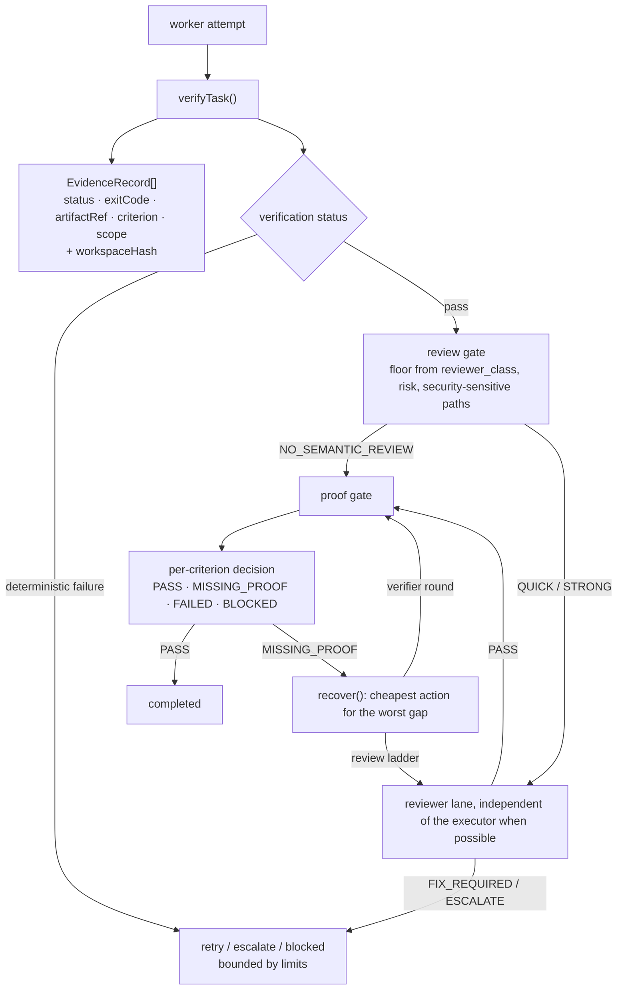

The contract's criteria are decided against **this turn's** evidence, read with
the hash the verifier stamped the records with — a hash recomputed by the caller
would read every record as stale and no criterion could ever be satisfied.
Records are fresh only when their `workspaceHash` matches the workspace at read
time, which is what makes "the tests passed" mean *after* the last edit.

| Verifier kind | Implemented by | Notes |
| --- | --- | --- |
| `typecheck`, `targeted_test`, `full_suite`, `lint`, `build`, `git_status` | `src/verify/descriptors.ts` | shelled commands; defaults in `DEFAULT_COMMANDS`, overridable per project |
| `runtime_smoke`, `cli_invocation`, `browser_test`, `screenshot_compare` | `src/runtime/` | declared by the trusted `verify.runtime` block; without one they are not selected, and a declared check records `not_run`/`unavailable`, never a pass |

`runtime_smoke` and `cli_invocation` start real programs. `browser_test` and
`screenshot_compare` need a browser the **host** owns: the installed Pi SDK
exposes no browser automation API, so a session passes an optional
`browserFacility` (`ActivateOptions` / `CreateLeanPiSessionOptions`) that is
threaded per verification context. With no facility — and no
`globalThis.browser` — those two record `unavailable`, which the gate reports as
missing browser evidence rather than a UI defect, and never as a pass.

Downgrades are always recorded rather than implied: an unsupported kind is
`skipped`, a missing baseline is `unavailable`, a missing plan is `not_run`. The
reviewer packet (`src/review/packet.ts`) carries the objective, the criteria,
the diff, changed files, verification results, warnings and the executor's
summary — and deliberately **not** the executor's transcript.

The goal boundary (`src/goal/boundary.ts`) runs after the gate only when a goal
is active, and decides the stop condition from the same evidence. `--max-turns`
and `--max-cost` are optional; uncapped is the default.

## 10. Backends, permissions, state

**Backends** (`src/backends/`) are `native` (an OpenAI-compatible endpoint Pi
calls directly) or `external_harness` (a vendor CLI spawned as a subprocess).
Billing classification drives routing: `external_harness` → subscription, a
native backend with zero marginal cost → local, everything else → metered.

| Vendor | Invocation (shape) |
| --- | --- |
| claude | `claude -p --output-format json --allowedTools … [--json-schema …] [--model …] -- PROMPT` |
| codex | `codex exec --sandbox workspace-write --skip-git-repo-check --json [--model …] [-c model_reasoning_effort=…] [--output-schema …] PROMPT` |
| opencode | `opencode run --format json [--model …] [--agent …] [--session …] PROMPT` |

Subscription detection (`src/backends/subscriptions.ts`) is two file questions
per vendor plus a login-status command (`claude auth status`, `codex login
status`, `opencode auth list`), and it feeds the compiler a deviation, so a
class bound to a vendor this machine cannot use is routed away from rather than
discovered by spending an attempt. First-run bootstrap writes the machine config
(`~/.config/leanpi/leanpi.config.yaml`, or `leanpi.config.yaml` in the working
directory when there is no XDG base) at mode 0600, with role bindings from JEV
or, when JEV is unavailable, the deterministic ladder allocation.

**Permissions** (`src/permissions/`) are nine scopes — `read`, `edit`, `shell`,
`network`, `mcp`, `external_dir`, `subagent`, `git_destructive`,
`package_install` — resolved by scope and target:

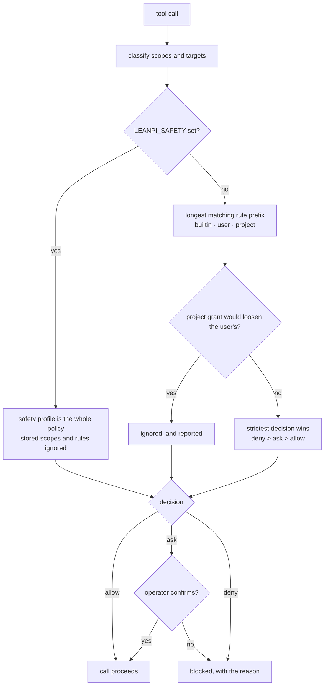

The guard is also the redaction boundary: tool results are scanned for secret
values (by name pattern and by value) before they reach the model, and the
execution tool spawns children with an allowlisted environment instead of the
parent's.

**Where state lands** — everything project-scoped is under `.leanpi/`, which
`bin/leanpi.js` adds to this clone's `.git/info/exclude` on first run (never to a
tracked `.gitignore`, which the operator did not ask LeanPi to edit):

| Path | Holds |
| --- | --- |
| `.leanpi/telemetry.jsonl` | one §52 record per run (`cost.telemetry_path` overrides) |
| `.leanpi/decisions.jsonl` | one row per JEV decision or fallback |
| `.leanpi/artifacts/<sessionId>/` | captured tool output and referenced bytes |
| `.leanpi/sessions/` | session records |
| `.leanpi/prd/` | active PRD state: criteria and work units (the PRD body itself lives in the artifact store) |
| `.leanpi/goal.json` | the active goal and its limits |
| `.leanpi/patches/<runId>.patch` | an isolated run's captured patch (tracked diff + untracked manifest), keyed by run id |
| `<primary-repo>/.worktrees/<runId>` | isolated checkouts when `limits.isolation: worktree`; owned by the primary repository, never nested under a linked checkout |
| `.leanpi/cache/mcp-catalog.json` | MCP catalog after a connection; schemas only for selected tools |
| `.leanpi/mcp-auth.json` | MCP OAuth tokens, 0600 |
| `~/.config/leanpi/leanpi.config.yaml` | the machine's config when no project file exists |
| `~/.config/leanpi/permissions.json` | user-scope permissions and project trust records |
| `~/.config/leanpi/credentials.json` | the JEV key, 0600 |

## 11. Where to read more

- Specification and acceptance criteria: [`docs/PRDs/v1/`](../PRDs/v1/) — start at
  `INDEX.md` for the PRD-to-section map.
- The cost strategies this architecture implements, and JEV's role in each:
  [`cost-strategies.md`](./cost-strategies.md).
- What is wired versus merely implemented: [`docs/reports/architecture-wiring-audit-2026-09-19.md`](../reports/architecture-wiring-audit-2026-09-19.md).
- What the numbers mean and where they came from:
  [`docs/benchmarks/2026-09-19-leanpi-vs-omp.md`](../benchmarks/2026-09-19-leanpi-vs-omp.md),
  [`docs/reports/reasoning-cost-2026-09-19.md`](../reports/reasoning-cost-2026-09-19.md),
  [`docs/audits/production-readiness-audit.md`](../audits/production-readiness-audit.md).
- The benchmark harness's own contract: `bench/rubric.md`, `bench/suites/`.
