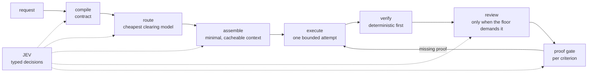

# LeanPi — cost strategies

**Scope:** the mechanisms in `src/` that reduce what a coding task costs, and the
role JEV plays in each. What those mechanisms actually saved, and what is still
unproven, lives in the reports linked at the end — this page is the map, not the
evidence. Where this page and the code disagree, the code is the fact.

LeanPi's objective is not fewer tokens. It is:

> minimize effective cost per **verified** successful coding task.

That reframing shapes every strategy below, because there are two ways to waste
money: spending too much on one attempt, and spending on attempts that do not
count. A cheap run that fails verification is not cheap — it is a full-price
attempt plus its retry. The number the objective names is therefore
**effective cost per verified success**, which `/cost` reports:

```
effective_cost = api_usd + jev_usd + estimated_quota_cost + local_compute + latency
```

One §52 record per run (`.leanpi/telemetry.jsonl`) carries it. `effective_cost`
is a *measurement*; routing's pre-dispatch `route_cost` is a *prediction*, and
the two are never summed.

## Where the money goes, and who decides



The premium model only ever *executes*. Every decision that would otherwise be
made by a model reading the repository is a typed JEV question (`Choice` /
`Score` / `Noul`, never prose) or arithmetic in ordinary code. JEV costs
**$0.042 per million input tokens with output free**, batches all questions for
one decision point into a single request, and is never registered as a tool — so
no executor model can spend a turn calling it.

## 1. Decide before you spend

The task compiler turns a request into an `ExecutionContract` before any
expensive model sees it. The contract is the executor's only input: the executor
does not get the repository to re-read and re-derive what the compiler already
decided.

| Mechanism | What it saves |
| --- | --- |
| Complexity class sets the budget (`LOW`/`MEDIUM`/`HIGH` → 6k/12k/24k context tokens, its own verification set, its own attempt count) | A one-file fix is not handed a 24k-token context and four attempts |
| §14 routing matrix (`prd_required` × complexity) picks the executor and reviewer **class** | Cheap work goes to the `quick` role, not the `strong` one |
| Capability floor + cheapest blended price picks the model (floors 50/70/85 by role) | The cheapest model that can actually do the job, never a flat premium default |
| Effort is priced *before* dispatch (`minimal` 0.5× … `high` 1.75× on predicted tokens) | Thinking has to justify itself in money, not be a free knob |
| Quota shadow pricing on subscription backends | A "free" call that burns scarce quota is not priced at zero |
| Predicted retry folded into the route cost | A model that fails often costs more than its rate card says |
| Availability/subscription deviations remove unreachable classes before dispatch | A class bound to a vendor this machine cannot use is routed away from, not discovered by spending an attempt |

**JEV's role:** `gate.prd_required` (PRD or direct?), `classify.execution_complexity`,
`classify.required_capability`, `classify.review_risk_input`, and
`routing.reasoning_effort`. Each returns a scalar, enum or score; the contract
is assembled by ordinary code. JEV **does not** pick the model — that is
arithmetic over the bundled capability index (`coding_score ≥ floor`, cheapest
blended price wins), so the ranking is reproducible and auditable. JEV reaches
routing in exactly one other place: `routing.quota_preference`, which may
reorder candidates only inside the configured `tie_band_usd` ($0.002), never
outside it.

## 2. Keep the prompt small and cacheable

| Mechanism | What it saves |
| --- | --- |
| **Progressive disclosure** — skills, MCP schemas and LSP tool groups enter context only when selected | The whole capability library never rides along |
| Skill bodies are read only after selection; the native path passes a *pointer*, not the body, because Pi's loop re-sends it every provider call | Bodies are paid for once, in the one-shot executor prompt |
| MCP is decided before hydration: three questions (any capability? which servers? which tools?), schemas fetched only for admitted tools | Full tool schemas for servers the task never touches |
| Layered prompt, static-first (`STATIC` byte-identical → `SEMI-STABLE` → `VOLATILE` last) | The provider cache prefix is maximal, so cached input is billed at the cached rate |
| Repeated blocks become an `artifact://` reference, never a second copy | Duplicate content in the same request |
| Compaction is reference substitution, never summarization; a preserved set (requirement, criteria, active errors) is copied first | Nothing that matters can be reduced away, and nothing is lost — every ref still expands |
| RTK reduces log-shaped tool output (`shell`/`test`/`build`/`lint`) above a size floor | Raw logs that a gist would have replaced |
| Pi's own skill catalog is stripped from the system prompt on the native path | ~82,343 bytes (~20.6k tokens) that used to sit in *every* provider call |

**JEV's role:** `skill.disclosure` (relevance over the registry, then a top-K fit
confirmation), `mcp.disclosure`, `lsp.usefulness`, `context.retention_relevance`
(stale evidence the working state still cites), and `rtk.reduction_policy` —
which is **off by default**, with the deterministic output-class rule as the
shipped decision and JEV an optional override only inside the ambiguous band.

## 3. Don't buy work the task doesn't need

| Mechanism | What it saves |
| --- | --- |
| Bounded exploration: 3 rounds, 5 files, 24 KB of context; the budget gate runs *after* every JEV answer and can only reduce, never extend | An unbounded "read the repo first" loop |
| Review ladder: `NO_SEMANTIC_REVIEW` when deterministic verification covers every criterion; a quick review otherwise; strong only when risk or the contract demands it | A premium reviewer reading a trivial diff |
| Executor and reviewer are separate lanes, at separate roles | The reviewer is not the executor's own model grading itself |
| Independent reviewer packet carries the objective, criteria, diff, evidence — deliberately **not** the executor's transcript | Re-paying for the executor's whole reasoning trace |
| Attempts and escalations are bounded per complexity (2/3/4 attempts, 1/2/2 escalations); semantic review rounds are bounded separately | A retry loop that drains the budget |

**JEV's role:** the six `explore.*` sites (candidate, snippet and test
relevance; subsystem order; sibling expansion; sufficiency), `review.level`
(which may only *raise* the deterministic floor, never lower it — its fallback
is `QUICK_REVIEW`, the cheapest level that still reviews), and
`executor.failure_classification`, `executor.retry_usefulness`,
`executor.escalation_reason`. A retry that cannot change the outcome is money
not spent.

## 4. Pay only for work that counts

A false "done" is the most expensive outcome there is: the task is re-done at
full price. Evidence is therefore part of the cost strategy, not a separate
quality concern.

| Mechanism | What it saves |
| --- | --- |
| Deterministic verification (typecheck, tests, lint, build, runtime smoke) runs before any semantic review | A model is never asked to judge facts a command can settle |
| The proof gate decides each acceptance criterion against **this turn's** evidence, read with the workspace hash the verifier stamped | "Done" backed by a stale pass, which would be rework later |
| `recover()` picks the cheapest action for the worst gap (a verifier round before a review round) | Escalating to a premium reviewer when a test would have closed the gap |
| Verification downgrades are recorded (`skipped`/`unavailable`/`not_run`), never implied | A silent gap that surfaces as a failed task after the budget is spent |

**JEV's role:** `verify.regression_scope`, `proof.sufficiency` and
`proof.missing_proof_category`. JEV assesses whether the collected evidence
supports each criterion; application code — not JEV — makes the final completion
decision.

## JEV's cost footprint, and its floor

| Property | Value |
| --- | --- |
| Price | `$0.042` / M input tokens, output free (`jev-latest`) |
| Batching | One request per decision point, every question for that point in the one payload |
| Answer shape | `Choice` / `Score` / `Noul` — classifications, never prose |
| Egress | `enabled` / `metadata-only` / `redacted` / `disabled`, applied at one choke point |
| Failure | Every site registers a non-null deterministic fallback; registration *rejects* a site without one, so JEV can never be a single point of failure |
| Credential | Optional. Without a key every site falls back and LeanPi still runs — it routes worse and spends more, and says so |

Because JEV is cheap and never blocking, the honest way to read its contribution
is: it buys better *decisions* for a fraction of one premium turn, and its
absence degrades routing quality rather than stopping work. The reports below
are explicit that JEV's own dollar contribution has **not yet been isolated** in
a measured comparison.

## Where JEV is deliberately absent

Two decisions that look semantic are not JEV sites, and both are cost decisions:

- **Model selection** over the capability index is arithmetic. A semantic router
  here would be unauditable and could not be replayed.
- **Permission decisions** are a security boundary and must be a deterministic
  function of config.

## Where to read more

- The mechanisms in full: [`docs/architecture/README.md`](README.md) — §6
  routing, §7 JEV, §8 disclosure, §9 evidence.
- What the savings measured, and the limitations:
  [`docs/reports/reasoning-cost-2026-09-19.md`](../reports/reasoning-cost-2026-09-19.md),
  [`docs/reports/real-session-cost-audit-2026-09-21.md`](../reports/real-session-cost-audit-2026-09-21.md),
  [`docs/benchmarks/2026-09-19-leanpi-vs-omp.md`](../benchmarks/2026-09-19-leanpi-vs-omp.md).
- The benchmark that produces the numbers: `bench/rubric.md`, `bench/suites/`.
- The specification behind each mechanism: [`docs/PRDs/v1/`](../PRDs/v1/),
  starting at `INDEX.md`.
