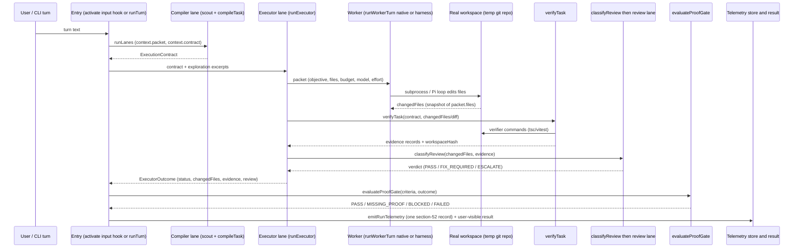

# LeanPi codebase audit — 2026-09-21

**Baseline:** `40e5507bcf267ce96e9e23e1196a0ea0b70f9e2b` · branch `audit/codebase-2026-09-21`
**Audit checkout (removed after delivery):** `/home/joao/projects/lean-pi/.worktrees/audit-codebase` · **Date:** 2026-09-21
**Method:** read-only static review, the smallest runnable probes, and the `complexity-optimizer` scanner, tracing the production flows end to end: entry points and lifecycle, the per-turn lane chain, the persistence stores, the trust/permission gates, and usage → normalization → persistence → pricing → aggregation → display. No source, test, config, lockfile or existing document was edited; no commit, PR, production service or real credential was used; no live model, billing or real installed-vendor-CLI call was made; and the baseline suite was not re-run. The only outbound reads were the providers' public pricing pages on 2026-09-21 ([official-price cross-check](#official-price-cross-check-2026-09-21)).
**PRD:** [`../PRDs/v1/done/PRD-035-codebase-audit.md`](../../PRDs/v1/done/PRD-035-codebase-audit.md)

## Scope

Production entry points and the flows traced through them:

| Entry point | Consumer flow |
|---|---|
| `bin/leanpi.js` → [`cli/bootstrap.ts`](../../../src/cli/bootstrap.ts), [`cli/launch.ts`](../../../src/cli/launch.ts) | launch, config discovery/auto-write, subscription detection, child spawn |
| [`index.ts` `activate()`](../../../src/index.ts#L407) | per-turn compiler → executor lane → verification → review → proof gate |
| [`index.ts` `createLeanPiSession()`](../../../src/index.ts#L920) | library/bench form of the same path |
| [`backends/*`](../../../src/backends), [`runtime/*`](../../../src/runtime), [`lsp/client.ts`](../../../src/lsp/client.ts), [`mcp/client.ts`](../../../src/mcp/client.ts) | subprocess/integration lifecycle |
| [`core/config.ts`](../../../src/core/config.ts), [`telemetry/*`](../../../src/telemetry), [`prd/state.ts`](../../../src/prd/state.ts), [`goal/*`](../../../src/goal), [`todo/*`](../../../src/todo) | config validation, persistence, session state |
| [`permissions/*`](../../../src/permissions), [`verify/*`](../../../src/verify), [`review/gate.ts`](../../../src/review/gate.ts) | authorization, verification and review gates |

**Complexity scope.** Per-turn hot paths: prompt assembly (`context/*`), exploration (`exploration/*`), capability/skill selection (`capabilities/*`, `mcp/*`), routing and calibration (`routing/*`, `telemetry/*`), the executor/worker seam (`executor/*`, `backends/*`), verification and review (`verify/*`, `review/*`). `src/bench/*`, `vendor/`, `skills/` vendored bytes and `node_modules` were not line-audited (the Pi dependency source was read only to verify A3).

**Exclusions / limitations.** No live model, billing or provider call and no real installed vendor CLI was invoked; no runtime performance measurement was taken (all complexity figures are structural). No coverage tooling exists, so no coverage percentage is measured. Windows-only behavior is unverified (stated as such). The two skipped test files are documented owner/machine gates, not failures. **The audit is against the committed snapshot `40e5507` only.** The primary checkout carries concurrent, uncommitted and unrelated source edits; those were not read, are not part of this baseline, and no finding, link, line number or baseline outcome here refers to them. Cost findings are code/arithmetic verdicts from the snapshot, config and deterministic probes, cross-checked against publicly published rates — they are not an observation of this user's real plan, invoice or billing.

## Baseline command outcomes

| Check | Command | Result |
|---|---|---|
| Dependency install | `pnpm install --frozen-lockfile` | exit 0 — 224 packages, 224 reused, 0 downloaded |
| Build | `pnpm build` | exit 0 (vendored `pi-thinking-fold` + `tsc`) |
| Tests, before build | `pnpm test` | exit 1 — 2 files / 8 tests failed, 651 passed, 10 skipped. **Cause: `dist/` absent**, not a product defect (`tests/cli/launch.spec.ts`, `tests/commands/thinking-fold.spec.ts` assert the built extension exists) |
| Tests, after build | `pnpm test` | **exit 0** — 111 files passed, 2 skipped (113); 659 tests passed, 10 skipped (669); ~20.9 s |
| Typecheck | `pnpm typecheck` | exit 0 |
| Lint | `pnpm lint` | exit 0 — warnings only (17 in `src/`, mostly unused imports) |
| Complexity scan | `python3 /home/joao/.codex/skills/complexity-optimizer/scripts/analyze_complexity.py . --format json --max-findings 2000` | 1332 `src/` leads (1267 nested-callback, 58 sort-in-loop, 7 io-in-loop); triaged against the named hot paths — leads, not findings, and not an item-by-item inspection (see [Complexity review](#complexity-review)) |
| A3 probe (Pi 0.87) | `node --input-type=module -e "import { resolveConfigValue, getConfigValueEnvVarNames } from './node_modules/@earendil-works/pi-coding-agent/dist/core/resolve-config-value.js'; console.log(resolveConfigValue('LEANPI_BACKEND_API_KEY', {LEANPI_BACKEND_API_KEY:'sk-secret'}))"` | prints `LEANPI_BACKEND_API_KEY` — a bare name is a literal, even when the env var is set |

These outcomes are the recorded baseline for the audited commit `40e5507`; they belong to it and not to the concurrent uncommitted primary-checkout edits. The cost and test-plan sections below use these recorded outcomes without re-running the suite.

## Current dispositions (2026-09-22)

The historical findings and baseline from `40e5507` are retained below. This section records their disposition
against the lane base `dd39d06` and the PRD-040 repair batch, which root accepted after independent recap
review. "Fixed at base" means the fix was already committed on the lane's base revision (`dd39d06`), so the
`40e5507` snapshot no longer describes lane HEAD. No live vendor/provider/subscription/billing call was made;
cost figures remain post-run configured valuations, not a provider invoice. Final local gates on the approved
revision all exited 0: `pnpm build`, `pnpm test` (862 passed / 10 skipped across 134 passed / 2 skipped files),
`pnpm typecheck`, `pnpm lint`, and `git diff --check`; the real `npm pack` artifact smoke passes inside the
suite.

| ID | Disposition | Rationale / evidence |
|---|---|---|
| A1 | Fixed at base | Change set derived from worktree state (`src/runtime/git.ts` `changeSnapshot`/`changedPathsSince`), not skill labels; `tests/executor/change-set.spec.ts` (TEST-1) green |
| SRP-1 | Fixed at base | Same defect as A1; `packet.files` is prompt context only, `WorkerResult.changedFiles` is separate |
| A2 | Fixed at base | `readPrdState` try/catch (`src/prd/state.ts`); corrupt-JSON test in `tests/prd/state.spec.ts` |
| A3 | Fixed at base | Native registration resolves via `apiKeyFor` (`src/backends/native.ts`); Authorization-header test in `tests/backends/native.spec.ts` |
| A4 | Fixed at base | `parseJev` keeps `usd_per_mtok`; round-trip test in `tests/telemetry/cost.spec.ts` |
| T1 (+prior S3) | Fixed at base | Untrusted project drops `backends`/`verify` (`withoutProjectSuppliedCommands`); config path hashed; `tests/permissions/trust.spec.ts` |
| COST-1 | Fixed at base | `parseCost`/top-level `cost:` carried by `loadConfig`; `tests/telemetry/cost.spec.ts` |
| COST-2 | Fixed this task | Native maps `stats.tokens.cacheWrite`; `RunUsage.cache_write_tokens?`/`CallRow.cacheWriteTokens?` optional and set only when reported; `tests/telemetry/cost.spec.ts` COST-2 block (red "expected undefined to be 400" → green) |
| COST-3 | Fixed this task | `/cost` renders billing volume (subscription/local/unmeasured metered) + valuation note; `unmeasuredCalls` disjoint from `unpricedCalls`; `tests/telemetry/cost.spec.ts` COST-3 block |
| COST-4 | Fixed this task | Negative/non-finite monetary rates and out-of-range `predicted_cached_input_fraction` reject with a named `ConfigError`; legitimate `0` preserved; `tests/telemetry/cost.spec.ts` COST-4 + `tests/routing/config.spec.ts` (red 6F/1P → 7P; routing 3F → 4P) |
| COST-5 | Deferred limitation | Per-call `pricing: "declared"\|"missing"` label added, but no peak/off-peak window, no rate effective-date, no billing-source/overflow provenance; `/cost` now says "configured post-run valuation, not a provider invoice". Metadata-before-logic remains future work. |
| S1 | Fixed this task | Scope is a structured `ScopeSpec` quoted once as an inert token list (`quoteScope`); `resolveCommand` is the sole boundary; quoted-placeholder and `<<`/`<<<` (heredoc) templates rejected via `AmbiguousScopeTemplateError`; `tests/verify/scope-injection.test.ts` green, real `$(touch PWNED)` sentinel red before the fix |
| S2 | Documented + tested (deliberate) | Verifier/harness inherit full `process.env` by design for trusted commands; only the guarded `execute` tool allowlists; `secrets.ts` doc corrected; `tests/verify/env-policy.test.ts` pins the intent |
| DRY-1 | Fixed this task | One `porcelainPaths` in `src/runtime/git.ts`, consumed by `verify/hash.ts`, `review/packet.ts`, `runtime/worktree.ts` (third copy consolidated) |
| A5 | Unverified / deferred | Windows-only (`:` PATH split, no `PATHEXT`); CI is Ubuntu-only; no claim that Windows is supported |
| C1 | Deferred | O(U) per-untracked review spawn; no measured gain established, and the spawn-skipping change is not behaviour-preserving without a byte-bounded renderer |
| C2 | Deferred | O(H) telemetry parse; no benchmark shows the path matters; the unbounded-store concern is already a `ponytail:` ceiling comment |
| SRP-2 | Deferred | `src/index.ts` entry+factory+barrel split is a public-API/`exports` refactor, non-blocking, no correctness defect |
| KISS-1 | Deferred | `buildWorkingState` two-source read is latent, not a confirmed correctness defect; no speculative refactor |
| DRY-2 | Deferred | In-module duplicated question/levels constants; no desync observed, non-blocking |

### Test-coverage plan reconciliation

| Plan item | Status |
|---|---|
| TEST-1 (A1 change set) | Implemented — `tests/executor/change-set.spec.ts` |
| TEST-4 (A4/COST-1/COST-4/COST-5) | Implemented — `tests/telemetry/cost.spec.ts` (COST-5 only partly: provenance label, not windows) |
| TEST-5 (A2 corrupt store) | Implemented — `tests/prd/state.spec.ts` |
| TEST-6 (A3 apiKey) | Implemented — `tests/backends/native.spec.ts` |
| TEST-8 (T1 untrusted config) | Implemented — `tests/permissions/trust.spec.ts` |
| TEST-2 / TEST-3 (whole-chain + negatives) | Implemented — `tests/e2e/value-chain.spec.ts` (including failing verifier, FIX_REQUIRED, no-facility browser, stale-proof re-hash); green in the final suite |
| TEST-2N (native interactive record+cost) | Implemented, relocated: the native `agent_end` record/cost is asserted in `tests/cost-wiring.spec.ts`; the native path explicitly records `not_run`/`success:false` |
| TEST-7 (real hanging child reaped) | Implemented — `tests/backends/timeout-reap.spec.ts`; process-group descendant reap |
| TEST-10 (live vendor lane) | Not run — owner-gated `describe.skipIf`, correctly optional; no live qualification |

### Additional defects confirmed only in PRD-040 (not in the original audit)

| Finding | Disposition | Evidence |
|---|---|---|
| `routing:` block dropped by `loadConfig` | Fixed this task | Typed, parsed, carried; fraction validated; `tests/routing/config.spec.ts` |
| Published package missed `scripts/patch-pi-model-command.mjs` and `src/cli/fold-cache.ts` | Fixed this task | `package.json` `files`; `tests/cli/packaging.spec.ts` extracts a real `npm pack` tarball, boots `--version`/`--help`, asserts attached extensions exist |
| Untrusted LSP overrides / project-local PATH+symlink binaries | Fixed this task | `src/lsp/detect.ts`; `tests/lsp/trust.spec.ts` (red 2F/4P → 6P) |
| Untrusted default project skill roots restored across `activate`/`doctor`/PRD creator | Fixed this task | `src/capabilities/skills.ts` `defaultRuntimeSkillRoots`; `tests/skill-trust-consumers.spec.ts` (3F → 3P) |
| Trust symlink containment + nested linked-dir / broken-link identity hashing | Fixed this task | `src/permissions/trust.ts`; trust spec 14P (red 2F/12P → 14P) |
| Runtime plans had no producer; worktree isolation had no session consumer | Fixed this task, root-reviewed | `src/runtime/plan.ts parseRuntimePlan`; verifier context threads runtime/browserFacility; `turn-lanes.ts` runs executor+gate inside `runIsolated`; `tests/runtime/{config-wiring,plan-wiring,isolation-session,isolation-retention,worktree,worktree-safety}.test.ts` |
| Screenshot capture did not navigate to its configured URL | Fixed this task | `src/runtime/screenshot.ts` now awaits navigation before capture; `tests/runtime/browser.test.ts` visited-URL regression: 1 failure before the fix, then 6 passes |
| Worktree safety corrections (owner `.worktrees/`, ignored-data retention, no force, complete applyable patches, NUL git paths, symlink patch identities) | Fixed this task, root-reviewed | mode drift/unmerged index red 2F → 35P; worktree/config-wiring/worktree-safety green 44P (final-safety/entrypoint logs) |

### Final runtime/isolation and recap corrections (root-reviewed)

- **Worktree lifecycle (primary-owned).** `.base`/`.owner` recorded; no force removal; ignored data, live
  owners, unknown commits, mode drift and an unmerged index are retained; patches stay durable and
  applyable (untracked, binary, symlinks); preflight rejects a partial application; the losing process's
  reap timer is unref'd; an external-only config boots with no native placeholder; there is no second Pi
  prompt; a failed compiled turn keeps exactly one usage record and its original failure. Root regressions:
  mode drift/unmerged index red 2F → green 35P; proc-exit red `1 ETIMEDOUT` → green 17P (includes a pure
  external-only SDK entrypoint).
- **Recap lifecycle/durable input.** Restore reads the active branch (`getBranch`) with
  `session_start`/`session_tree` invalidation; generation failure vs unavailable vs empty are distinguished;
  a durable completed external input is persisted for handled turns that have no SDK transcript; a native
  transcript fallback supplies the newest completed pair when no recap/input entry exists. Final root
  regression: newest native completion now beats an older saved recap/input by chronology — red 3F/24P →
  green 52P.

## Assessment and priorities

**Overall.** The per-turn arithmetic and the gate machinery are largely sound, but the executor's change set — the input verification, review and the proof gate all read — is derived from skill labels, so a real turn reports no changed files and the review gate short-circuits (A1, P1). Operator input is silently lost in two places (the `jev:` and top-level `cost:` rate blocks never load, A4/COST-1), and a corrupt PRD state file throws on every prompt (A2). Native-fallback auth sends a literal key name to Pi (A3), and the documented untrusted-project boundary is not enforced for `backends`/`verify` (T1). Cost arithmetic is conditionally appropriate but is a configured economic valuation, not a bill: two inputs are silently lost and the display hides subscription/local/unmeasured volume. The full gate chain is joinable end to end only on an external-harness config; the audited default binds native roles, and no test drives the whole chain through an entry point — the highest-value missing coverage ([test plan](#critical-test-coverage-and-value-chain-test-plan)).

| # | Fix | Category | Severity | Effort |
|---|---|---|---|---|
| [A1](#a1--executor-change-set-is-derived-from-skill-label-instead-of-worktree-state) | Derive the executor change set from worktree state, not skill labels; review/verification then see the real diff | Bug / SRP-1 | P1 | 2–4 h |
| [A2](#a2--corrupt-prd-state-file-throws-on-every-prompt-assembly) | Guard the `readPrdState` parse so a corrupt store degrades instead of failing every turn | Bug | P2 | 30–45 min |
| [A4](#a4--jevusd_per_mtok-is-silently-dropped-so-jev-spend-prices-at-0) + [COST-1](#cost-1--top-level-cost-block-never-reaches-pricing) | Keep `jev.usd_per_mtok` and carry the top-level `cost:` block through `loadConfig` | Bug / cost | P2 | 45–75 min |
| [A3](#a3--native-worker-sends-the-raw-apikey-name-to-pi) | Resolve the native backend `apiKey` through the documented env syntax | Bug | P2 | 30–60 min |
| [T1](#t1--project-config-file-is-outside-the-trust-surface) | Enforce the documented trust boundary for a project `leanpi.config.yaml` | Security | P2 | 2–4 h |

Jump to: [Critical test coverage and value-chain test plan](#critical-test-coverage-and-value-chain-test-plan) · [Cost accounting audit](#cost-accounting-audit) · [Complexity review](#complexity-review) · [SRP / KISS / DRY review](#srp--kiss--dry-review) · [Findings](#findings).

All other valid findings are retained in their categories below. A5 is a conditional unverified-platform risk, not a confirmed defect; the cost-specific findings COST-1–COST-5 (cache-write loss, zero/unlabelled display, invalid rates, missing billing/rate provenance) are in the [cost audit](#cost-accounting-audit); SRP-1 is A1 by another name and is not counted twice; the prior report's S3 is T1 and S1/S2 stay qualified.

## Findings

### A1 — Executor change set is derived from skill label instead of worktree state

**P1 · High confidence · Reproduced.** The executor lane fills the worker packet's `files` from the contract's **skills**, whose `source` is a `class:path` label, not a workspace path:

```ts
// src/executor/lane.ts:198
function selectedContextFiles(contract: ExecutionContract): string[] {
  return contract.capabilities.skills.map((skill) => skill.source).slice(0, 16);
}
// src/capabilities/skill-select.ts:141
source: `${record.source.class}:${record.source.path}`,   // "user:/home/…/SKILL.md"
```

`runExecutor` passes those as `task.context.files` ([`lane.ts:229`](../../../src/executor/lane.ts#L229)), `dispatchRequest` puts them on `packet.files`, and both workers derive `changedFiles` by re-snapshotting those same strings as `cwd`-relative paths:

```ts
// src/backends/worker.ts:165,174
export function snapshotFiles(cwd, files) { const path = isAbsolute(file) ? file : join(cwd, file); … }
export function changedFilesSince(before, cwd, files) { return files.filter((f) => before[f] !== after[f]); }
```

**The true change-detection boundary.** `WorkerResult.changedFiles` is computed only over `packet.files` at the worker seam — [`worker.ts:165-177`](../../../src/backends/worker.ts#L165), called from [`native.ts:85`](../../../src/backends/native.ts#L85) (`before`) and [`native.ts:214,223,231`](../../../src/backends/native.ts#L214), and [`harness.ts:421,520-523`](../../../src/backends/harness.ts#L421). `packet.files` is a prompt-context selector, so the changed set can never include a file the packet did not already name. Prompt-context selection and change detection are separate concerns that currently share one field — see [SRP-1](#srp-1--worker-packet-files-field-serves-two-responsibilities). **Mapping a skill `source` to a real path is not a fix**: it would only snapshot skill files, and would still miss edits, new and deleted workspace files, and the repo's pre-existing dirty state.

**Reachable call path:** `activate()` → `executorLane` → `runExecutor` → worker → `runHarness`/`runNative`. This is the external-harness configuration `ownsExecutionLoop()` selects ([`turn-lanes.ts:293`](../../../src/commands/turn-lanes.ts#L293)).

**Reproduced** (probe calls the real `runExecutor` with a contract whose one skill has `source: "user:/home/x/skills/s/SKILL.md"`; run the same shape with `node --input-type=module` importing `runExecutor` from `dist/` after `pnpm build`):

```
packet.files = ["user:/home/x/skills/s/SKILL.md"]
snapshot    = {"user:/home/x/skills/s/SKILL.md":null}
changedFiles = []
```

**Actual behavior and impact.** Every real executor turn reports `changedFiles: []`, so:

- `verifyTask` receives `diff.files: []`; `regressionScopeRule(undefined)` resolves *targeted sufficient* rather than widening, and `targetedSurfaceOf([])` is empty ([`verify/select.ts:45`](../../../src/verify/select.ts#L45), [`lane.ts:374-387`](../../../src/executor/lane.ts#L374));
- `classifyReview({ changedFiles: [] })` short-circuits to `NO_SEMANTIC_REVIEW` **before** the deterministic floor, so no reviewer ever runs and a security-sensitive change is not caught ([`review/gate.ts:153-163`](../../../src/review/gate.ts#L153));
- `workingStateSources.filesTouched` and the proof gate's `changedFiles` / `securitySensitivePathsIn` see no files ([`index.ts:293`](../../../src/index.ts#L293), [`lane.ts:614`](../../../src/executor/lane.ts#L614)).

The empty-set behavior is reproduced; the gate-skipping consequences are traced statically to the call sites above, not measured end to end.

**Smallest behaviour-preserving fix.** Detect the change set from worktree state, independent of `packet.files`. The repository already has the building block: `git status --porcelain` parsed by `porcelainPaths` ([`verify/hash.ts:21-44`](../../../src/verify/hash.ts#L21), used by `workspaceHash`). Capture the porcelain dirty set **before** the run and **after**, and report paths that appeared, disappeared, or whose content hash changed. That covers new files (appear in `after`), deletions (present in `before`, gone in `after`), edits to already-dirty files (content hash changes) and pre-existing dirty work (present in both and unchanged → not attributed to this turn). Keep `packet.files` (the §28 `context.files` key is required by the packet whitelist) for prompt context only.

The requirement is behavioral, not a specific helper. When git is unavailable, **do not fall back to the `packet.files` snapshot or otherwise silently report an empty change set**: either mark the change set unknown and force verification/review conservatively, or fail the turn with an explicit unsupported-mode error. A `changedPathsSince(before, cwd)` helper mirroring `workspaceHash` satisfies the requirement, but the fallback behavior is the fix.

**Why the exploration list is not the fix.** `context.exploration.files` ([`turn-lanes.ts:276`](../../../src/commands/turn-lanes.ts#L276)) is the ranked context selection, not the diff; it can omit a changed file the exploration did not rank and it cannot detect creations or deletions. It may seed the prompt, not the gate.

**Targeted regression check.** A spec that runs `runExecutor` (worker seam) against a temp repo, makes the injected worker create a new file and edit one already dirty, and asserts `changedFiles` contains exactly those paths (and not untouched pre-existing dirty files). Plus one asserting `classifyReview` does not return `NO_SEMANTIC_REVIEW` when the worker reports a changed `src/auth.ts`. The existing executor tests miss this because their injected worker returns `changedFiles` directly ([`tests/executor/lane.spec.ts:36`](../../../tests/executor/lane.spec.ts#L36)).

### A2 — Corrupt PRD state file throws on every prompt assembly

**P2 · High confidence · Statically confirmed.** `readPrdState` is the only persistence reader on the per-turn path that does not degrade:

```ts
// src/prd/state.ts:277-281
export function readPrdState(cwd: string): PrdState | null {
  const path = prdStatePath(cwd);
  if (!existsSync(path)) return null;
  return JSON.parse(readFileSync(path, "utf8")) as PrdState;   // no try/catch
}
```

Every sibling store catches (`goal/state.ts:101-105`, `telemetry/store.ts:92-103`, `mcp/catalog.ts:176-190`). `writePrdState` writes non-atomically (truncate + `writeFileSync`, [`state.ts:270-275`](../../../src/prd/state.ts#L270)), so a crash or kill mid-write leaves invalid JSON.

**Reachable call path:** `runLanes` → `assemble` → `buildWorkingState` → `sources.acceptance()` → `readPrdState` ([`index.ts:293`](../../../src/index.ts#L293), [`context/working-state.ts:48`](../../../src/context/working-state.ts#L48)). `buildWorkingState` has no per-source guard.

**Actual behavior and impact.** With a corrupt `.leanpi/prd/state.json`, `runLanes` throws before any lane completes, so every prompt in the session fails until the file is manually deleted; `/prd`, `/todo`, `/status` and goal derivation throw the same way ([`prd/commands.ts:105`](../../../src/prd/commands.ts#L105), [`commands/status.ts:41`](../../../src/commands/status.ts#L41)).

**Smallest suggested fix.** Wrap the parse in `try { … } catch { return null; }` (matching the other stores), and/or write via a temp file + `renameSync`.

**Targeted regression check.** A unit test that seeds an invalid `state.json`, asserts `readPrdState(path) === null`, and asserts `buildWorkingState` with that source returns without throwing.

### A3 — Native worker sends the raw `apiKey` name to Pi

**P2 · High confidence · Verified against the installed Pi 0.87 source and a probe.** The interactive registration path resolves LeanPi's documented `apiKey: SOME_ENV_VAR` syntax through `apiKeyFor`/`toPiConfigValue` and registers *nothing* when the variable is absent ([`index.ts:134-139`](../../../src/index.ts#L134), [`core/config.ts:415-420`](../../../src/core/config.ts#L415)). The native worker path bypasses both:

```ts
// src/backends/native.ts:103
apiKey: backend.apiKey ?? "LEANPI_BACKEND_API_KEY",
```

The registration happens only inside the `if (backend.baseUrl)` branch ([`native.ts:99-117`](../../../src/backends/native.ts#L99)); it is the whole native-provider registration, not a fallback path. `backend.apiKey` is the raw config string ([`registry.ts:135`](../../../src/backends/registry.ts#L135)).

**Pi 0.87 treats a bare name as a literal — confirmed, not assumed.** `resolveConfigValue` parses the value; only `$NAME`/`${NAME}` or `!command` forms produce env/command parts, otherwise the whole string is a literal (installed `@earendil-works/pi-coding-agent@0.87.0`, `dist/core/resolve-config-value.js:21-70,123-129` — cited as inline installed-dependency evidence, not a committed repository link). `getConfigValueEnvVarNames('LEANPI_BACKEND_API_KEY')` returns `[]`. The read-only probe printed `LEANPI_BACKEND_API_KEY` even with that env var set, while `$LEANPI_BACKEND_API_KEY` printed the secret. So the literal is sent as the provider key; it is **not** recognized as an env key anywhere else. (The LeanPi comment at [`index.ts:128`](../../../src/index.ts#L128) says "Pi 0.85"; the behaviour holds in the installed 0.87.)

**Reachable call path:** executor lane → `runWorkerTurn` → native backend → `runNative`. `ownsExecutionLoop` requires `quick`/`balanced`/`strong` to be external harnesses ([`turn-lanes.ts:293-298`](../../../src/commands/turn-lanes.ts#L293)), but `selectBackend` ranks every enabled backend whose `roles` includes the role or is pool-wide (`null`) — a native backend with no `roles:` is in the chain for every role, and the chain falls through to it when the harness fails ([`registry.ts:222-238,313-360`](../../../src/backends/registry.ts#L222)). A native `specialist` or any declared-role native backend is reachable the same way.

**Actual behavior and impact.** A provider answers `401 Invalid API key`, which reads to the operator as a verdict on the key they configured (the exact failure `apiKeyFor`'s comment documents). The launcher's `missingBackendKeys` warning also does not cover this path.

**Smallest suggested fix.** Reuse `apiKeyFor(backend.apiKey, env)` / `toPiConfigValue` in `native.ts`, registering no `apiKey` field when it resolves to nothing.

**Targeted regression check.** A test that invokes `runNative`'s provider registration with `apiKey: "OPENCODE_API_KEY"` and an env holding it, asserting the registered value is `$OPENCODE_API_KEY`, and that an absent/undeclared key omits `apiKey`. (The probe in the baseline table demonstrates the resolution rule without a live call.)

### A4 — `jev.usd_per_mtok` is silently dropped, so JEV spend prices at $0

**P2 · High confidence · Reproduced.** `parseJev` returns only four keys:

```ts
// src/core/config.ts:170-175
return { apiKey: …, endpoint: …, model: …, mode: resolvedMode };
```

so an operator's `jev.usd_per_mtok` ([`leanpi.config.yaml:74-76`](../../../leanpi.config.yaml#L74)) never reaches the loaded config. Cost resolution then reads that missing key:

```ts
// src/telemetry/pricing.ts:72
jev_usd_per_mtok: numberOf((config?.jev as { usd_per_mtok?: unknown } | undefined)?.usd_per_mtok),
```

**Reproduced** (`loadConfig` on a temp config with `jev.usd_per_mtok: 0.2`):

```
config.jev = {"apiKey":null,"endpoint":"…","model":"jev-latest","mode":"enabled"}
resolved cost.jev_usd_per_mtok = 0
```

**Actual behavior and impact.** `priceRun`'s `jev_usd` term is always `0` ([`pricing.ts:143`](../../../src/telemetry/pricing.ts#L143)), so `effective_cost` and `/cost` under-report every run by its JEV share; the configured rate is dead. Tests only pass `usd_per_mtok` through `overrides`, which is why this is not caught.

**Smallest suggested fix.** Preserve `usd_per_mtok` in `parseJev` (add it to the `jev:` type) or read it from the raw `cost:`/`jev:` block the way the other rates are read.

**Targeted regression check.** `loadConfig` on a config containing `jev.usd_per_mtok`, asserting `resolveCostConfig(config).jev_usd_per_mtok` equals it and that `priceRun` includes the JEV term.

### A5 — Vendor on-PATH detection is a conditional unverified-platform risk

**P3 · Conditional unverified-platform risk, not a confirmed defect · Low confidence (Windows-only, untested) · Statically confirmed code, platform unverified.** The code below is correct on POSIX; it is only a defect *if* Windows is a supported target, which nothing in this checkout establishes (see the platform-intent paragraph).

```ts
// src/backends/subscriptions.ts:57-61
function onPath(command: string, env: NodeJS.ProcessEnv): boolean {
  if (command.includes("/")) return existsSync(command);
  const path = env.PATH ?? "";
  return path.split(":").some((dir) => dir.length > 0 && existsSync(join(dir, command)));
}
```

Two defects on Windows: PATH is `;`-joined, and `existsSync(join(dir, "claude"))` does not resolve `claude.cmd`/`claude.exe` (needs `PATHEXT` enumeration, and Windows paths are case-insensitive). A command containing `/` is handled separately, so only bare-name CLIs are affected.

**Platform intent is thin, so the confidence is downgraded.** CI runs `ubuntu-latest` only ([`.github/workflows/ci.yml:15`](../../../.github/workflows/ci.yml#L15)); `package.json` declares no `os`; the only Windows adaptations are [`lsp/detect.ts:87`](../../../src/lsp/detect.ts#L87) (`process.platform === "win32"` mode-bit handling) and `windowsHide` in two spawns. `windowsHide` alone is not evidence that Windows is supported.

**Smallest honest fix.** If Windows is supported, resolve through a `which`/`where`-equivalent that honors `path.delimiter` **and** `PATHEXT` (e.g. `spawnSync("where", [command])` on win32); `path.delimiter` alone does **not** fix the `.cmd`/`.exe` lookup. Otherwise record that Windows is out of scope and leave it.

**Targeted regression check.** On Windows CI, a probe with a `;`-joined PATH containing a `.cmd` file asserting `onPath("claude", env)` is true. Without Windows CI this stays unverified.

### T1 — Project config file is outside the trust surface

**P2 · Medium confidence (prerequisites) · Statically confirmed invariant gap.** `surfaceFiles` hashes only the extensions dir, MCP config paths and skill roots:

```ts
// src/permissions/trust.ts:198-205
export function surfaceFiles(surface: ProjectSurface): Map<string, string> {
  const files = new Map<string, string>();
  hashTarget(surface.root, surface.extensionsDir, files);
  for (const configPath of surface.mcpConfigPaths) hashTarget(surface.root, configPath, files);
  for (const skillRoot of surface.skillRoots) hashTarget(surface.root, skillRoot, files);
  return files;
}
```

`loadConfig` keeps the project's `backends` and `verify` blocks regardless of trust ([`config.ts:353-361`](../../../src/core/config.ts#L353)); `trust.trusted` gates only skill roots and the MCP catalog. `SECURITY.md` names "a checked-out `leanpi.config.yaml`" as untrusted input that must "never … grant itself a capability" ([`SECURITY.md:33-36`](../../../SECURITY.md#L33)).

**Prerequisites / trust model.** Exploit requires the user to run LeanPi inside an untrusted cloned repository whose `leanpi.config.yaml` binds `backends[].command` (spawned via `spawnProcess`) or `verify.commands` (shelled via `execShell`), and to let the turn execute. It is not remote or unauthenticated, but it defeats the documented trust boundary and is a project file granting a capability.

**Smallest suggested fix.** Enforce the documented boundary first: add `leanpi.config.yaml` to `surfaceFiles` and strip `backends`/`verify` when `trust.trusted` is false. Amending `SECURITY.md` and the `config.ts:354-355` comment to legitimize executing commands from an untrusted project config is a **separate, explicit product/security-policy decision**, not an equally safe alternative fix: it trades a documented containment guarantee for config-declared command execution. If that decision is taken it must be stated as such; it must not be reached by documenting the current contradiction as an accepted exception. Do not leave the code and its stated boundary disagreeing either way.

**Targeted regression check.** A test that writes a project config with a `backends.evil.command` and no trust record, loads it, and asserts the executable block is dropped. If the policy decision is to allow config-declared commands, that decision needs its own explicit test and rationale instead of this one.

## Cost accounting audit

**Verdict — conditionally appropriate.** The arithmetic is sound and the *measured* path is correctly separated from the *predicted* one: `priceCall`/`priceRun` are the only pricing functions, they use the right denominator (USD per **1,000,000** tokens, [`pricing.ts:100-107`](../../../src/telemetry/pricing.ts#L100)), they price non-cached input, cache reads, cache writes and output at their own rates with no double count, and retries accumulate across attempts. The `metered`/`subscription`/`local` split is real at the record level. But `effective_cost` is a **post-run configured economic valuation**, not measured cash: it adds quota-shadow, local-compute and latency policy terms to metered API pricing ([`pricing.ts:136-152`](../../../src/telemetry/pricing.ts#L136)). It is only as honest as the quantities and rates that reach it, and inputs are silently lost before they get there: **the entire top-level `cost:` block never loads** (COST-1) and **cache-write tokens are dropped for native runs** (COST-2); the JEV rate is the already-known instance of the same class (A4, not re-counted). Under the repository's own `leanpi.config.yaml` (per-backend rates only, `cacheWrite` absent, `cost:` block absent) the visible figures are arithmetically correct *for what was collected*; they are **not** a bill, the rates are a point-in-time published snapshot and not the operator's plan (COST-5), and `/cost` does not say so (COST-3). Absent usage, unknown prices, unmodelled time-of-day rates and unproven billing provenance are the accuracy boundary, not the formula.

**Scope of this section.** Snapshot `40e5507`; no live model or billing call. The concurrent uncommitted edits in the primary checkout are excluded. Mocks were not used to claim real-world billing accuracy; the numbers below are hand-computed versus deterministic probes over the built exports, and the rate cross-check uses published list prices, not an account.

**Accounting stages.** One row per seam the quantity or rate crosses.

| Stage | Code | Covers | Gap |
|---|---|---|---|
| Provider usage → normalization | Pi `Usage` (installed `@earendil-works/pi-ai@0.87.0`, `dist/api/openai-completions.js:1173` — inline evidence), native ([`native.ts:189-194`](../../../src/backends/native.ts#L189)), Pi-loop ([`collect.ts:149-173`](../../../src/telemetry/collect.ts#L149)) | `input` is already net of cache read/write (`prompt_tokens − cacheRead − cacheWrite`); `output` already includes reasoning. Native maps input/cacheRead/output; Pi-loop also maps cacheWrite and splits reasoning | native drops `stats.tokens.cacheWrite` and reports `reasoningTokens: 0` (COST-2). The active `opencode-go` config declares no cache-write rate, so no extra cache-write fee is established for that backend |
| Run accumulation → persistence | [`collect.ts:259-270`](../../../src/telemetry/collect.ts#L259), [`emit.ts:50-64`](../../../src/telemetry/emit.ts#L50), [`record.ts:24-33,102-117`](../../../src/telemetry/record.ts#L24) | one call per attempt (success or failure) → `api_usd` includes retries; append-only store, one line per run; `subscription_usage` counts subscription calls | `RunUsage`/`CallRow` persist no cache-write (or per-call cached/reasoning) quantity |
| Pricing | [`pricing.ts:78-108`](../../../src/telemetry/pricing.ts#L78), [`pricing.ts:136-152`](../../../src/telemetry/pricing.ts#L136) | precedence `cost.models[model] ?? backends[backend].cost ?? 0`; `effective = api + jev + quota + local + latency` (a configured valuation, not cash) | top-level `cost:` never reaches this (COST-1); finite negatives accepted (COST-4); no peak/off-peak or rate-provenance input (COST-5) |
| Aggregation → display | [`aggregate.ts:54-124`](../../../src/telemetry/aggregate.ts#L54), [`cost.ts:57-98`](../../../src/telemetry/cost.ts#L57), [`statusline.ts:135`](../../../src/cli/statusline.ts#L135) | sums stored `effective_cost`; `byBilling`/`byBackendType` computed; `/cost <task>` prints the full usage/rate breakdown | the aggregate `/cost` and the statusline print only dollars; subscription/local volumes are unrendered (COST-3) |
| Routing prediction (separate) | [`routing/cost.ts:73-119`](../../../src/routing/cost.ts#L73), [`routing/config.ts:106-108`](../../../src/routing/config.ts#L106) | a pre-dispatch *estimate*: catalog price × predicted tokens + shadow + latency + predicted retry | never summed into `effective_cost`; basis intentionally differs (below) |

**Configured rate assumptions.** All are config- or catalog-derived; there is **no hard-coded billing-rate table; routing uses a checked-in catalog snapshot** and no runtime price fetch. The configured `opencode-go` rates coincide with the providers' published **off-peak** DeepSeek V4.1 Flash rates; the same categories are **2×** in peak windows, and no code or config key models the window ([official-price cross-check](#official-price-cross-check-2026-09-21), COST-5).

| Rate | Value | Source | Status |
|---|---|---|---|
| `opencode-go` input / output / cacheRead (off-peak) | 0.15 / 0.6 / 0.003 USD/Mtok | [`leanpi.config.yaml:49-52`](../../../leanpi.config.yaml#L49) | configured, loaded |
| published peak input / output / cacheRead | 0.30 / 1.20 / 0.006 USD/Mtok | public pricing pages, 2026-09-21 | not represented in code (COST-5) |
| `opencode-go` cacheWrite | — | absent → 0 | default, never observed |
| `jev.usd_per_mtok` | 0.042 USD/Mtok | [`leanpi.config.yaml:76`](../../../leanpi.config.yaml#L76) | configured but dropped (A4) |
| catalog `deepseek-v4-1-flash` input / output | 0.3 / 1.2 USD/Mtok | [`models.json`](../../../src/capability/models.json) (Artificial Analysis scrape 2026-09-21) | routing prediction only |
| quota shadow / local GPU / latency | unset | `cost` block | top-level block not loaded (COST-1) |

**Worked checks (hand value vs probe).**

- Normal + cached: input 1,000 @ $3, cache read 2,000 @ $0.3, output 100 @ $15 → `(3000 + 600 + 1500)/1e6 = 0.0051`; probe printed `0.0051`.
- Cache write: input 1,000 @ $3, cache write 400 @ $3.75, output 100 @ $15 → `(3000 + 1500 + 1500)/1e6 = 0.006`; probe printed `0.006`. The existing Pi-loop test asserts the same (and that dropping writes prices 0.0045) at [`cost.spec.ts:151-156`](../../../tests/telemetry/cost.spec.ts#L151).
- Missing price: a metered `CallRow` with tokens and `costUsd: 0` is flagged (`unpricedCalls` → 1); a **zero-token** metered row is not (→ 0) — the silently-free case in COST-3.
- Config load probe: `loadConfig` on a temp YAML with a top-level `cost:` block returned `config.cost === undefined`; `resolveCostConfig(config)` contained only `backends.api.cost` (top-level `models`/`quota_shadow_usd`/`local_usd_per_gpu_sec`/`latency_usd_per_sec`/`telemetry_path` all absent); `priceCall` still returned the backend-rate `0.006`. Repro: `node --input-type=module -e "import {loadConfig} from './dist/core/config.js'; import {resolveCostConfig} from './dist/telemetry/pricing.js'; console.log(resolveCostConfig(loadConfig('<dir-with-cost-yaml>')))"`.
- Negative / non-finite rates: input `-3` → `priceCall` `-0.003` (negative accepted); `NaN`/`Infinity` → `0`. Repro: same import, `priceCall({backend:'api',model:'m',type:'native',role:'balanced',billing:'metered',usage:{inputTokens:1000}}, resolveCostConfig({backends:{api:{cost:{input:-3}}}}))`.
- JEV term: with a rate passed explicitly, `priceRun` gave `api=3`, `jev=0.000042`, `effective=3.000042`; a real config cannot supply that rate (A4).
- Display: `renderCostReport` over a subscription-only run (`subscription_usage: 1`, one `external_harness` call) printed `session total: $0.000000` and `effective cost per verified success: $0.000000`, with no subscription or local line.

**Routing prediction vs billed spend — intentionally different, never summed.** `route_cost` is a ranking estimate, `effective_cost` is a measurement; [`routing/cost.ts`](../../../src/routing/cost.ts#L1) states this and the record keeps them in separate fields ([`record.ts:87-94,145-146`](../../../src/telemetry/record.ts#L87)). Concretely: the prediction uses the **catalog list price** for non-cached input/output while billing uses the configured `backends.<name>.cost` (0.3/1.2 vs 0.15/0.6 in this repo); it applies a configured cached-input fraction and prices cache reads from config but has **no cache-write term**; and it adds `latency` and `predicted_retry`, which have no billing counterpart. None of this is a defect — but the two must not be read as the same USD, and `/cost` should never be validated against `route_cost`.

**Checked and not defects.** (a) Input-vs-cache double counting does **not** occur: Pi normalizes `input` net of cache read/write, and LeanPi prices each bucket once. (b) A *metered* external harness is unreachable in code — [`registry.ts:61-64`](../../../src/backends/registry.ts#L61) maps every `external_harness` to `subscription` — but that is a **transport classification, not proof of commercial billing**: the configured `opencode-go` backend is `type: native`, so it classifies `metered`, and if Go's included allowance covers that usage the row is included-quota valuation mislabelled as additional metered spend. Missing harness usage is therefore *unrecorded*, not proven free/legitimate; the code has no provenance to reconcile cash billing (COST-5). (c) Retries are not duplicated: every attempt emits one invocation ([`registry.ts:344-356`](../../../src/backends/registry.ts#L344)) and usage accumulates across attempts. (d) `round6` bounds each call to 6 decimals, so rounding a sum of N calls versus summing rounded calls can differ by up to ~0.5e-6 USD **per call** — O(N·1e-6) overall — negligible at realistic N, but a per-call, call-count-accumulating bound, not a fixed run-level one. (e) `unpricedCalls` correctly excludes subscription/local rows and names the models an operator must price.

### Official-price cross-check (2026-09-21)

Checked 2026-09-21 against the providers' public pricing pages; no account, invoice or billing API was accessed, and these are published list rates — **not this user's plan, invoice or overflow setting**.

The configured `opencode-go` rates ([`leanpi.config.yaml:49-52`](../../../leanpi.config.yaml#L49)) match DeepSeek V4.1 Flash **off-peak** usage; peak is **2×** for the same metered category quantities:

| USD per million tokens | Config / off-peak | Peak |
|---|---:|---:|
| Uncached input | 0.15 | 0.30 |
| Output | 0.60 | 1.20 |
| Cache read | 0.003 | 0.006 |

Peak windows are Monday–Friday 01:00–04:00 and 06:00–10:00 UTC; weekends are off-peak. Sources: [OpenCode Go pricing and usage limits](https://opencode.ai/docs/go/#usage-limits), [OpenCode Go subscription and balance fallback](https://opencode.ai/docs/go/#usage-beyond-limits), [DeepSeek pricing](https://api-docs.deepseek.com/quick_start/pricing/) (independently confirms the same numeric peak/off-peak table and UTC windows). A pure rate sanity example: 1M uncached input + 1M output + 1M cache read values at **$0.753 off-peak** and **$1.506 peak**. That is a rate cross-check, **not** proof of cash charged.

**What the code does with it.** `priceCall`/`priceRun` apply one configured rate per token bucket and read no timestamp: there is no config key or branch for peak/off-peak, weekends, rate history or a rate effective-date ([`pricing.ts:95-108`](../../../src/telemetry/pricing.ts#L95), [`pricing.ts:136-152`](../../../src/telemetry/pricing.ts#L136)). Records carry ISO `timestamp`s ([`record.ts:103`](../../../src/telemetry/record.ts#L103), [`emit.ts:52`](../../../src/telemetry/emit.ts#L52)) but pricing never consults them, so a run metered in a peak window is valued at the off-peak rate. `effective_cost` is a post-run configured economic valuation, not a measured bill; the configured backend is `type: native` while the product is a subscription, and `billingOf` classifies by process type only ([`registry.ts:61-64`](../../../src/backends/registry.ts#L61)) — a transport classification, not evidence of commercial billing (COST-5).

### COST-1 — Top-level `cost:` block never reaches pricing

**P2 · High confidence · Reproduced.** `CostConfig` is documented as "the `cost:` block as declared in `leanpi.config.yaml`" ([`pricing.ts:34-50`](../../../src/telemetry/pricing.ts#L34)), but `loadConfig` never carries that block: the returned config object is built key-by-key ([`config.ts:367-388`](../../../src/core/config.ts#L367)) with no `cost` key, and `resolveCostConfig` then reads `config.cost` ([`pricing.ts:59-74`](../../../src/telemetry/pricing.ts#L59)). Only `backends.<name>.cost` survives, because `parseBackends` spreads the whole entry ([`config.ts:106`](../../../src/core/config.ts#L106)). The test fixture's own comment concedes it: "`cost:` is not parsed by `src/core/config.ts` yet … the fixture injects the block" ([`tests/telemetry/fixture.ts:100-104`](../../../tests/telemetry/fixture.ts#L100), and again at [`tests/routing/fixture.ts:82-95`](../../../tests/routing/fixture.ts#L82)) — which is why no test catches it.

- **Trigger / impact:** a user sets `cost.quota_shadow_usd`, `cost.local_usd_per_gpu_sec`, `cost.latency_usd_per_sec`, `cost.models.<model>`, or `cost.telemetry_path`. All are ignored, so the run is valued against no declared policy rather than the user's. The result is a **wrong valuation, which can be higher or lower**: the omitted positive terms (quota shadow, local compute, latency) specifically undercount, while a configured per-model override could have been cheaper or dearer than the backend default. `estimated_quota_cost` stays 0, the router's `quota_shadow_usd` stays empty ([`routing/config.ts:106-108`](../../../src/routing/config.ts#L106)), per-model overrides never apply and the store path override never applies. `/cost`, `/status` and goal budget therefore disagree with the declared policy.
- **Not A4:** A4 is the `jev.usd_per_mtok` key in the `jev:` block; this is the separate `cost:` block. Both are silent drops; fix both (or the JEV key moves with the block).
- **Minimum practical fix:** parse and retain the `cost:` block in `loadConfig` (add the field to `LeanPiConfig`) so `config.cost` round-trips, or have `resolveCostConfig` read the raw file record. Keep the existing `backends.<name>.cost` precedence.
- **Regression check:** `loadConfig` on a YAML declaring both top-level `cost:` and `backends.x.cost`; assert `resolveCostConfig(config)` returns the top-level values, that `priceQuota` prices a class, and that `priceRun` includes the shadow/local/latency terms.

### COST-2 — Native worker drops cache-write tokens (and the reasoning split)

**P3 · High confidence · Statically confirmed + probe.** The native worker reads Pi's per-session stats but maps only four fields, omitting `stats.tokens.cacheWrite` ([`native.ts:189-194`](../../../src/backends/native.ts#L189)); the invocation type has no cache-write slot at all ([`worker.ts:113-118`](../../../src/backends/worker.ts#L113)). The Pi-loop path *does* carry cache writes ([`collect.ts:165`](../../../src/telemetry/collect.ts#L165)), and `priceCall` prices them ([`pricing.ts:103`](../../../src/telemetry/pricing.ts#L103)), so the two execution paths disagree. The persisted shapes cannot represent the quantity either: neither `RunUsage` nor `CallRow` has a cache-write field ([`record.ts:24-33,102-117`](../../../src/telemetry/record.ts#L24)).

- **Trigger / impact:** any native run on a provider that bills cache writes. The tokens are neither priced nor recorded, `unpricedCalls` cannot flag them (they are not stored), and the record cannot be re-priced later. A configured `cacheWrite` rate (proven to price on the Pi-loop path) has no effect on native runs. This is latent for the active backend: `opencode-go` declares no cache-write rate, so no extra cache-write fee is established for it today. Secondary: native sets `reasoningTokens: 0` while `output_tokens` already contains reasoning, so `output_tokens` means "non-reasoning output" on the Pi-loop path and "all output" on the native path — same total either way, but the stored field is not comparable across paths.
- **Minimum practical fix:** add `cacheWriteTokens` to `InvocationUsage` and map `stats.tokens.cacheWrite` in `native.ts`; persist cache-write (and, for symmetry, the reasoning split) in `RunUsage`/`CallRow`.
- **Regression check:** feed a native stats object with `cacheWrite > 0` and assert it reaches `priceCall`; assert a stored record exposes the cache-write quantity so a later report can price it.

### COST-3 — `/cost` reports $0 without naming subscription/local volume or unmeasured calls

**P3 · Medium confidence · Reproduced (rendering).** The aggregate report renders only `effective_cost` and the metered `unpriced` line ([`cost.ts:57-77`](../../../src/telemetry/cost.ts#L57)); `aggregate.byBilling`/`byBackendType` are computed ([`aggregate.ts:43-46,58-63,78-86`](../../../src/telemetry/aggregate.ts#L43)) but **no display consumes them**. A subscription-only (or local-only) session therefore prints `$0.000000` and "per verified success: $0.000000" with no indication that quota/compute *was* consumed — the record holds `subscription_usage`/`external_harness_calls`/`local_gpu_seconds` but the report does not surface them. `pricing.ts` deliberately prices subscription/local at 0 and says so in prose ([`pricing.ts:15-19`](../../../src/telemetry/pricing.ts#L15)), but that prose is not in the output.
- **Related silent-zero:** `unpricedCalls` requires `inputTokens + outputTokens > 0` ([`pricing.ts:123-127`](../../../src/telemetry/pricing.ts#L123)), so a metered call that recorded **no** usage (e.g. a native provider that failed before a session existed, [`native.ts:144-146`](../../../src/backends/native.ts#L144)) is reported as $0 with no "unmeasured" marker. Absent usage is presented as free.
- **Trigger / impact:** an operator reads a subscription session as free, or reads an incomplete run as free, and no number in the output distinguishes "0 because subscription/local" from "0 because unknown".
- **Minimum practical fix:** render the `byBilling`/`byBackendType` totals (subscription calls, local GPU seconds) beside the dollar total, and add a separate "unmeasured: N metered call(s) with no recorded usage" line so an unknown is labelled unknown.
- **Regression check:** `renderCostReport` over a subscription-only run must show the subscription call count (and local GPU seconds for a local run) and must not present the figure as cash spend; a zero-token metered row must be labelled unmeasured, not silently $0.

### COST-4 — Negative configured rates and an unbounded cached fraction

**P3 · Medium confidence · Reproduced.** `numberOf` keeps any finite number, including negatives ([`pricing.ts:54-56`](../../../src/telemetry/pricing.ts#L54)), and `resolveCostConfig` applies it to every rate ([`pricing.ts:66-74`](../../../src/telemetry/pricing.ts#L66)); the config parser does not validate rate signs ([`config.ts:84-108`](../../../src/core/config.ts#L84)). A negative rate credits spend and can drive `effective_cost` (and cost-per-success) negative; `NaN`/`Infinity` are already neutralized to 0. Separately, `resolveRoutingConfig`'s `positive()` accepts any value `>= 0` with no upper bound ([`routing/config.ts:58-59`](../../../src/routing/config.ts#L58)), so `routing.predicted_cached_input_fraction > 1` makes `inputTokens = totalInput − cached` negative and yields a negative predicted monetary cost ([`routing/cost.ts:95-102`](../../../src/routing/cost.ts#L95)).
- **Trigger / impact:** a typo'd or hostile config silently reduces or inverts reported cost, and routing can prefer a candidate on a negative score.
- **Minimum practical fix:** reject invalid monetary rates (negative, and non-finite where a value is supplied) and out-of-range fractions (`predicted_cached_input_fraction` outside `[0, 1]`) with a **named config error** at load, rather than silently clamping a bad rate to 0 and making a typo look free. A valid configured `0` rate remains supported.
- **Regression check:** a config with `cost.models.<m>.input: -1` (or an out-of-range `predicted_cached_input_fraction: 2`) **fails load with a named error naming the offending key**; a config with a legitimate `input: 0` still loads and prices 0; `predictRouteCost` never yields a negative prediction.

### COST-5 — Pricing has no time-of-day or billing-source provenance, so a rate row is not reconcilable to cash

**P3 · High confidence · Code-traced against the official price cross-check.** Two independent provenance gaps share one consequence — a stored dollar row cannot be reconciled to a bill:

- **No time-of-day rate.** `priceCall`/`priceRun` multiply each bucket by one configured rate and never read the record `timestamp` ([`pricing.ts:95-108`](../../../src/telemetry/pricing.ts#L95), [`pricing.ts:136-152`](../../../src/telemetry/pricing.ts#L136)). The configured rates are the published **off-peak** DeepSeek V4.1 Flash rates; peak windows (Mon–Fri 01:00–04:00 and 06:00–10:00 UTC) are **2×** and weekends are off-peak. No config key or branch models peak/off-peak, a rate effective-date, or rate history, so a peak run is valued at the off-peak rate (a pure sanity example: $0.753 off-peak vs $1.506 peak for 1M each of uncached input/output/cache read — a rate cross-check, not proof of cash).
- **No billing-source provenance.** `billingOf` classifies by process type (`external_harness` → subscription, zero-marginal native → local, else metered, [`registry.ts:61-64`](../../../src/backends/registry.ts#L61)). The configured `opencode-go` backend is `type: native`, so it is labelled `metered`, while the product is a **$10/month subscription** whose token prices meter an included allowance with optional balance fallback. A transport classification is not evidence of commercial billing; nothing stored distinguishes included-allowance usage from paid overflow, so a metered dollar row is an **estimated valuation**, not an invoice line. Subscription fee, included-quota valuation, optional paid-overflow charge and local/economic routing scores are four distinct quantities, and none of the last three is automatically incremental cash.
- **Trigger / impact:** any run whose true rate varies by time, or whose provider bills as an allowance-backed subscription rather than pure metered cash. `/cost` totals then are not reconcilable to a bill without out-of-band knowledge. The published rates are list prices; this user's plan, invoice or overflow setting was never observed.
- **Minimum practical fix (metadata before pricing logic):** persist an explicit billing-source/valuation label plus a rate-provenance/effective-date on the row, and add named config for peak/off-peak windows (or label all figures rate-as-of). Do not infer billing from process type.
- **Regression check:** a deterministic fixture using **recorded** rates (never a live page) prices identical quantities at the peak rate inside weekday peak windows and at the same off-peak rate on weekends and outside those windows; a subscription-included row and a paid-overflow row carry distinct labels; a row with no pricing provenance is labelled estimated/unknown, not cash. Distinct from COST-1 (block not loaded), A4 (`jev:` key), COST-3 (display) and COST-4 (invalid rates): the gap is missing provenance, not a wrong formula.

## Complexity review

**Stack:** TypeScript ESM on Node ≥ 22; `pnpm`; tests `vitest run`; build `node scripts/vendor-thinking-fold.mjs && tsc`; typecheck `tsc --noEmit`; lint `oxlint src tests`. Performance-sensitive paths are the per-turn prompt/routing/verification pipeline; the dominant cost is model calls, so only work that scales with workspace size or stored history is material.

**Scanner methods.** `python3 /home/joao/.codex/skills/complexity-optimizer/scripts/analyze_complexity.py . --format json --max-findings 2000`. The scanner's default 80-result cap sorted by severity+path hides `src/` (it is after `scripts/` and `skills/` alphabetically), so the cap was raised and `bench/out/` generated output, `node_modules` and other worktrees were excluded from interpretation. Result: 1332 `src/` leads — 1267 `nested-or-callback-loop`, 58 `sort-in-loop`, 7 `io-or-query-in-loop`. The leads were triaged against the named hot paths, and those paths were inspected manually; most leads are `.map`/`.filter` chains over bounded collections (backends, candidates, evidence rows) and `p50` sorts over per-bucket samples, not findings. This is a targeted review, not an item-by-item inspection of all 1332 leads. The known unbounded inputs all carry explicit caps: `gather.ts` `MAX_WALK_FILES = 2000`, `MAX_SCAN_BYTES = 512 KiB`, `maxCandidates` ([`gather.ts:91-93`](../../../src/exploration/gather.ts#L91)); `working-state.ts` `WORKING_STATE_MAX_BYTES = 3000` ([`working-state.ts:37`](../../../src/context/working-state.ts#L37)); review diff bound `DEFAULT_INLINE_DIFF_BYTES = 32768` ([`packet.ts:21`](../../../src/review/packet.ts#L21)). No hot-path O(n²) was confirmed.

| ID | Issue | Input variable | Current | After | Class | Risk |
|---|---|---|---|---|---|---|
| C1 | Review diff spawns one `git` per untracked status entry | U = untracked status entries | O(U) subprocess spawns, each 5 s cap | O(U) worst case; fewer spawns only with a byte-bounded inline renderer kept separate from the full-diff/artifact path | work avoidance, conditional | Low–Medium |
| C2 | Full telemetry parse + per-candidate bucket filter per turn | H = stored rows; C = candidates (small); B_i = candidate bucket sizes | O(H) parse + O(C·H) filter + Σ O(B_i log B_i) sort | a `(path,mtime,size)` parse cache has no cross-turn benefit while every turn appends; grouping removes the repeated O(H) scan but not the per-bucket sort | parse = constant-factor (no reuse); grouping = asymptotic in C, but C bounded | Low |

The valid observation in C1 is that review spawns up to one subprocess per untracked status entry. The proposed spawn-skipping change is **not** established as behaviour-preserving (see C1). C2's improvements are optional and unwarranted without measurement (see C2).

### C1 — Review diff spawns one `git` process per untracked status entry

**P3 · Medium confidence · Structural (scanner lead + code inspection; no runtime measurement).**

- **Location / current pattern:** [`src/review/packet.ts:63-74`](../../../src/review/packet.ts#L63), the per-untracked `git(...)` at [`packet.ts:72`](../../../src/review/packet.ts#L72): `status.split("\n").filter(startsWith("??")).map(path => git(cwd, ["diff","--no-index",…,"/dev/null",path]))` — one synchronous `execFileSync` per untracked status entry.
- **Input variable:** U = untracked entries in `git status --porcelain` (not the file count: git collapses an untracked directory to one `?? dir/` entry, and an untracked empty file yields a header-only diff). U is unbounded in principle — a build, codegen step or executor turn can create many entries.
- **Current complexity:** O(U) subprocess spawns per review turn (fork/exec plus a full git invocation each, 5 s timeout cap), plus buffering the untracked output.
- **Naive early truncation is not behaviour-preserving.** `buildPacket` calls `workspaceChange` and, when the combined diff exceeds `DEFAULT_INLINE_DIFF_BYTES`, stores the **full** diff in the artifact store ([`packet.ts:142-146`](../../../src/review/packet.ts#L142)) and writes its full byte count into the inline truncation marker; `workspaceChange` is also a public export with direct consumers ([`review/index.ts:4`](../../../src/review/index.ts#L4), [`tests/review/support.ts:61`](../../../tests/review/support.ts#L61)). Stopping the untracked spawns early would shorten that canonical full diff and change the artifact bytes and reported total. A byte-bounded *inline renderer* that feeds the packet head while still producing the canonical full diff is a larger change with its own behaviour check — and **no optimization gain is established**.
- **Future validation (not run here, no timing claimed):** count `execFileSync` calls and assert full-artifact byte equality with U and 10U untracked entries; only if the spawn count is material on a realistic U is a renderer worth pursuing.

### C2 — Full telemetry parse and per-candidate bucket filter every turn

**P3 · Medium confidence · Structural (scanner lead + code inspection; no runtime measurement).**

- **Location / current pattern:** [`telemetry/store.ts:74-104`](../../../src/telemetry/store.ts#L74), [`routing/router.ts:207`](../../../src/routing/router.ts#L207), [`router.ts:247-260`](../../../src/routing/router.ts#L247), [`routing/cost.ts:73-88`](../../../src/routing/cost.ts#L73), [`routing/calibration.ts:49-101`](../../../src/routing/calibration.ts#L49). `selectRoute` calls `readRuns(cwd)` (whole `.leanpi/telemetry.jsonl` read + `JSON.parse`), `bucketStats` once provisionally ([`router.ts:258`](../../../src/routing/router.ts#L258)) and again per clearing candidate via `scoreAll` ([`router.ts:247-253`](../../../src/routing/router.ts#L247)), which can run twice ([`router.ts:302`](../../../src/routing/router.ts#L302), [`router.ts:360`](../../../src/routing/router.ts#L360)). Each `bucketStats` linearly filters the whole history then derives up to four p50s, each copying and sorting its bucket's samples ([`calibration.ts:49-101`](../../../src/routing/calibration.ts#L49)).
- **Input / current total:** H = stored run rows (unbounded), C = clearing candidates (bounded by configured backends × roles, small), B_i = bucket sample count. Per turn: O(H) parse + O((2C+1)·H) filter + Σ_i O(B_i log B_i) sort.
- **Grouping removes the scan, not the sort; a cache needs more than an offset.** Grouping history into `(role, complexity, backend)` buckets once per turn gives O(H + Σ_i B_i log B_i) but p50 still sorts each used bucket. A `(path, mtime, size)` parse cache has no cross-turn benefit while the store is appended each turn (size changes), and equal mtime/size do not guarantee byte-identical content (same-length rewrite, mtime-preserving copy, coarse granularity) — the safe key is a content hash, and an append offset is safe only with rotation/truncation detection, since a rotated or truncated store can reuse offsets.
- **Classification:** optional improvement, not a warranted fix: C is small and no measurement shows the path matters. The real concern — unbounded H growth — is already named by the store's `ponytail:` ceiling comment.
- **Future validation (not run here, no timing claimed):** a `node --input-type=module` probe showing numeric bucket-stat/route equality before and after grouping, a same-length-rewrite case where a `(mtime, size)` key misses, and a measured synthetic-history benchmark at H and 2H rows — only then consider a change.

### Bounded and explicitly not defects

- `lexicalSelect` rebuilds `tokens(request)` for every skill record ([`skill-select.ts:82`](../../../src/capabilities/skill-select.ts#L82)) — R is the enabled skill library, config-bounded and small; leave it.
- `matchesGlob`'s `**` recursion can backtrack ([`gather.ts:184-200`](../../../src/exploration/gather.ts#L184)), but patterns are config/spec-authored, not attacker-controlled; leave it.
- `assemble` hashes every context block ([`context/prompt.ts:86-118`](../../../src/context/prompt.ts#L86)); blocks are few and bounded; leave it.
- The exploration walk, grep and candidate scan are all capped by construction ([`gather.ts:210-278`](../../../src/exploration/gather.ts#L210)); no change.

## SRP / KISS / DRY review

Only confirmed, actionable violations are listed. Architectural judgments are stated as such; a long file is not by itself an SRP violation, and defensive/security/error handling is not a KISS violation.

### SRP-1 — Worker packet files field serves two responsibilities

**P1 · High confidence · Reproduced — same defect as A1, not independently counted.**

- **Occurrences:** [`worker.ts:25-26`](../../../src/backends/worker.ts#L25) ("Workspace files the packet asks for — the only paths `changedFiles` reports"), [`lane.ts:198-201`](../../../src/executor/lane.ts#L198) (fills it from skill `source` labels), [`lane.ts:229`](../../../src/executor/lane.ts#L229) and [`lane.ts:336`](../../../src/executor/lane.ts#L336) (passes it), [`worker.ts:165-177`](../../../src/backends/worker.ts#L165) (uses it as the change-detection surface).
- **Current consequence:** A1 — one field is asked to be both "the context the worker should read" and "the set of paths that define a change", so filling it for the prompt silently defines it as the diff.
- **Smallest fix:** keep `context.files` for the prompt only; derive `changedFiles` from worktree state ([A1](#a1--executor-change-set-is-derived-from-skill-label-instead-of-worktree-state)).
- **Migration/behaviour risk:** Medium — touches the worker contract, but the §28 packet key set is unchanged.
- **Targeted check:** the A1 regression spec.

### [SRP-2] `src/index.ts` is entry point + library factory + public barrel

**P3 · Medium confidence · Statically confirmed — already tracked by the prior code-quality report as A1 (`docs/reports/code-quality-report-2026-09-21.md` §4.4), merged here and not independently counted.**

- **Occurrences:** `activate()` ([`index.ts:407`](../../../src/index.ts#L407)), `createLeanPiSession()` ([`index.ts:920`](../../../src/index.ts#L920)), the ~200-name barrel ([`index.ts:1060`](../../../src/index.ts#L1060)). Three independent reasons to change: Pi's extension API, the library API, the published export surface.
- **Concrete consumer consequence:** the package exposes only the `.` entry point (`package.json` `exports`), so a library consumer importing any barrel name loads `index.ts` and its transitive modules, including top-level registrations such as `registerReviewLevelSite()` ([`review/gate.ts:66`](../../../src/review/gate.ts#L66)). The public API and the extension entry point cannot be loaded independently.
- **Smallest compatible fix:** move the barrel to its own module and add a package `exports` subpath for it, keeping `.` for the extension. Moving the barrel while `.` still points at `index.ts` would **not** by itself remove the entry-point side effects — the separate export is what makes the split observable. No export name may disappear (published API). The `activate()` split is prior work.
- **Targeted check:** existing package-export/public-API specs; assert the new subpath resolves without executing extension registration.

### [KISS-1] `buildWorkingState` reads `files_touched` from two different sources

**P3 · Medium confidence · Statically confirmed.**

- **Occurrences:** [`working-state.ts:57`](../../../src/context/working-state.ts#L57) initializes from `session.filesTouched ?? sources.filesTouched()`; [`working-state.ts:66`](../../../src/context/working-state.ts#L66) re-reads `sources.filesTouched()` in the over-budget truncation loop. Both production callers pass `filesTouched: []` ([`commands/session.ts:216`](../../../src/commands/session.ts#L216), [`commands/context.ts:179`](../../../src/commands/context.ts#L179)), so the `??` fallback is dead and the truncation branch is the only path that can show source files.
- **Current consequence:** latent, size-dependent inconsistency — under 3000 bytes the working state hides the changed files; over budget it would show them (a different, re-read value). Today masked by A1 (`changedFiles` is empty).
- **Smallest fix (a behaviour correction, not equivalent on the broken path):** compute the chosen source once and truncate that same value — `const filesTouched = session.filesTouched ?? sources.filesTouched();` then `truncate(filesTouched, budget, "files")`. Because `sources.filesTouched()` may be stateful, the current over-budget branch can render a value the field was not built from; the one-computation form fixes that rather than preserving it. Alternatively delete the dead fallback and document `[]` as intentional. Confirm intent first.
- **Risk:** Low, but it changes what the prompt renders. **Check:** `buildWorkingState` with a source returning `["a.ts"]` and `session {}` yields `files_touched: ["a.ts"]`; with `{ filesTouched: [] }` it stays `[]` both under and over budget.

### [DRY-1] `git status --porcelain` path parsing duplicated

**P3 · Medium confidence · Statically confirmed.**

- **Occurrences:** [`verify/hash.ts:35-44`](../../../src/verify/hash.ts#L35) and [`review/packet.ts:46-55`](../../../src/review/packet.ts#L46) implement the same `porcelainPaths` (rename ` -> ` handling, quoted-path stripping).
- **Current consequence:** divergence risk between `workspaceHash` freshness and the reviewer's `changed_files` (a quoted or renamed path handled differently in one copy gives a stale hash or a missing file).
- **Smallest fix:** extract one helper and import it in both (e.g. from `verify/hash.ts` or a new `runtime/git.ts`).
- **Migration/behaviour risk:** Low (pure extraction). **Check:** feed one porcelain string including `R  a -> b` and a quoted path; assert both consumers return the same array; existing trust/review specs pass.

### [DRY-2] Skill-site question templates duplicated

**P3 · Low confidence · Statically confirmed.**

- **Occurrences:** the `any_skill` Choice question at [`skill-select.ts:54`](../../../src/capabilities/skill-select.ts#L54) and [`skill-select.ts:94`](../../../src/capabilities/skill-select.ts#L94); the four relevance `levels` at [`skill-select.ts:55`](../../../src/capabilities/skill-select.ts#L55) and [`skill-select.ts:100`](../../../src/capabilities/skill-select.ts#L100).
- **Current consequence:** a level renamed in the registered site but not the asked batch (or vice versa) desyncs the site schema from what is sent.
- **Smallest fix:** define the shared constants once in `skill-select.ts` and reference them in both places. They are used only inside this module, so no export is needed.
- **Migration/behaviour risk:** Low. **Check:** existing capability specs plus an assertion that `relevanceQuestions([])[0]` equals the registered `any_skill` question.

### Explicitly no actionable violation

- **KISS:** no confirmed violation in the permission, verification or worker error paths — the branches there are load-bearing defense, not padding. The only KISS finding is [KISS-1](#kiss-1-buildworkingstate-reads-files_touched-from-two-different-sources).
- **SRP:** besides SRP-1 and the prior-report `index.ts`/long-function items (not re-counted), no confirmed violation; `runExecutor` (336 lines) and `explore` (325 lines) are prior-report A2, tracked there.

## Prior-report follow-ups (qualified)

The prior code-quality report (`docs/reports/code-quality-report-2026-09-21.md`, revision `e2749a2`) raised three security findings. They are re-checked here and are not counted among the confirmed defects above.

- **S1 — unquoted `{{scope}}` into a `shell: true` command.** Code present ([`descriptors.ts:111-121`](../../../src/verify/descriptors.ts#L111), [`run.ts:28`](../../../src/verify/run.ts#L28)); `scope` is model-authored contract text or a changed test path ([`select.ts:45-47`](../../../src/verify/select.ts#L45)). Quoting/splitting args is a warranted robustness fix on its own — a filename with a space breaks the command. The security question is separate and is **not settled by the command sink being trusted**: the verifier already executes project-defined commands, but untrusted task/model text reaching those trusted commands is still a distinct injection boundary, and nothing here proves such text cannot carry shell metacharacters. The changed-path vector is masked today by A1; the contract-scope vector is unmeasured. Treat as a **targeted validation** item — trace the contract `scope` from its source to `spawn(..., { shell: true })` with a metacharacter probe — rather than dismissing it as inside an already-trusted sink.
- **S2 — verifier/harness children inherit `process.env`.** `childEnv` is applied only at the guarded `execute` tool ([`guard.ts:213`](../../../src/permissions/guard.ts#L213)); verifier and harness children inherit the parent env ([`run.ts:28`](../../../src/verify/run.ts#L28), [`harness.ts:305-310`](../../../src/backends/harness.ts#L305)). The harness comment states this is deliberate credential passthrough, and a vendor CLI cannot authenticate from a filtered env; the `secrets.ts` doc comment ([`secrets.ts:5-8`](../../../src/permissions/secrets.ts#L5)) overstates the containment. Treat as a documentation/intent decision (decide and record), not a demonstrated leak.
- **S3 — config outside the trust surface.** Promoted to **T1** above, because `SECURITY.md` explicitly names the file as untrusted and the code contradicts it. Prerequisites stated there.

## Critical test coverage and value-chain test plan

**Method (read-only).** Sourced from the recorded baseline (`40e5507`, 659 passed / 10 skipped, typecheck/lint exit 0) plus a read of the real tests, entry points and consumer wiring. The baseline belongs to the audited commit; the concurrent uncommitted primary-checkout edits are excluded. No suite was re-run for this section, no coverage was instrumented, no test was written, and **no coverage percentage is claimed or measured**. Every test below is **PROPOSED, not implemented or run**; where a scenario is expected to fail against the audited code that is stated as an expected outcome of a future run, not an observed one. Line anchors are exact for this revision; proposed files are marked *(does not exist)*.

### The product value chain, from observed source

The full LeanPi gate chain is **only reachable on an external-harness configuration**. Both entry points compile every turn, but execution differs:

| Entry point | Config | What actually runs |
|---|---|---|
| Interactive `pi --extension` | external harness | [`activate()` `input` hook](../../../src/index.ts#L712) owns the turn (`action: "handled"`) → [`runLanes`](../../../src/commands/session.ts#L204) → compiler lane → executor lane → worker → verify → review → proof → [`emitRunTelemetry`](../../../src/index.ts#L765). Pi's own loop is **not** run. |
| Interactive `pi --extension` | native | [`before_agent_start`](../../../src/index.ts#L783) runs the **compiler lane only**; Pi's own loop is the executor. No executor lane, no automatic verify/review/proof (the gate is hand-only via [`/verify`](../../../src/index.ts#L610)); the §52 record is written at [`agent_end`](../../../src/index.ts#L877) from the loop's messages. |
| Library / bench `createLeanPiSession()` | either | [`runTurn`](../../../src/index.ts#L1033) → [`runTurnWithTelemetry`](../../../src/telemetry/emit.ts#L137) → registered lanes. Native configs register **only** the compiler lane ([`registerTurnLanesIfOwned`](../../../src/commands/turn-lanes.ts#L314), [`ownsExecutionLoop`](../../../src/commands/turn-lanes.ts#L293)). |

The two entry points are **not equivalent**: `runTurn()` drives lanes itself, while the interactive `input` hook does the same and returns `handled`; the native paths never reach verification, review or the proof gate. Native `runTurn` is compiler-only, so it cannot stand in for native execution. A test that calls `runExecutor` directly is not exercising the entry point. **The audited default `leanpi.config.yaml` binds every role to the native `opencode-go` backend**, so the native entry point is the default and the assurance difference is the norm, not an edge case.



**Trust/permission boundary:** the permission guard ([`installPermissionGuard`](../../../src/index.ts#L458)) gates the baseline `execute` tool and MCP calls; verifier and harness children inherit `process.env` ([`verify/run.ts:28`](../../../src/verify/run.ts#L28), audit S2). Project `leanpi.config.yaml` is **not** in the trust surface ([`surfaceFiles`](../../../src/permissions/trust.ts#L198), audit T1).

### Coverage map

Confidence: **C** = covered integration (real production path, real components), **M** = partial / mocked-only (real logic, injected seam bypasses a boundary), **G** = missing, **L** = optional live-platform proof only.

#### Group A — chain reachability and the executor/worker boundary

| Capability / boundary | Real existing test | What it actually proves | Mocked / bypassed seam | Conf. | Remaining risk → proposed test |
|---|---|---|---|---|---|
| User turn → executor lane edits FS | [`tests/executor/turn.spec.ts:21`](../../../tests/executor/turn.spec.ts#L21) | `runTurn` compiles, executor lane runs and a file changes on disk | `worker` injected; no real worker process | M | Lane wiring to a **real** worker never exercised → **TEST-1** |
| Executor packet §28 isolation | [`tests/executor/lane.spec.ts:54`](../../../tests/executor/lane.spec.ts#L54) | Exactly six keys, no routing metadata leaks | `worker` injected | M | Contract→packet projection is real; transport not |
| Worker change detection | [`tests/backends/native.spec.ts:26`](../../../tests/backends/native.spec.ts#L26), [`harness.spec.ts:53`](../../../tests/backends/harness.spec.ts#L53) | Real Pi-loop / stub-CLI edits make `changedFiles` list the edited `packet.files` | Packet is hand-built, not built by `selectedContextFiles` | M | **A1**: lane feeds skill `source` labels as `packet.files`, so `changedFiles` is `[]`; not covered end-to-end → **TEST-1** |
| Review not skipped on real change | [`lane.spec.ts:188`](../../../tests/executor/lane.spec.ts#L188) | Floor routes a security-sensitive change despite a "no review" answer | Worker + reviewRunner injected, `changedFiles` hand-supplied | M | With A1 the gate sees `[]` and short-circuits → **TEST-1** |
| Quick-path structural claim | [`lane.spec.ts:150`](../../../tests/executor/lane.spec.ts#L150) | One quick invocation, no capability scan / PRD lane / reviewer | Injected worker | M | Call absence is real; route selection is real |
| Retry/permission to change packet | [`executor/retry.spec.ts:97`](../../../tests/executor/retry.spec.ts#L97), [`lane.spec.ts:346`](../../../tests/executor/lane.spec.ts#L346) | Attempt ceiling and escalation directives alter the next real packet | Worker injected | M | Not a gap; lifecycle proven at packet level |
| Vendor fallback / limits / cooldown | [`tests/backends/fallback.spec.ts:27`](../../../tests/backends/fallback.spec.ts#L27) | Real stub CLI subprocess: rate limit, hang, chain exhaustion, no fabricated success | Vendor transport faked by stub CLI (the intended boundary) | C | Good; but never driven through the lane |
| Whole-chain success on external harness | none | — | — | G | No test boots a session whose `input` hook runs compiler→executor→real worker→verify→review→proof→telemetry → **TEST-2** |
| Native entry-point record + cost | [`tests/cost-wiring.spec.ts:45`](../../../tests/cost-wiring.spec.ts#L45) | Real session + stub HTTP backend: skill disclosure, effort cap, one priced record | Native **library** path, not the interactive Pi loop | M | Interactive native `agent_end` record/cost never asserted → **TEST-2N** |

#### Group B — verification, review and proof

| Capability / boundary | Real existing test | What it proves | Mocked / bypassed seam | Conf. | Remaining risk → proposed test |
|---|---|---|---|---|---|
| verifyTask reachable from a turn | [`tests/verify/integration.test.ts:15`](../../../tests/verify/integration.test.ts#L15) | Real `tsc` failure attached to the turn outcome | Lane added by hand; no executor lane | C | Real command + real failure; the full lane isn't |
| Selection, attribution, scope widening | [`tests/verify/select.test.ts:29`](../../../tests/verify/select.test.ts#L29), `:113`, `:174`, `:194` | Real temp workspaces: failing typecheck, per-criterion attribution, suite widening | Command runner partly faked (`fakeExec`) | C/M | A1 makes `diff.files` empty, so widening reads targeted-sufficient → **TEST-1** |
| Evidence freshness/claims/staleness | [`tests/verify/evidence.test.ts:40`](../../../tests/verify/evidence.test.ts#L40), `:68`; [`precedence.test.ts:55`](../../../tests/verify/precedence.test.ts#L55) | Content hash, stale drop, deterministic failure outranks semantics | None material | C | Priced path, not model calls |
| Review gate floor / fallback | [`tests/review/review-gate.test.ts:25`](../../../tests/review/review-gate.test.ts#L25), `:93`, `:125` | Model can raise only; empty change skips; JEV failure → QUICK_REVIEW | JEV stubbed at HTTP (intended) | C | Good |
| Reviewer lane verdict parsing | [`tests/review/review-lane.test.ts:25`](../../../tests/review/review-lane.test.ts#L25) | Real stub-CLI subprocess returns FIX_REQUIRED with populated finding | Vendor transport stub CLI (intended) | C | Good |
| Review rejection blocks a turn | [`tests/executor/lane.spec.ts:268`](../../../tests/executor/lane.spec.ts#L268), `:305` | FIX_REQUIRED blocks; a spent round then PASS completes | `reviewRunner` injected | M | Reviewer seam is the same contract; acceptable |
| Proof gate per-criterion / false completion / contradiction / review requirement | [`tests/proof/gate.test.ts:45`](../../../tests/proof/gate.test.ts#L45), `:85`, `:124`, `:161`, `:226`, `:320` | No PASS on unproved/contradicted/stale/unavailable evidence, including missing proof | JEV at HTTP stub | C | Good at module level |
| Proof gate from the compiled turn | [`tests/wiring.spec.ts:338`](../../../tests/wiring.spec.ts#L338) | `runTurn` → proof gate over contract criteria; negative control | `worker` + `reviewRunner` injected, `exec` faked | M | Gate is real, transport is not |
| Recovery loop bound | [`tests/proof/recover.test.ts:126`](../../../tests/proof/recover.test.ts#L126), `:169`, `:263` | Exactly-N rounds then QUICK→STRONG→BLOCKED; table-only dispatch | Verifiers stubbed | C | Good |

#### Group C — lifecycle, persistence, costs, trust

| Capability / boundary | Real existing test | What it proves | Mocked / bypassed seam | Conf. | Remaining risk → proposed test |
|---|---|---|---|---|---|
| Retry/abort/timeout lifecycle | [`tests/process-safety.spec.ts:54`](../../../tests/process-safety.spec.ts#L54), [`native.spec.ts:158`](../../../tests/backends/native.spec.ts#L158) | Reserved/invalid PIDs never signalled; stalled loop ends at ceiling | `spawn` mocked in process-safety; worker-level only | M | No lane-level timeout with a real hanging child and budget accounting → **TEST-7** |
| Worktree isolation + crash cleanup | [`tests/runtime/worktree.test.ts:26`](../../../tests/runtime/worktree.test.ts#L26), `:191`, `:248`, `:279` | Real worktrees; orphan reclaim; refuse unsafe removal | None material | C | Good |
| Runtime verifier child reaping | [`tests/runtime/verifiers.test.ts:66`](../../../tests/runtime/verifiers.test.ts#L66), `:95` | Boot failure/timeout leaves no child behind | Real fixtures | C | Good |
| PRD state persistence/criteria | [`tests/prd/state.spec.ts:74`](../../../tests/prd/state.spec.ts#L74), `:194`; [`creator.spec.ts:156`](../../../tests/prd/creator.spec.ts#L156) | Per-criterion status across reads; **missing** state returns null | None | C | Corrupt JSON is untested: **A2** → **TEST-5** |
| Goal state persistence | [`tests/goal/goal-state.test.ts:15`](../../../tests/goal/goal-state.test.ts#L15), `:133` | Fresh store deserializes exactly; cross-session isolation | None | C | Good |
| Telemetry persistence/query | [`tests/telemetry/run-record.spec.ts:217`](../../../tests/telemetry/run-record.spec.ts#L217), `:270` | Fresh process queries by `task_id`; missing/partial store degrades to zero, no throw | None | C | Good |
| Usage → money totals | [`run-record.spec.ts:97`](../../../tests/telemetry/run-record.spec.ts#L97), `:200`; [`routing/cost.test.ts:50`](../../../tests/routing/cost.test.ts#L50) | Hand-computed six-term cost; quota shadow pass-through | `cost`/`jev.usd_per_mtok` **injected directly on the config object** ([`fixture.ts:118`](../../../tests/telemetry/fixture.ts#L118)) | M | `loadConfig` drops `jev.usd_per_mtok`: **A4** → **TEST-4** |
| Native credential registration | [`native.spec.ts:26`](../../../tests/backends/native.spec.ts#L26), `:100` | Real Pi loop round-trips; provider error typed | Provider registered with literal stub key | M | Bare `apiKey` name sent as literal: **A3** → **TEST-6** (L for real 401) |
| Permissions/guard | [`tests/permissions/guard.spec.ts:49`](../../../tests/permissions/guard.spec.ts#L49), `:82`, `:242`, `:295` | Deny/ask/allow, network, package-install, bypass, symlink escape | Real guard on real tool calls | C | Strong |
| Trust surface | [`tests/permissions/trust.spec.ts:84`](../../../tests/permissions/trust.spec.ts#L84), `:118`, `:143` | Untrusted project drops extension/MCP/skill root; self-grant ignored | None | C | Project `backends`/`verify` are kept regardless of trust: **T1** → **TEST-8** |
| Interactive surface reachability | [`tests/extension-surface.spec.ts:164`](../../../tests/extension-surface.spec.ts#L164), [`wiring.spec.ts:87`](../../../tests/wiring.spec.ts#L87) | `activate()` returns `handled` on external config and not on native; commands registered | `fakePi` + absent CLI → chain ends blocked | M | Proves routing/handling, not a successful chain → **TEST-2** |
| Native disclosure/record wiring | [`tests/cost-wiring.spec.ts:45`](../../../tests/cost-wiring.spec.ts#L45), `:115`, `:146` | Real session + stub HTTP backend: skill disclosure, effort cap, one priced record | LLM HTTP transport stubbed (intended) | C | Good for the native library path; interactive native entry unstested → **TEST-2N** |

#### Whole-chain local scenario

| Scenario | Existing | Conf. | Risk |
|---|---|---|---|
| Compiler → executor lane → real worker process → real verifier → review → proof → telemetry, one entry point | **None** | G | The single highest-value missing integration; every stage is individually covered but no test joins them through an entry point → **TEST-2**, negative controls **TEST-3**, native variant **TEST-2N** |
| Vendor argv/credential acceptance against a real binary | [`fallback.spec.ts:232`](../../../tests/backends/fallback.spec.ts#L232) (`describe.skipIf`) | L | Owner-gated; correctly optional, not a correctness blocker |

### Proposed tests (not implemented or run)

All are deterministic and local. They use a temporary git repo with real subprocesses/file edits, a controlled fake vendor at its **transport** boundary (the existing stub CLI or stub HTTP server), and never assert that a fake was called. New files are marked *(does not exist)*. Expected initial outcome is stated per test and is never promised as passing without a run.

**Group 1 — value chain (run first).**

- **TEST-1 — Executor change set comes from the worktree, not skill labels (A1).** Priority: P1. Consumer: `runExecutor` (the lane's own entry, [`lane.ts:221`](../../../src/executor/lane.ts#L221)) plus `classifyReview`. Fixture: temp git repo; commit a clean file and leave a second file dirty before the run. Real components: `runExecutor`, `dispatchRequest`, real `runWorkerTurn` → stub CLI that creates a **new** file and edits the already-dirty file; real `verifyTask` with a real command. Faked boundary: vendor argv/stdout only. Actions: build a contract whose only skill has a `source` label (as `selectedContextFiles` produces, [`lane.ts:198`](../../../src/executor/lane.ts#L198)); run. Assertions (disk/outcome): `outcome.changedFiles` contains exactly the new path and the edited dirty path; an untouched pre-existing dirty file is absent; review level is **not** `NO_SEMANTIC_REVIEW`. Detects: A1. Why existing tests miss it: every lane test injects `worker` returning `changedFiles` directly ([`lane.spec.ts:36`](../../../tests/executor/lane.spec.ts#L36)); worker tests never go through the lane. Proposed location: new `tests/executor/change-set.spec.ts` *(does not exist)*. Command: `pnpm vitest run tests/executor/change-set.spec.ts`. Effort: 3–5 h. **Expected initial result: fails (red) on the audited A1 defect; green after the A1 fix.**
- **TEST-2 — Whole-chain external-harness success plus persisted-state agreement through a session entry point (folds TEST-9).** Priority: P1. Consumer: `createLeanPiSession().runTurn()` ([`index.ts:1033`](../../../src/index.ts#L1033)). Fixture: temp git repo; config with `quick`/`balanced`/`strong` → one `external_harness` backend whose `command` is the existing stub CLI ([`tests/backends/helpers.ts`](../../../tests/backends/helpers.ts)); `verify` commands backed by a real script. Provide any external decision through the project's **existing transport fixture** (the stub CLI and the stub HTTP provider used by [`cost-wiring.spec.ts`](../../../tests/cost-wiring.spec.ts)) so the real compiler and gates decide; do not disable JEV if a needed compiler/proof decision requires it, and do not stub internal lane/worker/reviewer functions. Prerequisite: the contract must be **non-empty with an applicable acceptance criterion that the real verifier actually evidences**, and the review lane must return an actual verdict — PASS on empty criteria or a skipped review is a **vacuous success** and TEST-2 fails on it. Real components: `runTurn`, compiler lane, executor lane, `runWorkerTurn`, real subprocess edit, `verifyTask`, `classifyReview`, review lane (stub CLI emitting `PASS`), `evaluateProofGate`, `emitRunTelemetry`. Faked boundary: vendor executable + provider HTTP transport (the project's own contract seams). Assertions: file on disk byte-equal to the stub's write; pre-existing user edit preserved; `proof.decision` is `PASS` for that evidenced criterion; exactly one telemetry line whose `result.success` is true and whose `executor_backend` names the harness; a second process reading `readRuns(cwd)` sees the same row (the folded TEST-9 agreement assertion); the record's cost matches a **hand-calculated known usage** for the stubbed quantities (and, where usage is absent, exposes the missing-usage disclosure) — not merely `> 0`. Detects: absence of any joined-chain regression; would have caught the A1 skip and "ran twice / record zeroed" classes. Why existing tests miss it: `extension-surface.spec.ts:164` uses an absent CLI and `fakePi`; `wiring.spec.ts` and `lane.spec.ts` inject a worker. Proposed location: new `tests/e2e/value-chain.spec.ts` *(does not exist)*. Command: `pnpm vitest run tests/e2e/value-chain.spec.ts`. Effort: 4–6 h. **Expected initial result: unverified integration proposal; depends on the A1 fix for a meaningful change set; result not promised.**
- **TEST-3 — Fail-closed negative controls on the same chain.** Priority: P1. Consumer: same as TEST-2. Fixture: same, with three negative cases: (a) a verifier that exits non-zero, (b) a reviewer that emits `FIX_REQUIRED`, (c) **missing/stale proof** — an unmatched criterion, a stale evidence record, or an unavailable facility. Real components: the whole chain. Assertions: `outcome.status` is `blocked` / proof is not `PASS`; the edited file still exists (no lost/rolled-back change); the record's `result.success` is false; no user-visible success line. Negative control: if the gate passed on a failing verifier, a rejecting review, or missing proof, TEST-3 fails. Detects: "success without verification/review/proof" and silent change loss. Why existing tests miss it: failing-verifier coverage stops at `wiring.spec.ts:338` with a fake `exec`. Proposed location/command: same file as TEST-2. Effort: +1–2 h. **Expected initial result: unverified integration proposal; result not promised.**
- **TEST-2N — Native entry-point result persistence and cost (assurance difference made explicit).** Priority: P1. Consumer: the interactive native path — `activate` / `before_agent_start` / `agent_end` ([`index.ts:783`](../../../src/index.ts#L783), [`index.ts:877`](../../../src/index.ts#L877)) with the installed Pi loop and the existing local HTTP provider fixture (as in [`cost-wiring.spec.ts:45`](../../../tests/cost-wiring.spec.ts#L45)). Real components: the real Pi loop, compiler lane, `agent_end` record emission, cost resolution. Faked boundary: provider HTTP transport (intended). Assertions: the compiler lane ran; the §52 record is written at `agent_end` from the loop's messages with a cost matching a hand-calculated known usage (and the missing-usage disclosure where usage is absent); the scenario does **not** claim automatic verify/review/proof exists on this path — the assurance difference from the external-harness chain is asserted explicitly, not a false full-chain promise. This replaces any use of the compiler-only native library `runTurn` as a stand-in for native execution. Proposed location: new `tests/e2e/native-entry.spec.ts` *(does not exist)*. Command: `pnpm vitest run tests/e2e/native-entry.spec.ts`. Effort: 3–5 h. **Expected initial result: unverified integration proposal; result not promised.**

**Group 2 — persistence, trust, credential resolution, lifecycle.**

- **TEST-4 — Cost surface: `jev.usd_per_mtok`, the top-level `cost:` block, invalid rates, and rate-provenance labels (A4, COST-1, COST-4, COST-5).** Priority: P2. Consumer: `loadConfig` + `resolveCostConfig` + `priceRun`/`priceCall` + `renderCostReport`. Fixture: write a real `leanpi.config.yaml` containing `jev.usd_per_mtok: 0.2` and a top-level `cost:` block (`quota_shadow_usd`, `local_usd_per_gpu_sec`, `latency_usd_per_sec`, a `cost.models` override); load it. Extend the **existing cost test scenario**, not a new suite, with the deterministic requirements the price cross-check raises: (i) identical quantities use the peak rate inside weekday peak windows and the same off-peak rate on weekends and outside those windows, from a **recorded** rate fixture (never a live price page); (ii) an included-subscription row and a paid-overflow row carry distinct labels, and a row with no pricing provenance is labelled estimated/unknown rather than cash; (iii) an invalid negative monetary rate or out-of-range `predicted_cached_input_fraction` fails load with a **named error**, while a legitimate `0` rate still loads. Real components: [`parseJev`](../../../src/core/config.ts#L158), [`resolveCostConfig`](../../../src/telemetry/pricing.ts#L59), [`priceRun`](../../../src/telemetry/pricing.ts#L136). Faked boundary: none for config/arithmetic cases; the existing local HTTP provider fixture for the usage round-trip case. Assertions: `resolveCostConfig(config).jev_usd_per_mtok === 0.2`; top-level `cost:` values round-trip; a run with `jev_tokens` yields the hand-computed `jev_usd`/`effective_cost`; the invalid-rate and peak/overflow expectations above hold. Include a native-worker usage round-trip: the local HTTP fixture returns nonzero cache-write usage; carry the real worker result through collection and persistence, read it back, and assert the preserved quantity and hand-computed charge (COST-2). Do not inject an invocation that bypasses normalization. Assert each retry contributes its known usage once, and missing usage is disclosed (COST-3). Detect: A4 (configured rate dropped), COST-1 (block dropped), COST-4 (invalid rates), COST-5 (missing provenance). Why existing tests miss A4: the telemetry fixture injects `usd_per_mtok` onto the config object, bypassing `parseJev` ([`fixture.ts:118`](../../../tests/telemetry/fixture.ts#L118)). Proposed location: extend [`tests/telemetry/cost.spec.ts`](../../../tests/telemetry/cost.spec.ts). Command: `pnpm vitest run tests/telemetry/cost.spec.ts`. Effort: 1–2 h. **Expected initial result: fails (red) on A4 and COST-1; the COST-4 named-error and COST-5 label/window assertions are new coverage whose initial state depends on those fixes.**
- **TEST-5 — Corrupt `prd/state.json` degrades instead of killing every prompt (A2).** Priority: P2. Consumer: `buildWorkingState` → `readPrdState` on the per-turn path ([`index.ts:293`](../../../src/index.ts#L293), [`working-state.ts:48`](../../../src/context/working-state.ts#L48)). Fixture: seed `.leanpi/prd/state.json` with invalid JSON. Real components: [`readPrdState`](../../../src/prd/state.ts#L277), [`buildWorkingState`](../../../src/context/working-state.ts). Faked boundary: none. Assertions: `readPrdState` returns `null` and does not throw; `buildWorkingState` with that source returns a state (and a whole `runTurn` with a corrupt store still compiles). Detects: A2. Why existing tests miss it: [`creator.spec.ts:156`](../../../tests/prd/creator.spec.ts#L156) asserts `null` for an **absent** file, never corrupt bytes. Proposed location: extend [`tests/prd/state.spec.ts`](../../../tests/prd/state.spec.ts). Command: `pnpm vitest run tests/prd/state.spec.ts`. Effort: 30 min. **Expected initial result: fails (red) on A2.**
- **TEST-6 — Native worker resolves `apiKey` through the documented env syntax (A3).** Priority: P2. Consumer: `runWorkerTurn` → `runNative` registration ([`native.ts:103`](../../../src/backends/native.ts#L103)). Fixture: the **existing local HTTP provider fixture** with backend `apiKey: "OPENCODE_API_KEY"` and an environment carrying a **dummy** key. Real components: `apiKeyFor`/`toPiConfigValue` ([`index.ts:134`](../../../src/index.ts#L134)), the real native provider registration and Pi SDK serialization. Faked boundary: the provider stub HTTP server receives the request; the assertion is on the **actual `Authorization` header** it sees, so no new exported helper is added to spy on `registerProvider`, and no real credentials are used. Missing-key case: isolated temporary auth state, never a live credential. Assertions: the header contains the **dummy resolved key**, not the bare name `OPENCODE_API_KEY`; with no key or stored credential, no literal placeholder is sent; the provider may reject before sending with a clear missing-credential error. Detects: A3. A live failing paid request/401 is **not** needed to prove this and is not part of the test; an optional live smoke is only for real vendor compatibility. Why existing tests miss it: `native.spec.ts` registers a literal `sk-stub`. Proposed location: extend [`tests/backends/native.spec.ts`](../../../tests/backends/native.spec.ts). Command: `pnpm vitest run tests/backends/native.spec.ts`. Effort: 1–2 h. **Expected initial result: fails (red) on A3.**
- **TEST-7 — Cancellation/timeout through the real supported path reaps the child and spends one bounded attempt.** Priority: P2. Consumer: the real entry point that persists the record (the session entry of TEST-2) driving a worker stub CLI in `hang` mode with a small `timeoutMs`; if instead asserted at the lane level, scope the checks to `runExecutor`'s **invocation result** and do not assert persisted telemetry (which is emitted by the caller). Use the actual supported timeout path — the harness worker's own `timeoutMs`/kill ([`harness.ts:320`](../../../src/backends/harness.ts#L320)) — not an invented `runTurn` cancellation signature. Real components: real child process, real descendant cleanup, bounded retry, `runExecutor`/`runWorkerTurn`. Do **not** include `execShell` teardown in the worker-hang path; it does not participate there. Faked boundary: the vendor executable only (a real child). Assertions: the turn is blocked/timed out, not hung; the child pid (and descendants) is gone after the call; exactly one failed invocation row and the attempt budget is not exceeded; if driven through the session entry, the persisted record reflects the failed outcome. Detects: leaked children / overspend on timeout. Why existing tests miss it: [`process-safety.spec.ts`](../../../tests/process-safety.spec.ts) mocks `spawn` and tests helpers; [`native.spec.ts:158`](../../../tests/backends/native.spec.ts#L158) tests the native loop ceiling, not a real lane timeout. Proposed location: new `tests/executor/abort.spec.ts` *(does not exist)*. Command: `pnpm vitest run tests/executor/abort.spec.ts`. Effort: 2–3 h. **Expected initial result: unverified; behaviour not established as broken.**

**Group 3 — trust boundary and optional live qualification.**

- **TEST-8 — An untrusted project config cannot grant a capability (T1), per the documented trust policy.** Priority: P2. Consumer: `loadConfig` + `surfaceFiles`/trust. Fixture: untrusted project `leanpi.config.yaml` carrying `backends.evil.command` and `verify.commands`. Real components: [`loadConfig`](../../../src/core/config.ts), [`surfaceFiles`](../../../src/permissions/trust.ts#L198), trust state. Assertions: with no trust record the executable `backends`/`verify` blocks are dropped (or the load fails closed); after `trust`, the surface hash changes when the file is edited. This exercises the **existing documented policy** in `SECURITY.md` ([`SECURITY.md:33-36`](../../../SECURITY.md#L33)) as the default regression; changing that policy to allow config-declared commands is a **separate explicit product/security option** with its own test, not a prerequisite. Detects: T1. Why existing tests miss it: trust specs cover extensions/MCP/skill roots, not `backends`/`verify`. Proposed location: extend [`tests/permissions/trust.spec.ts`](../../../tests/permissions/trust.spec.ts). Command: `pnpm vitest run tests/permissions/trust.spec.ts`. Effort: 2–3 h. **Expected initial result: fails (red) on T1.**
- **TEST-10 — Live-platform qualification lane (optional, not a correctness blocker).** Priority: P3 / L. What only live tests establish: a real vendor CLI accepts the composed argv (the existing owner-gated [`fallback.spec.ts:232`](../../../tests/backends/fallback.spec.ts#L232)) and current successful authentication against that provider. Keep it `describe.skipIf`-gated by `LEANPI_SUBSCRIPTION_SMOKE`, documented in `CONTRIBUTING.md`. No deterministic test depends on it.

**TEST-9** is folded into TEST-2's persisted-state agreement assertions; the reference ID is kept only for this coverage map. **TEST-6 and TEST-2** use existing transport fixtures rather than a new exported seam where possible; a test-only fixture, if needed, stays at the transport boundary.

### What "end-to-end" means here, and the guarantees

**External-harness E2E** = one entry point in the table above runs unchanged through the real compiler lane, the real executor lane, a **real worker process** (or Pi's loop), real files edited in a temporary git repository, a real verifier subprocess, the real review gate/lane, the real proof gate, and a persisted telemetry record. The only things faked are the **vendor/provider transport** (stub CLI or stub HTTP server) and, where a deterministic decision is required, that transport's response — the project's own contract seams ([`tests/CLAUDE.md`](../../../tests/CLAUDE.md): "No network, no real model"). Not E2E: calling `runExecutor` with an injected `worker`; asserting a fake's own output; stubbing internal lane/worker/reviewer functions and checking the orchestrator called them.

Every guarantee below is a planned assertion, not something asserted to be broken or working now. Meaningful guarantees are grouped into five.

| # | Guarantee | Covers |
|---|---|---|
| 1 | **No success without evidence.** A failing verifier, a rejecting review (`FIX_REQUIRED`/`ESCALATE`), or missing/stale/unavailable proof cannot yield `PASS` or a successful record. | verification, review, proof |
| 2 | **No lost or fabricated change state.** Worker-written files survive a blocked turn; deletions are reported absent, not dropped; a pre-existing user edit untouched by the turn is preserved and not attributed to it. | A1 change set, rollback |
| 3 | **Usage and cost are honestly labelled.** Every invoked backend yields a call row or a named `unpricedCalls`/missing-usage disclosure; configured JEV and top-level `cost:` rates price their terms; peak/off-peak, subscription-included and paid-overflow are labelled, never inferred from process type. | money path, COST-1/4/5 |
| 4 | **Executable configuration fails closed when untrusted.** An untrusted project file cannot contribute `backends`/`verify`. | trust boundary |
| 5 | **Abort/timeout reaps children and bounds attempts; persisted state and the user-visible result report one verdict.** | lifecycle, record/UI agreement |

Negative controls (plans only): each test names the concrete defect it would fail on — TEST-1 fails if `changedFiles` is `[]`; TEST-2 fails if no record is written, the proof is not `PASS` for an evidenced criterion, or a vacuous PASS is accepted; TEST-3 fails if a failing verifier, a rejecting review, or missing proof still succeeds; TEST-4 fails if `jev_usd_per_mtok` resolves to `0`, the top-level block is dropped, an invalid rate is silently accepted, or the peak/overflow labels are absent; TEST-5 fails if `readPrdState` throws; TEST-6 fails if the Authorization header carries the bare name; TEST-8 fails if an untrusted config's `backends` survives. **Expected initial outcomes:** TEST-1/4/5/6/8 are regression scenarios expected to expose the audited defects (A1, A4+COST-1, A2, A3, T1) and so are expected to fail before those fixes; TEST-2, TEST-3 and TEST-2N are integration proposals whose initial result is **unverified** and depends on the relevant fixes; TEST-7 is unverified behaviour. No test is promised to pass unrun.

### Implementation order (≤5 steps)

1. **TEST-5 (A2) and TEST-4 (A4 + COST-1)** — smallest, pure-logic, each red→green with a one-function fix; TEST-4 additionally carries the COST-4 named-error and COST-5 peak/overflow coverage. Verify: `pnpm vitest run tests/prd/state.spec.ts tests/telemetry/cost.spec.ts`.
2. **TEST-1 (A1)** — red against the current lane; then fix change detection from worktree state per the audit's A1 requirement. Verify: `pnpm vitest run tests/executor/change-set.spec.ts tests/executor/lane.spec.ts`.
3. **TEST-2 + TEST-3 + TEST-2N** — build the entry-point E2E spec, its negative controls, and the native variant (external-harness cases depend on TEST-1; the native variant is independent). Verify: `pnpm vitest run tests/e2e/value-chain.spec.ts tests/e2e/native-entry.spec.ts`.
4. **TEST-7 and TEST-6** — lifecycle timeout and credential resolution; independent of 1–3. Verify: `pnpm vitest run tests/executor/abort.spec.ts tests/backends/native.spec.ts`.
5. **TEST-8 (T1)** — regression against the **documented** trust policy (no separate policy decision is a prerequisite); if the project later chooses to allow config-declared commands, that change gets its own explicit test and rationale. Verify: `pnpm vitest run tests/permissions/trust.spec.ts`.

Full gate after the batch: `pnpm build && pnpm test && pnpm typecheck && pnpm lint` (build first: `tests/cli/launch.spec.ts` and `tests/commands/thinking-fold.spec.ts` assert the built `dist/` exists). New specs importing `src/` do not need `dist/`; they can run with `pnpm vitest run <path>`.

Dependencies: external-harness TEST-2/3 depend on TEST-1; native TEST-2N is independent of A1; TEST-10 is owner-gated and never a prerequisite. Completion criteria (for the future implementation): every deterministic test green, no `describe.skipIf` used for correctness, one new telemetry record per E2E turn, and the A1/A2/A4 regression tests shown failing before their fixes and passing after. Remaining live-platform uncertainty: real vendor argv/credential acceptance and the real A3 behavior (TEST-10) cannot be established by a stub and stay an explicitly optional qualification lane.

### Limitations of this plan

- No coverage percentage exists or is claimed; gaps are inferred from reading tests and seams, not from instrumentation. No test in this plan has been run.
- Line anchors are for baseline `40e5507` and may drift.
- TEST-2/TEST-2N/TEST-6 prefer existing transport fixtures (stub CLI / stub HTTP); any new test-only fixture stays at the vendor/provider transport boundary and does not stub internal lane, worker or reviewer functions. No source edit is proposed here.
- TEST-8 is a regression against the documented policy; changing that policy is a separate option with its own test.

## Fix order

1. **A1** (2–4 h) — the change set feeds verification, review and the proof gate; derive it from worktree state (behavioural requirement above) plus tests.
2. **A2** (30–45 min) — one guard restores session availability after a crash.
3. **A4 + COST-1** (45–75 min) — make the cost surface round-trip: keep `jev.usd_per_mtok` in `parseJev` and carry the top-level `cost:` block through `loadConfig`; restores quota/local/latency/per-model/path config and honest cost accounting.
4. **A3** (30–60 min) — reuse `apiKeyFor` in `native.ts`; unblocks native fallback auth.
5. **T1** (2–4 h) — enforce the documented trust boundary; a policy change to allow config-declared commands is a separate explicit decision.

Housekeeping after the core five (optional, not blocking): **COST-2 / COST-3 / COST-4 / COST-5** (15–45 min each; COST-3 is display-only, COST-2 touches the worker/invocation type, COST-4 is input validation, COST-5 is rate/billing provenance and labelling), **DRY-1 / DRY-2 / KISS-1** (15–30 min each; DRY-1 first because it lands next to A1's detector), **S1/S2** (quote the targeted scope and run S1's targeted validation; record the env policy), and **A5** only if Windows support is intended (30 min + Windows CI). The [test plan](#critical-test-coverage-and-value-chain-test-plan) sequences the regression tests with each fix (TEST-1/4/5/6/8 red first, then green); the integration proposals TEST-2/2N/3 are future work, not part of the core five.

## Known coverage gaps

- No live model or billing call and no real installed vendor CLI, so A3's 401 is reasoned from the installed dependency source and a pure probe, not observed end to end.
- No runtime performance measurement: the complexity section is structural. C1/C2 were not benchmarked, and no optimization gain is claimed.
- `src/bench/*` is out of scope; the benchmark is not part of the user runtime.
- No coverage measurement (no tool configured), so test blind spots are inferred from injected seams — A1 is the concrete example. The [test plan](#critical-test-coverage-and-value-chain-test-plan) lists 8 deterministic scenarios (TEST-1–TEST-8) plus a native entry-point variant (TEST-2N) and one optional live lane (TEST-10), all **proposed and unrun**; TEST-9 is folded into TEST-2. None is implemented.
- Windows behavior is untested (A5); CI is Ubuntu-only.
- Cost figures are code/arithmetic verdicts over the snapshot, config and deterministic probes, cross-checked against publicly published list rates; no real provider response, account, invoice, plan or overflow setting was observed, so the *formula* is established but real-world billed accuracy and cash reconciliation are not. No cache-write quantity exists in the snapshot's persisted records to probe (COST-2), and no live run exercised the native path's `stats.tokens.cacheWrite`. The price cross-check is a rate comparison, not evidence of cash spent (COST-5).

## Files changed by this audit

- `docs/audits/done/2026-09-21-codebase-audit.md` (new; includes the cost accounting, complexity, SRP/KISS/DRY, prior-report follow-up and test-coverage/value-chain plan sections; the `Current dispositions (2026-09-22)` section and this move were added by PRD-040)
- `docs/PRDs/v1/done/PRD-035-codebase-audit.md` (new; final audit record)

## Verification evidence (concise)

- Link/line validation: 255 relative/internal references across the two completed documents checked against the audited checkout; 0 errors. Proposed test files are labelled and are not linked as existing files.
- Whitespace: `git diff --check` and explicit checks of both new Markdown files passed; code fences are balanced.
- A3 probe: prints the literal for a bare name and the secret for `$NAME` (baseline table).
- Cost probes: the config-load, arithmetic, unpriced-call, negative-rate and rendering probes in the [Cost accounting audit](#cost-accounting-audit) ran against the built `dist/` exports (read-only, temp paths only) with the hand-computed values shown; the config-load and negative-rate probes are reproducible from the `node --input-type=module` snippets there. The official-price cross-check reads **published list prices only** (public pages, 2026-09-21) and no account/billing API.
- Scanner: run as documented above; leads triaged manually, no runtime conclusions drawn from them.
- Baseline tests/typecheck/lint: recorded from the audited commit and not re-run; they do not apply to the concurrent uncommitted primary-checkout edits. No coverage percentage was measured and no proposed test was implemented or run.
