# LeanPi — architecture wiring audit

**Date:** 2026-09-19
**Scope:** `src/` (172 modules, 30,027 LOC) + `bench/`, against the two real entry points.
**Question:** does every implemented feature have a caller on a runtime path, or is
some of it only reachable from `src/index.ts` re-exports and tests?
**Working-tree note:** audited with 8 uncommitted files in the tree
(`src/core/types.ts`, `src/permissions/{rules,trust}.ts`, `src/review/lane.ts`,
`src/telemetry/emit.ts`, three test files). Findings are about wiring, not about
those edits.

---

## Verdict

**11 features are implemented, unit-tested and unreachable at runtime.** Roughly
**10,830 of 30,027 src LOC (36%)** cannot be entered by any configuration of the
extension. One file is dead outright. The test suite is green (488 `it()` cases)
because tests import the subsystems directly from the `src/index.ts` barrel, so
"AC passes" and "a session can reach it" are currently independent facts.

| # | Feature | Owning PRD | Runtime entry symbol | Callers on a runtime path |
|---|---|---|---|---|
| F1 | LSP integration (tools + provider) | 018 | `registerLspTools`, `createLspProvider` | **none** |
| F2 | MCP tool disclosure | 006 | `registerMcpDisclosure`, `selectMcpTools` | **none** |
| F3 | Proof gate | 010 | `evaluateProofGate` | **none** |
| F4 | Exploration governor | 023 | `explore`, `createExplorationSession` | **none** |
| F5 | Todo list | 025 | `registerTodoCommands`, `withTodo` | **none** |
| F6 | Goal engine | 013 | `registerGoalCommands`, `runGoalLoop` | **none** |
| F7 | PRD lane + `/prd` | 012 | `openPrdLane`, `registerPrdCommandsLazily` | **none** |
| F8 | Adaptive router / quota pricing | 020 | `selectRoute`, `dispatchRequest` | **none** |
| F9 | RTK tool-output reduction | 019 | `reduceToolOutput` | **none** in a session (bench only) |
| F10 | Per-turn §52 telemetry | 015 | `runTurnWithTelemetry` | **none** (bench emits directly) |
| F11 | `/review` command surface | 011 | `registerReviewCommand` | **none** (lane is wired) |
| F12 | Live capability catalog | 024 | `src/capability/catalog.ts` (whole file) | **zero importers anywhere** |

F13–F17 (context assembled from stubs, the dead skill renderer, stale wiring
docs, the twice-dangling artifact seam, and the host hooks that make wiring
cheap) are detailed in [Findings](#findings). The per-finding verdict — **wire**
or **clean up**, with the exact call site and size — is in
[Decisions](#decisions--wired-or-cleaned-up).

---

## Implementation status (added after the first pass)

Wired and verified in one session; evidence is the test named beside each item.
`npx tsc --noEmit` is clean.

| # | Status | Where | Proof |
|---|---|---|---|
| F5, F6a, F11, F7a | **wired** — `/todo`, `/goal`, `/review`, `/prd` registered by `activate()` (`PRD_OWNED_COMMANDS`, replace-not-stack), per-turn inputs fanned in through `LeanPiActivation.observeTurn` | `src/index.ts` 340-390, `src/commands/index.ts:49-56` | `tests/wiring.spec.ts` — a booted session dispatches `todo add …` and the item lands on the carrier |
| F10 | **wired** — `runTurn` goes through `runTurnWithTelemetry`; `verdict` accepts a post-run function; the interactive path emits at `before_agent_start` | `src/telemetry/emit.ts:118-153`, `src/index.ts:551-563` | `tests/wiring.spec.ts` — one §52 record per contract-bearing turn |
| F13 | **wired** — real `WorkingStateSources` (goal store, PRD criteria, last changed files, failing evidence, attempts, open todo) replace `stubSources()` | `src/index.ts:212-237` | `tests/wiring.spec.ts` + `tests/context-working-state.test.ts` |
| F1 | **wired** — `createLspProvider` registered; `registerLspTools(pi, …)` once; LSP names allowlisted, boot active set = the five baseline; the compiled mode's group applied per turn | `src/index.ts:231-234, 292-297, 544-549`; `src/commands/session.ts:145-155` | `tests/wiring.spec.ts` (registered but inactive) |
| F2 | **wired** — `registerMcpDisclosure` reads the same catalog the `/mcp` runtime builds | `src/index.ts:308` | provider-side unit tests; effect needs a configured server |
| F9, F16 | **wired** — a `tool_result` pipeline captures every tool result into the artifact store and applies PRD-019's reducer; the guard's `onOutput` stores redacted text; `artifacts` reaches `runExecutor`; and the `artifact` expand tool (PRD-014 AC-2) is registered and active so a reference is recoverable from the session | `installToolOutputPipeline` / `installArtifactTool` in `src/index.ts`, `src/commands/turn-lanes.ts:21-22,53` | `tests/wiring.spec.ts` — a 51KB result becomes `artifact://execute/<sha>` in the next request, the bytes are on disk, and a second turn reads them back through the tool |
| F14 | **wired + deleted** — `context.skills` filled from the contract slot; `renderSkillBlock` deleted | `src/commands/session.ts:113-116` | `tests/wiring.spec.ts` (skill body present in the request) |
| F12, F15 | **cleaned** — `src/capability/catalog.ts` and the dead `capability.liveCatalog` field deleted; the MCP barrel comment corrected | `git status` | `npx tsc --noEmit` |

**Deferred, waiting on a stable `src/executor/lane.ts`:** F3 (proof gate at the
executor boundary), F7b (PRD dispatch via `CompileRecord.next_stage`), F6b
(goal evaluation at the boundary), F4 (exploration pre-generation hook). All
four land in the executor tail; the call sequences are documented above.

**Not mine:** during the same window another writer wired the adaptive router —
`src/executor/lane.ts` now imports `selectRoute`, `dispatchRequest` and
`effortParameterOf`, which is F8. Not verified here.

**Pre-existing failure found while verifying (not from this work):**
`tests/exploration/explore-governor.test.ts` → "adds PRD-018 symbol evidence to
the candidates it names, and survives a failing port" fails identically on a
clean `HEAD` worktree (`9f2efd8`) with `expected +0 to be 3`. The exploration
governor's symbol-evidence path is broken in the tree the PRD was closed on,
which is consistent with F4: no runtime path exercises it.

**Surface change to flag:** a session now offers six active tools — the five
baseline names plus `artifact`. §44's "five baseline tools" still describes
`activation.tools` and the registration contract; the sixth is the expand
affordance PRD-014 AC-2 requires as soon as the pipeline may replace a large
result with a reference, and without it every `artifact://` a native session saw
would be unrecoverable.

**Two things the wiring does not fix, by design of the current gate:**

- On a native-backend config `registerTurnLanesIfOwned` still registers no lane,
  so F1/F2/F3/F7/F8's *contract-side* effects stay dormant (the LSP mode, the
  MCP slot and the PRD dispatch are all contract-driven). The command surfaces,
  the tool-output pipeline, the todo block and telemetry on contract-bearing
  turns do run.
- The interactive path cannot apply the per-turn LSP tool group: Pi's
  `ExtensionContext` exposes `sessionManager` but not the live `AgentSession`
  (`pi-coding-agent/dist/core/extensions/types.d.ts:219`), so only
  `createLeanPiSession()` turns can set the active tool set.

---

## Method

1. Parsed every relative `import` / `export … from` / dynamic `import()` in
   `src/`, `bench/`, `tests/`, `scripts/` (299 files) into an import graph.
2. Took the **production spine** as the root set — the modules `activate()` and
   its lanes actually call by name — and computed reachability with
   `src/index.ts` excluded, because that file is a re-export barrel rather than
   a hub that invokes anything.
3. For every candidate, enumerated **every** reference in `src/` and classified
   it as definition, barrel re-export, or call. A finding is recorded only when
   the module has **definition + re-export and no calling site**.
4. Checked the escape hatches that would falsify such a finding: dynamic
   imports (`await import()` — only `src/prd/dispatch.ts:49,65`, inside a lane
   that is itself uncalled), Pi hook registration (`pi.on(...)` in `activate()`),
   and self-registration on import (e.g. `registerRtkSite()` at
   `src/rtk/reducer.ts:290`, which sits *inside* the uncalled function).

## The two runtime paths

LeanPi has one boot function and two disjoint execution models, and the gate
between them decides whether most of the architecture runs at all:

```mermaid
flowchart TD
  P[pi --extension ./dist/index.js] --> A[activate&#40;&#41;]
  A --> B[registerBackends + 5 baseline tools + permission guard]
  A --> C[command surface: /help /status /model /route /context /compact<br/>/tree /config /doctor /new /resume + /jev /skills /mcp /cost /permissions]
  A --> D{ownsExecutionLoop&#40;config&#41;?}
  D -- all quick/balanced/strong = external_harness --> E[registerTurnLanes]
  E --> F[compiler lane to contract]
  F --> G[executor lane to verify + review]
  D -- native --> H[Pi's own agent loop]
  H --> I[Ponytail prefix + 5 tools only]
```



`ownsExecutionLoop` (`src/commands/turn-lanes.ts:68-73`) requires **all three**
of `quick`/`balanced`/`strong` to resolve to an enabled `external_harness`
backend. The shipped `leanpi.config.yaml` maps all six roles to the native
`opencode-go` backend, so `registerTurnLanesIfOwned` (`src/index.ts:237`)
returns `false` and **no lane is registered**. The consequence chain is:

- no compiler lane → no `ExecutionContract`;
- no contract → `runExecutor` (`src/executor/lane.ts:170`) is never called;
- the only callers of `verifyTask` are the executor lane
  (`src/executor/lane.ts:257`), `/review` (`src/review/commands.ts:73`, itself
  unregistered) and the bench (`src/bench/adapters.ts:178`) → **deterministic
  verification never runs in a native session**;
- the only caller of `emitRunTelemetry`/`runTurnWithTelemetry` outside the bench
  is nothing → **`/cost` reads a store an interactive session never writes**.

That is consistent with the caveat already in `README.md`, but it means
findings F1–F11 are unreachable *twice over* on the shipped config: their
entry points are not called, and the lane that would call them is not
registered either. Wiring only the entry points (below) does not make them
live until either the lane gate or the config changes.

## What is genuinely wired (verified, not orphaned)

*This section describes the tree as audited, before the Implementation status
changes above landed.*

| Subsystem | Evidence |
|---|---|
| Backends, 5-tool surface, prefix | `src/index.ts:164-166` |
| Permission guard + `/permissions` | `src/index.ts:177-178` |
| `/cost` | `src/index.ts:180` |
| `/mcp` catalog surface | `src/index.ts:183`, `src/mcp/command.ts:37` |
| Skills: scan, `/skills`, JEV site | `src/index.ts:186-212` |
| Skills capability provider | `src/index.ts:227-233` |
| Command surface (12 commands) | `src/index.ts:219-226`, `src/commands/index.ts:58-65` |
| Runtime/UI verifiers registration | `src/index.ts:215`, `src/runtime/index.ts:26-31` |
| Reviewer lane (`runReview`) | `src/executor/lane.ts:28-30,270,395` |
| Capability index + `/models` | `src/commands/model.ts:15,65`, `src/core/roles.ts:9` |
| Context engine (assembly, artifacts, `/compact`) | `src/commands/session.ts:108`, `src/commands/context.ts:113` |
| `bench/*` | by design: `src/bench/lane.ts`, `bench/cli.ts` |
| `src/skills/vendor.mjs` | `scripts/sync-ponytail.mjs:23`, `scripts/sync-skills.mjs` |

---

## Findings

### F1 — LSP integration (PRD-018) never reaches a session — HIGH

- Entry points: `registerLspTools` `src/lsp/tools.ts:400`,
  `applyLspTools` `src/lsp/tools.ts:315`, `lspToolsForTurn`
  `src/lsp/provider.ts:53`, `createLspProvider` `src/lsp/provider.ts:117`.
- Callers in `src/`: none. Every reference is the definition or the barrel
  re-export in `src/lsp/index.ts:47-69`.
- The only cross-module import of `src/lsp/*` at runtime is
  `languageOfPath` from `src/exploration/gather.ts:17` — inside F4, itself
  unreachable.
- Consequence: `execute`-side sessions never get navigation/diagnostics tools,
  and the `kind: "lsp"` capability provider is never registered, so
  `contract.capabilities.lsp` stays at the compiler's boolean
  (`src/compiler/index.ts:149`, `lsp: packet.workspace.lsp_available`).
- Masked by `tests/lsp/*.spec.ts` (4 files) driving `registerLspTools`,
  `applyLspTools`, `lspSelectionOf` and `closeLspClients` directly.

### F2 — MCP disclosure never registers; only the `/mcp` surface exists — HIGH

- `registerMcpDisclosure` (`src/mcp/select.ts:390`) is the **only** caller of
  `registerCapabilityProvider` for `kind: "mcps"` (`src/mcp/select.ts:392`), and
  it is never called. `selectMcpTools` (`src/mcp/select.ts:188`) is reached only
  from inside it (`:376`).
- `activate()` calls `registerMcpCommand` only (`src/index.ts:183`), which
  builds the pool and the `/mcp` command (`src/mcp/command.ts:37-100`) — it does
  not select tools per task.
- The module doc comment is stale and asserts the opposite:
  `src/mcp/index.ts:3` — "*`activate()` builds the runtime, registers the
  provider and calls `registerMcpCommand`*".
- Consequence: `capabilities.mcps` is always `[]`; a task never gets an MCP
  tool. `mcpToolDefinition` (`src/mcp/tools.ts`) is test-only.
- Masked by `tests/mcp/*` (5 files) calling `registerMcpDisclosure` directly.

### F3 — Proof gate never runs — HIGH

- `evaluateProofGate` `src/proof/gate.ts:308`; `registerProofSites` is
  self-called from inside it (`:313`) so the JEV site only exists when the gate
  is entered.
- Callers: 37 references, all under `tests/` (proof, review, runtime, todo,
  bench suites). No `src/` module calls it — the executor lane imports
  `verifyTask` and the reviewer, never the proof gate.
- Consequence: the "done is a claim backed by artifacts" gate (§ PRD-010) is
  not applied to any real run; `src/proof/{decide,questions,recover,actions}.ts`
  (1,401 LOC) execute only in tests.
- Masked by `tests/proof/gate.test.ts`, `tests/proof/recover.test.ts`.

### F4 — Exploration governor never runs — HIGH (largest single block)

- `explore()` `src/exploration/governor.ts:253`, `createExplorationSession`
  `:755`. Zero callers outside `src/exploration/`.
- Only importer: `src/index.ts:477` (`export * from "./exploration/index.js"`).
- 1,901 LOC across 7 files (governor is 30 KB) with budgets, ranking, JEV
  sufficiency sites and test-file ranking — none of it reachable.
- Masked by `tests/exploration/*` (5 files).

### F5 — Todo list never registered or rendered — HIGH

- `registerTodoCommands` `src/todo/commands.ts:79`, `createTodoHandler`,
  `withTodo` `src/todo/render.ts:81`, `renderTodo` `src/todo/render.ts:45`.
- No `src/` module outside `src/todo/` imports the package; `activate()`
  registers neither the commands nor the prompt block. `OWNED_COMMANDS`
  (`src/commands/index.ts:37-50`) does not include `todo`.
- Consequence: no `/todo` command in a session, and the VOLATILE todo block is
  never composed into a prompt.
- Masked by `tests/todo/*` (4 files).

### F6 — Goal engine never registered or looped — HIGH

- `registerGoalCommands` `src/goal/command.ts:88`, `runGoalLoop`
  `src/goal/boundary.ts:446`, `evaluateGoal` `:322` (self-call only, `:451`).
- No importer outside `src/goal/`; `/goal` is absent from `OWNED_COMMANDS`.
- Consequence: stop conditions, clause evaluation and the goal loop (1,066 LOC)
  are inert.
- Masked by `tests/goal/*` (5 files).

### F7 — PRD lane never opens; the gate decision leads nowhere — HIGH

- `openPrdLane` `src/prd/dispatch.ts:44`, `registerPrdCommandsLazily` `:60`.
  Neither is called. `src/prd/manager.ts` (390), `creator.ts` (273) and
  `commands.ts` (180) have no non-test importer.
- `src/prd/state.ts` is the one prd module on a live path, read by `/status`
  (`src/commands/status.ts:11`).
- Compiler-side evidence that this is a broken dispatch, not a missing
  feature: `compileTask` computes `next_stage` via `dispatchFor()`
  (`src/compiler/index.ts:227`) and stores it on the `CompileRecord`, but
  **nothing reads `next_stage`**. A gate answer of `PRD_REQUIRED` flows into
  `contract.task.prd_required` and stops there; the executor lane runs the
  request as a single-criterion direct task.
- Consequence: PRD-012's 9 boxes are green while the lane never opens. The
  lazy-load contract (`laneLoads`, tested in `tests/prd/skip-close.spec.ts`) is
  verified against a code path no session takes.

### F8 — Adaptive router never consulted — HIGH

- `selectRoute` `src/routing/router.ts:201`, `dispatchRequest` `:176`; no
  production caller. `src/routing/candidates.ts`, `calibration.ts`, `cost.ts`
  and `sites.ts` are unreachable.
- The only cross-module import is a **type**:
  `src/executor/escalation.ts:14` imports `EscalationCategory` from
  `routing/defaults.ts`, which is a shared vocabulary, not a call.
- Consequence: routing is the §14 static matrix only (`compiler/route.ts`);
  quota pricing, capability clearance and calibration never influence a
  decision, and `ExecutorOutcome.route_cost` is always absent.

### F9 — RTK reduction is bench-only — HIGH

- `reduceToolOutput` `src/rtk/reducer.ts:152`; the JEV site registers from
  inside it (`:290` in `consultSite`), so no site exists until it is called.
- Only consumer of the package: `src/bench/report/rtk.ts:18` (reads
  measurements) plus `src/rtk/ab.ts` (the A/B harness).
- Consequence: tool outputs are never reduced in a session; `capabilities.rtk`
  stays `"auto"` with no provider behind it. Note the asymmetry: `"rtk"` is a
  declared provider kind (`src/compiler/contract.ts:69`) with **no provider
  implementation anywhere in the repo**.

### F10 — Per-turn telemetry is never written in a session — HIGH

- `runTurnWithTelemetry` `src/telemetry/emit.ts:133` — declared as "*the seam
  the session's turn entry point calls*", with no caller. `activate()` wires
  `/cost` (`src/index.ts:180`), and `runTurn` (`src/commands/session.ts:120`)
  never emits.
- The bench bypasses the seam: `emitRunTelemetry` + `appendRun` directly at
  `src/bench/adapters.ts:226,149`.
- Consequence: §52 has one writer per *benchmark attempt*, none per turn.
  In an interactive session `/cost` and `aggregateTelemetry` report nothing.

### F11 — `/review` command surface missing — MEDIUM

- `registerReviewCommand` `src/review/commands.ts:140`; no caller.
- The reviewer **lane** is wired (`src/executor/lane.ts:28-30,270`), so this is
  the manual surface only: `reviewerRoleOf`, `verifyTask` on an existing
  contract, `/review` modes (`REVIEW_MODES`, `src/review/lane.ts:43`) are
  reachable only from tests.

### F12 — `src/capability/catalog.ts` is dead — MEDIUM

- 35 lines, **zero importers** in `src/`, `bench/`, `tests/` or `scripts/`
  (`LIVE_CATALOG_FLAG`, `LiveCatalogDisabledError`, the fetch entry point).
- It is intentionally not re-exported from `src/capability/index.ts` ("*the
  owner-gated live catalog fetch lives in `catalog.ts`, deliberately not
  re-exported here*"), which is a defensible network-isolation decision — but
  nothing else imports it either, so there is no entry point at all: the
  owner-gated path cannot be exercised even by the owner.

### F13 — Context engine is assembled from stubs — MEDIUM

- `runLanes` builds the prompt with
  `context.workingStateSources ?? stubSources()` (`src/commands/session.ts:112`).
  Nothing in `src/` ever assigns `workingStateSources` (the only other
  reference is the field declaration at `:36`), so the
  `WorkingStateSources` seam (`src/context/working-state.ts:22`) has **no
  producer**.
- Consequence: goal, acceptance criteria, files touched, failing evidence,
  attempt count and unresolved items are empty in every real VOLATILE block —
  the data the executor is supposed to see. `/context` renders the same stub
  (`src/commands/context.ts:53`).

### F14 — `renderSkillBlock` is dead; skills never enter the prompt — MEDIUM

- `renderSkillBlock` `src/commands/session.ts:90`: no caller (definition + one
  re-export at `src/index.ts:424`).
- `context.skills` is `[]` at both production entry points
  (`src/index.ts:272-283` and `runTurn`), so `assemble()`'s SEMI-STABLE block is
  always empty and `skills` only reach the executor through
  `contract.capabilities.skills` — which requires the compiler lane, i.e. an
  `external_harness` config.
- Consequence: the skill bodies a user enabled via `/skills` are disclosed to a
  model only in the config shape that is not the shipped one.

### F15 — Stale wiring docs — LOW

- `src/mcp/index.ts:3`: claims `activate()` registers the MCP provider (it does
  not — F2).
- `NextStage` (`src/compiler/index.ts:121`) is exported and consumed by nothing
  (F7).
- `src/index.ts:493-496` documents the PRD lane as "reached through its gate
  only" — no gate reaches it.

### F16 — The artifact seam is dangling in two places — MEDIUM

Discovered while deciding F9/F13, and it is why "the context engine is wired"
is only half true:

- `ExecutorDeps.artifacts` (`src/executor/lane.ts:107`) is optional and the lane
  wiring never supplies it (`src/commands/turn-lanes.ts:44` passes registry,
  cwd, config, jev only), so `diagnosticOf`'s artifact path and PRD-014's
  artifact-backed diffs are inert even on the external-harness path.
- `installPermissionGuard` is called without `onOutput`
  (`src/index.ts:177`), so the guard's own comment — "the artifact store
  receives the redacted text" (`src/permissions/guard.ts:155-156,169`) —
  describes a path that cannot fire: `deps.onOutput?.(...)` is always `undefined`.

Both are the same missing object: one `ArtifactStore` created in `activate()`
and passed to the guard and the executor lane.

### F17 — The host seams these features need already exist — informational

Not a defect, but it changes the cost of every "wire" decision below: Pi's
extension API exposes `tool_call` (mutable input, can block), `tool_result`
(mutable `content`, "fired after a tool executes — can modify result"),
`turn_end` (`message`, `toolResults`) and `agent_end`
(`node_modules/@earendil-works/pi-coding-agent/dist/core/extensions/types.d.ts:679,726,586`).
`src/permissions/guard.ts:150,157` already hooks `tool_call` and `tool_result`,
so tool-output interception is an established pattern in this repository, not a
new mechanism. Assistant messages carry `usage`
(`pi-coding-agent/.../types.d.ts:839`) so per-turn pricing has a real source on
the native path.

---

## Why this survived review

- `src/index.ts` re-exports 16 module trees (`export * from "./lsp/index.js"`,
  `"./mcp/index.js"`, `"./proof/index.js"`, `"./exploration/index.js"`,
  `"./todo/index.js"`, `"./goal/index.js"`, `"./rtk/index.js"`, …). That barrel
  is the *test* API, so import-graph reachability from it says nothing about
  runtime reachability — it is exactly why a source-reachability scan reports
  "0 orphans".
- Every PRD's acceptance test imports its own module and calls it directly
  (e.g. `tests/executor/turn.spec.ts:27` calls `registerTurnLanes(...)` rather
  than booting a session and letting `activate()` decide). 488 `it()` cases
  pass while the production wiring has 11 holes.
- `tests/bootstrap.spec.ts` does boot through the real SDK and would catch a
  broken *tool* registration — but it asserts the five baseline tools, not
  lanes, providers or commands.
- The README caveat ("the task compiler, JEV control plane and skill disclosure
  do not run on a native backend") covers the *lane* gate, not the missing
  registrations: F1, F2, F5, F6, F11, F12, F13 and F14 are absent from the code
  on **every** config.

## Decisions — wired or cleaned up

Bucket A is reachable the moment it is wired (command surface, hooks, provider
slots that exist). Bucket B only matters when LeanPi owns the loop
(`ownsExecutionLoop`, `src/commands/turn-lanes.ts:68-73`); wiring it is still
correct, but the feature stays dormant on the shipped native config until the
gate or the config changes. Bucket C is removal.

| # | Verdict | Size | Call site (exact) | Order |
|---|---|---|---|---|
| F1 | **WIRE** | M | `registerCapabilityProvider(createLspProvider(...))` at `src/index.ts:227`; per-turn tool group via `lspToolsForTurn(contract)` + `registerLspTools(pi, …)` after `compileTask` — needs a tool sink on `TurnLaneDeps` | B2 |
| F2 | **WIRE** | S + M | `registerMcpDisclosure(...)` at `src/index.ts:227` (provider, S); admitted-tool hydration via `selectMcpTools` + `mcpToolDefinition` at turn start (M) | A3 |
| F3 | **WIRE** | M | `evaluateProofGate(criteria, outcome)` in `executorLane` after `runExecutor` (`src/commands/turn-lanes.ts:44`), result on a new `TurnContext.proof` (`src/commands/session.ts:26-50`) | B3 |
| F4 | **WIRE** | M | `explore()` as `session.explore()` on `LeanPiSession` (`src/index.ts:329`); executor pre-generation hook calling it before dispatch | B4 |
| F5 | **WIRE** | S + M | `registerTodoCommands` at `src/index.ts:219` + `"todo"` in `OWNED_COMMANDS`; `todo_add` via `admitTodoAdd`/`invokeTodoAdd` at turn start; todo block into `assemble()`'s VOLATILE layer | A2 |
| F6 | **WIRE** | S + M | `registerGoalCommands` at `src/index.ts:219`; `evaluateGoal(state, …)` at the executor boundary after verification | A2 / B3 |
| F7 | **WIRE** | M | consume `CompileRecord.next_stage` (`src/compiler/index.ts:227`) and call `openPrdLane`; `registerPrdCommandsLazily` at `src/index.ts:219` for `/prd` | A2 / B3 |
| F8 | **WIRE** | M | `selectRoute(request)` + `dispatchRequest(packet, decision, config)` in `executorLane` before the worker call; fills `ExecutorOutcome.route_cost` (`src/executor/lane.ts:91`) | B5 |
| F9 | **WIRE** | M | the existing `tool_result` hook, `src/permissions/guard.ts:157`: apply the deterministic rule + `reduceToolOutput` to the text part | A4 |
| F10 | **WIRE** | S + M | `runTurnWithTelemetry(...)` in `runTurn` (`src/commands/session.ts:120-147`); interactive path emits at `turn_end`/`agent_end` from the assistant message's `usage` | A1 |
| F11 | **WIRE** | S | `registerReviewCommand(commands, …)` at `src/index.ts:219` + `"review"` in `OWNED_COMMANDS` | A2 |
| F12 | **CLEAN UP** | S | delete `src/capability/catalog.ts` (35 lines, zero importers); if the owner-gated fetch is wanted, it belongs under `scripts/` with its own entry point, not in `src/` | C1 |
| F13 | **WIRE** | M | supply real `WorkingStateSources` into `runLanes`' context (`src/commands/session.ts:36,112`) from task/goal state + `verify/evidence.ts`, replacing `stubSources()` | B6 |
| F14 | **CLEAN UP + WIRE** | S | delete `renderSkillBlock` (`src/commands/session.ts:90`) — `assemble()` owns rendering; set `context.skills = contract.capabilities.skills` after `compileTask` so PRD-005's bodies reach the request | A5 / B2 |
| F15 | **CLEAN UP** | S | fix `src/mcp/index.ts:3`; delete `NextStage`/`dispatchFor` (`src/compiler/index.ts:119-121,227`) unless F7 lands, in which case they are the consumed field | C2 |
| F16 | **WIRE** | S | one `ArtifactStore` created in `activate()`, passed to `installPermissionGuard(..., { onOutput })` (`src/index.ts:177`) and to `ExecutorDeps.artifacts` (`src/commands/turn-lanes.ts:44`) | A6 |

### Bucket A — wire now (no lane, no new mechanism)

1. **F10** telemetry seam — one call in `runTurn`; makes `/cost` real on the
   native path. Add the `turn_end` emit for the interactive flow in the same
   change, since that is the only path a user actually takes.
2. **F5/F6/F11/F7** command surfaces — `registerTodoCommands`,
   `registerGoalCommands`, `registerReviewCommand`, `registerPrdCommandsLazily`
   plus `OWNED_COMMANDS` entries. Each takes a dependency object that partially
   exists already (`ArtifactStore` from F16, PRD state path, `CommandSurface`);
   `todo`/`goal`/`prd` share `src/prd/state.ts`, so one shared record is enough.
   This is the single highest value-per-line change in the audit: four whole
   features become reachable without touching the lane gate.
3. **F2 provider half** — `registerMcpDisclosure` completes the second of the
   four declared capability kinds.
4. **F9** RTK — the `tool_result` hook already exists and already mutates
   content for redaction; reduction is the same shape of edit. Keep
   `rtk.jev_policy: false` and the deterministic rule as shipped.
5. **F14 slot half** — `context.skills` from the contract; then delete
   `renderSkillBlock`.
6. **F16** artifact store — one object, two consumers, and it is the
   prerequisite for F9's artifacts, F13's excerpts and PRD-014 AC-1.

### Bucket B — wire with the lane / contract path

B needs the owner's answer on the gate itself first: if lanes are meant to run
on native backends too, `ownsExecutionLoop` (`src/commands/turn-lanes.ts:72`)
is the one line to change and the README caveat must be rewritten. If lanes
stay external-harness-only, wire B anyway — the compiler path is that mode's
whole point — but say so in `README.md`.

1. The `TurnLaneDeps` → tool-sink plumbing (F1, F2 hydration, F5's `todo_add`):
   the lane path currently has no way to add a tool for one turn.
2. **F1** LSP provider + per-turn tool group; **F14** skills slot.
3. **F3** proof gate; **F7** PRD dispatch; **F6** goal boundary — all three hang
   off "after `runExecutor` returns, before the turn is called done", so they
   are one new tail on the executor lane.
4. **F4** exploration as the executor's pre-generation hook, writing its
   selection into the working state it feeds.
5. **F8** router before dispatch — depends on F10 for the telemetry store its
   calibration reads.
6. **F13** real working-state sources (goal state, evidence store) — depends on
   F3/F6 producing that state.

### Bucket C — clean up

1. **F12** delete `src/capability/catalog.ts`. It is dead by design
   (PRD-024 ships no network path) and dead in fact (no importer); if the fetch
   is wanted for the owner gate, it becomes a script, not a `src/` module.
2. **F15** delete `renderSkillBlock`, `NextStage`/`dispatchFor` (unless F7
   lands first) and fix the stale MCP comment.

### The two calls that are not mine to make

1. **Does a native-backend session run the compiler/executor chain?** Bucket B
   is worth ~6,000 LOC of wiring that the shipped `leanpi.config.yaml` will
   never execute. Either the gate changes, the shipped config gets an
   `external_harness` role, or bucket B is explicitly scoped to the config
   shape LeanPi does not ship — and the README says so.
2. **Does LeanPi own tool-output interception?** F9 (and PRD-014's artifact
   capture) assume it does, and Pi's `tool_result` hook makes it possible; today
   the only interception is redaction inside the permission guard. Answering
   "yes" makes F9/F13/F16 one coherent change.

### Verification requirements for every wired item

Each item lands with one test that boots through `createLeanPiSession()` and
asserts observable behaviour — a `/todo` command exists in the registry, a
compiled contract carries `capabilities.mcps`, telemetry is appended after a
turn, the proof decision appears on the turn context. The current per-subsystem
tests cannot fail on an unregistered feature by construction, which is how 11
holes stayed green.

## Reproducing the audit

```sh
# every reference to a candidate, classified by file
grep -rn "registerMcpDisclosure\|registerLspTools\|evaluateProofGate\|createExplorationSession\|registerTodoCommands\|registerGoalCommands\|openPrdLane\|selectRoute\|reduceToolOutput\|runTurnWithTelemetry\|registerReviewCommand" src tests

# the lane gate on the shipped config
grep -n "ownsExecutionLoop" -A 8 src/commands/turn-lanes.ts

# capability providers actually registered
grep -rn "registerCapabilityProvider(" src
```

Enumerating every `export … from`/`import` in `src/` and computing reachability
from the spine roots (seed list: the modules `activate()` names) reproduces the
grouping used here: 62 modules on the production path, 17 bench-only, the rest
listed above.
