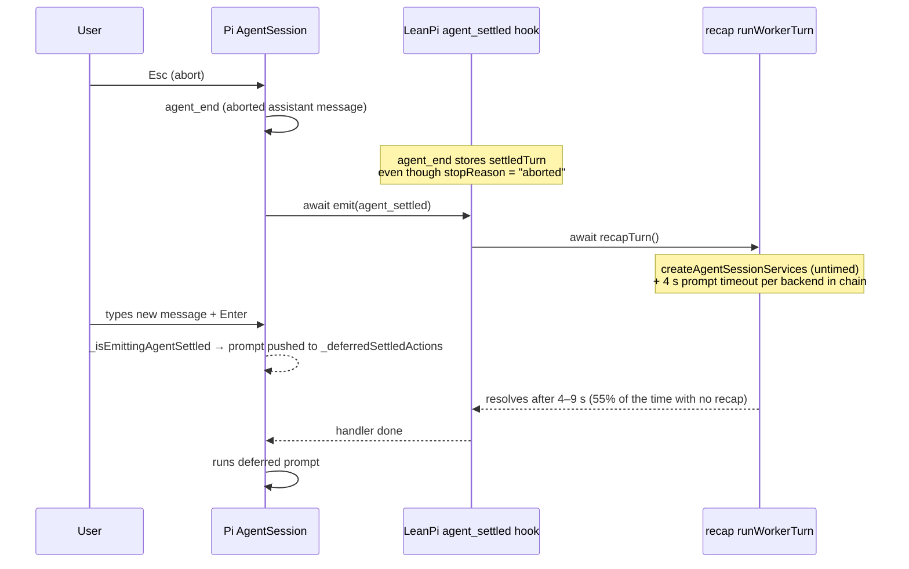
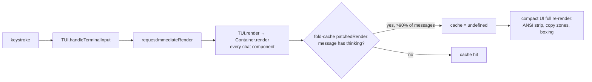

# Bug report: prompt delay after abort, and UI slowing down over time

Date: 2026-09-24 · Pi 0.87.1 · pi-claude-code-ui 1.0.83 · LeanPi 0.1.3 (`02adb10`)

| # | Symptom | Root cause | Severity |
|---|---------|------------|----------|
| 1 | Sometimes a message sent right after aborting waits several seconds before it starts | LeanPi's `agent_settled` hook **awaits** a recap model call, and Pi holds every new prompt until the `agent_settled` handlers finish | High: 4–9 s dead time, most visible after an abort |
| 2 | Typing and image submission get slower as the session goes on | `src/cli/fold-cache.ts` turns off the compact UI's per-message render cache for every assistant message that has reasoning, and that is >90% of them. Every keystroke re-renders the whole chat. | High: cost grows linearly with the length of the chat |

**Memory leak?** No evidence of one in LeanPi code. No `setInterval`, stdin listener or process listener builds up (`grep` across `src/` and `extensions/`: only `runtime/proc.ts` and bench signal handlers). The recap's nested Pi session is disposed (`src/backends/native.ts:210`). Bug 2 is **CPU per frame growing with transcript length**, not heap growth. It feels like a leak but a restart does not fix it: resuming a long session is just as slow. See "Ruling out a leak" below.

---

## Bug 1: delay when submitting after an abort

### Mechanism



### Evidence

1. **Pi defers prompts during `agent_settled`**:
   `node_modules/@earendil-works/pi-coding-agent/dist/core/agent-session.js:1208`
   ```js
   if (this._isEmittingAgentSettled) {
       this._deferredSettledActions.push(async () => await this.prompt(text, options));
       return;
   }
   ```
   `_emitAgentSettled` (`:532`) sets that flag around `await this._extensionRunner.emit({ type: "agent_settled" })`.

2. **LeanPi awaits a model call in that handler**: `src/index.ts:914`
   ```ts
   pi.on("agent_settled", async (_event, ctx) => {
       ...
       await deps.recap.recapTurn(ctx, turn);
   });
   ```
   The recap is on by default (`src/core/config.ts:351`) and uses the `quick` role (`opencode-go/deepseek-v4.1-flash`).

3. **Aborted turns still get a recap**: `agent_end` (`src/index.ts:894`) takes the last assistant message without checking `stopReason`. The recap module has an `isCompletedAssistant` filter that rejects `"aborted"` (`src/recap/index.ts:234`), but only `restore()` uses it. An abort therefore **always** starts a paid recap call, right when the user is about to type again.

4. **The "4 s ceiling" is not a ceiling**: `RECAP_TIMEOUT_MS = 4_000` is passed to `runWorkerTurn`. There it bounds only `session.prompt()`, per backend attempt (`src/backends/native.ts:173`). Before that, `createAgentSessionServices` runs untimed: it loads resources, including the user's `~/.pi/agent/extensions/subagent`. On top of that, a failed attempt moves on to the next backend in the role chain.

5. **Measured in this repo's own telemetry** (`.leanpi/telemetry.jsonl`, 71 `recap:` runs):

   | p50 | p90 | max | failed (no recap produced) |
   |-----|-----|-----|-----|
   | 4 363 ms | 8 212 ms | 9 430 ms | 39 / 71 (55%) |

   So the next prompt usually waits about 4 s and sometimes 9 s, and more than half the time that wait buys nothing.

It also happens after a normal (non-aborted) turn if the user types within about 4 s of the answer finishing. After an abort, the user almost always re-submits immediately, so they notice it.

### Solution

`clear()` already cancels a stale recap: every new prompt bumps `runId`, so a late result is discarded. The hook therefore has no reason to block settle.

1. **Stop blocking settle** (the fix), `src/index.ts:914`:
   ```ts
   pi.on("agent_settled", (_event, ctx) => {
       const turn = settledTurn;
       settledTurn = undefined;
       if (!turn || routePins().model) return;
       // Fire-and-forget: Pi defers the next prompt until this handler returns,
       // and `recap.clear()` on the next `input` already invalidates a late result.
       void deps.recap.recapTurn(ctx, turn).catch(() => {});
   });
   ```
   Do the same for the `await deps.recap.recapTurn(...)` in the `input` hook (`src/index.ts:710`). That one holds the handled external-harness turn open the same way.

2. **Skip aborted and errored turns** in `agent_end` (`src/index.ts:894`): only set `settledTurn` when `lastAssistant.stopReason` is not `"aborted"` or `"error"`. Export and reuse `isCompletedAssistant` from `src/recap/index.ts` rather than writing a second copy.

3. *(Optional, secondary)* Make `RECAP_TIMEOUT_MS` a real wall-clock bound: wrap the whole `run(...)` in `src/recap/index.ts:327` in a `Promise.race` with a timer. Once (1) lands this only affects cost, not latency.

### Verification (red → green)

- Unit test on `installTurnHooks`: register a recap runner that never resolves. Emit `agent_settled`, then assert the handler's promise resolves in under 50 ms. **Red today** (it hangs), green after (1).
- Unit test: an `agent_end` whose last assistant message has `stopReason: "aborted"` leads to **zero** runner calls on `agent_settled`. Red today, green after (2).
- Manual: `leanpi`, send a prompt, press Esc, immediately send another. It should start at once, with no 4–9 s pause.

---

## Bug 2: typing and image submission slow down over the session

### Mechanism



### Evidence

1. **Every keystroke renders the whole tree immediately**:
   `node_modules/@earendil-works/pi-tui/dist/tui.js:722-726`, where `handleInput(data)` is followed by `this.requestImmediateRender()`. `Container.render` (`tui.js:114`) calls `render(width)` on every child, i.e. every message in the chat.

2. **The compact UI's cache is what keeps long chats fast**, in its own words (`pi-claude-code-ui/extensions/index.ts:1398-1403`):
   > avoids re-running the per-line ANSI stripping (applyTerminalCopyZones, normalizeLeadingCheckGlyph, border boxing) on every scroll/expand re-render — the dominant CPU cost on long chats, scaling linearly with chat length.

3. **LeanPi clears that cache on every render of any message with reasoning**: `src/cli/fold-cache.ts:48`
   ```ts
   proto.render = function patchedRender(this, ...args) {
       if (carriesReasoning(this)) this[MESSAGE_RENDER_CACHE] = undefined;
       return inner.apply(this, args);
   };
   ```
   Its `ponytail:` note assumes "Reasoning messages are a small share of a transcript". Real sessions show the opposite:

   | session | assistant msgs | with thinking |
   |---------|---------------|---------------|
   | `…9b64.jsonl` | 180 | 166 (92%) |
   | `…e0aef.jsonl` | 260 | 234 (90%) |

   (`~/.pi/agent/sessions/*lean-pi*/`; with DeepSeek reasoning on, almost every turn thinks.)

   So with `--ui compact` (the default) and thinking-fold on (the default), the compact UI's cache is effectively off. Every keystroke costs O(chat length) ANSI processing, and each turn makes it worse.

4. **Image submission** goes through the same path. Attaching or pasting, then submitting, triggers several renders (editor update, user message append, streaming start), and each one pays the full-transcript cost.

### Solution

Clear the cache only when the message's children were actually rebuilt, not on every frame. `AssistantMessageComponent.updateContent` always does `this.contentContainer.clear()` and builds new child components. Thinking-fold's timer and Ctrl+T call that same `updateContent` (the one it captured at load), so "the first child is a different object" reliably detects a rebuild.

`src/cli/fold-cache.ts`:
```ts
/** The first content child the cache was last valid for; a rebuild replaces it. */
const RENDERED_CHILD = Symbol.for("leanpi:fold-cache-child");

proto.render = function patchedRender(this: Record<string | symbol, unknown>, ...args: unknown[]): unknown {
    if (carriesReasoning(this as never)) {
        const first = (this.contentContainer as { children?: unknown[] } | undefined)?.children?.[0];
        if (this[RENDERED_CHILD] !== first) {
            this[MESSAGE_RENDER_CACHE] = undefined;
            this[RENDERED_CHILD] = first;
        }
    }
    return (inner as (...rest: unknown[]) => unknown).apply(this, args);
};
```
Update the `ponytail:` note: the old "small share" claim was the bug.

If the fold ever rebuilds children without going through `updateContent`, this misses a toggle. That is the regression the existing Ctrl+T test must keep catching.

### Verification (red → green)

- Render-count test: build an `AssistantMessageComponent` with a thinking block, install the patch, spy on the compact UI's inner render work, and call `render(80)` twice with no content change. It should do the work **once**. **Red today** (twice), green after the fix.
- Keep the existing fold/Ctrl+T test green: after `updateContent` (toggle), the next render must show the new lines.
- Manual: resume `…e0aef.jsonl` (260 turns) under `--ui compact` and type. Input should keep up. Compare with `--ui plain`, which never had the patch, as a baseline.

---

## Ruling out a leak (5 min)

If typing is still slow after the Bug 2 fix, take heap snapshots before blaming CPU:

1. `NODE_OPTIONS=--inspect leanpi`, open `chrome://inspect`.
2. Heap snapshot at turn 5, then at turn 50. Compare retained `AgentSession` / `AssistantMessageComponent` counts.
3. Growth beyond the visible chat means a real leak and needs its own report. Otherwise it is the render cost above.

## Files to change

| File | Change |
|------|--------|
| `src/index.ts:914` | `agent_settled`: fire-and-forget recap |
| `src/index.ts:710` | `input` (owned turn): fire-and-forget recap |
| `src/index.ts:894` | `agent_end`: no `settledTurn` for aborted/errored turns |
| `src/recap/index.ts:234` | export `isCompletedAssistant` for reuse |
| `src/cli/fold-cache.ts:48` | clear the cache only when children were rebuilt |

Estimate: about 1 hour including the red/green tests, then `pnpm test && pnpm typecheck && pnpm lint`.
