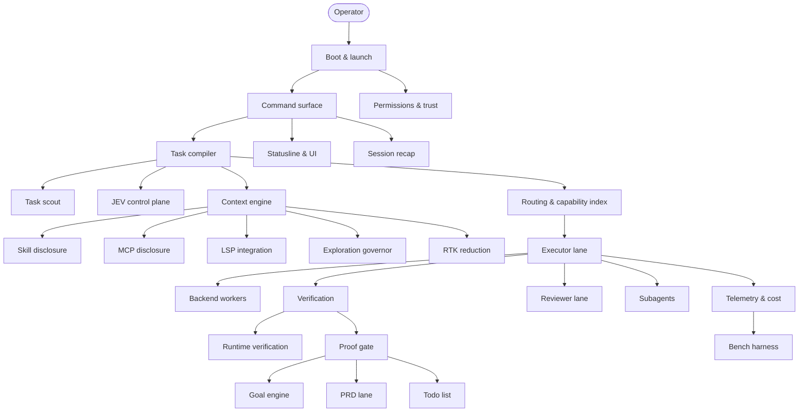

# LeanPi — systems

**Scope:** the systems inside `src/` as they run today, one page per system.
[`docs/architecture/README.md`](../architecture/README.md) is the single top-level
view (the planes, the turn lifecycle, the contract); this directory is the
per-system reference beside it. Where a page and the code disagree, the code is
the fact and the disagreement belongs in a PR.

Every system page states its **entry symbol** (the one function or value the
rest of the code calls), the modules that own it, the diagram of its flow, and
where its spec lives. Diagrams are [mermaid](https://mermaid.js.org/); GitHub
renders them inline.

## The systems at a glance

## Planes and systems

### Surface

| System | Entry symbol | Covers |
| --- | --- | --- |
| [Boot & launch](./boot-and-launch.md) | `activate()`, `createLeanPiSession()` | PRD-001, 016, 039 |
| [Command surface](./command-surface.md) | `commandRegistry.dispatch()`, `registerTurnLanesIfOwned()` | PRD-016, 048 |
| [Statusline & UI](./statusline-and-ui.md) | `LEANPI_STATUS_KEY`, `renderTurnOutcome()` | PRD-016 |
| [Session recap](./session-recap.md) | `createRecapController()` | PRD-036 |

### Decision

| System | Entry symbol | Covers |
| --- | --- | --- |
| [Task scout](./task-scout.md) | `scoutTask()` | PRD-003 |
| [Task compiler](./task-compiler.md) | `compileTask()` | PRD-004 |
| [JEV control plane](./jev-control-plane.md) | `ask()`, `ensureSite()` | PRD-002 |
| [Routing & capability index](./routing-and-capability.md) | `selectRoute()`, `predictRouteCost()`, `resolveRoleViaRanking()` | PRD-020, 024, 048 |
| [Subagents](./subagents.md) | `ensureDefaultConfig()`, `clampSubagentOverride()` | PRD-041, 049 |

### Context

| System | Entry symbol | Covers |
| --- | --- | --- |
| [Context engine](./context-engine.md) | `assemble()` | PRD-014 |
| [Skill disclosure](./skill-disclosure.md) | `selectSkills()`, `bundledSkillRoot()` | PRD-005, 026 |
| [MCP disclosure](./mcp-disclosure.md) | `registerMcpDisclosure()`, `createToolSurface()` | PRD-006, 045 |
| [LSP integration](./lsp-integration.md) | `selectLspMode()`, `registerLspTools()` | PRD-018 |
| [Exploration governor](./exploration-governor.md) | `explore()` | PRD-023 |
| [RTK reduction](./rtk-reduction.md) | `reduceToolOutput()` | PRD-019 |

### Execution

| System | Entry symbol | Covers |
| --- | --- | --- |
| [Executor lane](./executor-lane.md) | `runExecutor()` | PRD-007 |
| [Backend workers](./backends.md) | `runWorkerTurn()`, `runHarness()` | PRD-008 |
| [Reviewer lane](./reviewer-lane.md) | `buildPacket()`, `parseVerdict()` | PRD-011 |

### Evidence

| System | Entry symbol | Covers |
| --- | --- | --- |
| [Verification](./verification.md) | `verifyTask()` | PRD-009 |
| [Proof gate](./proof-gate.md) | `evaluateProofGate()`, `recover()` | PRD-010 |
| [Runtime verification](./runtime-verification.md) | `registerRuntimeVerifiers()`, `runIsolated()` | PRD-022 |

### State and policy

| System | Entry symbol | Covers |
| --- | --- | --- |
| [Permissions & trust](./permissions.md) | `installPermissionGuard()` | PRD-017 |
| [Telemetry & cost](./telemetry-cost.md) | `emitRunTelemetry()`, `aggregateRuns()` | PRD-015 |
| [Goal engine](./goal-engine.md) | `evaluateGoal()`, `runGoalLoop()` | PRD-013 |
| [PRD lane](./prd-lane.md) | `openPrdLane()`, `readPrdState()` | PRD-012 |
| [Todo list](./todo-list.md) | `syncFromPrd()`, `createTodoHandler()` | PRD-025 |

### Measurement

| System | Entry symbol | Covers |
| --- | --- | --- |
| [Bench harness](./bench-harness.md) | `main()` (bench CLI) | PRD-021 |

## Reading order

The turn path is the spine; read it in this order:

1. [Boot & launch](./boot-and-launch.md) → how a session starts.
2. [Command surface](./command-surface.md) → the two turn lanes.
3. [Task scout](./task-scout.md) → [Task compiler](./task-compiler.md) → [JEV control plane](./jev-control-plane.md) → [Routing](./routing-and-capability.md).
4. [Context engine](./context-engine.md) and its disclosure systems.
5. [Executor lane](./executor-lane.md) → [Backend workers](./backends.md).
6. [Verification](./verification.md) → [Proof gate](./proof-gate.md) → [Reviewer lane](./reviewer-lane.md) → [Goal engine](./goal-engine.md).
7. [Telemetry & cost](./telemetry-cost.md) closes the turn.

## Related docs

- [Architecture](../architecture/README.md) — planes, boot, turn lifecycle, contract.
- [Cost strategies](../architecture/cost-strategies.md) — why each mechanism exists.
- [PRD index](../PRDs/v1/INDEX.md) — every FR and its owning PRD.
