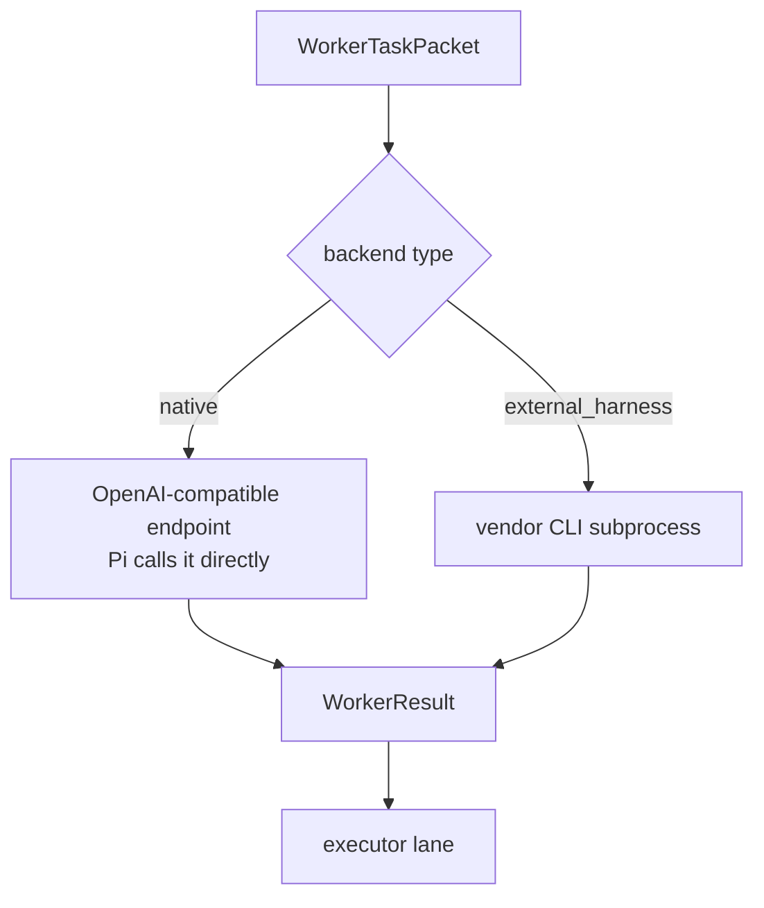

# Backend workers

**Plane:** execution · **Entry symbol:** `runWorkerTurn()`, `runHarness()` · **Spec:** PRD-008

A native backend (LeanPi owns the Pi agent loop) and an external harness worker
(Claude Code / Codex / OpenCode own the loop) return the **identical**
`WorkerResult` shape, so the executor never branches on `type`. The packet is
bounded by construction: objective, allowed tools, budget and an optional output
schema — no routing metadata, no transcript.

## Two backend kinds

Billing classification drives routing: `external_harness` → subscription; a
native backend with zero marginal cost → local; everything else → metered.

| Vendor | Invocation shape |
| --- | --- |
| claude | `claude -p --output-format json --allowedTools … [--json-schema …] [--model …] -- PROMPT` |
| codex | `codex exec --sandbox workspace-write --skip-git-repo-check --json [--model …] [-c model_reasoning_effort=…] [--output-schema …] PROMPT` |
| opencode | `opencode run --format json [--model …] [--agent …] [--session …] PROMPT` |

## Subscription detection

`src/backends/subscriptions.ts` asks two file questions per vendor plus a
login-status command (`claude auth status`, `codex login status`,
`opencode auth list`), and feeds the compiler a **deviation**, so a class bound to
a vendor this machine cannot use is routed away from rather than discovered by
spending an attempt.

## Modules

| Module | Owns |
| --- | --- |
| `src/backends/worker.ts` | `WorkerTaskPacket`, `WorkerResult`, `Billing`, `WorkerMcpServer`, `modelFor()` |
| `src/backends/registry.ts` | `BackendRegistry`, `runWorkerTurn()`, `RunWorkerTurnOptions` |
| `src/backends/harness.ts` | `HARNESS_DESCRIPTORS`, `runHarness()`, `spawnProcess()` |
| `src/backends/native.ts` | the native worker |
| `src/backends/subscriptions.ts` | `detectSubscriptions()`, `probeVendor()`, `subscriptionDeviations()` |

MCP tools travel to a vendor harness only when the permission guard resolves them
to `allow` (a vendor loop is outside the chokepoint and cannot prompt); a server's
`env` reaches the child's argv/env only — never telemetry, never a decision row.

## Read more

- [Architecture §10](../architecture/README.md), [Cost strategies §6](../architecture/cost-strategies.md)
- [Executor lane](./executor-lane.md), [Permissions & trust](./permissions.md), [MCP disclosure](./mcp-disclosure.md)
