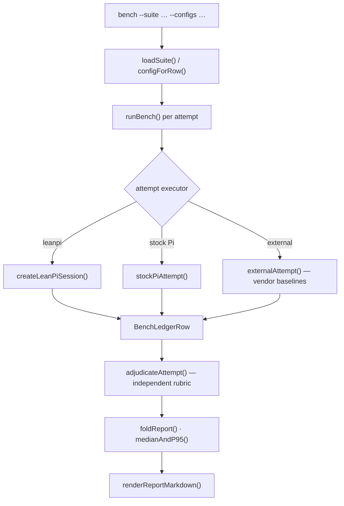

# Bench harness

**Plane:** measurement · **Entry symbol:** `main()` in `src/bench/cli.ts` · **Spec:** PRD-021

The harness owns the **matrix and the metrics**: which configurations run, how
each attempt is adjudicated independently of LeanPi's own gate, and what the
report says. It re-measures nothing — per-attempt cost, tokens and time come from
telemetry §52 records, and the external baselines are backend workers rather than
a second set of CLI drivers.

## Flow



The exit code never depends on §4's aspirational targets: a benchmark that
honestly reports "LeanPi cost 60% of baseline" has succeeded as a benchmark.
External baselines are gated behind `--external-baselines`.

## Commands

```
bench --suite bench/suites/seed --configs leanpi-no-jev,leanpi-jev
bench --list
bench --report jev --from bench/fixtures/telemetry/jev
bench --report rtk --from bench/fixtures/telemetry/rtk
bench --recompute bench/out/<runId>
```

`pnpm bench` runs `dist/bench/lane.js`; `pnpm bench:cost-gate` runs the
pre-publish regression gate (PRD-038).

## Modules

| Module | Owns |
| --- | --- |
| `src/bench/cli.ts` | `main()`, argument parsing, dispatch |
| `src/bench/lane.ts` | the entry wiring (`runArgv()`) |
| `src/bench/suite.ts` | `loadSuite()`, `configForRow()`, `coverageOf()` |
| `src/bench/runner.ts` | `runBench()`, the ledger |
| `src/bench/adapters.ts` | `leanPiAttempt()`, `stockPiAttempt()`, `externalAttempt()` |
| `src/bench/adjudicate.ts` | `adjudicateAttempt()`, rubric and golden runs |
| `src/bench/metrics.ts` | `foldReport()`, `medianAndP95()`, `renderReportMarkdown()` |
| `src/bench/report/` | `jevReport()`, `rtkReport()` |

## Read more

- [Benchmarks](../benchmarks/README.md), [bench rubric](../../bench/rubric.md)
- [Telemetry & cost](./telemetry-cost.md), [RTK reduction](./rtk-reduction.md)
