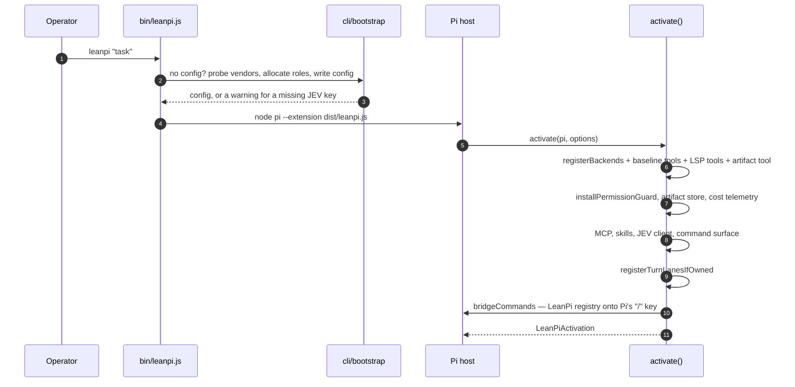

# Boot & launch

**Plane:** surface · **Entry symbol:** `activate()` (`src/index.ts`), `createLeanPiSession()` · **Spec:** PRD-001, PRD-016, PRD-039

`bin/leanpi.js` is a launcher; the harness itself is one Pi extension. Nothing
here embeds a model or holds a vendor credential — a session is Pi's runtime with
LeanPi's wiring attached.

## Flow

## Modules

| Module | Owns |
| --- | --- |
| `bin/leanpi.js` | argv → Pi argv; adds `.leanpi/` to `.git/info/exclude` on first run |
| `src/cli/launch.ts` | builds the Pi argv; `dependencyDir()` for SDK deep paths |
| `src/leanpi.ts` | the extension entry file Pi loads (a rename, so Pi reports `leanpi`) |
| `src/cli/bootstrap.ts` | first-run: detect vendors, allocate roles, write the machine config, warn on a missing JEV key |
| `src/cli/allocate.ts` | deterministic ladder allocation when JEV cannot answer `bootstrap.role_models` |
| `src/leanpi.ts` → `src/index.ts` | `activate()`: the registration hub and the re-export barrel |

## What `activate()` registers

Order is load-bearing:

1. one Pi provider per `native` backend, the five baseline tools, the seven LSP
   tools (registered once, inactive until a turn's compiled mode exposes a group);
2. `installPermissionGuard` — **after** the baseline tools, so the guarded
   `execute` wins the name — plus the session-keyed artifact store;
3. one JEV client per process, handed to the compiler by reference
   (`setCompilerContext`); `--no-jev` sets mode `disabled` and every site falls
   back deterministically;
4. the skill registry, command surface, capability providers (`skills`, `mcps`,
   `lsp`) and the tool-output pipeline (artifact capture + RTK reducer);
5. PRD-owned commands and the turn lanes, then `bridgeCommands` onto Pi's `/`
   key. Command output goes to `ui.notify`, never `sendMessage`, so it never
   enters the model's context.

Re-entering `activate()` replaces rather than stacks (owned commands, lanes and
capability providers all follow the same rule), because the bench boots a
session per task.

## The two runtime paths

`ownsExecutionLoop(config)` (`src/commands/turn-lanes.ts`) is the single most
consequential branch; see [command surface](./command-surface.md).

## Storage written at boot

| Path | Holds |
| --- | --- |
| `~/.config/leanpi/leanpi.config.yaml` | machine config (0600) when no project file exists |
| `~/.config/leanpi/credentials.json` | the JEV key (0600) |
| `.leanpi/` | project state, added to `.git/info/exclude` |

## Read more

- [Architecture §1–§3](../architecture/README.md)
- [Command surface](./command-surface.md), [Backend workers](./backends.md), [Permissions & trust](./permissions.md)
