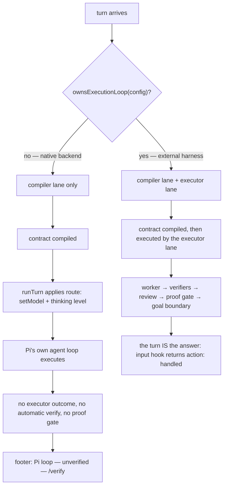

# Command surface & turn lanes

**Plane:** surface · **Entry symbol:** `commandRegistry.dispatch()`, `registerTurnLanesIfOwned()`, `ownsExecutionLoop()` · **Spec:** PRD-016, PRD-048

Two things live here: the `/` command dispatcher, and the two turn lanes that
connect the compiler to the executor. They live in `src/commands/turn-lanes.ts`
rather than inline in `activate()` so the chain a real session runs is the chain
a spec can register and drive.

## The turn lanes

`ownsExecutionLoop` is true only when **all** of `quick`, `balanced` and `strong`
resolve to an *enabled* `external_harness` backend. On the native path Pi's own
loop executes and LeanPi only compiles and routes; the status line says
"unverified" rather than implying evidence that was never collected.

| | native backend | external harness |
| --- | --- | --- |
| executor | Pi's own loop | `runExecutor` → vendor CLI |
| routing effect | `setModel` + `setThinkingLevel`, clamped by `backends.<name>.thinkingLevel` | model and effort pinned on the worker packet |
| deterministic verification | only via `/verify` | automatic, inside `runExecutor` |
| proof gate, review ladder, goal boundary | not run | run, on the turn's evidence |
| the answer | Pi's assistant message | the lane's outcome, returned as `action: "handled"` |

The two Pi hooks that drive this (`src/index.ts`):

- `input` — when LeanPi owns the loop, runs the lanes and returns
  `{ action: "handled" }` so Pi does not answer the same prompt twice;
- `before_agent_start` — every other case: runs the lanes, applies the compiled
  route to the session, strips Pi's skill catalog from the system prompt
  (`withoutSkillCatalog`), and arms `pendingRun` so `agent_end` writes one
  telemetry record.

`createLeanPiSession()` → `runTurn()` goes through `runLanes` directly and
applies the same compiled model and thinking level.

## The dispatcher

One `Map<string, Command>` plus `register()` and `dispatch()` — deliberately a
map and not a plugin framework: no lifecycle hooks, no middleware, no per-command
permission layer (permissions are enforced at the tool boundary). Every PRD
registers here rather than standing up a second dispatcher, which is what makes
`/help` complete for free.

`/model` and `/role` are PRD-048: they may bind a CLI model to a role mid-session,
so the executor lane is always installed and its `run` is gated on `ownsTurn`.

## Modules

| Module | Owns |
| --- | --- |
| `src/commands/registry.ts` | `commandRegistry`, `Command`, `dispatch()` |
| `src/commands/surface.ts` | `SessionHost` (Pi's `SessionManager` wrapped), `CommandSurface` shared state |
| `src/commands/session.ts` | `registerLane`, `runLanes`, `thinkingLevelFor` |
| `src/commands/turn-lanes.ts` | `ownsExecutionLoop`, `ownsTurn`, `registerTurnLanesIfOwned` |
| `src/commands/{status,model,role,route,verify,doctor,jev,config,context,skills,recap,subagents-limit,thinking-fold}.ts` | one command family each |

## Read more

- [Architecture §3–§4](../architecture/README.md)
- [Executor lane](./executor-lane.md), [Task compiler](./task-compiler.md), [Statusline & UI](./statusline-and-ui.md)
