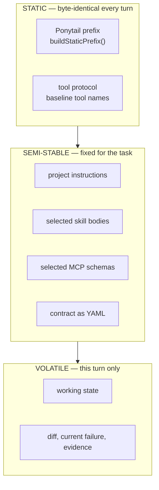

# Context engine

**Plane:** context · **Entry symbol:** `assemble()` · **Spec:** PRD-014

The single place a provider request is built. Three layers, and order is the
cache strategy (`ROADMAP §22`): dynamic content strictly last, so the cacheable
prefix is maximal.

## Layers

Each block is content-hashed; a repeated block is emitted as its existing
`artifact://` reference rather than a second copy.

## The artifact store

`src/context/artifacts.ts` is the reversibility mechanism under all of this:
anything over `context.artifact_threshold_bytes` becomes a reference, and the
`artifact` tool (the one tool beyond the five baseline names) expands it.
`ArtifactNotFoundError` is the only failure mode.

## Modules

| Module | Owns |
| --- | --- |
| `src/context/prompt.ts` | `assemble()`, `withoutSkillCatalog()` — the one request builder |
| `src/context/artifacts.ts` | `createArtifactStore()`, dedup and expansion |
| `src/context/working-state.ts` | `buildWorkingState()`, `serializeWorkingState()`, `WorkingStateSources` provider port |
| `src/context/excerpt.ts` | `buildExcerpt()`, `buildSnippet()` — byte-bounded excerpts |
| `src/context/compaction.ts` | `compact()` — context compaction, recorded |

## State/context JEV sites

`context.retention_relevance` (`RETENTION_SITE_ID`) and the RTK policy site; the
governor's sites live in [exploration](./exploration-governor.md).

## Read more

- [Architecture §8](../architecture/README.md), [Cost strategies §2](../architecture/cost-strategies.md)
- [Skill disclosure](./skill-disclosure.md), [MCP disclosure](./mcp-disclosure.md), [Exploration governor](./exploration-governor.md), [RTK reduction](./rtk-reduction.md)
