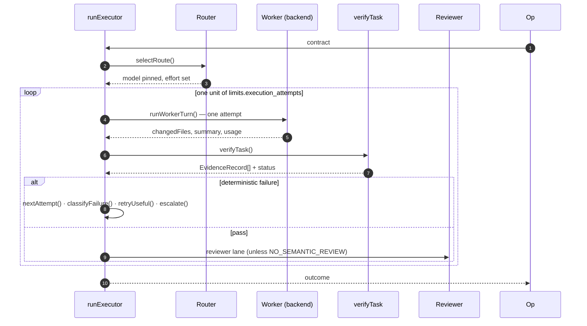

# Executor lane

**Plane:** execution · **Entry symbol:** `runExecutor(contract, deps)` · **Spec:** PRD-007

The executor projects the contract into a task packet carrying exactly the six
`ROADMAP §28` fields — `EXECUTOR_TASK_KEYS` — and drives bounded attempts through
the [backend workers](./backends.md). Nothing about the routing process crosses
that boundary: not the classifier scores, not the JEV decision records, not the
backend-selection reasons. The projection is a whitelist whose produced key set
is asserted.

## Flow

Termination is structural: every loop iteration spends exactly one unit of
`limits.execution_attempts` and invokes exactly one backend, so total invocations
can never exceed the budget whatever a model or a JEV answer asks for. Escalation
never grants an attempt — it only changes what the next one runs on. The reviewer
verdict budget is bounded separately by `limits.semantic_review_rounds`.

## Modules

| Module | Owns |
| --- | --- |
| `src/executor/lane.ts` | `runExecutor()`, `EXECUTOR_TASK_KEYS`, `renderExecutorPrompt()`, `ROUTE_SITE_ID` |
| `src/executor/retry.ts` | `nextAttempt()`, `recordAttempt()`, `RetryBudget` |
| `src/executor/escalation.ts` | `classifyEscalation()`, `escalate()`, `needsClarification()` |
| `src/executor/sites.ts` | `executor.failure_classification`, `executor.retry_usefulness`, `executor.escalation_reason`, `executor.user_clarification_need` |

## Read more

- [Architecture §5](../architecture/README.md), [Cost strategies §5](../architecture/cost-strategies.md)
- [Task compiler](./task-compiler.md), [Backend workers](./backends.md), [Verification](./verification.md), [Reviewer lane](./reviewer-lane.md), [Proof gate](./proof-gate.md)
