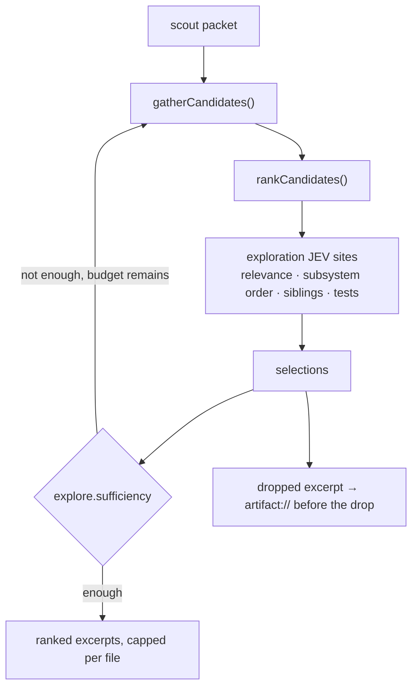

# Exploration governor

**Plane:** context · **Entry symbol:** `explore()` · **Spec:** PRD-023

Candidates in, a bounded selection out. The governor is seeded from the scout
packet, runs budget-bounded rounds, and stores every dropped excerpt **before**
the drop — so a drop is reversible through the artifact store.

## Flow

Every site has a deterministic fallback (`candidateFallback`, `snippetFallback`,
`subsystemFallback`, `siblingFallback`, `testFallback`, `sufficiencyFallback`),
so exploration runs with JEV disabled.

## Sites

| Site id | Question |
| --- | --- |
| `explore.candidate_relevance` | which candidate files matter |
| `explore.snippet_relevance` | which snippets of a candidate matter |
| `explore.subsystem_order` | which subsystem to visit first |
| `explore.sibling_expansion` | whether to expand across siblings |
| `explore.test_relevance` | which tests are relevant |
| `explore.sufficiency` | stop, or another round |

## Modules

| Module | Owns |
| --- | --- |
| `src/exploration/governor.ts` | `explore()`, `createExplorationSession()` |
| `src/exploration/gather.ts` | `gatherCandidates()`, `createFileSearch()` |
| `src/exploration/rank.ts` | `rankCandidates()`, `lexicalSelect()`, `overlayScores()` |
| `src/exploration/budget.ts` | `BudgetLedger` — bounded rounds |
| `src/exploration/tests.ts` | `discoverTests()`, `rankTests()` |
| `src/exploration/sites.ts` | `registerExplorationSites()` |

## Read more

- [Architecture §8](../architecture/README.md), [Cost strategies §4](../architecture/cost-strategies.md)
- [Context engine](./context-engine.md), [Task scout](./task-scout.md), [LSP integration](./lsp-integration.md)
