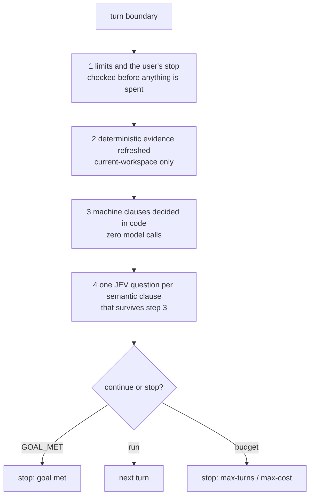

# Goal engine

**Plane:** state & policy · **Entry symbol:** `evaluateGoal()`, `runGoalLoop()` · **Spec:** PRD-013

Nothing here schedules, polls or spins: the engine is one pure evaluation
function the executor calls at a boundary, plus the record it reads and the
`/goal` command that sets it.

## The four steps, in order

The order is the whole point. JEV is reached only when no deterministic clause is
outstanding: an answer that could not change the continue/stop decision is
exactly the inference `ROADMAP §6.4` forbids buying. `GOAL_MET` is reachable only
from fresh deterministic evidence plus the proof gate's decision table, never
from an executor's self-report. The site's declared fallback is
`insufficient_evidence` — a disabled or unreachable JEV can never fabricate
completion.

## Stop precedence

`STOP_PRECEDENCE` in `src/goal/limits.ts` orders the stops (user stop, budget,
evidence). `--max-turns` and `--max-cost` are optional; **uncapped is the
default**.

## Modules

| Module | Owns |
| --- | --- |
| `src/goal/index.ts` | barrel |
| `src/goal/boundary.ts` | `evaluateGoal()`, `semanticQuestion()`, the goal JEV site |
| `src/goal/state.ts` | `createGoalStore()`, `newGoalState()`, `parseGoalArgs()` |
| `src/goal/limits.ts` | `checkBudget()`, `sessionCost()`, `STOP_PRECEDENCE` |
| `src/goal/clauses.ts` | `splitClauses()` — machine vs semantic |
| `src/goal/from-prd.ts` | `derivedGoalText()`, `prdGoalSource()` — a goal derived from an active PRD |
| `src/goal/command.ts` | `/goal` |

## State

`.leanpi/goal.json` holds the active goal and its limits.

## Read more

- [Architecture §9](../architecture/README.md), [PRD-013](../PRDs/v1/done/PRD-013-goal-engine.md)
- [Proof gate](./proof-gate.md), [PRD lane](./prd-lane.md), [Todo list](./todo-list.md)
