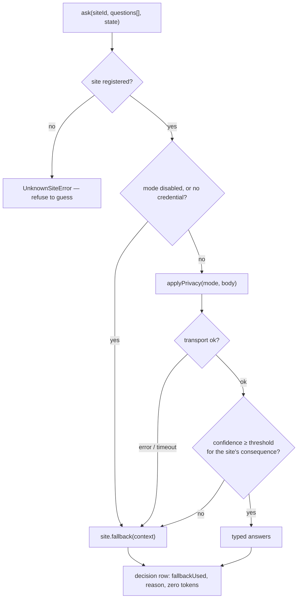

# JEV control plane

**Plane:** decision · **Entry symbol:** `ask(siteId, questions, state)`, `ensureSite()` · **Spec:** PRD-002, PRD-032, PRD-042

One function and one structural guarantee: a decision site cannot exist without a
deterministic fallback, so no decision is ever blocked on the network. JEV is
never registered as a tool — no executor model can spend a turn calling it.

## Flow

## Properties

| Property | Implementation |
| --- | --- |
| Decision sites | declared with `ensureSite({ id, questions, returnType, consequence, fallback, telemetryTag })` (`src/jev/registry.ts`); registration rejects a missing fallback, a duplicate id, or a question/return-type mismatch |
| Consequence | per site — `low`/`normal`/`high`; thresholds 0.5 / 0.7 / 0.85 (`src/jev/confidence.ts`) |
| Asymmetry | a `high` site rejects the whole batch if any answer is below threshold; `normal`/`low` sites replace only the failed answers |
| Wire | `POST https://api.typesafe.ai/v1/systemone`, `jev-latest`, 20 s timeout, $0.042/M input tokens |
| Credentials | `config.jev.apiKey` → `~/.config/leanpi/credentials.json` (0600) → `JEV_API_KEY` → project `.env` (read, never exported), resolved per call |
| Privacy | `enabled` / `metadata-only` (counts, kinds, extensions, salted path hashes) / `redacted` / `disabled`; one redactor for payloads and log rows |
| Log | `.leanpi/decisions.jsonl`, one row per site with `fallbackUsed`, `reason`, `confidence`, tokens |
| Local provider | `--laya` routes the same sites to a local model (`src/jev/laya.ts`, provider `laya`, PRD-042) |

## Modules

| Module | Owns |
| --- | --- |
| `src/jev/registry.ts` | `ensureSite()`, `ask()` site lookup, `UnknownSiteError` |
| `src/jev/client.ts` | `ask()`, transport, per-call credential resolution |
| `src/jev/confidence.ts` | `accept()` — the per-consequence thresholds |
| `src/jev/privacy.ts` | `applyPrivacy()`, one redactor |
| `src/jev/credentials.ts` | the key resolution order |
| `src/jev/log.ts` | `.leanpi/decisions.jsonl` |
| `src/jev/provider.ts`, `laya.ts` | remote vs local provider |
| `src/jev/types.ts` | `JevQuestion` (`Choice` / `Score` / `Noul`), `JevResult`, `JevUsage` |

## Sites by stage

| Stage | Sites |
| --- | --- |
| planning | `gate.prd_required` |
| classification | `classify.execution_complexity`, `classify.required_capability`, `classify.review_risk_input` |
| routing | `routing.reasoning_effort`, `routing.quota_preference`, `routing.delegation_worth` |
| disclosure | `skill.disclosure`, `mcp.disclosure`, `lsp.usefulness` |
| exploration | `explore.candidate_relevance`, `explore.snippet_relevance`, `explore.subsystem_order`, `explore.sibling_expansion`, `explore.test_relevance`, `explore.sufficiency` |
| execution | `executor.failure_classification`, `executor.retry_usefulness`, `executor.escalation_reason`, `executor.user_clarification_need` |
| evidence | `verify.regression_scope`, `proof.sufficiency`, `proof.missing_proof_category`, `review.level` |
| context | `context.retention_relevance`, `rtk.reduction_policy` |
| session | `goal.semantic_completion`, `prd.criterion_satisfied`, `bootstrap.role_models` |

Two decisions are deliberately **not** JEV sites: model selection over the
capability index (arithmetic) and permission decisions (a security boundary that
must be a deterministic function of config).

## Read more

- [Architecture §7](../architecture/README.md), [PRD index — JEV decision sites](../PRDs/v1/INDEX.md)
- [Cost strategies](../architecture/cost-strategies.md), [Task compiler](./task-compiler.md)
