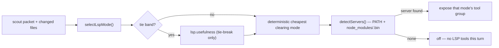

# LSP integration

**Plane:** context · **Entry symbol:** `selectLspMode()`, `registerLspTools()`, `lspSelectionOf()` · **Spec:** PRD-018

Four pieces, each with one owner: `mode` selects, `detect` resolves a server,
`client` speaks LSP lazily over stdio, `tools` exposes the mode's group. The
provider is the only thing the compiler touches.

## Flow

Modes are ordered cheapest-first (`LSP_MODE_ORDER`): `off` → diagnostics →
navigation. Detection is static; the compiled mode decides which tool group a
turn exposes. The provider contributes an availability flag to the contract's
`capabilities.lsp`.

## Modules

| Module | Owns |
| --- | --- |
| `src/lsp/mode.ts` | `selectLspMode()`, `cheapestMode()`, `preferTargetedCheck()` |
| `src/lsp/detect.ts` | `detectServers()`, `LSP_SERVER_COMMANDS` |
| `src/lsp/client.ts` | `LspClient`, lazy stdio, `closeLspClients()` |
| `src/lsp/tools.ts` | `lspToolDefinitions()`, `lspToolsForMode()`, `applyLspTools()` |
| `src/lsp/provider.ts` | `createLspProvider()`, `lspSelectionOf()` |
| `src/lsp/site.ts` | `lsp.usefulness` (registered only as a tie-break) |
| `src/lsp/config.ts` | `LSP_CONFIG_MODES`, per-project overrides |

## Read more

- [Architecture §8](../architecture/README.md), [PRD-018](../PRDs/v1/done/PRD-018-lsp-integration.md)
- [Context engine](./context-engine.md), [Exploration governor](./exploration-governor.md)
