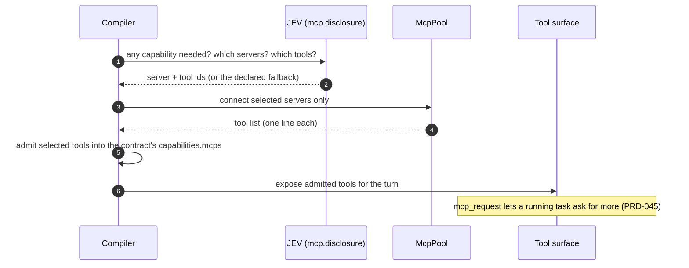

# MCP disclosure

**Plane:** context · **Entry symbol:** `registerMcpDisclosure()`, `selectMcpTools()`, `createToolSurface()` · **Spec:** PRD-006, PRD-045

MCP servers are discovered but their tool schemas do not enter context wholesale.
Three questions decide disclosure — any capability needed, which servers are
relevant, which tools of those are needed — and hydration happens **after** the
decision. While deciding, the model sees one line per tool; only admitted tools
get their full schema.

## Flow

## Properties

| Property | Implementation |
| --- | --- |
| Catalog cache | `.leanpi/cache/mcp-catalog.json` — after a connection; schemas only for selected tools |
| OAuth tokens | `.leanpi/mcp-auth.json` (0600); `McpAuthRequiredError` surfaces a manual auth step |
| Mid-task request | `mcp_request` tool + `mcp.disclosure` phase `request` (PRD-045) |
| Permission scope | `mcp` is one of the nine permission scopes (PRD-017) |

## Modules

| Module | Owns |
| --- | --- |
| `src/mcp/index.ts` | barrel |
| `src/mcp/select.ts` | `selectMcpTools()`, the three-question decision |
| `src/mcp/client.ts` | `createMcpPool()`, lazy connection |
| `src/mcp/catalog.ts` | `buildCatalog()`, schema cache read/write |
| `src/mcp/tools.ts` | `createToolSurface()`, `mcpToolName()`, `mcpRequestDefinition()` |
| `src/mcp/command.ts` | `/mcp`; `registerMcpDisclosure()` provider |

## Read more

- [Architecture §8](../architecture/README.md), [PRD-006](../PRDs/v1/done/PRD-006-mcp-disclosure.md)
- [Context engine](./context-engine.md), [Skill disclosure](./skill-disclosure.md), [Permissions & trust](./permissions.md)
