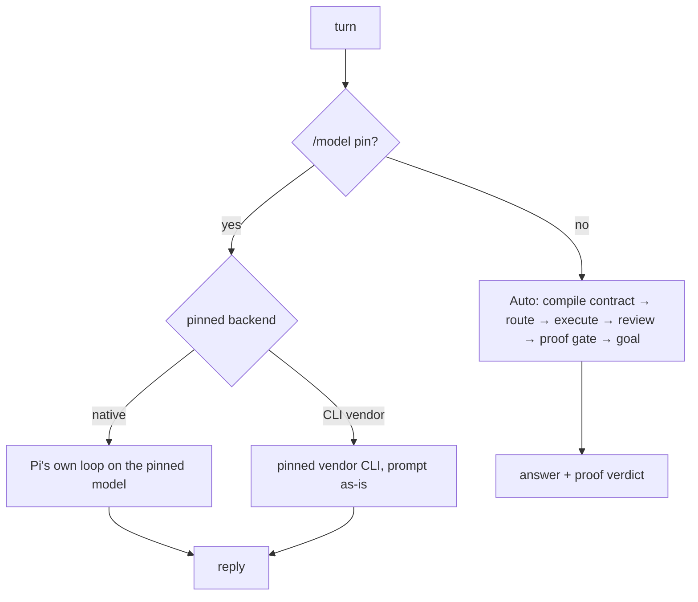
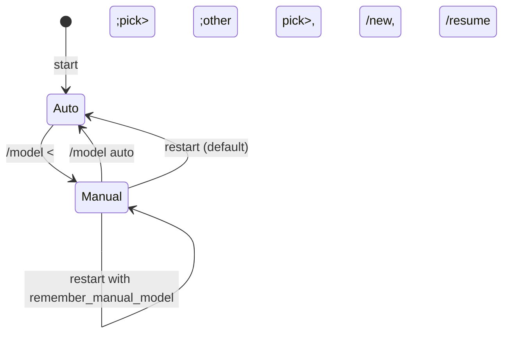

# Model modes: Auto and Manual

**Plane:** surface · **Entry symbol:** `routePins().model`, `compilerLane()` · **Spec:** PRD-048

LeanPi has two modes, and only two.

| | **Auto** (default) | **Manual** |
|---|---|---|
| Entered by | starting LeanPi; `/model` → auto | `/model` → pick a model |
| Who picks the model | the router, per turn | the operator, once |
| Contract, JEV, PRD gate, exploration, review, proof gate, goal boundary | yes | **none** |
| Output | the answer plus the proof verdict | the model's reply, nothing else |
| Footer | router's pick, `Auto` | the pinned model, `Manual` in red; redrawn the moment `/model` changes |
| Survives `/new`, `/resume` | — | yes |
| Survives a restart | — | only with `remember_manual_model: true` |

**Auto** is LeanPi: the harness classifies the turn, routes it to a model, and
proves the result.

**Manual** is a plain harness: the prompt goes to the model you picked, and its
reply comes back. It stays in effect until `/model` switches back to Auto.

## Lifetime

- The pin is session-process state, never a config write.
- `remember_manual_model: true` in `leanpi.config.yaml` (default `false`) also saves the pick
  to `~/.leanpi/model.json`; startup reads it and comes back in Manual. `/model auto` deletes it.
- A CLI pin keeps its conversation through the vendor's session id (`claude --resume` and
  equivalents); `/new`, `/resume`, `/model auto` or a repin start a fresh one.
- Role bindings are a different thing: `/role` writes the config the router uses in Auto.
