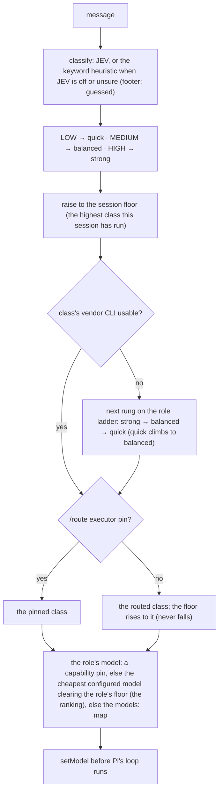
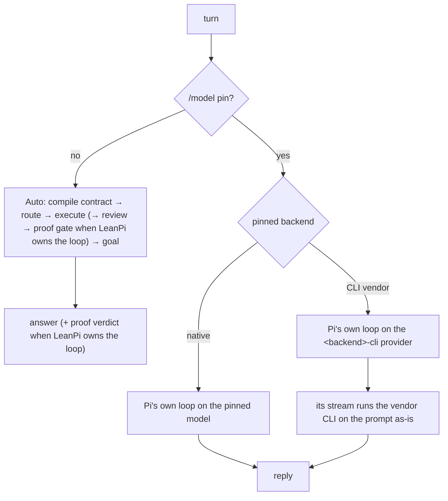
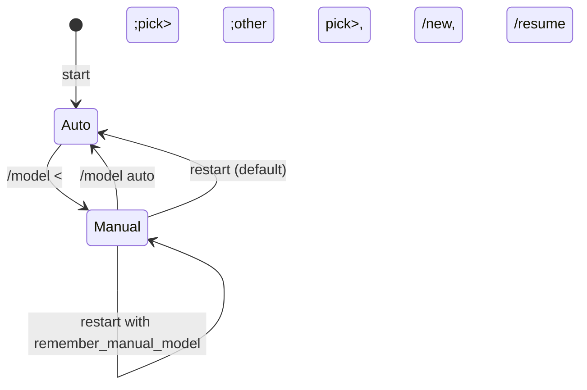

# Model modes: Auto and Manual

**Plane:** surface · **Entry symbol:** `routePins().model`, `compilerLane()` · **Spec:** PRD-048, PRD-051, PRD-053

LeanPi has two modes, and only two.

| | **Auto** (default) | **Manual** |
|---|---|---|
| Entered by | starting LeanPi; `/model` → auto | `/model` → pick a model |
| Who picks the model | the router: the first message decides, later messages may only escalate | the operator, once |
| Contract, JEV, PRD gate, exploration | yes | **none** |
| Review, proof gate | only when every executor role is a vendor CLI (LeanPi owns the loop) | **none** |
| Output | Pi's reply; the proof verdict when LeanPi owns the loop | the model's reply, nothing else |
| Footer | the installed model, `Auto`, thinking level, task size, `guessed` when JEV could not decide | the pinned model, `Manual` in red; redrawn the moment `/model` changes — no `LeanPi: …` phase |
| Chat | Pi's messages, or LeanPi's report | a regular Pi turn on the pinned model, native or CLI: prompt, spinner, reply, Esc, usage |
| Survives `/new`, `/resume` | — (the escalation floor resets) | yes |
| Survives a restart | — | only with `remember_manual_model: true` |

**Auto** is LeanPi: the harness classifies the turn and routes it to a model.
On a config whose roles include a native backend (the usual case), Pi's own loop
runs the turn on that model and nothing reviews it afterwards. Only an
all-vendor-CLI config hands the turn to LeanPi's executor lane, which adds the
reviewer and the proof gate.

## How Auto picks the model

```mermaid
flowchart TD
    M[message] --> C["classify: JEV, or the keyword heuristic when JEV is off or unsure (footer: guessed)"]
    C --> X["LOW → quick · MEDIUM → balanced · HIGH → strong"]
    X --> F["raise to the session floor (the highest class this session has run)"]
    F --> U{class's vendor CLI usable?}
    U -- no --> D["next rung on the role ladder: strong → balanced → quick (quick climbs to balanced)"]
    U -- yes --> P
    D --> P{"/route executor pin?"}
    P -- yes --> R[the pinned class]
    P -- no --> R2["the routed class; the floor rises to it (never falls)"]
    R --> B["the role's model: a capability pin, else the cheapest configured model clearing the role's floor (the ranking), else the models: map"]
    R2 --> B
    B --> S["setModel before Pi's loop runs"]
```

- **First message decides.** A follow-up like "now run the tests" stays on the model that did
  the work. A later harder message escalates; nothing drops back until `/new` or `/route reset`.
- **The ranking picks the role's model.** Among the models the config binds to *any* role, a role
  runs the cheapest one that clears its floor, so `balanced: claude/opus` beside a native
  deepseek that clears 70 still runs deepseek — streaming in Pi's loop. To force a model onto a
  role, set `capability.roles.<role>.pin`. (v0.1.10 briefly made bindings final; every normal turn
  then ran as a headless vendor-CLI run that shows nothing until done, so v0.1.11 restored this.)
- **Config layers.** `~/.config/leanpi/leanpi.config.yaml` is the base; a repo's
  `leanpi.config.yaml` overrides only the entries it sets. An entry (`backends.<name>`,
  `models.<role>`) is replaced whole, never field by field, and `jev:` is replaced as one
  section, so a repo can never pair your stored `apiKey` with an endpoint it chose. Lists replace.
- **`/route executor <class>`** pins the class for the session; `/route reset` returns to the
  classifier and clears the floor, but leaves a `/model` pin alone.

**Manual** is a plain harness: the prompt goes to the model you picked, and its
reply comes back. It stays in effect until `/model` switches back to Auto.

```mermaid
flowchart TD
    T[turn] --> P{"/model pin?"}
    P -- no --> A["Auto: compile contract → route → execute (→ review → proof gate when LeanPi owns the loop) → goal"]
    P -- yes --> K{pinned backend}
    K -- native --> N["Pi's own loop on the pinned model"]
    K -- CLI vendor --> N2["Pi's own loop on the &lt;backend&gt;-cli provider"]
    N2 --> C[its stream runs the vendor CLI on the prompt as-is]
    N --> R[reply]
    C --> R
    A --> V["answer (+ proof verdict when LeanPi owns the loop)"]
```

## Lifetime

```mermaid
stateDiagram-v2
    [*] --> Auto: start
    Auto --> Manual: /model &lt;pick&gt;
    Manual --> Manual: /model &lt;other pick&gt;, /new, /resume
    Manual --> Auto: /model auto
    Manual --> Auto: restart (default)
    Manual --> Manual: restart with remember_manual_model
```

- The pin is session-process state, never a config write.
- `remember_manual_model: true` in `leanpi.config.yaml` (default `false`) also saves the pick
  to `~/.leanpi/model.json`; startup reads it and comes back in Manual. `/model auto` deletes it.
- A CLI pin keeps its conversation through the vendor's session id (`claude --resume` and
  equivalents); `/new`, `/resume`, `/model auto` or a repin start a fresh one.
- A CLI pin is a Pi model (PRD-051, `src/backends/cli-provider.ts`): `/model` registers a
  `<backend>-cli` provider (never the backend's own name — Pi ships `opencode` and `opencode-go`)
  and `setModel`s it, so Pi's footer names it and Pi's loop runs the turn. The provider's stream
  sends the last user message to the vendor CLI, maps its reply and usage onto the assistant
  message, and kills the vendor on Esc. Pi's tool declarations are ignored: the CLI uses its own.
- `claude --model opus` runs an alias. The result's `modelUsage` names the full id, which is saved
  to `~/.leanpi/model-ids.json`; the pin, the footer and the `/model` picker then use it
  (`claude-opus-5-5`). Only a real run teaches an id — nothing is guessed.
- Role bindings are a different thing: `/role` writes the config the router uses in Auto.
