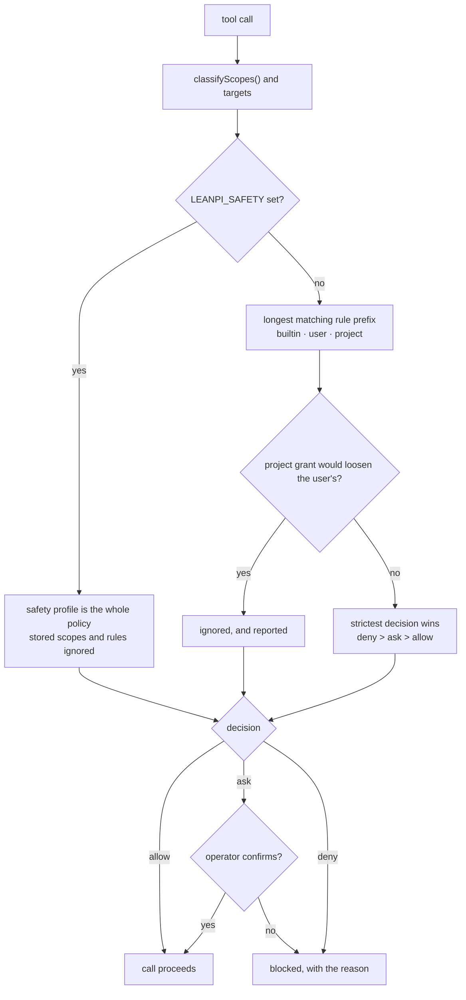

# Permissions & trust

**Plane:** state & policy · **Entry symbol:** `installPermissionGuard()` · **Spec:** PRD-017

Nine scopes — `read`, `edit`, `shell`, `network`, `mcp`, `external_dir`,
`subagent`, `git_destructive`, `package_install` — resolved by scope and target.
The guard is also the redaction boundary: tool results are scanned for secret
values before they reach the model, and the execution tool spawns children with
an allowlisted environment instead of the parent's.

## Flow

A project can only make permissions stricter, never looser than the user's.

## Modules

| Module | Owns |
| --- | --- |
| `src/permissions/guard.ts` | `installPermissionGuard()` |
| `src/permissions/rules.ts` | `classifyScopes()`, `DECISION_RANK`, `globMatch()`, `escapesRoot()` |
| `src/permissions/state.ts` | `loadPermissionState()`, scopes and rules |
| `src/permissions/trust.ts` | project trust records, `resolvedDefaults()` |
| `src/permissions/secrets.ts` | secret scan before results reach the model |
| `src/permissions/commands.ts` | `/permissions` |

## Where permissions live

| Path | Holds |
| --- | --- |
| `~/.config/leanpi/permissions.json` | user-scope permissions and project trust records |
| project `.leanpi/` | project-scope grants (stricter only) |
| `LEANPI_SAFETY` / `--safety low\|medium\|high` | a whole-session profile that overrides stored rules |

Permission decisions are deliberately **not** JEV sites: a security boundary must
be a deterministic function of config.

## Read more

- [Architecture §10](../architecture/README.md), [PRD-017](../PRDs/v1/done/PRD-017-permissions-trust.md)
- [Backend workers](./backends.md), [MCP disclosure](./mcp-disclosure.md), [Runtime verification](./runtime-verification.md)
