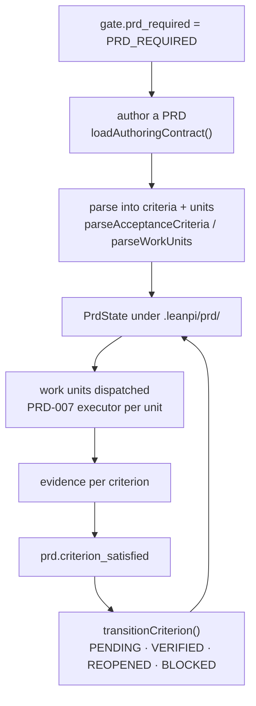

# PRD lane

**Plane:** state & policy · **Entry symbol:** `openPrdLane()`, `readPrdState()` · **Spec:** PRD-012

Structured planning when the gate says a task needs it. One record per acceptance
criterion plus the work units derived from the PRD body, persisted as a single
JSON file. The PRD body itself lives in the artifact store and only its
`artifact://` reference is kept here, so nothing in this module can hand a model
the whole PRD.

## Flow

Status transitions are the only writer: evidence in, status out. Everything else
(units, routing annotations, the goal descriptor) is derived on read, so no copy
of a criterion's status exists that could drift.

## Modules

| Module | Owns |
| --- | --- |
| `src/prd/dispatch.ts` | `openPrdLane()`, lazy lane-module loading |
| `src/prd/state.ts` | `createPrdState()`, `readPrdState()`, `writePrdState()`, `transitionCriterion()`, `REQUIREMENT_SECTIONS` |
| `src/prd/creator.ts` | `createPrdAuthor()`, `loadAuthoringContract()`, `parseAcceptanceCriteria()` |
| `src/prd/manager.ts` | `createPrdManager()`, work units |
| `src/prd/goal.ts` | `deriveGoal()` — remaining criteria as a goal |
| `src/prd/commands.ts` | `/prd`; `registerPrdCommandsLazily()` |

JEV site: `prd.criterion_satisfied`. The authoring contract prefers the installed
`prd-creator` skill and falls back to the bundled one (PRD-026), so the lane works
with no installed skill library.

## Read more

- [Architecture §9](../architecture/README.md), [PRD-012](../PRDs/v1/done/PRD-012-prd-lane.md)
- [Task compiler](./task-compiler.md), [Goal engine](./goal-engine.md), [Todo list](./todo-list.md)
