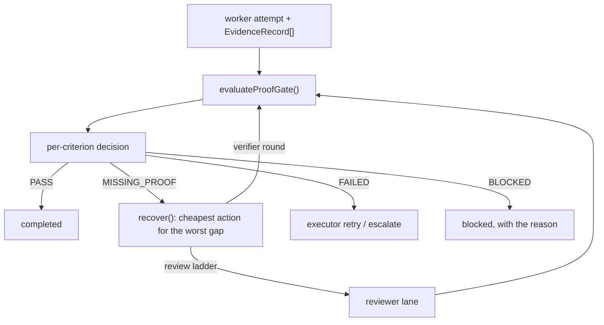

# Proof gate

**Plane:** evidence · **Entry symbol:** `evaluateProofGate()`, `recover()` · **Spec:** PRD-010

The contract's criteria are decided against **this turn's** evidence, read with
the hash the verifier stamped. Each criterion gets a decision —
`PASS` · `MISSING_PROOF` · `FAILED` · `BLOCKED` — and the gate either completes
the turn or names the cheapest action for the worst gap.

## Flow

## Decisions are total and explicit

`decideCriterion()` folds coverage + evidence + verdict into one of the four
decisions; `detectContradiction()` catches an executor claim that the evidence
contradicts; `coverageFallback()` and `gapCategoryFallback()` are the
deterministic answers when JEV is off. `GAP_ACTIONS` maps each
`ProofGapCategory` to its action, and `recover()` picks the cheapest action for
the worst unsatisfied gap.

## Modules

| Module | Owns |
| --- | --- |
| `src/proof/gate.ts` | `evaluateProofGate()` |
| `src/proof/decide.ts` | `decideCriterion()`, `detectContradiction()`, `foldTaskDecision()` |
| `src/proof/packet.ts` | `criteriaOf()`, the evidence view the gate reads |
| `src/proof/questions.ts` | `proof.sufficiency`, `proof.missing_proof_category` |
| `src/proof/actions.ts` | `GAP_ACTIONS`, `categoryForVerifierKind()` |
| `src/proof/recover.ts` | `recover()` |

## Read more

- [Architecture §9](../architecture/README.md), [Cost strategies §7](../architecture/cost-strategies.md)
- [Verification](./verification.md), [Reviewer lane](./reviewer-lane.md), [Goal engine](./goal-engine.md), [Todo list](./todo-list.md)
