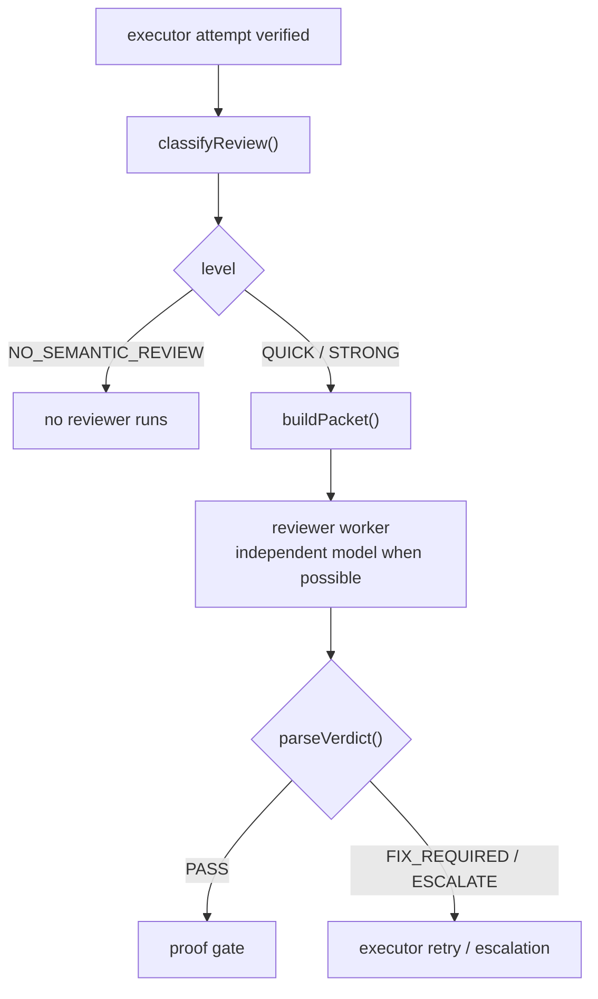

# Reviewer lane

**Plane:** execution · **Entry symbol:** `buildPacket()`, `parseVerdict()`, `review()` · **Spec:** PRD-011

A separate reviewer checks the executor's work when the floor demands it — a
reviewer verdict that is not `PASS` is bounded separately by
`limits.semantic_review_rounds`, which is why the reviewer gate and the verifier
retry ladder cannot drain each other's budget.

## Flow

The reviewer packet (`src/review/packet.ts`) carries the objective, the criteria,
the diff, changed files, verification results, warnings and the executor's
summary — and deliberately **not** the executor's transcript. `workspaceChange()`
caps the inline diff (`DEFAULT_INLINE_DIFF_BYTES`) and stores the rest as an
`artifact://` of kind `DIFF_ARTIFACT_KIND`.

## The floor

`classifyReview` sets the floor from `reviewer_class`, `review_risk` and
security-sensitive paths (`securitySensitivePathsIn`). `maxReviewLevel` and
`escalateVerdict` keep a re-review from running the same level twice.

## Modules

| Module | Owns |
| --- | --- |
| `src/review/gate.ts` | `classifyReview()`, `securitySensitivePathsIn()` |
| `src/review/packet.ts` | `buildPacket()`, `workspaceChange()`, `acceptanceCriteriaOf()` |
| `src/review/lane.ts` | `review()`, `ReviewRunner` |
| `src/review/schema.ts` | `parseVerdict()`, `REVIEW_DECISIONS`, `REVIEW_LEVELS`, `escalateVerdict()` |
| `src/review/commands.ts` | `/review` |

JEV site: `review.level`.

## Read more

- [Architecture §9](../architecture/README.md), [PRD-011](../PRDs/v1/done/PRD-011-reviewer-lane.md)
- [Executor lane](./executor-lane.md), [Verification](./verification.md), [Proof gate](./proof-gate.md)
