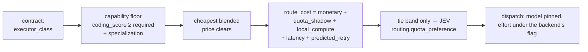

# Routing & capability index

**Plane:** decision · **Entry symbol:** `selectRoute()`, `predictRouteCost()`, `resolveRoleViaRanking()` · **Spec:** PRD-020, PRD-024, PRD-048

Six logical roles — `quick`, `balanced`, `strong`, `specialist`, `review_quick`,
`review_strong` — are what the config binds. A role resolves to a concrete
(backend, model) pair, never the other way round.

## Flow

## Two resolution mechanisms

- **The capability index** (`src/capability/models.json`): per model a
  `coding_score`, `specializations`, a 3:1 blended price, a speed tier and an
  `evidence` flag (measured or estimated). A role's floor (`quick` 50,
  `balanced` 70, `strong`/`review_strong` 85) filters the index; the cheapest
  clearing candidate wins; a role nothing clears reports a capability gap rather
  than silently downgrading. A configured `pin` wins unconditionally and reports
  its shortfall instead of being swapped.
- **The per-role fallback chain** (`src/core/roles.ts`), walked when the ranking
  cannot answer — the model is unbound, or its backend is disabled.
  `resolveRoleViaRanking` returns `null` (never throws) when the bundled ranking
  cannot be read or does not validate, and the call site keeps the static
  `models:` map.

## Cost, not just price

`route_cost` is a **pre-dispatch estimate**; the §52 record's `effective_cost` is
the measurement, and the two are never summed. What makes it cost-aware:

- **quota shadow pricing** — a subscription call costs no dollars but consumes
  scarce quota, so its class carries a configured shadow price;
- **predicted retry** — the bucket's calibrated retry rate multiplies the other
  terms;
- **effort before pricing** — a higher reasoning effort raises predicted token
  counts before they are priced;
- **calibration** — token, latency and retry statistics come from recorded
  telemetry.

Model selection is arithmetic and deliberately **not** a JEV site. JEV reaches
routing in three narrow places: `routing.reasoning_effort`,
`routing.quota_preference` (tie band only, inside the configured cost window) and
`routing.delegation_worth`.

## Modules

| Module | Owns |
| --- | --- |
| `src/routing/router.ts` | `selectRoute()` |
| `src/routing/cost.ts` | `predictRouteCost()`, `routeCostBlock()` |
| `src/routing/candidates.ts` | clearing candidates from the index |
| `src/routing/calibration.ts` | bucket stats, failure signatures, retry rates |
| `src/routing/config.ts`, `defaults.ts` | routing config, tie band, skip flags |
| `src/routing/sites.ts` | routing JEV sites |
| `src/capability/index.ts` | `loadRanking()`, `resolveRoleViaRanking()`, `roleStatus()` |
| `src/capability/select.ts`, `match.ts`, `feed.ts`, `schema.ts`, `roles.ts` | index read, match, feed from telemetry, validation |
| `src/core/roles.ts` | static role resolution and fallback chains |
| `src/compiler/pins.ts` | operator pin (`/model`, `/role`) |

## Read more

- [Architecture §6](../architecture/README.md), [Cost strategies §1](../architecture/cost-strategies.md)
- [Task compiler](./task-compiler.md), [JEV control plane](./jev-control-plane.md), [Backend workers](./backends.md), [Telemetry & cost](./telemetry-cost.md)
