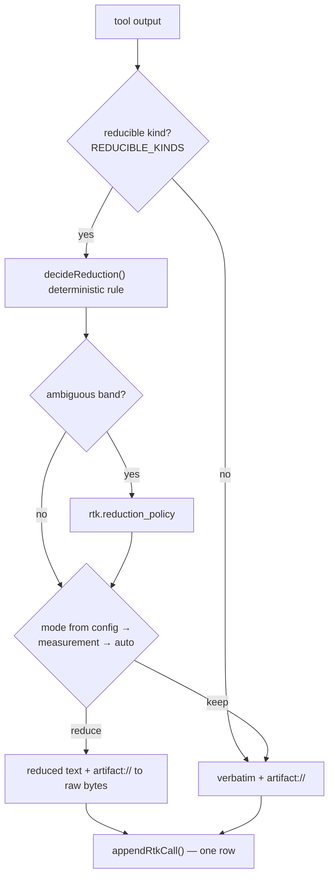

# RTK reduction

**Plane:** context · **Entry symbol:** `reduceToolOutput()` · **Spec:** PRD-019

Optional, **reversible** tool-output reduction and the measurement that alone can
promote it to default. A deterministic rule decides most reductions; JEV is
consulted only in the ambiguous band.

## Flow

Nothing is lost: the raw bytes are stored before reduction, so every reduction is
an `artifact://` reference away from the original.

## The measurement gate

`src/rtk/ab.ts` runs an A/B (`runRtkAb()`) and `src/rtk/measurement.ts` records
it. The default mode resolves config → recorded measurement → `auto`, so
reduction only becomes the default after it is measured to help.

## Modules

| Module | Owns |
| --- | --- |
| `src/rtk/reducer.ts` | `reduceToolOutput()`, `appendRtkCall()` |
| `src/rtk/policy.ts` | `decideReduction()`, `rtkPolicyQuestion()` |
| `src/rtk/site.ts` | `rtk.reduction_policy` (off by default) |
| `src/rtk/measurement.ts` | `readRtkMeasurement()`, `writeRtkMeasurement()`, `resolveRtkDefault()` |
| `src/rtk/ab.ts` | `runRtkAb()` |

## Read more

- [Architecture §8](../architecture/README.md), [PRD-019](../PRDs/v1/done/PRD-019-rtk-integration.md)
- [Context engine](./context-engine.md), [Bench harness](./bench-harness.md)
