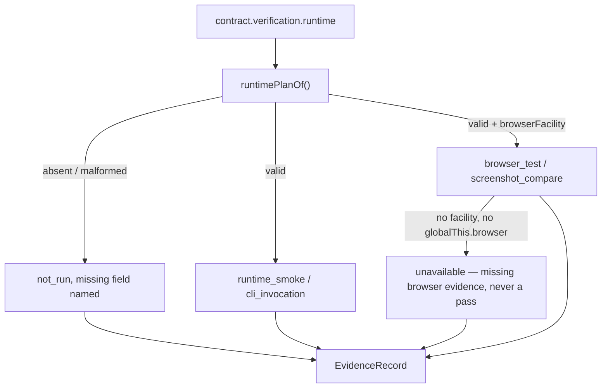

# Runtime verification & workspace isolation

**Plane:** evidence · **Entry symbol:** `registerRuntimeVerifiers()`, `runIsolated()` · **Spec:** PRD-022

Two halves. The first registers the four runtime verifier kinds through
verification's only registration point — so they are real entries in the verifier
map rather than a parallel mechanism. Registration is explicit and never a side
effect of importing: a process that has not called it reports `not_run`, which
makes "the browser verifier is unregistered" an observable state instead of a
claim. The second is a bounded execution in its own git worktree.

## Flow

## Workspace isolation

`runIsolated()` runs a bounded execution in a git worktree, captures a patch
keyed by run id (tracked diff + untracked manifest), and cleans up with a policy
that refuses to destroy what it cannot account for. Worktree ownership: when
`limits.isolation: worktree`, the checkout lives at
`<primary-repo>/.worktrees/<runId>` owned by the primary repository, never nested
under a linked checkout.

## Property-based verifiers

Neither smoke nor CLI infers anything: the command, readiness signal
(`ReadinessPlan` — log line, TCP port, or both) and expectation come from the
contract's `verification.runtime` block. `browser_test` and `screenshot_compare`
need a browser the **host** owns — the installed Pi SDK exposes no browser
automation API, so a session passes an optional `browserFacility`
(`ActivateOptions` / `CreateLeanPiSessionOptions`) threaded per verification
context.

## Modules

| Module | Owns |
| --- | --- |
| `src/runtime/index.ts` | `registerRuntimeVerifiers()`, `runIsolated()`, `worktreePermissionPrompt()` |
| `src/runtime/plan.ts` | `runtimePlanOf()`, `SmokePlan`, `CliExpectation` |
| `src/runtime/smoke.ts` | `runtimeSmokeVerifier` |
| `src/runtime/cli.ts` | `cliInvocationVerifier` |
| `src/runtime/browser.ts` | `browserTestVerifier`, `BrowserFacility` |
| `src/runtime/screenshot.ts`, `png.ts` | `screenshotCompareVerifier`, PNG compare |
| `src/runtime/worktree.ts` | `worktreePath()`, `worktreeRootOf()`, patch capture, cleanup |
| `src/runtime/proc.ts`, `git.ts`, `ignore.ts` | process spawn, git helpers, `.leanpi/` ignore |

## Read more

- [Architecture §10](../architecture/README.md), [PRD-022](../PRDs/v1/done/PRD-022-runtime-verification.md)
- [Verification](./verification.md), [Proof gate](./proof-gate.md), [Permissions & trust](./permissions.md)
