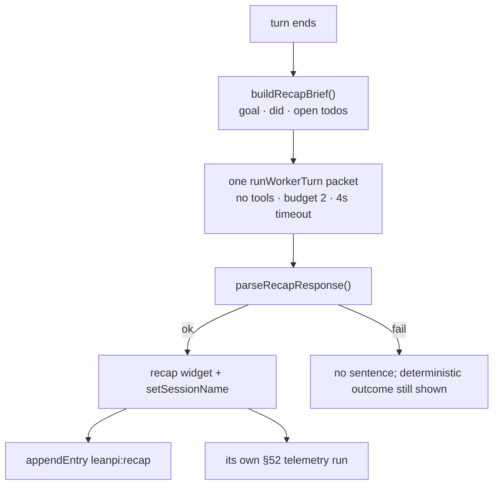

# Session recap

**Plane:** surface · **Entry symbol:** `createRecapController()` · **Spec:** PRD-036

A long session leaves no answer to "what was I doing in this terminal?". The
answer is one sentence of intent — goal, state, next action — plus a title that
survives the session. Everything else the recap shows is data LeanPi already
holds: the deterministic half is `renderTurnOutcome()`'s notify, and this system
adds only the sentence a model has to write.

## Flow

The model sees a fixed-shape brief (`src/recap/brief.ts`), never the transcript,
so a long session costs the same as a short one. The call is one `runWorkerTurn`
packet — no tools, a two-turn ceiling, a 4 s timeout (`RECAP_TIMEOUT_MS`).

## Modules

| Module | Owns |
| --- | --- |
| `src/recap/index.ts` | `createRecapController()`, the one-shot call, the persisted entry (`leanpi:recap`, version 1) |
| `src/recap/brief.ts` | `buildRecapBrief()` — fixed-shape input, no transcript |
| `src/recap/parse.ts` | `parseRecapResponse()` — title + sentence, or nothing |
| `src/cli/recap-widget.ts` | the widget slot |
| `src/commands/recap.ts` | `/recap on|off|regenerate` |

Cost lands in the same telemetry the user reads with `/status`: a recap is not a
turn, so `emitRecapRun` writes its own row rather than folding into one.

## Read more

- [Statusline & UI](./statusline-and-ui.md), [Telemetry & cost](./telemetry-cost.md)
