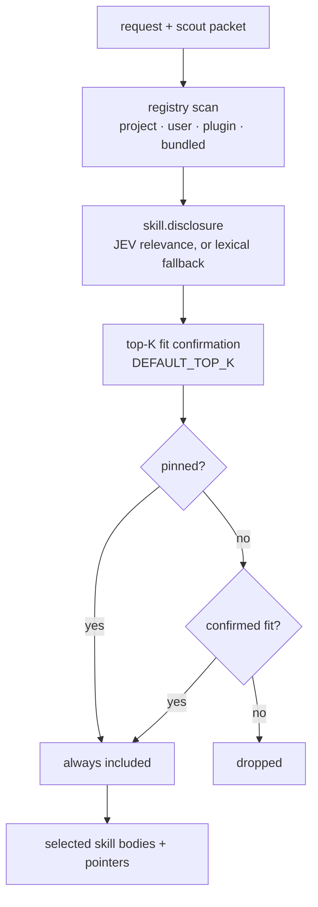

# Skill disclosure

**Plane:** context · **Entry symbol:** `selectSkills()`, `bundledRoot()`, `verifyBundledFile()` · **Spec:** PRD-005, PRD-026

Skills enter context only when the task needs them: JEV relevance over the whole
registry, then a top-K fit confirmation. Pins bypass ranking; disabling wins over
pinning. The native path gets the **pointer** (name, description, path); the body
only enters the one-shot executor prompt.

## Flow

## Registry precedence

project > user global > plugin cache > **bundled**, first-claim-wins by skill
name. Bundled is a floor that config omission cannot remove. Bundled files are
verified against `skills/pack.lock.json` sha256 on load; a mismatch throws
(`BundledIntegrityError`) rather than degrading.

## Modules

| Module | Owns |
| --- | --- |
| `src/capabilities/skills.ts` | `selectSkills()`, `scanSkills()`, `createSkillControl()`, `skillRootsFor()` |
| `src/capabilities/skill-select.ts` | ranking and confirmation |
| `src/skills/pack.ts` | `bundledRoot()`, `checkPack()`, `verifyBundledFile()`, `bundledRoot()` integrity |
| `src/skills/vendor.mjs` | sync-time vendoring behind a file allowlist |
| `skills/` | the bundled pack; `skills/pack.lock.json` pins each file |
| `scripts/sync-skills.mjs` | `pnpm sync:skills` |

## Read more

- [Architecture §8](../architecture/README.md), [Cost strategies §3](../architecture/cost-strategies.md)
- [Context engine](./context-engine.md), [MCP disclosure](./mcp-disclosure.md)
